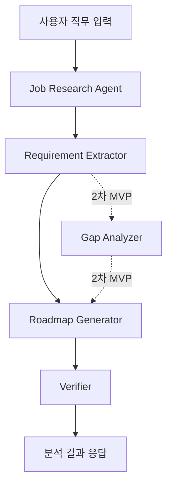
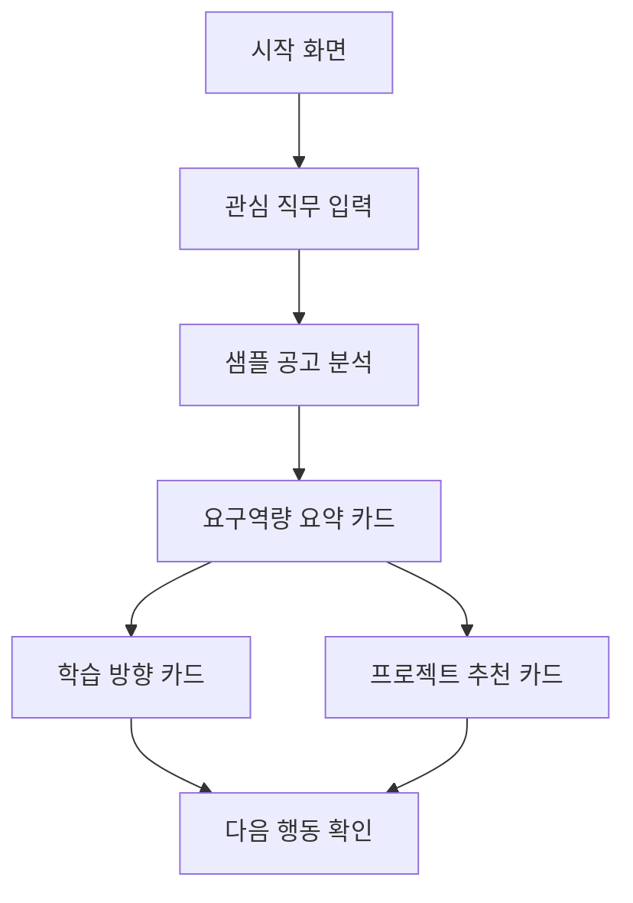
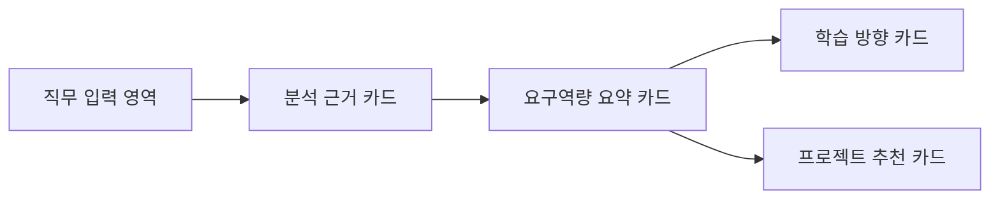
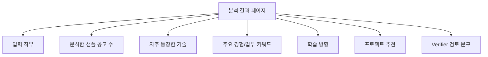
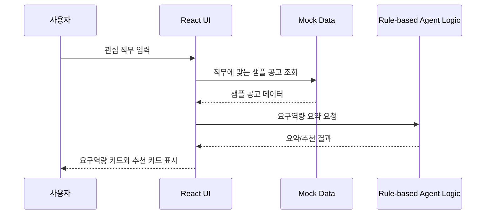
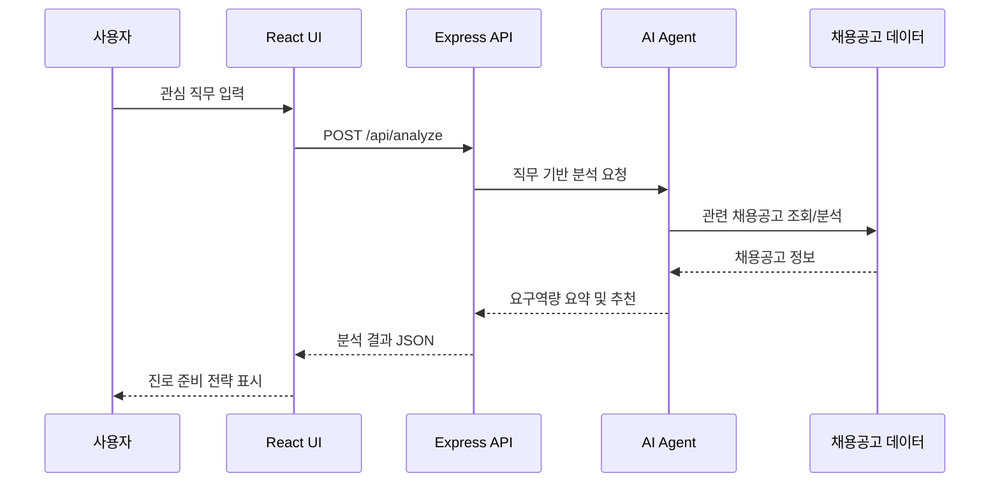

# 채용공고 기반 대학생 진로탐색 리서치 에이전트 기획서

## 1. 프로젝트 개요

이 프로젝트는 대학생이 관심 직무를 준비할 때, 실제 채용공고에 나타나는 요구 역량을 바탕으로 학습 방향과 프로젝트 방향을 정리하도록 돕는 AI 리서치 에이전트입니다.

사용자는 관심 직무를 입력하고, 서비스는 샘플 채용공고 데이터를 분석해 자주 등장하는 기술, 경험, 자격요건, 우대사항을 요약합니다. 이후 사용자가 바로 다음 행동을 정할 수 있도록 학습 키워드와 프로젝트 아이디어를 제안합니다.

초기 버전은 실제 채용공고 자동 수집보다 사용자 흐름 검증에 집중합니다. 따라서 1주차 프로토타입은 mock data 기반으로 구현하고, 이후 Express API와 실제 LLM 연동, 공고 수집 기능을 단계적으로 확장합니다.

## 2. 문제 발견

대학생은 진로를 준비할 때 실제 채용시장의 요구와 자신의 준비 방향 사이의 차이를 파악하기 어렵습니다. 채용공고는 많지만, 공고마다 표현이 다르고 요구사항이 흩어져 있어 직접 비교하고 정리하는 데 시간이 많이 듭니다.

특히 다음 문제가 반복됩니다.

- 관심 직무에 필요한 기술과 경험을 한눈에 파악하기 어렵다.
- 여러 채용공고에서 반복되는 핵심 요구사항을 직접 정리해야 한다.
- 채용공고의 요구사항을 학습 계획이나 프로젝트 주제로 연결하기 어렵다.
- AI가 조언을 해도 채용공고 기반 근거가 보이지 않으면 신뢰하기 어렵다.
- 진로 탐색 결과가 정보 수집에서 끝나고 구체적인 다음 행동으로 이어지기 어렵다.

## 3. 문제 정의

대학생은 관심 직무를 준비하고 싶지만, 실제 채용공고에 담긴 시장 요구사항을 구조화해서 이해하기 어렵고, 그 결과 학습 방향과 프로젝트 준비 방향을 구체적으로 결정하기 어렵다.

이 프로젝트가 해결하려는 핵심 문제는 다음과 같습니다.

> 채용공고에 흩어진 직무 요구사항을 대학생이 실행할 수 있는 진로 준비 정보로 바꾸는 것

이 문제를 해결하기 위해 단순한 직무 설명이 아니라, 채용공고 기반의 근거와 다음 행동을 함께 제공해야 합니다.

## 4. 타겟 사용자

### 주요 사용자

- 취업 준비를 시작하는 대학생
- 관심 직무는 있지만 준비 방향이 명확하지 않은 학생
- 프로젝트나 포트폴리오 주제를 정해야 하는 학생
- 채용공고를 읽어봤지만 요구사항을 체계적으로 정리하기 어려운 학생

### 사용자 특성

- 직무명, 기술 스택, 우대사항 같은 단어는 알지만 중요도를 판단하기 어렵다.
- 학습할 것은 많다고 느끼지만 무엇부터 해야 할지 결정하기 어렵다.
- 실제 기업 요구사항을 기준으로 진로 준비를 하고 싶다.
- 추상적인 조언보다 구체적인 학습 키워드와 프로젝트 예시를 원한다.

## 5. 사용자 시나리오

### 시나리오 1: 관심 직무 요구사항 파악

사용자는 "프론트엔드 개발자"처럼 관심 직무를 입력합니다. 서비스는 샘플 채용공고 데이터를 기반으로 자주 등장한 기술 스택, 업무 키워드, 요구 경험을 요약합니다. 사용자는 해당 직무를 준비하기 위해 어떤 역량이 중요한지 빠르게 이해합니다.

### 시나리오 2: 다음 학습 방향 결정

사용자는 분석 결과에서 자주 등장한 기술과 경험을 확인합니다. 서비스는 요구 빈도와 직무 관련성을 바탕으로 우선 학습할 키워드를 제안합니다. 사용자는 막연한 공부 목록이 아니라 우선순위가 있는 학습 방향을 얻습니다.

### 시나리오 3: 프로젝트 주제 결정

사용자는 분석 결과를 바탕으로 프로젝트 아이디어를 추천받습니다. 추천 프로젝트는 채용공고에서 반복적으로 요구되는 기술이나 경험과 연결됩니다. 사용자는 포트폴리오에 넣을 프로젝트 방향을 정합니다.

## 6. MVP와 프로토타입 구분

### 프로토타입

프로토타입은 사용 흐름과 화면 구성을 검증하기 위한 실험물입니다. 실제 공고 수집, 실제 AI 분석, 사용자 저장 기능이 완성되지 않아도 됩니다.

1주차 프로토타입 목표는 다음과 같습니다.

> 사용자가 직무를 입력하면 샘플 공고 데이터를 기반으로 요구역량 요약 카드와 추천 학습/프로젝트 카드를 볼 수 있는 React 프로토타입을 완성한다.

### MVP

MVP는 사용자가 핵심 가치를 경험할 수 있는 최소 제품입니다. 이 프로젝트의 1차 MVP는 다음 3개 기능으로 제한합니다.

1. 관심 직무 입력
2. 샘플 채용공고 기반 요구역량 요약
3. 학습 방향 및 프로젝트 아이디어 추천

사용자 현재 역량 입력과 Gap 분석은 중요하지만, 1차 MVP에서는 제외하고 2차 MVP로 미룹니다.

## 7. 핵심 기능

### 7.1 관심 직무 입력

사용자가 분석하고 싶은 직무명을 입력합니다.

- 예: 프론트엔드 개발자, 백엔드 개발자, 데이터 분석가, AI 엔지니어
- 1주차 프로토타입에서는 직무명 텍스트 입력과 예시 직무 선택만 지원합니다.

### 7.2 샘플 공고 기반 요구역량 요약

입력된 직무에 대응되는 샘플 채용공고 데이터를 분석해 요구 역량을 요약합니다.

- 분석한 샘플 공고 수 표시
- 자주 등장한 기술 스택 표시
- 자격요건과 우대사항 요약
- 반복 등장 키워드와 등장 횟수 표시

예시 출력:

```text
분석한 샘플 공고 수: 5개
자주 등장한 기술: React 4회, TypeScript 3회, REST API 3회
주요 경험: 협업 경험, 컴포넌트 설계, API 연동
```

### 7.3 학습 방향 제안

공고에서 반복적으로 등장한 기술과 경험을 바탕으로 우선 학습할 항목을 제안합니다.

예시 출력:

```text
우선 학습 키워드
1. React 컴포넌트 설계
2. TypeScript 기본 문법
3. REST API 연동
```

### 7.4 프로젝트 아이디어 추천

요구 역량과 연결되는 프로젝트 주제를 추천합니다.

예시 출력:

```text
추천 프로젝트
- 채용공고 검색 결과를 카드로 보여주는 React 대시보드
- REST API를 연동해 필터링 가능한 직무 분석 페이지 만들기
```

### 7.5 사용자 역량 비교

사용자의 현재 기술과 경험을 입력받아 요구 역량과 비교합니다.

이 기능은 2차 MVP 범위입니다. 1주차 프로토타입에서는 화면 설계만 고려하고 실제 기능 구현은 제외합니다.

## 8. 우선순위와 MVP 범위

### 단계별 범위

| 단계 | 포함 기능 | 목적 |
| --- | --- | --- |
| 1주차 프로토타입 | 직무 입력, mock data 결과 표시, 요구역량 카드, 추천 카드 | 화면 흐름과 핵심 가치 검증 |
| 1차 MVP | 직무 입력, 샘플 공고 분석, 요구역량 요약, 학습/프로젝트 추천 | 사용자가 다음 행동을 정할 수 있는 최소 제품 |
| 2차 MVP | 사용자 현재 역량 입력, Gap 분석, 우선순위 추천 | 개인화된 진로 준비 전략 제공 |
| 이후 확장 | 실제 공고 수집, LLM API 연동, 저장 기능, 여러 직무 비교 | 서비스 고도화 |

### 1차 MVP 포함

- 관심 직무 입력
- 샘플 채용공고 데이터 기반 분석
- 분석한 공고 수 표시
- 기술/경험/우대사항 요약
- 자주 등장한 키워드와 빈도 표시
- 학습 방향 제안
- 프로젝트 아이디어 추천

### 1차 MVP 제외

- 실시간 채용공고 크롤링
- 로그인/개인 저장
- 여러 직무 동시 비교
- GitHub 자동 분석
- 사용자 이력 기반 정밀 Gap 분석
- 완전 자동 장기 로드맵 관리
- 실제 기업 지원 전략 추천

## 9. AI Agent 구조

초기 프로토타입은 mock data와 rule 기반 로직으로 시작하지만, 전체 구조는 Agent 역할을 분리해 확장 가능하게 설계합니다.



### Agent 역할

| 역할 | 설명 | 1주차 포함 여부 |
| --- | --- | --- |
| Job Research Agent | 직무에 맞는 샘플 공고를 선택 | mock data 기반 포함 |
| Requirement Extractor | 기술, 경험, 자격요건, 우대사항 추출 | rule/mock 기반 포함 |
| Roadmap Generator | 학습 방향과 프로젝트 아이디어 생성 | rule/mock 기반 포함 |
| Verifier | 결과가 입력 직무와 공고 근거에 맞는지 확인 | 간단한 검토 문구로 포함 |
| Gap Analyzer | 사용자 역량과 요구 역량 비교 | 2차 MVP로 제외 |

Verifier를 포함하는 이유는 결과가 단순 AI 조언이 아니라 입력 직무와 채용공고 근거에 맞는지 확인하는 Agent 흐름을 보여주기 위해서입니다.

## 10. 화면 흐름



## 11. 화면 목록

### 11.1 프로젝트 소개 화면

프로젝트의 목적과 문제의식을 소개합니다. 현재 구현된 소개 컴포넌트가 이 역할을 합니다.

### 11.2 직무 입력 화면

사용자가 관심 직무를 입력하는 화면입니다.

포함 요소:

- 직무명 입력창
- 예시 직무 버튼
- 분석 시작 버튼

### 11.3 분석 결과 화면

샘플 채용공고 분석 결과를 보여주는 화면입니다.

포함 요소:

- 분석한 샘플 공고 수
- 핵심 기술 스택과 등장 횟수
- 주요 업무 키워드
- 자격요건 요약
- 우대사항 요약

### 11.4 추천 결과 화면

분석 결과를 바탕으로 다음 행동을 제안하는 화면입니다.

포함 요소:

- 추천 학습 키워드
- 추천 프로젝트 주제
- 포트폴리오 강조 포인트
- 결과 검토 문구

### 11.5 역량 비교 화면

사용자의 현재 역량과 채용공고 요구 역량을 비교하는 화면입니다.

이 화면은 2차 MVP 범위입니다. 1주차 프로토타입에서는 구현하지 않습니다.

## 12. 와이어프레임

### 12.1 1주차 프로토타입 화면 구성



### 12.2 결과 화면 정보 구조



## 13. 시스템 흐름

1주차 프로토타입은 React 내부 mock data 기반으로 구현합니다. Express API는 이후 단계에서 추가합니다.

### 13.1 1주차 프로토타입 흐름



### 13.2 이후 Express 연동 흐름



## 14. 1주차 구현 범위

1주차 목표는 완성된 AI Agent가 아니라, 사용자가 핵심 가치를 이해할 수 있는 React 프로토타입을 만드는 것입니다.

### 포함

- React 기반 직무 입력 UI
- 샘플 직무 선택 버튼
- mock job data
- 요구역량 요약 카드
- 분석 근거 표시
- 추천 학습 키워드 카드
- 추천 프로젝트 카드
- 기본 로딩/에러 상태

### 제외

- Express 서버 구현
- 실제 LLM API 호출
- 실시간 채용공고 크롤링
- DB 저장
- 로그인
- 사용자별 장기 로드맵

## 15. 작업 분해 기준

기획이 확정되면 다음 기준으로 작업을 분해합니다.

### 15.1 레이어 기준

- UI 구성
- 상태 관리와 이벤트 처리
- mock data 연결
- rule 기반 분석 결과 생성
- 응답 데이터 렌더링
- 로딩/에러 상태 처리

### 15.2 중요도 기준

- 직무 입력과 결과 표시 먼저 구현
- 추천 카드와 분석 근거를 다음으로 구현
- 사용자 역량 입력과 Gap 분석은 후순위로 분리

### 15.3 완성도 기준

- 최소 기능 구현
- 사용 흐름 검증
- 화면 개선
- Express API와 Agent 로직 분리
- 실제 공고 데이터 연동

