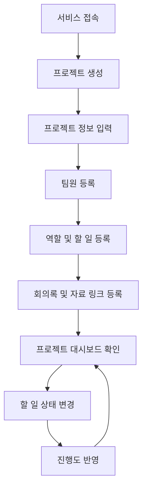

# 팀플 관리 웹서비스 기획서
## 1. 프로젝트 주제
팀 프로젝트 관리 웹서비스
## 2. 문제 정의
대학생이 팀플이나 공모전 프로젝트를 진행할 때, 계획, 역할 분담, 할 일, 진행 상황, 회의 내용, 자료 등이 여러 곳에 흩어져 있어 팀 전체의 현재 상황을 파악하기 어렵다. 하나의 사이트에서 해결 하기가 힘들고 사전 세팅도 많이 필요하며 진행 하는동안 지속적으로 운영하기도 귀찮다.
## 3. 문제 배경
팀플을 진행하다 보면 카카오톡에는 회의 내용이 있고, 구글 드라이브에는 자료가 있으며, 노션이나 메모장에는 할 일과 역할 분담이 따로 정리되는 경우가 많다. 그리고 대부분 사전에 세팅을 좀 해야하고 세팅을 했더라도 지속적으로 운영할때 귀찮고 처음 생각한거 처럼 잘 흘러가지 않는 문제가 있다.
이로 인해 누가 어떤 일을 맡았는지 헷갈리거나, 마감 전에 어떤 작업이 남았는지 계획대로 흘러가는지 놓치는 문제가 생긴다.
이 서비스는 팀플에 필요한 정보를 한 공간에 모아, 팀원들이 프로젝트 진행 상황을 쉽게 확인하고 관리할 수 있도록 돕는 것을 목표로 한다.
## 4. 사용자 시나리오
1. 사용자는 새로운 팀플 프로젝트를 생성한다.
2. 프로젝트 이름, 목표, 설명, 최종 마감일등 기초적인 계획들을 입력한다.
3. 팀원을 등록하고 각 팀원의 역할을 정리한다.
4. 프로젝트에 필요한 할 일을 등록하고 진행 상태를 설정한다.
5. 회의 내용과 자료 링크를 프로젝트 안에 저장한다.
6. 사용자는 대시보드에서 전체 진행도, 남은 할 일, 팀원별 담당 업무, 최근 회의록과 자료를 확인한다.
## 5. 핵심 기능
### 기능 1. 할 일 및 역할 관리
팀 프로젝트에서 누가 어떤 일을 맡았는지 명확하게 관리하는 기능이다.
주요 기능:
- 팀원 등록
- 팀원별 역할 입력
- 할 일 등록
- 할 일 담당자 지정
- 할 일 상태 변경
이 기능을 핵심으로 고른 이유는 팀플에서 가장 자주 발생하는 문제가 “누가 무엇을 하고 있는지 모르는 것”이기 때문이다. 역할과 할 일을 연결하면 팀원별 책임 범위와 현재 진행 상태를 쉽게 파악할 수 있다.
### 기능 2. 프로젝트 대시보드
프로젝트의 전체 상황을 한 화면에서 확인하는 기능이다.
주요 기능:
- 프로젝트 기본 정보 표시
- 최종 마감일 표시
- 전체 진행도 표시
- 남은 할 일 표시
- 팀원별 담당 업무 표시
- 최근 회의록 및 자료 링크 표시
이 기능을 핵심으로 고른 이유는 팀플 정보가 메신저, 드라이브, 노션, 개인 메모에 흩어져 있을 때 필요한 정보를 찾기 어렵기 때문이다. 대시보드를 통해 프로젝트의 현재 상태와 필요한 정보를 한눈에 확인할 수 있다.
## 6. 사용자 흐름

## 7. MVP 범위
초기 구현에서는 다음 기능을 우선한다.
- 프로젝트 생성
- 팀원 등록
- 역할 및 할 일 등록
- 할 일 상태 변경
- 회의록 작성
- 자료 링크 등록
- 프로젝트 진행률 표시
초기 버전에서는 로그인, 실시간 협업, 파일 직접 업로드, 알림, 채팅, AI 팀원 기능은 제외한다.
## 8. 확장 아이디어
웹을 더 잘 이용하기 위해서 AI 팀원 기능을 추가할 수 있다.  
AI 팀원은 자료조사 담당, 회의록 정리 담당, 기획 피드백 담당처럼 실제 사람의 특정 역할을 맡아 프로젝트 진행을 보조할 수 있다.
다만 1차 목표는 AI 기능이 아니라, 팀플 관리 웹서비스의 기본 구조를 완성하는 것이다.
웹기능에 내장된 ai챗봇의 느낌이 아닌 정말 팀원 자리에 ai가 들어가 팀적으로 활용할수 있게 하는것이 목표다.