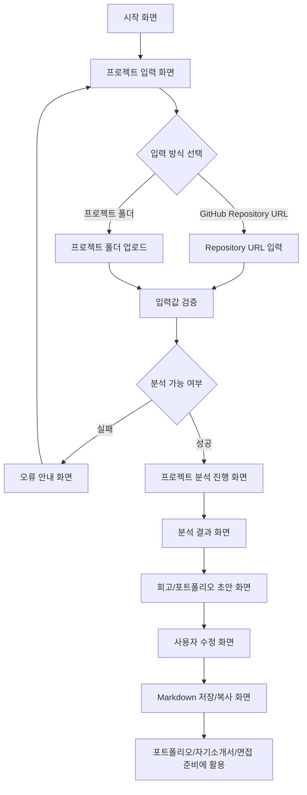

# PtoP 기획서

## 문제 정의

프로젝트 경험을 쌓는 대학생 개발자는 프로젝트가 끝난 뒤 시간이 지나면 자신이 맡은 역할, 핵심 구현 내용, 문제 해결 과정을 정확히 기억하고 정리하기 어렵다.

## 사용자 시나리오

1. 사용자는 프로젝트를 마친 뒤 포트폴리오에 정리할 내용이 필요하다고 느낀다.
2. 사용자는 PtoP에 GitHub Repository URL 또는 프로젝트 폴더를 입력한다.
3. PtoP는 README, 폴더 구조, 주요 코드 파일을 분석한다.
4. 사용자는 분석된 프로젝트 목적, 기술 스택, 핵심 기능을 확인한다.
5. 사용자는 생성된 회고/포트폴리오 초안을 확인하고 필요한 부분을 수정한다.
6. 사용자는 최종 결과를 Markdown으로 저장해 포트폴리오, 자기소개서, 면접 준비에 활용한다.

## 핵심 기능 (2개)

### 1. 프로젝트 분석 기능

GitHub Repository 또는 프로젝트 폴더를 바탕으로 README, 폴더 구조, 주요 코드 파일을 분석해 프로젝트 목적, 기술 스택, 핵심 기능을 정리한다.

선정 이유:

- Repository 분석이 되어야 회고와 포트폴리오 초안을 만들 수 있다.
- 사용자가 직접 코드와 README를 다시 뒤지는 시간을 줄여준다.
- 문제 정의에서 말한 "프로젝트 경험을 다시 기억하고 정리하기 어려움"을 해결하는 출발점이다.

### 2. 회고/포트폴리오 초안 생성 기능

분석 결과를 바탕으로 내가 한 일, 어려웠던 점, 해결 과정, 배운 점을 포트폴리오에 활용할 수 있는 문장 형태로 정리한다.

선정 이유:

- 사용자가 최종적으로 필요한 것은 단순한 코드 요약이 아니라 포트폴리오에 쓸 수 있는 경험 정리다.
- 프로젝트 경험을 자기소개서나 면접에서 설명할 수 있는 형태로 바꿔준다.
- PtoP의 핵심 가치인 Project to Portfolio를 가장 직접적으로 보여준다.

## 화면 흐름

## 화면별 역할

| 화면 | 역할 |
| --- | --- |
| 시작 화면 | 서비스 목적과 핵심 기능을 짧게 안내한다. |
| 프로젝트 입력 화면 | 사용자가 Repository URL 또는 프로젝트 폴더를 입력한다. |
| 입력값 검증 화면 | 입력된 URL이나 폴더가 분석 가능한지 확인한다. |
| 오류 안내 화면 | 입력값이 잘못되었거나 분석할 수 없는 경우 다시 입력하도록 안내한다. |
| 프로젝트 분석 진행 화면 | README, 폴더 구조, 주요 코드 파일을 분석 중임을 보여준다. |
| 분석 결과 화면 | 프로젝트 목적, 기술 스택, 핵심 기능을 요약해서 보여준다. |
| 회고/포트폴리오 초안 화면 | 내가 한 일, 어려웠던 점, 해결 과정, 배운 점 초안을 보여준다. |
| 사용자 수정 화면 | 사용자가 AI 초안을 자신의 표현으로 수정한다. |
| Markdown 저장/복사 화면 | 최종 결과를 Markdown으로 저장하거나 복사한다. |
