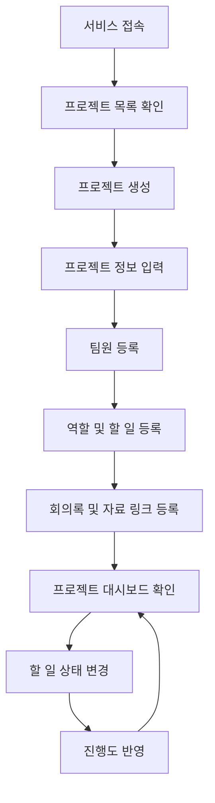
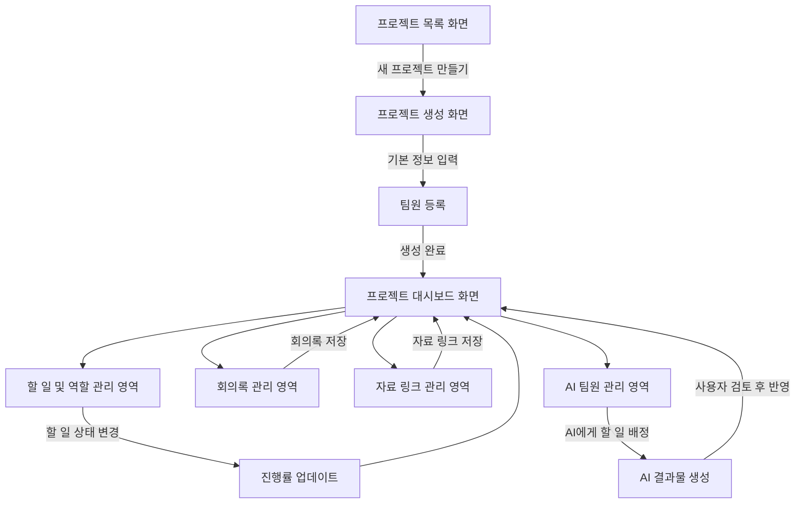

# 팀플 관리 웹서비스 기획서
## 1. 프로젝트 주제
팀 프로젝트 관리 웹서비스
## 2. 문제 정의
대학생이 팀플이나 공모전 프로젝트를 진행할 때, 계획, 역할 분담, 할 일, 진행 상황, 회의 내용, 자료 등이 여러 곳에 흩어져 있어 팀 전체의 현재 상황을 파악하기 어렵다.사전 세팅이 번거롭고, 프로젝트가 진행되는 동안 계속 관리하기도 어렵다.
## 3. 문제 배경
팀플을 진행하다 보면 카카오톡에는 회의 내용이 있고, 구글 드라이브에는 자료가 있으며, 노션이나 메모장에는 할 일과 역할 분담이 따로 정리되는 경우가 많다.
이로 인해 다음과 같은 문제가 생긴다.
- 누가 어떤 일을 맡았는지 헷갈린다.
- 마감 전에 어떤 작업이 남았는지 놓친다.
- 자료와 회의 내용을 다시 찾기 어렵다.
- 처음에 세운 계획대로 프로젝트가 진행되고 있는지 확인하기 어렵다.
- 여러 도구를 오가며 관리해야 해서 팀플 운영이 귀찮아진다.
이 서비스는 팀플 정보를 한 곳에 모아 관리함으로써, 팀 전체가 현재 상황과 다음 할 일을 쉽게 파악할 수 있도록 한다.
## 4. 사용자 관점 동작 시나리오
### 시나리오 1. 프로젝트를 처음 생성하는 경우
1. 사용자는 팀플이나 공모전 프로젝트를 시작하기 위해 서비스에 접속한다.
2. 프로젝트 목록 화면에서 `새 프로젝트 만들기` 버튼을 누른다.
3. 프로젝트 이름, 목표, 설명, 최종 마감일을 입력한다.
4. 팀원을 등록하고 각 팀원의 역할을 간단히 작성한다.
5. 프로젝트 생성이 완료되면 프로젝트 대시보드 화면으로 이동한다.
6. 사용자는 대시보드에서 현재 프로젝트의 기본 정보와 초기 진행 상태를 확인한다.
### 시나리오 2. 팀플 진행 중 할 일을 관리하는 경우
1. 사용자는 프로젝트 대시보드에서 현재 남은 할 일을 확인한다.
2. 필요한 작업을 새 할 일로 등록한다.
3. 각 할 일에 담당자, 마감일, 진행 상태를 설정한다.
4. 팀원은 자신의 할 일 상태를 `시작 전`, `진행 중`, `검토 중`, `완료` 중 하나로 변경한다.
5. 할 일 상태가 변경되면 프로젝트 진행률이 함께 반영된다.
6. 사용자는 대시보드에서 전체 진행 상황과 팀원별 담당 업무를 확인한다.
### 시나리오 3. 회의록과 자료를 정리하는 경우
1. 팀플 회의가 끝난 뒤 사용자는 회의록 영역으로 이동한다.
2. 회의 날짜, 회의 주제, 결정사항, 다음 할 일을 기록한다.
3. 프로젝트에 필요한 자료 링크를 자료 영역에 추가한다.
4. 자료에는 제목, 링크, 간단한 설명을 함께 작성한다.
5. 이후 팀원들은 대시보드에서 최근 회의록과 자료 링크를 바로 확인한다.
### 시나리오 4. AI 팀원을 활용하는 경우
1. 사용자는 프로젝트 팀원 목록에서 사람 팀원과 같은 방식으로 AI 팀원을 추가한다.
2. AI 팀원에게 역할을 부여한다.
3. 사용자는 사람 팀원에게 할 일을 배정하듯이 AI 팀원에게도 할 일을 배정한다.
4. AI 팀원은 프로젝트 목표, 회의록, 자료 링크, 할 일 목록을 참고해 맡은 작업을 수행한다.
5. AI가 만든 결과물은 바로 반영되지 않고, 사용자가 검토한 뒤 회의록, 자료, 할 일 목록 등에 저장한다.
## 5. 핵심 기능
이 서비스의 핵심은 팀플 정보를 단순히 저장하는 것이 아니라, 팀 전체의 현재 상황을 한눈에 파악하고 다음 행동을 정할 수 있게 만드는 것이다.
초기 구현에서는 기능을 많이 늘리기보다, 팀플 관리에 가장 중요한 기능을 중심으로 만든다.
### 기능 1. 할 일 및 역할 관리
팀 프로젝트에서 누가 어떤 일을 맡았고, 현재 어디까지 진행했는지 명확하게 관리하는 기능이다.
#### 주요 기능
- 팀원 등록
- 팀원별 역할 입력
- 할 일 등록
- 할 일 담당자 지정
- 할 일 마감일 설정
- 할 일 진행 상태 변경
- 팀원별 담당 업무 확인
#### 할 일 상태
할 일은 다음 상태로 관리한다.
- 시작 전
- 진행 중
- 검토 중
- 완료
#### 이 기능이 중요한 이유
팀플에서 가장 자주 발생하는 문제는 “누가 무엇을 하고 있는지 모르는 것”이다.
카카오톡 대화나 회의 중에 역할을 정해도 시간이 지나면 누가 어떤 일을 맡았는지 헷갈리기 쉽고, 마감 직전에 빠진 작업을 발견하는 경우도 많다.
따라서 할 일과 담당자를 명확하게 연결하고, 각 작업의 상태를 계속 업데이트할 수 있어야 한다.
이 기능을 통해 팀원은 자신이 해야 할 일을 확인할 수 있고, 팀장은 팀 전체의 작업 분배와 진행 상황을 파악할 수 있다.
### 기능 2. 프로젝트 대시보드
프로젝트의 전체 상황을 한 화면에서 확인하는 기능이다.
#### 주요 기능
- 프로젝트 이름, 목표, 설명 표시
- 최종 마감일 표시
- 전체 진행률 표시
- 남은 할 일 표시
- 마감이 가까운 할 일 표시
- 팀원별 역할 및 담당 업무 표시
- 최근 회의록 표시
- 자료 링크 목록 표시
#### 이 기능이 중요한 이유
팀플 정보는 보통 여러 곳에 흩어진다.
회의 내용은 카카오톡에 있고, 자료는 구글 드라이브에 있으며, 할 일은 노션이나 개인 메모에 따로 정리되는 경우가 많다.
이렇게 정보가 흩어지면 프로젝트의 현재 상태를 파악하기 위해 여러 도구를 계속 확인해야 한다.
프로젝트 대시보드는 흩어진 정보를 한 화면에 모아, 사용자가 “지금 우리 팀이 어디까지 했고, 다음에 무엇을 해야 하는지” 바로 확인할 수 있게 한다.
### 확장 핵심 기능. AI 팀원
AI 팀원은 별도의 챗봇 기능이 아니라, 프로젝트의 팀원 목록에 사람 팀원과 같은 방식으로 추가되는 팀원 유형이다.
즉, 사용자는 사람 팀원을 등록하듯이 AI 팀원을 추가하고, AI 팀원에게도 역할과 할 일을 배정할 수 있다.
AI 팀원은 기존 팀원이 사용하는 기능 구조를 그대로 활용한다.
#### AI 팀원이 사용하는 기본 구조
- 역할을 가진다.
- 할 일을 배정받는다.
- 프로젝트 목표와 자료를 참고한다.
- 회의록과 자료 링크를 확인한다.
- 맡은 일에 대한 결과물을 생성한다.
- 필요한 경우 진행 상태나 다음 작업을 제안한다.
#### 이 기능이 중요한 이유
이 서비스에서 AI는 단순히 화면 한쪽에서 질문에 답하는 챗봇이 아니다.
AI는 팀원 목록 안에서 사람 팀원과 같은 프로젝트 관리 흐름을 따라가는 존재다.
중요한 점은 AI가 별도의 보조 도구로 존재하는 것이 아니라, 팀원 자리에 들어가 역할을 맡고 할 일을 배정받는다는 것이다.
다만 초기는 AI가 실제로 작업을 수행하는 기능까지 구현하지 않는다.
초기 구현에서는 사람 팀원을 기준으로 팀원, 역할, 할 일, 진행 상태를 관리하는 구조를 먼저 만들고, 이후 같은 구조에 AI 팀원 타입을 추가할 수 있도록 확장 가능성을 열어둔다.
## 6. 화면 구조 UI
이 서비스는 팀플 프로젝트를 빠르게 생성하고, 프로젝트별 대시보드에서 역할, 할 일, 회의록, 자료를 한눈에 확인하는 구조로 설계한다.
### 1) 프로젝트 목록 화면
사용자가 참여 중인 프로젝트를 확인하는 첫 화면이다.
#### 주요 요소
- 서비스 이름
- 새 프로젝트 만들기 버튼
- 프로젝트 카드 목록
- 각 프로젝트의 이름, 마감일, 진행률
#### 주요 동작
- 사용자는 새 프로젝트를 만들 수 있다.
- 기존 프로젝트 카드를 선택하면 해당 프로젝트 대시보드로 이동한다.
### 2) 프로젝트 생성 화면
새로운 팀플 프로젝트를 만드는 화면이다.
#### 주요 요소
- 프로젝트 이름 입력
- 프로젝트 목표 입력
- 프로젝트 설명 입력
- 최종 마감일 입력
- 팀원 입력
- 생성 버튼
#### 주요 동작
- 사용자는 프로젝트 기본 정보를 입력한다.
- 생성 버튼을 누르면 프로젝트 대시보드로 이동한다.
### 3) 프로젝트 대시보드 화면
서비스의 핵심 화면이다. 프로젝트 전체 상황을 한눈에 확인한다.
#### 주요 요소
- 프로젝트 이름
- 최종 마감일
- 전체 진행률
- 남은 할 일
- 팀원별 역할
- 최근 회의록
- 자료 링크
#### 주요 동작
- 사용자는 현재 프로젝트의 전체 진행 상황을 확인한다.
- 할 일, 회의록, 자료 링크를 추가하거나 확인할 수 있다.
- 할 일 상태가 변경되면 전체 진행률이 함께 변경된다.
### 4) 할 일 및 역할 관리 영역
팀원별 역할과 할 일을 관리하는 영역이다.
#### 주요 요소
- 팀원 목록
- 역할 정보
- 할 일 목록
- 담당자
- 마감일
- 진행 상태
#### 주요 동작
- 사용자는 팀원을 추가하고 역할을 입력한다.
- 사용자는 할 일을 추가하고 담당자를 지정한다.
- 할 일 상태를 변경하면 진행률에 반영된다.
### 5) 자료 관리 영역
프로젝트 자료를 저장하는 영역이다.
#### 주요 요소
- 결정사항
- 다음 할 일
- 자료 제목
- 자료 링크
#### 주요 동작
- 자료 링크를 저장하고 프로젝트 안에서 다시 확인할 수 있다.
### 6) AI 팀원 관리 영역
추후 확장 기능으로, AI 팀원을 관리하는 영역이다.
#### 주요 요소
- AI 팀원 이름
- AI 팀원 역할
- AI에게 배정된 할 일
- AI가 참고할 자료
- AI가 생성한 결과물
- 사용자 검토 상태
#### 주요 동작
- 사용자는 AI 팀원을 추가한다.
- AI 팀원에게 역할과 할 일을 배정한다.
- AI가 만든 결과물을 확인하고, 필요한 경우 프로젝트 자료나 할 일에 반영한다.
## 7. 사용자 흐름

## 8. 화면 단위 동작 흐름

## 9. 프로토타입 계획
오늘 제작할 프로토타입은 핵심 화면인 프로젝트 대시보드 화면을 기준으로 만든다.
프로토타입에서 보여줄 내용은 다음과 같다.
- 프로젝트 이름과 설명
- 최종 마감일
- 전체 진행률
- 팀원별 역할
- 할 일 목록
- 최근 회의록
- 자료 링크
- 추후 확장 영역으로 AI 팀원 카드
프로토타입은 순수 HTML, CSS로 제작한다.

