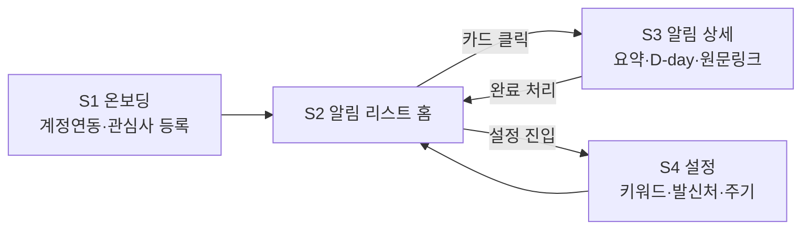
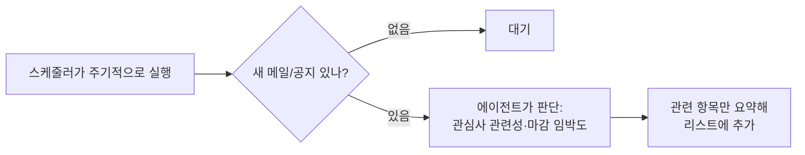

# 보쇼 — 기획서

> AI Agent Challenge · N146_임두희 (GitHub: Urindo-do)
> 카테고리: 대학생(본인)이 겪는 문제 해결 · 최종 확정

---

## 0. 서비스 한눈에

| 무엇을 해결하나 | 우리의 답 |
|---|---|
| 학교 공지·메일이 이메일, eclass, 포털에 흩어져 있다 | 흩어진 알림을 한 곳에 모은다 |
| 정보량이 너무 많아 나에게 필요한 걸 찾기 어렵다 | 내가 등록한 관심사·발신처 기준으로 걸러준다 |
| 시기별로 챙겨야 할 일(수강신청, 등록금 등)을 놓친다 | 학사일정과 마감일 기준으로 우선순위를 정해 먼저 알려준다 |

**한 줄 정의: "흩어진 학교 소식 중, 지금 나에게 필요한 것만 골라 먼저 알려주는 에이전트"**

---

## 1. 문제 정의

대학 생활 시스템에 아직 익숙하지 않은 신입생이, 등록금 납부·수강신청·장학금·자기개발 프로그램 신청처럼 시기별로 챙겨야 할 정보가 학교 이메일·eclass·포털에 흩어져 있어서, 정작 본인에게 필요한 정보를 제때 찾지 못하고 놓친다.

---

## 2. 사용자 시나리오 (화면 단위)

1. 신입생 B씨가 앱에 처음 접속해 **[S1 온보딩]** 에서 학교 이메일 계정을 연동하고, 관심 키워드(장학금, 취업, 교환학생)와 "꼭 알림 받을 발신처"(학과 사무실, 장학팀)를 등록한다.
2. 에이전트가 백그라운드에서 주기적으로 새 메일·공지를 확인한다. (화면 없음)
3. B씨가 앱을 열면 **[S2 알림 리스트(홈)]** 에 에이전트가 골라낸 항목들이 마감 임박·중요도 순으로 정렬되어 보인다. 각 카드에는 한 줄 요약과 D-day가 붙어 있다.
4. 관심 가는 카드를 누르면 **[S3 알림 상세]** 에서 에이전트가 정리한 요약, 마감일, 원문 링크를 확인하고, 처리했으면 "완료" 표시한다.
5. 알림 기준을 바꾸고 싶으면 **[S4 설정]** 에서 키워드·발신처·확인 주기를 수정한다.

---

## 3. 화면 흐름 (User Flow)

핵심 루프: **리스트 확인 → 상세 → 완료 처리 → 리스트** (최초 1회만 온보딩)

백그라운드 동작(화면 없음):

---

## 4. 화면 목록 (IA)

| 번호 | 화면 | 역할 | MVP |
|---|---|---|---|
| S1 | 온보딩 | 이메일 계정 연동(OAuth), 관심 키워드·필수 발신처 등록 | ✅ |
| S2 | 알림 리스트 (홈) | 에이전트가 선별한 알림을 우선순위 순으로 표시 | ✅ |
| S3 | 알림 상세 | 요약·마감일·원문 링크·완료 처리 | ✅ |
| S4 | 설정 | 키워드/발신처/확인주기 수정 | ✅ (최소 기능만) |
| S5 | 학사일정 캘린더 뷰 | 내 알림을 달력 형태로 보기 | ⬜ 확장 |
| S6 | 보호자 공유 | 요약 알림을 보호자에게 전달 | ⬜ 확장 |

---

## 4-1. 와이어프레임

S1~S4 저해상도 와이어프레임: [docs/wireframe.html](wireframe.html) (무채색, 디자인은 프로토타입 단계에서 진행)

| 화면 | 설계 근거 |
|---|---|
| S1 온보딩 | 이메일 연동은 읽기 전용 권한만 요청 — 개인정보 최소 수집 원칙을 UI에도 명시. 관심 키워드는 선택식 칩 + 직접입력으로, 신입생이 뭘 입력할지 모르는 상태를 배려. 발신처 등록은 기능 A의 사용자 규칙 그 자체(AI가 틀려도 동작하는 안전망) |
| S2 알림 리스트 (홈) | 기본 정렬을 마감 임박순으로 두어 "제때 못 찾고 놓친다"는 문제 정의를 화면 배치로 직접 해결. 카드 한 줄 요약은 기능 B(에이전트 요약)의 얼굴 — 원문을 열지 않고도 판단 가능해야 함. 출처 태그는 다중 소스 통합(기능 A)이 사용자 눈에 보이는 지점. 완료 항목은 흐리게 남겨 "다 챙겼다"는 안심을 주는 처리 이력으로 유지 |
| S3 알림 상세 | 요약 박스를 최상단에 배치 — 상세 화면에서도 원문보다 에이전트 판단이 먼저 보이게 함. 원문은 저장하지 않고 링크로만 연결해 개인정보 설계 원칙과 일치시킴. "완료로 표시"는 핵심 루프(리스트→상세→완료→리스트)를 마무리하는 동작 |
| S4 설정 | 온보딩(S1)에서 등록한 값을 그대로 불러와 수정하는 구조 — 같은 데이터의 두 입구. 확인 주기를 사용자가 직접 조절하게 해 폴링 간격·LLM 호출 비용 설계와 연결. 채널별 토글에서 취업진로포털은 "검증 중" 상태를 정직하게 노출 |

---

## 5. 핵심 기능 (2개)

### 기능 A: 조건 기반 알림 수집·전달 (서비스의 뼈대)
- 사용자가 등록한 발신처·키워드에 해당하는 메일/공지를 주기적으로 수집
- 스케줄러(폴링) 방식: 정해진 주기로 새 항목만 확인, 이미 처리한 항목은 기록해두고 건너뜀
- **이 기능만으로도 서비스가 동작함** (AI 없이도 규칙 기반으로 성립)

### 기능 B: 에이전트 기반 우선순위 판단·요약 (차별점)
- LLM 에이전트가 수집된 항목을 읽고 판단:
  - 사용자 관심사와의 **의미적 관련성** (예: 키워드가 "장학금"일 때 "국가근로 학자금 안내"도 매칭 — 별도 DB 없이 LLM의 의미 이해로 처리)
  - **학사일정 시기**와의 연관성 (수강신청 기간엔 수강신청 공지를 상위로)
  - **마감 임박도** (D-day 계산)
- 판단 결과를 한 줄 요약 + 우선순위로 리스트에 반영
- 에이전트 구조: LLM에게 도구(메일 조회, 학사일정 조회, 알림 기록)를 제공하고, 무엇을 언제 쓸지 LLM이 판단하는 tool-use 구조

---

## 6. MVP 범위

### 3주 내 구현 (MVP)
- S1~S4 화면
- 수집 채널 (우선순위 순):
  1. **학교 이메일 (Gmail API)** — 가장 안정적, 공식 API 제공
  2. **학교 포털 공지 게시판 (크롤링)** — 로그인 없이 완전 공개임을 확인 (학사안내/취업정보/장학안내 카테고리 포함), RSS 미제공이라 HTML 파싱 방식
- 기능 A 전체 + 기능 B(관심사 매칭, 요약, D-day 정렬)

### 검증 후 MVP 편입 (2순위) — 서비스 확장의 핵심 지점
공개 채널(이메일·공지 게시판)만으로는 수집 가능한 정보의 폭에 한계가 있다 (예: 취업 프로그램 전체 목록은 로그인 필요). 로그인 뒤 정보까지 수집할 수 있는지가 이 서비스가 "반쪽 알림이"에서 "진짜 개인 비서"로 갈 수 있는지를 가르는 지점.
방식: 포털의 "신뢰할 수 있는 기기등록"으로 최초 1회 수동 인증 → 이후 세션 재사용 (2차 인증 우회가 아니라 학교가 제공하는 공식 기능 활용, 본인 계정·개인 사용 한정)
편입 조건: 세션 만료 주기 실측 → 재로그인 빈도가 사용자 경험을 해치지 않는 수준이면 MVP에 편입

### 하지 않는 것 (이번 스코프 제외)
- 로그인 뒤에 있는 개인 서비스 자동 접근 (성적, 수강신청 내역 등 — 2차 인증 우회는 하지 않음)
- eclass 연동 (Open API 존재 여부 확인 후 가능하면 추가, 기본은 제외)
- 지원조건 자동 판단 (예: "이 장학금에 내가 지원 가능한가" — 개인 데이터 부족으로 판단 불가, 키워드 매칭 추천까지만)
- 실서비스 배포·운영 (에러 모니터링, 다중 사용자 스케일링 등)

### MVP 검증 후 확장
- S5 캘린더 뷰: 월간 뷰는 중요도 점 표시(임박/관심/일반 3색), 일자 탭 시 하단에 해당일 알림 목록 표시, 캘린더 표시 여부는 S4에서 알림 유형별 토글
  여부는 S4에서 알림 유형별 토글
- S6 보호자 공유
- eclass 등 수집 채널 추가
- **프라이버시 모드**: 메일 내용을 외부 API에 보내지 않고 로컬 오픈소스 LLM(Ollama 등)으로 처리하는 옵션 — LLM 호출부를 한 곳에 모아두는 구조로 설계해 교체 가능하게 함
- **완료 처리 고도화**: 실제 신청 여부 체크 옵션 — 사용자 행동 변화를 에이전트가 추적·학습하는 입력으로 활용
- **추천 품질 피드백**: 알림별 간단 평가(도움됨/아님)로 우선순위 판단 개선

---

## 7. 기술 검토 요약

| 항목 | 내용 |
|---|---|
| 메일 수집 | Gmail API (읽기 전용 OAuth 스코프, 표준 사용량 내 무료) |
| 포털 공지 수집 | 공개 게시판 크롤링 (로그인 불필요 확인 완료, RSS 미제공 → HTML 파싱, 새 글만 증분 수집) |
| 취업진로포털 | 신뢰 기기등록 실측 — 추가인증 1개월 면제(본인 기기 한정, 공식 안내 확인). 편입 조건(재로그인 빈도) 충족 가능성 높음, 세션 쿠키 수명은 자동화 구현 시 별도 확인 |
| 실행 방식 | 상시 구동 X → 주기적 폴링(예: 1시간), 새 항목 있을 때만 LLM 호출 |
| LLM 비용 | 메일 1건당 수 원 수준, 월 수천 원 이내 예상. 지출 한도(budget cap) 설정 |
| 개인정보 | 원문은 저장하지 않고 분류·요약 결과만 유지. 읽기 전용 권한만 요청 |
| 의미 매칭 | MVP: LLM 프롬프트로 직접 판단. 대량 처리 필요 시 임베딩 1차 필터 추가 (확장) |
| 학사일정 데이터 | 포털 학사일정 페이지(공개, 달력 구조) 확인 — 기능 B 시기 판단의 입력 후보 |

---

## 8. 결정 히스토리

| 결정 | 이유 |
|---|---|
| 주제: 요식업 음성주문 대신 학교 알림 에이전트 | 본인이 매일 실사용하며 즉시 검증 가능. 요식업은 소규모 자영업 도입 사례가 거의 없어 경제성 추가 검증 필요했음 |
| RAG 보안 AI 단독 주제는 폐기 | 실제 기밀 데이터가 없어 기술 데모에 그침. 대신 이 프로젝트 안에 기법으로 흡수 |
| 포털 공지: 제외 → 크롤링 포함으로 변경 | 실제 확인 결과 공지 게시판은 로그인 없이 완전 공개였음 (초기 가정이 틀렸음을 브라우저 에이전트로 직접 검증). 2차 인증이 필요한 것은 개인 서비스 영역이며, 이 부분은 우회하지 않고 제외 유지 |
| 취업진로포털은 2순위 검증 채널 | 전체 목록은 로그인 필요하나 "신뢰 기기등록"으로 최초 1회 인증 후 세션 재사용 가능성 확인. 세션 만료 주기가 미검증이라 MVP 확정 채널에는 미포함 |
| "지원조건 자동 판단" 제외 | 개인 데이터·행동 패턴 데이터가 없어 신뢰할 수 없는 판단이 됨. 키워드 기반 추천까지만 |
| 자동 판단 + 사용자 규칙 병행 | AI가 틀려도 사용자 규칙(필수 발신처)은 동작 → 핵심 알림을 놓치는 최악 상황 방지 |
| 의미 매칭에 임베딩 DB 대신 LLM 직접 판단 | 개인 계정 스케일(하루 수십 통)에선 LLM 판단으로 충분, 과설계 방지 |
| wiki 대신 docs/ 폴더 | wiki는 별도 git 저장소라 커밋 히스토리와 분리됨. docs/는 기획 수정 이력이 커밋으로 남음 |
| 로컬 LLM은 MVP 제외, 확장으로 명시 | 소형 로컬 모델은 판단 품질 리스크 있음. 3주 내 완성 우선, 구조만 교체 가능하게 설계 |
| 완료 = 사용자의 처리 선언 | 실제 신청 여부는 앱이 검증 불가, 개인 서비스 접근은 스코프 외 — 버튼 문구 "완료로 표시"가 이 의미를 반영 |
| 학사일정 캘린더 표시는 MVP 미편입 | 전체 일정 나열은 문제 정의와 반대 방향, 중요 건은 에이전트가 알림으로 승격 — S5 확장에서 재검토 |
| S3 공유 버튼은 S6(보호자 공유) 연계 요소로 UI만 배치, MVP 미구현 | 공유 대상·권한 설계가 아직 없어 기능 구현은 시기상조지만, 화면 구조에는 미리 자리를 남겨 확장 시 재작업을 줄임 |
| 에이전트 실행 위치는 MVP에서 본인 PC 로컬(폴링), 휴대폰 접근은 서버 호스팅 필요로 확장 단계 — 신뢰 기기 세션의 기기 귀속 문제 포함 재검토 | 신뢰 기기등록은 기기 단위로 세션이 귀속되므로, 서버로 옮기면 "신뢰 기기"의 정의 자체를 재검토해야 함 |
