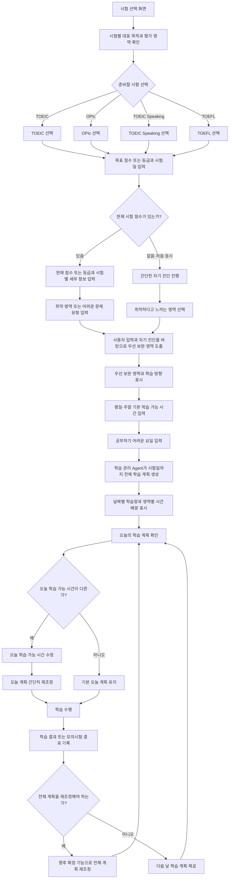

# 프로젝트 기획서 초안

## 1. 서비스 개요
대학생이 TOEIC, OPIc, TOEIC Speaking, TOEFL 중 준비할 시험을 직접 선택하고, 현재 실력, 목표 점수/등급, 시험일, 학습 가능 시간을 입력하면 취약 영역을 분석하고 시험일까지 날짜별 학습 계획을 제공하는 Agent 서비스입니다. 사용자가 자신의 조건을 빠르게 입력하면, 시험까지 남은 기간을 고려한 맞춤형 학습 일정을 제안합니다.

## 2. 문제 정의
대학생은 취업, 교환학생, 졸업 요건 등으로 어학 성적이 필요한 경우가 많습니다. 준비할 시험을 정한 뒤에도 현재 실력과 목표, 남은 기간을 바탕으로 어떤 영역을 먼저 공부해야 할지, 하루 학습 시간을 어떻게 배분해야 할지 판단하기 어렵습니다. 특히 방학이나 단기간에 성적이 필요한 상황에서는 바쁜 일정 속에서 자투리 시간을 계획적으로 활용해야 하지만, 이를 나누고 활용할 기준이 부족합니다.

## 3. 핵심 사용자
- 어학 시험 점수가 필요한 대학생
- 시험 준비까지 기간이 짧은 학생
- 현재 실력은 있으나 우선순위와 일별 학습 계획이 필요한 학생
- 처음 시험을 준비하는 학생

## 4. 사용자 시나리오
1. 사용자는 첫 화면에서 TOEIC, OPIc, TOEIC Speaking, TOEFL의 대표 활용 목적과 평가 영역을 확인합니다.
2. 사용자는 자신이 준비할 영어시험을 직접 선택합니다.
3. 사용자는 목표 점수 또는 등급과 시험일을 입력하고, 현재 점수가 있는 경우 입력하며 없는 경우에는 ‘처음 응시’로 선택합니다.
4. 현재 점수 또는 등급과 시험별 세부 정보를 입력하고, 처음 응시인 경우 간단한 자기 진단을 진행합니다.
5. 사용자가 입력한 점수·등급과 자기 진단을 바탕으로 우선 보완 영역을 도출합니다.
6. 사용자는 평일과 주말의 기본 학습 가능 시간과 공부하기 어려운 요일을 입력합니다.
7. 학습 관리 Agent는 시험일까지 남은 기간을 고려해 전체 학습량을 날짜별로 배분합니다.
8. 사용자는 매일 오늘의 계획을 확인하고, 필요한 경우 오늘의 학습 가능 시간을 수정합니다.
9. 사용자가 학습 결과나 모의시험 결과를 기록하면, MVP에서는 오늘의 계획 조정에 반영하고 향후에는 전체 계획 재조정 흐름으로 확장됩니다.

## 5. 핵심 기능
1. 사용자가 선택한 시험의 현재 수준과 목표를 바탕으로 취약 영역을 파악합니다.
2. 시험까지 남은 기간과 학습 가능 시간을 고려해 학습 우선순위와 기본 학습 방향을 제안합니다.
3. 오늘 실천 가능한 구체적인 학습 과제를 제공하고, 완료 여부를 기록해 진행 상황을 확인할 수 있도록 돕습니다.
4. 학습 결과나 일정 변화가 반영되면, MVP에서는 오늘의 학습 조정까지 지원하고 향후에는 전체 계획 재조정으로 확장됩니다.

학습 관리 Agent는 사용자의 입력 정보와 자기 진단을 바탕으로 학습 계획의 기본 흐름을 생성하고, 시험별 특성에 맞는 우선순위를 제시합니다.

## 6. 시험별 입력 정보
공통 입력 항목 외에도 각 시험의 특성에 따라 필요한 입력 정보는 다를 수 있다.

- TOEIC
  - 목표 점수
  - 현재 점수(있다면)
  - 리딩/리스닝 영역별 취약점
- OPIc
  - 목표 등급
  - 현재 등급(있다면)
  - 주요 말하기 주제 또는 어려운 유형
- TOEIC Speaking
  - 목표 점수
  - 현재 점수(있다면)
  - 말하기 유형별 어려움
- TOEFL
  - 목표 점수
  - 현재 점수(있다면)
  - 리딩/리스닝/스피킹/라이팅별 취약점

공통 입력
- 시험일
- 평일 학습 가능 시간
- 주말 학습 가능 시간
- 공부하기 어려운 요일

## 7. 사용자 흐름 Mermaid

## 8. 학습 계획 생성 및 재조정 방식
- 사용자가 입력한 시험 종류와 목표, 현재 상태, 자기 진단을 바탕으로 주요 학습 영역을 도출합니다.
- 남은 기간과 학습 가능 시간을 고려해 전체 학습량과 일별 배분을 산출합니다.
- 취약 영역 비중을 높여 우선순위 학습 항목을 생성합니다.
- 계획 생성 방식은 규칙 기반으로 먼저 구현할지, 실제 AI 모델을 연결할지는 개발 과정에서 결정합니다.
- 사용자가 학습 결과나 모의시험 결과를 입력하면, MVP에서는 오늘의 학습 조정에 반영하고 향후에는 전체 계획 재조정으로 확장할 수 있습니다.

## 9. 공통 MVP 범위
- 사용자가 시험 선택 및 기본 정보 입력합니다.
- 현재 상태(점수/등급, 자기 진단) 입력합니다.
- 평일/주말 또는 하루 학습 가능 시간 입력합니다.
- 사용자가 입력한 점수·등급과 자기 진단을 바탕으로 우선 보완 영역을 도출합니다.
- 학습 우선순위 및 기본 학습 계획을 생성합니다.
- 오늘의 학습 항목을 확인합니다.
- 오늘의 학습 확인, 완료 체크, 진행률 표시를 제공합니다.
- 오늘 학습 가능 시간 변경에 따라 오늘의 계획을 간단히 조정합니다.
- React와 Express 기반의 기본 개발 환경을 구성합니다.

## 10. MVP 제외 범위
- 외부 성적 자동 연동
- 자동 채점
- 음성 평가
- 글쓰기 자동 첨삭
- 문제 자동 생성
- 문자·이메일 알림
- 복잡한 회원 관리
- 장기간 학습 데이터 분석

React와 Express 기반의 기본 개발 환경은 MVP 범위로 포함하되, 로그인, 회원 관리, 서버 기반 영구 저장 기능은 MVP에서는 제외하고 향후 확장 가능성으로 다룹니다.

## 11. 예외 상황
- 시험일이 현재 날짜보다 이전인 경우
- 목표 점수/등급이 해당 시험의 허용 범위를 벗어난 경우
- 입력한 학습 가능 시간이 0인 경우
- 사용자가 시험 종류를 선택하지 않은 경우
- 평일과 주말의 학습 가능 시간이 모두 0시간인 경우
- 필수 입력 정보가 누락된 경우

## 12. 향후 확장 기능
- 모의시험 결과를 분석해 전체 계획을 자동 재조정하는 기능
- 학습 결과를 반영해 계획을 더 정교하게 조정하는 기능
- 시험별 맞춤형 추천과 취약 영역 분석의 정밀화
- 서버 기반 저장, 로그인 및 회원 관리 등 사용자 계정 기능
- 주간·월간 학습 기록 관리와 학습 데이터 분석
- 알림 기능을 포함한 학습 루틴 관리 확장

## 13. 아직 결정하지 않은 사항
- 계획 수정 시 구체적인 재조정 알고리즘 세부 방식
- UI에서 `처음 응시` 자기 진단의 구체적 질문 구성
- 하루 계획 구성 단위(시간 단위 vs 영역 단위)
- 데이터 저장 방식(세션 기준 저장 vs 로컬 저장)
