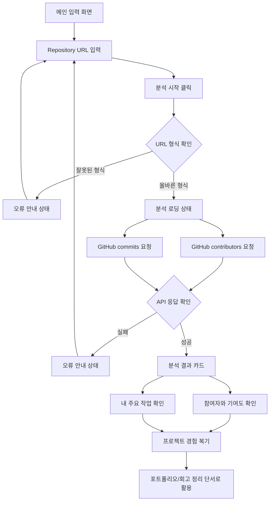

# PtoP 기획서

## 1. 문제 발견

최근 대학생 개발자는 동아리, 부트캠프, 해커톤, 수업, 개인 프로젝트를 통해 짧은 기간에 여러 프로젝트를 빠르게 경험한다. 특히 AI 도구의 발전으로 프로젝트를 구현하는 속도는 빨라졌지만, 프로젝트가 끝난 직후 경험을 정리하지 않으면 시간이 지난 뒤 자신의 역할과 기여 내용을 다시 설명하기 어렵다.

포트폴리오, 자기소개서, 면접 준비 단계에서는 단순히 “무엇을 만들었는가”보다 “내가 어떤 역할을 했고, 어떤 문제를 해결했는가”가 중요하다. 하지만 실제로는 Repository를 다시 열어 README, commit, PR, 코드 구조를 하나씩 확인해야 해서 정리 비용이 크다.

## 2. 문제 정의

프로젝트 경험을 쌓는 대학생 개발자는 프로젝트가 끝난 뒤 시간이 지나면 자신이 맡은 역할, 기여도, 핵심 구현 내용, 문제 해결 과정을 정확히 기억하고 정리하기 어렵다.

문제 정의 공식:

```text
[프로젝트 경험을 쌓는 대학생 개발자]가
[프로젝트 종료 후 포트폴리오나 자기소개서를 작성해야 하는 상황에서]
[자신의 역할, 기여도, 핵심 구현 내용, 문제 해결 과정을 다시 기억하고 정리하기 어려움]을 겪는다.
```

이 문제 정의에는 해결책을 넣지 않고, 사용자가 실제로 겪는 불편만 적었다.

## 3. 서비스 목표

PtoP(Project to Portfolio)는 GitHub Repository를 기반으로 프로젝트 참여 정보와 작업 흔적을 빠르게 확인하고, 나중에 포트폴리오와 회고로 확장할 수 있는 프로젝트 정리 초안을 만드는 서비스다.

현재 MVP에서는 기능을 넓히기보다 다음 두 흐름을 명확하게 만든다.

- Repository를 입력하면 참여자, 기여도, 주요 커밋 흐름을 확인한다.
- 분석 결과를 바탕으로 내가 어떤 작업을 했는지 설명할 수 있는 단서를 제공한다.

## 4. 사용자 시나리오

1. 사용자는 프로젝트를 마친 뒤 포트폴리오에 정리할 내용이 필요하다고 느낀다.
2. 사용자는 PtoP 첫 화면에서 분석하고 싶은 GitHub Repository URL을 입력한다.
3. 사용자는 `분석 시작` 버튼을 누르고, 서비스 컬러 기반 spinner를 통해 분석이 진행 중임을 확인한다.
4. PtoP는 GitHub 공개 API로 Repository 참여자와 최근 commit 정보를 가져온다.
5. 사용자는 결과 화면에서 프로젝트 참여자, commit 수 기준 기여도, Repository owner의 주요 commit message를 확인한다.
6. 사용자는 결과를 보며 “내가 주로 어떤 작업을 했는지”를 빠르게 복기한다.
7. 사용자는 이 정보를 바탕으로 회고, 포트폴리오, 자기소개서에 쓸 내용을 직접 정리한다.

## 5. 핵심 기능 2개

### 5.1 Repository 분석 기능

사용자가 GitHub Repository URL을 입력하면 GitHub 공개 API를 통해 프로젝트의 참여자와 작업 흐름을 분석한다.

입력:

- GitHub Repository URL
- URL 형식: `https://github.com/{owner}/{repository}`

분석 대상:

- Repository 기본 정보
- contributors API의 참여자별 commit 수
- commits API의 최근 commit 작성자
- commits API의 최근 commit message

사용자에게 보여줄 결과:

- Repository 이름
- GitHub Repository 원문 링크
- 프로젝트 참여자 목록
- 참여자별 commit 수
- 참여자별 기여도 퍼센트

선정 이유:

- 이 기능이 없으면 서비스가 “프로젝트를 분석한다”는 핵심 흐름을 수행할 수 없다.
- 사용자가 포트폴리오를 정리하기 전 가장 먼저 필요한 정보는 “누가 참여했고, 어느 정도 작업했는가”이다.
- commit 수와 참여자 정보는 GitHub에서 바로 확인할 수 있는 객관적인 작업 흔적이다.

제한과 주의점:

- commit 수는 작업량을 보여주는 참고 지표이며, 실제 구현 난이도나 코드 품질을 완전히 설명하지 않는다.
- 비공개 Repository, 잘못된 URL, GitHub API rate limit 상황에서는 임의 데이터를 만들지 않고 오류를 안내한다.
- 현재 단계에서는 코드 파일 내부 분석이나 AI 기반 역할 추론은 하지 않는다.

### 5.2 작업 내용 정리 기능

Repository 분석 결과를 바탕으로 사용자가 자신의 주요 작업을 빠르게 복기할 수 있도록 최근 commit message를 정리한다.

입력:

- Repository 분석 결과
- Repository owner 정보
- 최근 commit message

정리 대상:

- Repository owner가 남긴 최근 commit message
- 반복적으로 등장하는 작업 흐름
- 포트폴리오에 옮길 수 있는 작업 단서

사용자에게 보여줄 결과:

- “내 주요 작업” 목록
- commit message 기반 작업 힌트
- 이후 회고/포트폴리오 초안으로 확장 가능한 요약 단서

선정 이유:

- 사용자가 최종적으로 필요한 것은 단순 Repository 정보가 아니라 “내가 무엇을 했는지 설명할 수 있는 근거”다.
- AI가 사용자의 역할을 바로 단정하면 과장되거나 틀린 결과가 나올 수 있다.
- 현재 MVP에서는 사용자가 직접 검증할 수 있는 commit message를 먼저 보여주는 방식이 더 안전하다.

제한과 주의점:

- 현재 구현은 Repository owner 기준으로 주요 commit message를 보여준다.
- commit 작성자가 GitHub 계정과 연결되지 않거나 최근 100개 commit 안에 owner의 commit이 없으면 “찾지 못함”을 표시한다.
- 추후에는 사용자가 직접 GitHub ID를 지정하거나 PR/Issue까지 분석하는 방식으로 확장할 수 있다.

## 6. MVP 범위

이번 단계에서 포함하는 것:

- GitHub Repository URL 입력
- 서비스 컬러 기반 로딩 상태
- GitHub API 기반 참여자 조회
- commit 수 기준 기여도 계산
- 최근 commit message 기반 주요 작업 표시
- 오류 상태 안내
- 서비스 소개 랜딩 섹션
- 기획 문서와 프로토타입 링크 연결

이번 단계에서 제외하는 것:

- 프로젝트 폴더 업로드
- README 전체 분석
- 코드 파일 내용 분석
- PR/Issue 분석
- AI 기반 회고 문장 자동 생성
- Notion, GitHub Pages 내보내기
- 여러 프로젝트 비교

제외 이유:

- 핵심 기능 2개를 먼저 검증하는 것이 목표다.
- 기능을 넓히면 각 기능이 얕아지고, 사용자가 실제로 어떤 가치를 느끼는지 확인하기 어렵다.
- 현재는 “Repository를 입력하면 분석 결과가 나온다”는 가장 작은 흐름을 탄탄하게 만드는 데 집중한다.

## 7. 정보 구조(IA)

현재 UI는 하나의 랜딩 페이지 안에서 입력, 분석, 결과, 서비스 소개가 이어지는 구조다.

```text
PtoP Page
├─ Hero / Repository 입력
│  ├─ PtoP 로고
│  ├─ GitHub Repository URL 입력창
│  ├─ 분석 시작 버튼
│  ├─ 분석 로딩 상태
│  ├─ 오류 안내 상태
│  └─ 분석 결과 카드
├─ 프로젝트 개요
│  ├─ 대상
│  ├─ 문제
│  ├─ 해결
│  └─ 형태
├─ 핵심 기능
│  ├─ Repository 입력
│  ├─ 참여자 분석
│  └─ 작업 내용 정리
├─ 문제 정의 / 해결 방안
├─ 추가 기능 고려사항
├─ 기획 문서와 프로토타입 링크
└─ 한 줄 소개
```

## 8. 화면 구조(UI)

| 화면/섹션 | 주요 UI | 사용자 동작 | 시스템 동작 | 다음 흐름 |
| --- | --- | --- | --- | --- |
| 메인 입력 화면 | PtoP 로고, URL 입력창, 분석 시작 버튼, 안내 문구 | GitHub Repository URL을 입력한다. | URL 형식을 확인한다. | 로딩 상태 |
| 분석 로딩 상태 | 민트 컬러 spinner, 분석 중 메시지 | 분석 완료를 기다린다. | GitHub API로 contributors와 commits를 요청한다. | 결과 카드 또는 오류 상태 |
| 분석 결과 카드 | Repository 이름, GitHub 링크, 참여자/기여도, 주요 작업 목록 | 참여자와 주요 작업을 확인한다. | API 결과를 화면에 요약한다. | 프로젝트 경험 복기 |
| 오류 안내 상태 | 오류 메시지, 입력창 유지 | URL을 수정하거나 공개 Repository인지 확인한다. | 임의 결과를 만들지 않고 실패를 안내한다. | 다시 입력 |
| 프로젝트 개요 섹션 | 대상, 문제, 해결, 형태 4개 요약 | 서비스가 누구를 위한 것인지 확인한다. | 정적 정보를 제공한다. | 핵심 기능 섹션 |
| 핵심 기능 섹션 | Repository 입력, 참여자 분석, 작업 내용 정리 | 서비스 핵심 기능을 이해한다. | 정적 정보를 제공한다. | 문제/해결 섹션 |
| 문제/해결 섹션 | 문제 정의, 해결 방안 | 서비스 기획 배경을 확인한다. | 정적 정보를 제공한다. | 추가 기능 섹션 |
| 문서 링크 섹션 | 기획서, 프로토타입, GitHub Wiki 링크 | 필요한 문서로 이동한다. | 외부/내부 링크를 제공한다. | 문서 확인 |

## 9. 사용자 흐름



## 10. 화면 단위 와이어프레임

### 10.1 메인 입력 화면

```text
┌──────────────────────────────────────────────┐
│                                              │
│                  PtoP Logo                   │
│                                              │
│   ┌──────────────────────────────────────┐   │
│   │ https://github.com/user/repository   │   │
│   └────────────────────── [분석 시작] ───┘   │
│                                              │
│   분석하고 싶은 프로젝트의 Git Repository     │
│   주소를 입력해보세요.                       │
│                                              │
└──────────────────────────────────────────────┘
```

### 10.2 분석 로딩 상태

```text
┌──────────────────────────────────────────────┐
│  ◌  Repository를 분석하고 있어요              │
│     참여자, 기여도, 최근 커밋 흐름 확인 중     │
└──────────────────────────────────────────────┘
```

로딩 상태는 로고나 마스코트 이미지를 사용하지 않고, 서비스 색상인 민트 계열 CSS spinner로 표현한다.

### 10.3 분석 결과 카드

```text
┌──────────────────────────────────────────────┐
│ Analysis Result                              │
│ SubJeeLee/hub                                │
│ [GitHub에서 보기]                            │
├──────────────────────┬───────────────────────┤
│ 프로젝트 참여자       │ SubJeeLee의 주요 작업  │
│ SubJeeLee 80%        │ feat: ...             │
│ userA 20%            │ docs: ...             │
└──────────────────────┴───────────────────────┘
```

### 10.4 오류 안내 상태

```text
┌──────────────────────────────────────────────┐
│ 분석할 수 없습니다                            │
│ Repository 데이터를 가져오지 못했습니다.       │
│ 공개 저장소인지 확인해 주세요.                │
└──────────────────────────────────────────────┘
```

### 10.5 서비스 소개 섹션

```text
┌────────────┬────────────┬────────────┬────────────┐
│ 대상       │ 문제       │ 해결       │ 형태       │
└────────────┴────────────┴────────────┴────────────┘

┌──────────────────────────────────────────────┐
│ 핵심 기능                                    │
│ 01 Repository 입력  02 참여자 분석  03 작업 정리 │
└──────────────────────────────────────────────┘
```

## 11. 현재 구현 기준

현재 구현된 화면:

- React 메인 페이지: `/`
- HTML/CSS/Vanilla JS 프로토타입: `prototype/index.html`

두 화면 모두 같은 UI 흐름을 따른다.

- 로고 중심 Hero
- GitHub Repository URL 입력
- 분석 시작 버튼
- 민트 컬러 spinner
- 분석 결과 카드
- 서비스 소개 랜딩 섹션

현재 구현된 동작:

- GitHub Repository URL 형식 검사
- GitHub 공개 API 요청
- contributors API 기반 참여자별 commit 수 조회
- commit 수 합계를 기준으로 기여도 퍼센트 계산
- 최근 commits API 기반 Repository owner의 commit message 표시
- API 실패 시 오류 안내

## 12. AI 활용 방식

이번 기획과 구현에서는 AI Agent를 다음 방식으로 활용했다.

- `planning-tip.md` 요구사항을 분석해 기획서 구조를 잡았다.
- 문제 정의, 사용자 시나리오, 핵심 기능을 좁히는 과정에서 AI에게 초안을 요청하고 직접 수정했다.
- 현재 구현된 UI를 기준으로 기획서를 역정리했다.
- React 메인 페이지와 HTML/CSS 프로토타입을 같은 UI 흐름으로 맞추는 작업에 AI를 활용했다.
- 최종 판단은 직접 수행했다.
  - 핵심 기능은 2개로 유지
  - AI 역할 추론은 MVP에서 제외
  - commit 수 기반 기여도는 참고 지표로만 표기
  - API 실패 시 임의 결과 생성 금지

## 13. 점검

내 서비스가 푸는 문제를 한 문장으로 설명할 수 있는가?

- 프로젝트 경험을 쌓는 대학생 개발자는 시간이 지난 뒤 자신의 역할, 기여도, 핵심 구현 내용, 문제 해결 과정을 다시 정리하기 어렵다.

핵심 기능을 왜 이 2개로 골랐는가?

- Repository 분석 기능이 있어야 프로젝트의 객관적인 작업 흔적을 확인할 수 있다.
- 작업 내용 정리 기능이 있어야 사용자가 자신의 경험을 포트폴리오나 회고로 옮길 단서를 얻을 수 있다.

사용자 흐름에서 빠진 화면은 없는가?

- 입력 화면, 로딩 상태, 결과 화면, 오류 상태, 서비스 소개 섹션을 모두 정의했다.
- Mermaid 흐름과 와이어프레임으로 화면 이동과 상태 변화를 확인했다.

현재 MVP에서 과한 기능은 없는가?

- README 전체 분석, 코드 파일 분석, AI 회고 문장 자동 생성, PR/Issue 분석은 확장 후보로 분리했다.
- 현재는 Repository URL 입력과 GitHub API 기반 분석 흐름에 집중한다.

## 14. 관련 문서

- [GitHub Wiki](https://github.com/SubJeeLee/hub/wiki)
- [1주차 작업 체크리스트](./checklist.md)
- [Git Repository 분석 학습 노트](./repo-analysis-study.md)
- [PtoP 테스트 케이스](./test-cases.md)
- [기획하기 with AI 가이드](./planning-tip.md)
