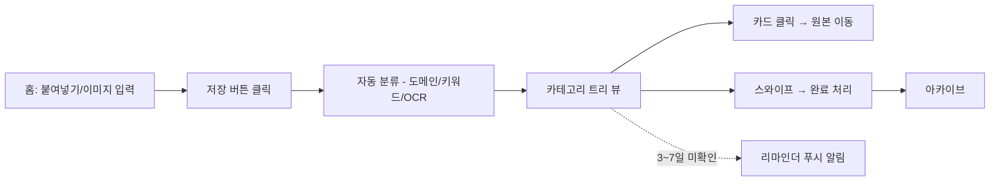

## 문제 정의
정보 과잉 시대에 사람들은 트위터, 유튜브, 인스타 등을 스크롤하다 유용한 글, 영상,
상품 링크를 발견하면 "나중에 봐야지" 하며 저장한다. 하지만 좋아요, 저장, 카톡
나에게 보내기, 갤러리 캡쳐 등 여러 채널에 흩어져 저장되다 보니 실제로 다시
열어보는 경우는 거의 없다. 저장은 했지만 소비하지 못한 정보가 계속 쌓이면서,
사용자는 정보를 놓치고 있다는 불안감과 심리적 피로를 느낀다. Later는 이렇게
흩어진 저장 콘텐츠를 한 곳에 모으고, 추가 동작 없이 자동으로 분류해 실제로
다시 꺼내 보게 만드는 것을 목표로 한다.

## 타겟 사용자
- 여러 SNS/메신저를 오가며 콘텐츠를 소비하는 20~30대
- "저장했는데 안 본 것"이 카톡방/갤러리에 계속 쌓이는 사람
- 기존 정리 앱(Notion, Pocket 등)의 저장 과정이 번거로워 포기한 사람

## 사용자 시나리오
1. 예진은 유튜브에서 러닝화 추천 영상을 보다가 나중에 다시 보려고 링크를 복사한다.
2. Later 입력창에 붙여넣고 저장 버튼을 누르면, 폴더 지정 없이 "영상 > 러닝화"로
   자동 분류된다.
3. 카톡 "나에게 보내기"에 저장해둔 채용 공고 링크도 같은 방식으로 붙여넣어
   "취업" 카테고리에 저장한다.
4. 화장품 정보글처럼 URL이 없는 텍스트 스크랩도 그대로 붙여넣으면 "뷰티"로
   분류되고, 첫 문장 기반으로 카드 제목이 자동 생성된다.
5. 스크린샷을 캡쳐한 경우 입력창 옆 이미지 첨부 버튼으로 업로드하면, OCR로
   텍스트를 읽어 자동 분류된다.
6. 저장 후 3~7일 지나면 앱이 "저장한 걸 잊지 않도록" 부드럽게 알림을 보낸다.
7. 사이드바에서 카테고리를 눌러 저장해둔 콘텐츠를 다시 확인하고, 원본 링크로
   바로 이동할 수 있다.
8. 다 본 콘텐츠는 카드를 스와이프해 완료 처리하면 아카이브로 정리된다.

## 핵심 기능 (2개)
- **원터치 저장**: 링크나 텍스트를 붙여넣고 저장 버튼 하나로 완료, 폴더 지정이나
  태그 입력 같은 추가 동작 없음
- **자동 분류**: 도메인/키워드 기반 규칙으로 대분류(쇼핑/영상/뉴스/취업/뷰티/기타)
  → 소분류(예: 쇼핑 > 신발/의류/가전) 트리 구조로 자동 태깅

## 추가 기능 (2차 우선순위)
- 이미지(스크린샷) 업로드 + OCR 기반 텍스트 인식/분류
- 저장 후 N일 경과 시 미확인 리마인더 알림
- 공유 시트 저장 (Android Web Share Target API / iOS는 Apple 단축어로 우회)
- 완료 처리 및 아카이브
- 주간 다이제스트, 사용자 지정 분류 규칙 (3차)

## 화면 흐름

## 기술 스택
| 영역 | 선택 | 이유 |
|---|---|---|
| 프론트엔드 | Next.js (React) + Tailwind CSS | PWA 설정 용이, React Native 전환 시 재사용률 높음 |
| PWA | next-pwa (manifest.json + Service Worker) | 앱스토어 배포 비용 없이 홈 화면 설치, 아이폰은 Apple 단축어로 공유 시트 우회 |
| 백엔드/인프라 | Supabase (Postgres, Auth, Storage) + Vercel 호스팅 | 무료 티어로 서버 비용 없이 운영 |
| 푸시 알림 | Firebase Cloud Messaging | 저장 후 미확인 리마인더 |
| OCR | Google Cloud Vision / Naver Clova OCR | 스크린샷 텍스트 추출, 무료 티어 존재 |

## 차별점 (경쟁 서비스 대비)
- Raindrop.io/Pocket 등은 링크 중심, SnapStash 등은 스크린샷 중심으로 나뉘어
  있는데 반해 Later는 링크·텍스트·이미지를 한 파이프라인에서 통합 처리
- 카카오톡 "나에게 보내기" 등 한국 메신저 생태계를 고려한 워크플로우
- 저장에서 끝나지 않고 리마인더로 실제 재방문을 유도하는 데 초점

## 향후 로드맵
- 시맨틱 검색, AI 요약(긴 글/영상), 가격 추적(쇼핑 카테고리)
- 폴더 공유/협업, React Native/Expo 기반 네이티브 앱 전환
