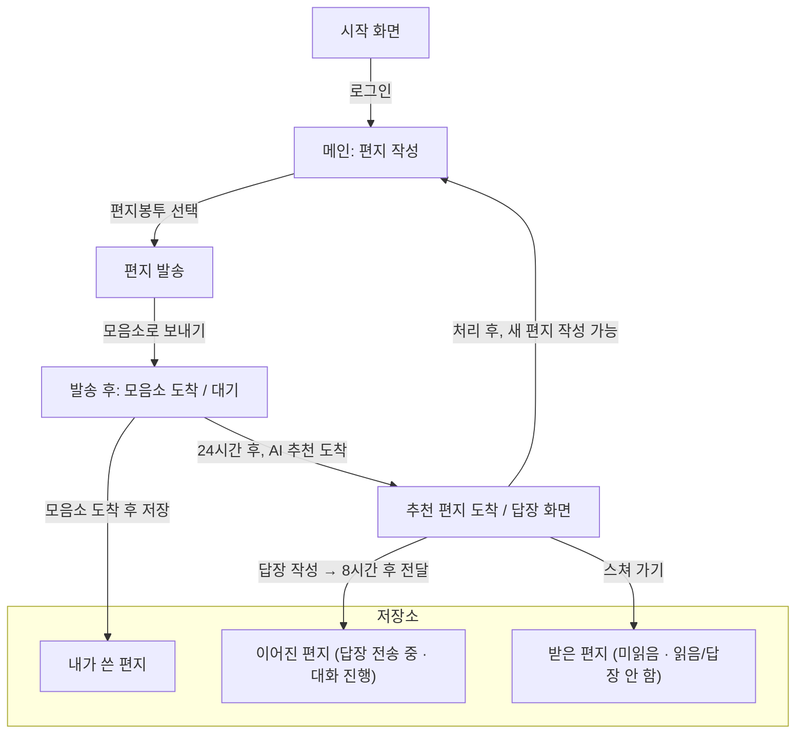

# Bridge 서비스 기획서

Bridge 서비스 기획안

▎ 글을 통해 사람과 연결되는 플랫폼

### 기획자의 생각

- 이 사이트를 통해 사람들이 직접 편지를 주고받는 경험까지 이어졌으면 하는 바램이 있음
- 이번 챌린지가 원하는 방향과는 거리가 있음을 알고 있음. 그럼에도 이 프로젝트를 선택한 이유는 
본인이 첫 사용자가 되어보고 싶다는 생각이 들게하고, 애정이 가는 프로젝트이어야 결과와 상관없이 끝까지 해낼 수 있을 것 같아서임.

### 프로젝트 철학

1. 사람과 사람 사이의 관계에는 여유, 즉 느슨함이 필요하다
2. 편지 내용은 어떤 주제든 상관없다 — 주제 제한 없음
3. 자신만의 글을 처음부터 끝까지 직접 쓰는 것이 가장 중요하다 (붙여넣기 금지의 철학적 근거)
4. 공개와 비공개 사이의 애매함이 이 서비스의 특징 — 완전한 SNS도, 완전한 사적 대화도 아님
5. 같은 주제에 대해 비슷하거나 반대되는 글을 접하고, 경험을 나누며 공감할 수 있다
6. Bridge = 글과 글 사이의 다리를 놓아주는 역할 → AI Agent가 그 다리 역할을 한다

> **Why:** 빠르게 소비되는 SNS에 대한 반작용 — 천천히 쓰고 기다리는 편지 감성을 디지털로 구현
> **적용:** 새 기능·UI 제안 시 "느슨한 연결", "직접 쓰는 행위", "애매한 공개성" 세 가지 철학에 맞는지 먼저 확인. AI는 매칭 알고리즘이 아니라 "다리를 놓는 존재"로 포지셔닝할 것.

#### 사용자 욕구 구체화

Bridge를 쓰게 만드는 계기는 두 가지 욕구로 나뉜다.

**글쓰기 욕구** (표현 자체를 향한 욕구)
- 내 안의 것을 밖으로 표현하고 싶다
- 흔적을 남기고 싶다
- 창조하고 싶다

**연결 욕구** (표현이 닿기를 바라는 욕구)
- 나의 글이 어딘가에 닿기를 바라는 마음
- 타인의 생각을 들어보고 싶음
- 나와 관계없는 사람에게 오히려 솔직해질 수 있음
- 글로만 연결된 관계에서는 편견이 줄어든다 — 사람보다 '생각'을 먼저 만나게 되고, 사람을 통해 글을 읽는 관계가 아니라 글을 통해 사람을 발견하게 된다

---
## 문제 정의

### 문제 발견
1. 현대인은 SNS·메신저의 짧고 즉각적인 소통에 익숙해지며, 자신의 생각과 경험을 처음부터 끝까지 하나의 글로 완성해보는 경험 자체가 줄어들고 있다
2. 관계는 넓어졌지만 빠른 소비·즉각 반응 압박 때문에 오히려 얕아진다
3. 완전 공개(SNS 피드)와 완전 사적(1:1 메신저) 사이, 적당히 느슨하게 연결될 공간이 없다
4. 같은 고민·주제를 가진 낯선 사람과 경험을 나누고 공감할 기회가 부족하다

### 타겟 사용자
짧은 소통에 익숙해져 장문으로 자신을 표현해본 적 없는 사람 (나이 무관 — 10대~성인 누구나)

### 문제 정의
> 짧은 소통에 익숙해 장문으로 표현해보지 않은 사람들이 많다. 공개와 비공개 사이의 중간 지점이 부족하다.

---
## 사용자 시나리오

1. 오늘, 하고 싶은 말이 생겼다.
2. 시작 화면에서 로그인 또는 회원가입으로 시작한다.
3. 메인(편지 작성) 화면에서 편지를 쓴다.
   - 임시저장(자동 저장) · 초안 이어쓰기 · 글자 수 표시
   - 저장소 이동, 프로필 수정, 답장 도착 알림, 추천 편지 도착까지 남은 시간(24시간 카운트다운)도 이 화면에서 확인
4. 봉투를 고르고 모음소로 보낸다.
   - "이 편지는 보내면 수정할 수 없습니다." 안내 확인
5. 편지가 무사히 모음소에 도착했다는 안내를 받는다. 메인 화면은 닫힌 편지 이미지로 바뀌고, 다음 편지 작성까지 대기한다.
6. 편지를 보낸 지 24시간 후, AI가 추천한 편지가 도착한다. 추천 이유도 함께 표시된다.
   - 예: "AI는 두 편지 모두 새로운 시작이라는 주제를 담고 있다고 판단했습니다."
7. 그 편지에 답장을 쓰거나 '스쳐 가기'를 선택하면, 새 편지를 작성할 수 있게 된다.
   - 답장은 작성 완료 후 8시간 뒤 상대에게 전달
8. 답장하지 않은 편지는 저장소에서 내용은 사라지고 "읽음 / 답장 안 함" 흔적만 남는다.
9. 저장소에서 내가 쓴 편지 / 받은 편지 / 이어진 편지를 확인할 수 있다.

### 서비스 규칙
- 하루에 한 번만 편지 작성 가능 (모음소 기준)
- 편지를 보낸 직후에는 추천 편지를 보여주지 않음
- 편지를 보낸 지 24시간 후, AI가 추천한 편지를 전달
- 추천 편지를 답장하거나 '스쳐 가기'로 처리해야 다음 편지 작성 가능
- 흐름: 쓰기 → 기다리기 → 읽기 → 다시 쓰기
- 답장은 작성 완료 후 8시간 뒤 전달

### 추가 UX
- 편지 개봉 애니메이션 — 봉투를 열고 종이가 펼쳐지는 연출

---
## 핵심 기능

### 기능 1. 편지 작성 (장문 표현)
- 직접 타이핑으로 편지를 처음부터 끝까지 완성
- 임시저장(자동 저장) · 초안 이어쓰기 · 글자 수 표시로 장문 작성을 지원

**필요한 이유:** 짧은 소통에 익숙해져 장문으로 자신을 표현해본 적 없는 사람에게, 생각을 처음부터 끝까지 하나의 글로 완성하는 경험 자체를 제공한다.

### 기능 2. AI 추천 연결
- 편지를 보낸 지 24시간 후, AI가 추천한 편지를 전달, 추천 이유도 함께 표시
- 답장 또는 '스쳐 가기' 선택 가능 — 답장은 작성 완료 후 8시간 뒤 전달
- 둘 중 하나를 선택해야 다음 편지 작성 가능

**필요한 이유:** 완전 공개(SNS)도 완전 사적(메신저)도 아닌 중간 지점에서, 낯선 사람과 연결되는 경험을 제공한다.

---
## 화면 흐름

### 화면 목록
1. 시작 화면 (로그인 / 회원가입 시작)
2. 메인 (편지 작성)
3. 편지 발송 (편지봉투 선택)
4. 발송 후 (대기 화면 — 닫힌 편지 이미지)
5. 추천 편지 도착 / 답장 화면 (24시간 후)
6. 저장소 (내가 쓴 편지 / 받은 편지 / 이어진 편지)

### User Flow

> 로그인/회원가입 화면, 프로필 수정 화면은 핵심 흐름이 아니라 이번 기획서에서는 생략 (추후 필요 시 추가)

[프로토타입 확인하기](https://bovozhang.github.io/hub/bridge/prototype/index.html)

---
6. 진행 계획

- ✅ 기획 — 문제 정의, 시나리오, 핵심 기능 정리
- ✅ UI 설계 — 화면 흐름, 컴포넌트 구조 설계
- ⬜ 핵심 기능 구현 — 편지 작성 + 모음소
- ⬜ AI 매칭 연동 — 편지 분류 + 수신자 매칭 API
- ⬜ 통합 테스트 — E2E 흐름 검증

---
