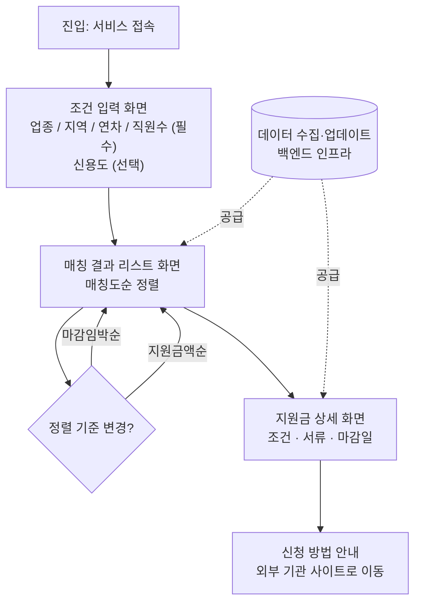

# 소상공인 정부 지원금 큐레이터 — 기획서 (plan.md)

## 문제 정의

> 소상공인이 정부 지원금을 찾을 때, 정보가 각 기관·사이트에 흩어져 있어
> 내게 맞는 지원금을 한눈에 파악하기 어렵다.

- **누가**: 전체 소상공인 (업종 무관)
- **어떤 상황에서**: 지원금을 찾아보려 할 때
- **무슨 불편**: 정부24, 소상공인시장진흥공단, 지자체 등 여러 기관 사이트에
  정보가 흩어져 있어, 내 조건에 맞는 지원금을 검색·비교하기가 어렵다.

---

## 사용자 시나리오

1. 사용자가 서비스에 접속해 업종 / 지역 / 업력(연차) / 직원 수를 입력한다 (필수)
   — 신용도는 선택 입력으로 추가할 수 있다.
2. 입력한 조건에 맞는 지원금 리스트가 **매칭도 순**으로 뜬다.
   — 필요 시 **마감임박순 / 지원금액순**으로 재정렬할 수 있다.
3. 관심 있는 지원금을 눌러 상세 조건·필요 서류·신청 방법을 확인한다.
4. 신청 방법(링크·기관)을 확인하고, 실제 신청은 해당 기관 사이트로 이동해 진행한다.

---

## 핵심 기능 (2개)

선정 기준: "이게 없으면 서비스가 안 돌아가나? (필수성)" / "문제정의를 정확히 해결하나? (적합성)"

- **기능 A. 조건 매칭 + 정렬 추천**
  입력한 조건(업종/지역/연차/직원수/신용도)을 기준으로 지원금을 매칭하고,
  매칭도·마감임박·지원금액 기준으로 정렬해서 보여준다.

- **기능 B. 지원금 상세정보 및 신청 연결**
  선택한 지원금의 상세 조건, 필요 서류, 신청 기간 등을 보여주고
  실제 신청은 외부(해당 기관) 사이트로 연결한다.

### 인프라 (핵심 기능은 아니지만 서비스 운영에 필수)
- **지원금 데이터 수집·업데이트**: 여러 기관(정부24, 소진공, 지자체 등)의
  지원금 공고를 모으고 최신 상태로 유지하는 백엔드 작업. 사용자가 직접
  마주하는 "기능"은 아니지만 없으면 기능 A/B가 애초에 작동하지 않음.

---

## 입력 조건 정의

| 조건 | 필수 여부 | 비고 |
|---|---|---|
| 업종 | 필수 | 전체 업종 대상 |
| 지역 | 필수 | 지자체 지원금 매칭에 사용 |
| 업력(연차) | 필수 | 창업 초기/기존 사업자 구분 |
| 직원 수 | 필수 | 5인 이하 등 규모 조건 매칭 |
| 신용도 | 선택 | 접근성을 높이기 위해 선택 입력으로 유지 |

> 참고: 실제 정부 지원금 공고들은 보통 업종 / 상시근로자 수 / 사업자등록 여부·업력 /
> 지역 / 신용도 / 재해·청년 등 특수 상황을 조건으로 사용함. 이번 MVP에서는
> 신용도를 필수에서 제외해 진입장벽을 낮추는 방향으로 결정.

---

## 화면 흐름 (User Flow)

**화면 목록**
1. 조건 입력 화면
2. 매칭 결과 리스트 화면 (정렬 옵션 포함)
3. 지원금 상세 화면
4. (외부 이동) 신청 페이지

---

## MVP 범위 (이번 단계에서 하지 않는 것)

- ❌ 저장·알림 기능 (관심 지원금 저장, 마감 알림) → 추후 확장
- ❌ 서비스 내 신청서 작성 → 우선 외부 사이트 이동으로 처리, 추후 상세 화면 다음 단계만
  교체하는 방식으로 확장 가능 (조건입력·매칭·상세 구조는 그대로 유지)

---

## 결정 히스토리 (왜 이렇게 정했는가)

- 타겟을 특정 업종이 아닌 **전체 소상공인**으로 잡음 → 접근 범위를 넓게 시작
- 불편의 핵심을 "정보가 흩어져 있어 검색이 힘듦"으로 정의 → 자격 판단보다
  **정보 집약·매칭**에 집중하는 서비스 방향 확정
- 신용도는 조건에서 **선택사항**으로 둠 → 접근 가능성(진입장벽 낮추기)을 우선
- 정렬 기준 우선순위: **매칭도 > 마감임박 > 지원금액**
- 저장/알림 기능은 MVP에서 제외 → 핵심 기능 2개(매칭·상세연결)에 집중
- 신청서 작성 기능은 제외하고 외부 이동으로 처리 → 추후 상세 화면 다음 단계만
  교체하면 되므로 확장 용이

---

## 구현 보충 (와이어프레임 · CLAUDE.md 기준)

기획서(본 문서)는 **제품 요구사항**을, HTML 와이어프레임은 **1차 UI 구현 기준**을 정의한다.
아래 차이는 모순이 아니라 **의도적 단계적 구현**이다.

| 기획서 (plan.md) | 와이어프레임 / 현재 구현 | 방침 |
|-----------------|------------------------|------|
| 업력(연차) 필수 | step4는 연매출 + 직원 수 | 1차 UI는 와이어프레임, 업력은 API 필드로 후속 추가 |
| 신용도 선택 | UI 없음 | API optional, MVP UI 미노출 |
| 알림 MVP 제외 | 알림·탭바 UI 존재 | 시각만 유지, 클릭 placeholder |
| 조건 입력 1화면 | 4스텝 온보딩 | UX 개선, 수집 정보는 동등 |

상세: [`CLAUDE.md`](../CLAUDE.md), [`.cursor/skills/gov-subsidy-design/`](../.cursor/skills/gov-subsidy-design/)