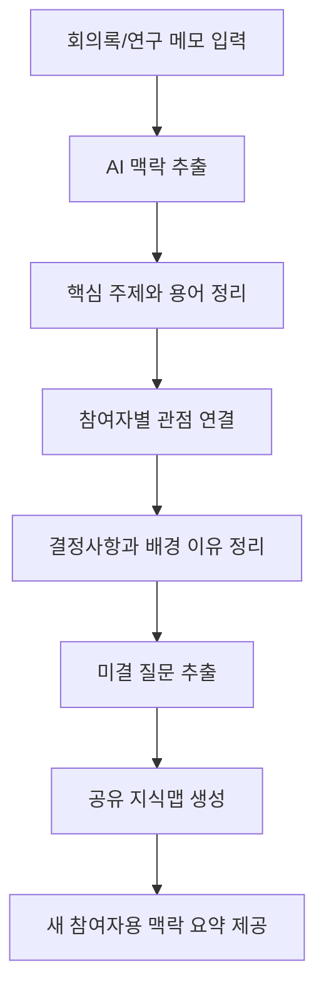

# 모두의 뇌 기초 개발 기획서

## 1. 프로젝트 주제

**모두의 뇌 - 협업 맥락 공유 AI 에이전트**

모두의 뇌는 여러 사람이 하나의 프로젝트를 함께 진행할 때, 각자 알고 있는 배경지식, 결정사항, 용어, 미결 질문을 하나의 공유 지식망으로 정리해주는 AI 에이전트이다.

기존 방향은 팀플 회의록에서 할 일과 마감일을 추출하는 업무 정리 에이전트에 가까웠다. 하지만 이 방식은 일반적인 회의 요약 에이전트와 차별성이 약하다. 수정된 방향은 `회의를 정리하는 도구`가 아니라 `팀 전체가 같은 맥락을 이해하도록 돕는 공유 두뇌`이다.

## 2. 문제 정의

여러 사람이 하나의 프로젝트를 함께 진행할 때 각자 다른 전공, 역할, 연구 분야, 업체 관점에서 문제를 바라본다. 같은 주제를 말하고 있어도 사용하는 용어, 중요하게 보는 기준, 이전 결정의 배경이 다르기 때문에 서로의 맥락을 정확히 이해하지 못하는 경우가 많다.

이로 인해 반복 설명, 오해, 중복 조사, 재작업, 의사결정 지연이 발생한다. 특히 건축 공학설계, 연구실 공동 연구, 공모전, 조선/플랜트/제조 프로젝트처럼 여러 분야가 연결된 프로젝트에서는 맥락 손실이 곧 노동력 낭비로 이어진다.

### 문제 정의 한 문장

> 여러 분야의 사람이 하나의 프로젝트를 함께 진행할 때 각자 알고 있는 맥락과 판단 근거가 문서, 회의, 메모에 흩어져 있어 서로의 의도를 정확히 이해하지 못하고 반복 설명과 재작업이 발생한다.

## 3. 목표 사용자

- 공학설계, 졸업설계, 공모전을 진행하는 대학생 팀
- 연구실에서 하나의 주제를 여러 세부 분야로 나눠 연구하는 연구자
- 건축, 조선, 플랜트 프로젝트에서 협업하는 설계/구조/설비/시공 담당자
- 제조 공장 구축 과정에서 생산, 품질, 안전, 장비 업체와 협업하는 실무자
- 동아리, 창업팀, 산학 프로젝트처럼 여러 역할이 얽힌 팀

## 4. 서비스 목표

회의록, 연구 메모, 설계 피드백, 보고서, 공지 내용을 입력하면 AI가 다음 정보를 정리한다.

- 프로젝트의 핵심 주제는 무엇인가
- 참여자별로 중요하게 보는 관점은 무엇인가
- 지금까지 어떤 결정이 내려졌고, 그 이유는 무엇인가
- 서로 이해가 갈린 부분은 무엇인가
- 아직 답하지 못한 질문은 무엇인가
- 새로 합류한 사람이 가장 먼저 알아야 할 맥락은 무엇인가

## 5. 사용자 시나리오

1. 건축 설계팀, 구조팀, 설비팀이 같은 프로젝트를 두고 회의한다.
2. 각 팀은 같은 건물을 말하지만 공간 경험, 구조 안정성, 설비 유지보수처럼 서로 다른 관점에서 말한다.
3. 회의록, 설계 피드백, 관련 메모를 모두의 뇌에 입력한다.
4. AI가 주요 용어, 결정사항, 배경 맥락, 참여자별 관점, 미결 질문을 추출한다.
5. 사람/분야/주제별로 연결된 공유 지식맵이 생성된다.
6. 팀원은 지식맵을 보며 서로의 맥락 차이와 미결 질문을 확인한다.
7. 새로 합류한 사람도 지금까지의 흐름을 빠르게 이해한다.

## 6. 핵심 기능 2개

### 기능 1. 프로젝트 맥락 추출

사용자가 회의록, 연구 메모, 설계 피드백, 보고서 내용을 텍스트로 입력하면 AI가 프로젝트 맥락을 구성하는 정보를 추출한다.

추출 항목:

- 핵심 주제
- 전문 용어와 쉬운 설명
- 결정사항
- 결정의 배경 또는 이유
- 참여자/분야별 관점
- 이해가 갈린 지점
- 미결 질문

### 기능 2. 공유 지식맵 생성

추출한 정보를 사람, 분야, 업체, 주제, 질문 단위로 연결해 팀 전체가 볼 수 있는 지식 구조로 만든다.

생성 항목:

- 프로젝트 맥락 요약
- 사람/분야별 관점 표
- 주제 간 연결 관계
- 미결 질문 목록
- 새 참여자 온보딩 요약

## 7. MVP 범위

### 포함 범위

- 회의록/연구 메모/설계 피드백 텍스트 입력
- 핵심 주제, 용어, 결정사항, 미결 질문 추출 결과 표시
- 사람/분야별 관점 표 표시
- 공유 지식맵 형태의 시각화
- 새 참여자용 맥락 요약 표시

### 제외 범위

- 실제 기업 문서 시스템 자동 연동
- 카카오톡, 슬랙, 노션 자동 수집
- 음성 회의 자동 녹음 및 분석
- 법적 책임이 필요한 계약/공문 검토
- 실제 산업 현장 의사결정 자동 승인

## 8. 예시 입력

```text
오늘 설계 회의에서 건축팀은 중앙 보이드를 유지해야 공간 경험이 살아난다고 말했다.
구조팀은 보이드가 커지면 장스팬 구간의 보강이 필요하다고 설명했다.
설비팀은 기계실과 배관 샤프트 공간이 부족해 유지보수 동선이 어렵다고 했다.
교수님은 디자인 의도를 유지하되 구조와 설비가 설명 가능한 방식으로 정리되어야 한다고 피드백했다.
아직 보이드 크기를 유지하면서 구조 보강과 설비 공간을 어떻게 조정할지는 결정되지 않았다.
```

## 9. 예시 출력

### 프로젝트 맥락 요약

- 핵심 주제: 중앙 보이드를 가진 복합문화시설 설계
- 주요 갈등: 공간 경험을 위한 보이드 유지와 구조/설비 현실성 사이의 조율
- 현재 결정: 보이드는 유지하되 구조 보강과 설비 공간 확보 방안을 추가 검토
- 미결 질문: 보이드 크기, 구조 보강 방식, 기계실/샤프트 위치

### 참여자별 관점

| 참여자/분야 | 중요하게 보는 점 | 현재 우려 | 연결된 질문 |
| --- | --- | --- | --- |
| 건축 설계 | 공간 경험, 동선, 형태 | 설비 공간이 디자인을 침범할 수 있음 | 보이드 크기를 유지할 수 있는가 |
| 구조 | 하중, 기둥 위치, 안정성 | 장스팬 구간 보강 필요 | 어떤 보강 방식이 적절한가 |
| 설비 | 배관, 공조, 유지보수 | 기계실과 샤프트 공간 부족 | 설비 공간을 어디에 배치할 것인가 |
| 지도교수 | 설계 논리, 발표 설득력 | 디자인과 기술 설명의 연결 부족 | 구조/설비 조정안을 어떻게 설명할 것인가 |

### 미결 질문

- 보이드 크기를 유지하면서 구조 보강이 가능한가?
- 설비 공간을 어느 층에 배치할 것인가?
- 디자인 의도를 유지하면서 시공 가능성을 설명할 수 있는가?

## 10. 사용자 흐름



## 11. 화면 구성

| 화면 | 목적 | 주요 요소 |
| --- | --- | --- |
| 홈 화면 | 서비스 목적 설명 | 서비스 이름, 한 줄 설명, 시작 버튼 |
| 문서 입력 화면 | 회의록/연구 메모 입력 | 텍스트 입력창, 예시 입력 버튼, 분석 버튼 |
| 맥락 분석 화면 | 추출 결과 확인 | 핵심 주제, 용어, 결정사항, 참여자별 관점 |
| 공유 지식맵 화면 | 맥락 연결 구조 확인 | 사람/분야/주제 노드, 연결선, 미결 질문 |
| 온보딩 요약 화면 | 새 참여자 빠른 이해 | 지금까지의 결정, 알아야 할 용어, 질문 목록 |

## 12. 시장 조사 기반 기획 타당성

협업 도구 시장에는 Notion, Confluence, Mem, Obsidian처럼 지식 저장과 검색을 돕는 도구가 이미 있다. 하지만 모두의 뇌는 단순 문서 저장이나 회의 요약이 아니라, 여러 분야 참여자의 관점 차이와 결정 배경을 연결해주는 것을 목표로 한다.

시장 조사에서 확인한 핵심 근거는 다음과 같다.

- 지식 노동자는 업데이트 확인, 불필요한 회의, 도구 전환 같은 `work about work`에 많은 시간을 쓴다.
- 건설/엔지니어링 프로젝트에서는 나쁜 데이터와 커뮤니케이션 문제가 재작업 비용으로 이어진다.
- Notion AI, Confluence AI, Mem처럼 팀 지식을 AI로 검색하고 재사용하려는 흐름이 이미 존재한다.
- Obsidian식 세컨드 브레인과 지식 그래프는 개인 지식 관리에는 강하지만, 프로젝트 참여자 간 관점 차이를 조율하는 팀 단위 맥락 관리에는 별도 설계가 필요하다.

자세한 분석은 [시장 조사 및 경쟁 분석](market-research.md)에 정리한다.

## 13. 기초 개발 방향

### 1차 구현 방식

처음에는 실제 AI API를 연결하지 않고, 정해진 예시 입력과 더미 분석 결과를 사용해 화면 흐름을 먼저 구현한다.

이후 AI 분석 기능을 붙이면 `문서 입력 → 맥락 추출 → 지식맵 생성` 흐름을 그대로 확장할 수 있다.

### 필요한 데이터 구조

```text
KnowledgeNode
- id: 노드 ID
- label: 용어/사람/분야/질문 이름
- type: topic / person / domain / decision / question
- summary: 짧은 설명
```

```text
KnowledgeLink
- from: 출발 노드 ID
- to: 도착 노드 ID
- relation: 관련성 설명
```

```text
PerspectiveItem
- actor: 참여자 또는 분야
- focus: 중요하게 보는 점
- concern: 현재 우려
- question: 연결된 미결 질문
```

## 14. React 컴포넌트 개발

시장 조사와 관련 사례를 보여주는 카드 UI를 만들기 위해 `NewsCard` 컴포넌트를 추가한다.

요구사항:

- React + TypeScript
- 파일 위치: `src/components/NewsCard.tsx`
- props: `title: string`, `source: string`, `thumbnail: string`
- CSS Modules 사용
- 외부 UI 라이브러리 사용 금지

렌더 확인용 샘플 props는 다음과 같다.

```tsx
{
  title: "프로젝트 데이터와 커뮤니케이션 문제가 재작업 비용으로 이어진다",
  source: "Autodesk + FMI",
  thumbnail: "/images/research-construction.svg"
}
```

## 15. 개발 작업 분해

- 기획서 제목과 문제 정의를 모두의 뇌 방향으로 수정
- 시장 조사 및 경쟁 분석 문서 작성
- 사용자 흐름 시각화를 공유 지식맵 흐름으로 수정
- 와이어프레임을 입력 화면 + 지식맵 화면으로 수정
- React + TypeScript 개발 환경 구성
- `NewsCard.tsx` 컴포넌트 작성
- CSS Modules 스타일 작성
- `npm run build`로 타입/빌드 검증
- `npm run dev` 확인 시나리오 정리

## 16. 완료 기준

- 기존 회의 요약/업무표 에이전트와 다른 차별점이 분명하다.
- 문제 정의가 협업 맥락 손실과 노동력 낭비를 직접 다룬다.
- 시장 조사와 경쟁 분석이 기획 타당성을 뒷받침한다.
- README에서 모든 문서와 시각화 자료에 접근할 수 있다.
- `NewsCard` 컴포넌트가 TypeScript props 기준에 맞게 동작한다.
- `npm run build`가 성공한다.

## 17. 최종 요약

모두의 뇌는 팀 전체가 함께 쓰는 두 번째 뇌를 만드는 협업 맥락 AI 에이전트이다. 회의록과 문서를 단순히 요약하는 것이 아니라, 프로젝트 안의 사람, 분야, 용어, 결정사항, 미결 질문을 연결해 모두가 같은 맥락을 이해하도록 돕는다.

초기 MVP는 대학생 공학설계나 연구 프로젝트에서 시작하지만, 구조는 건축, 조선, 플랜트, 제조 프로젝트의 원청/협력업체 협업에도 확장할 수 있다.
