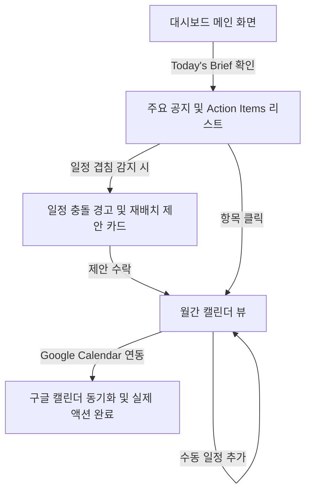

## 문제 정의

대학생이 여러 시스템(공모전, 대외활동, 학교 공지, LMS, 장학재단 등)에 흩어진 정보와 겹치는 마감 기한을 직면하는 상황에서, 스스로 중요도를 분석하고 한정된 시간을 재배분하여 실제 행동으로 옮기는 데 심각한 의사결정 마비와 피로감을 겪고 있다.

## 사용자 시나리오

1. 사용자가 AI Student Agent 대시보드에 접속하여 오늘의 핵심 요약(Today's Brief)을 한눈에 파악한다.
2. AI가 백그라운드에서 수집·분석한 공지들이 사용자의 관심사와 마감일에 맞춰 정렬된 'Action Items' 리스트를 확인한다.
3. 이번 주 내에 과제와 국가장학금 마감이 겹치는 것을 AI가 감지하면, 장학금의 Irreversibility(되돌릴 수 없음)가 높음을 근거로 장학금을 먼저 처리하라는 '재배치 시나리오' 경고 카드를 띄운다.
4. 사용자가 AI의 재배치 제안을 [수락]하면, 캘린더 뷰에 해당 일정이 자동으로 조정되어 반영되며, 최종적으로 구글 캘린더에 동기화된다.

## 핵심 기능

- **데이터 수집 및 구조화**: 흩어진 비정형 데이터(공모전, 대외활동, 학교 공지, LMS, 장학금 등)를 자동 스크래핑하여 AI가 이해할 수 있는 JSON 형태로 추출
- **Priority Engine**: 사용자의 관심사(Cosine Similarity)와 마감일(Deadline)을 조합하여 업무의 중요도를 점수화(Priority Score)
- **Conflict Resolution**: 마감이 겹치는 항목들을 식별하고, 각 업무의 '되돌릴 수 없는 정도(Irreversibility)'를 바탕으로 LLM이 구체적인 일정 재배치 시나리오를 도출
- **행동 및 학습 엔진**: 결과를 구글 캘린더에 연동하고, 사용자의 제안 수락/거절 내역을 바탕으로 우선순위 가중치를 자가 학습(Learn)

## 화면 흐름

