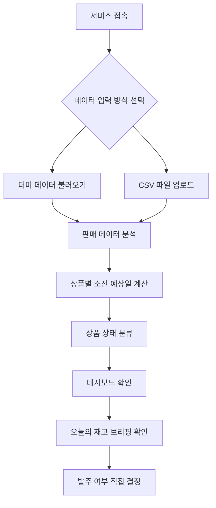
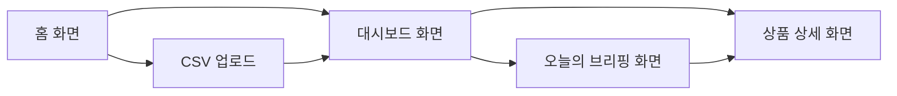

# 재고소진 예측 및 발주 타이밍 브리핑 에이전트 MVP 기획서

## 1. 프로젝트 개요

### 프로젝트명

**StockMate Agent**

### 한 줄 소개

소규모 스마트스토어 셀러의 판매 데이터를 분석해 상품별 재고 소진 시점을 예측하고, 오늘 발주하거나 확인해야 할 상품을 알려주는 재고관리 에이전트

### MVP 목표

4주 안에 더미 판매 데이터 또는 CSV 데이터를 기반으로 작동하는 재고관리 에이전트 MVP를 만든다.

이 MVP는 네이버 커머스 API를 직접 연동하지 않는다.  
대신 가상의 스마트스토어 데이터를 사용해 **재고 소진 예측, 발주 필요 판단, 오늘의 재고 브리핑** 기능을 구현한다.

---

## 2. 문제 정의

### 문제 정의 한 문장

**소규모 스마트스토어 셀러가 여러 상품의 판매량과 재고를 매일 직접 확인하지 못하는 상황에서, 어떤 상품이 곧 품절되거나 과잉재고가 되는지 제때 판단하지 못하는 불편을 겪는다.**

### 핵심 문제

소규모 셀러는 재고관리 시스템 없이 스마트스토어 관리자 화면, 엑셀, 감에 의존해 재고를 관리하는 경우가 많다.

이 때문에 다음 문제가 반복된다.

- 잘 팔리는 상품이 갑자기 품절된다.
- 잘 안 팔리는 상품을 많이 발주해 재고가 쌓인다.
- 상품 수가 많아질수록 매일 모든 재고를 확인하기 어렵다.
- 재고표를 봐도 오늘 무엇을 먼저 확인해야 하는지 판단하기 어렵다.

---

## 3. 타겟 사용자

### 대표 페르소나

**박지현, 34세**  
네이버 스마트스토어에서 홈카페 편집숍 **“모닝루틴”**을 운영하는 1인 셀러

### 운영 상황

- 본업이 있고, 스마트스토어는 부업으로 운영한다.
- 원두, 드립백, 티백, 커피용품, 머그컵, 텀블러 등 약 40개 상품을 판매한다.
- 상품 등록, 주문 확인, CS, 발주 관리를 혼자 처리한다.
- 매일 모든 상품의 판매량과 재고를 꼼꼼히 확인할 시간이 없다.

### 사용자의 불편

박지현은 재고 숫자 자체보다 다음 판단이 어렵다.

- 이 상품이 며칠 뒤 품절될지
- 지금 발주해야 하는지
- 어떤 상품을 먼저 확인해야 하는지
- 너무 많이 쌓인 상품은 무엇인지

따라서 단순 표나 그래프보다 **오늘 확인해야 할 상품과 그 이유를 알려주는 서비스**가 필요하다.

---

## 4. 서비스 컨셉

### 서비스 정의

**StockMate Agent는 판매 데이터와 현재 재고를 바탕으로 상품별 소진 예상일을 계산하고, 오늘 사용자가 확인해야 할 상품을 우선순위로 브리핑해주는 재고관리 에이전트다.**

### 에이전트로 보이기 위한 구조

이 서비스는 단순 계산기가 아니라 다음 세 단계를 수행한다.

1. **인지**  
   상품별 판매량, 현재 재고, 리드타임, 최근 판매 추세를 확인한다.

2. **판단**  
   전체 상품 중 품절 위험, 발주 필요, 과잉재고 상품을 분류하고 우선순위를 정한다.

3. **제안**  
   사용자에게 오늘 확인해야 할 상품과 추천 행동을 문장으로 알려준다.

### 예시 브리핑

> 콜롬비아 원두 250g은 최근 7일 판매량이 평소보다 60% 증가했고, 현재 재고 기준 4일 뒤 품절이 예상됩니다. 공급 리드타임이 5일이므로 오늘 발주하지 않으면 품절 가능성이 높습니다. 추천 발주 수량은 30개입니다.

---

## 5. MVP 범위

### 포함 기능

MVP에서는 다음 기능만 구현한다.

1. 더미 데이터 또는 CSV 데이터 불러오기
2. 상품별 판매량, 현재 재고, 리드타임 분석
3. 상품별 재고 소진 예상일 계산
4. 상품 상태 자동 분류
5. 오늘 확인해야 할 상품 브리핑 생성
6. 간단한 대시보드 제공

### 제외 기능

4주 MVP에서는 다음 기능을 제외한다.

- 네이버 커머스 API 자동 연동
- 실제 카카오톡 또는 이메일 알림 발송
- 자동 발주
- 머신러닝 기반 수요 예측
- 신선식품 유통기한 관리
- 사용자 계정/로그인 기능
- 결제 기능

### 제외 이유

이 프로젝트는 개인 프로젝트이며 4주 안에 작동 가능한 MVP를 만드는 것이 목표다.  
네이버 커머스 API 연동은 승인, 권한, 실제 셀러 데이터 확보 문제가 있어 MVP의 핵심 기능 검증을 방해할 수 있다.

따라서 초기에는 더미 데이터와 CSV 기반으로 핵심 기능인 **예측과 브리핑**에 집중한다.

---

## 6. 가상 스토어 설정

### 스토어명

**모닝루틴**

### 스토어 컨셉

홈카페를 즐기는 사람들을 위한 원두, 드립백, 티백, 커피용품, 생활잡화를 판매하는 스마트스토어

### 주요 카테고리

1. 가공식품  
   원두, 드립백, 티백, 시럽, 쿠키

2. 생활잡화  
   드리퍼, 커피 필터, 머그컵, 텀블러, 청소용품

### 신선식품 제외 이유

신선식품은 재고 소진뿐만 아니라 유통기한과 폐기 리스크가 중요하다.  
현재 MVP에서는 판매량 기반 소진 예측에 집중하기 위해 신선식품은 제외한다.

---

## 7. 더미 데이터 설계

### 데이터 목적

더미 데이터는 기능 테스트용이면서 동시에 데모용 데이터다.  
따라서 실제처럼 보이면서도 서비스의 필요성을 보여줄 수 있어야 한다.

### 상품 수

약 **40개 SKU**를 사용한다.

이 정도 규모는 소규모 셀러에게 현실적이고, 사람이 매일 직접 확인하기에는 번거로운 수준이다.

### 데이터에 포함할 상품 상태

더미 데이터에는 다음 상태의 상품을 의도적으로 섞는다.

1. **정상 재고**  
   당장 조치가 필요 없는 상품

2. **품절 위험**  
   현재 재고가 적고 판매 속도가 빨라 곧 품절될 가능성이 높은 상품

3. **발주 필요**  
   아직 재고는 있지만 리드타임을 고려하면 지금 발주해야 하는 상품

4. **과잉재고**  
   재고는 많지만 최근 판매량이 낮은 상품

5. **판매 급증**  
   최근 7일 판매량이 이전 평균보다 크게 증가한 상품

6. **데이터 수집 중**  
   판매 이력이 부족해 예측이 어려운 신상품

### 데이터 컬럼 예시

- order_date
- product_id
- product_name
- category
- quantity_sold
- current_stock
- lead_time_days
- unit_cost
- selling_price
- supplier_name

---

## 8. 예측 로직

MVP에서는 설명 가능한 규칙 기반 예측을 사용한다.

### 최근 14일 일평균 판매량

```text
최근 14일 일평균 판매량 = 최근 14일 판매량 / 14
```

### 소진 예상일

```text
소진 예상일 = 현재 재고 / 최근 14일 일평균 판매량
```

### 발주 필요 판단

```text
발주 필요 기준 = 리드타임 + 안전마진
```

기본 안전마진은 2일로 설정한다.

예를 들어 리드타임이 5일이고 안전마진이 2일이면, 소진 예상일이 7일 이하인 상품은 발주 필요 상품으로 분류한다.

### 판매 급증 판단

최근 7일 평균 판매량과 최근 30일 평균 판매량을 비교한다.

```text
판매 추세 비율 = 최근 7일 평균 판매량 / 최근 30일 평균 판매량
```

- 1.5 이상: 판매 급증
- 0.5 이하: 판매 둔화
- 그 외: 일반 상태

### 과잉재고 판단

예시 기준:

- 최근 30일 판매량이 5개 이하
- 현재 재고가 50개 이상

두 조건을 만족하면 과잉재고 후보로 분류한다.

### 데이터 수집 중 판단

판매 이력이 7일 미만인 상품은 정확한 예측이 어렵기 때문에 “데이터 수집 중”으로 표시한다.

---

## 9. 핵심 기능 2개

### 핵심 기능 1. 재고 소진 예측 및 상태 분류

사용자가 불러온 판매 데이터를 기반으로 상품별 상태를 자동 분류한다.

분류 상태:

- 품절 위험
- 발주 필요
- 정상
- 과잉재고
- 판매 급증
- 데이터 수집 중

이 기능은 “어떤 상품이 위험한지 모르겠다”는 핵심 문제를 직접 해결한다.

### 핵심 기능 2. 오늘의 재고 브리핑 생성

전체 상품 중 오늘 확인해야 할 상품 3~5개를 우선순위로 골라 문장형 브리핑을 제공한다.

브리핑에는 다음 정보가 포함된다.

- 상품명
- 현재 상태
- 왜 확인해야 하는지
- 예상 소진 시점
- 추천 행동
- 추천 발주 수량

이 기능은 서비스를 단순 재고표가 아니라 **재고 담당 에이전트**처럼 보이게 만드는 핵심 기능이다.

---

## 10. 사용자 시나리오

1. 사용자는 서비스에 접속한다.
2. 사용자는 더미 데이터를 불러오거나 CSV 파일을 업로드한다.
3. 서비스는 상품별 판매량, 현재 재고, 리드타임을 분석한다.
4. 서비스는 각 상품의 소진 예상일과 상태를 계산한다.
5. 사용자는 대시보드에서 품절 위험, 발주 필요, 과잉재고 상품을 확인한다.
6. 사용자는 오늘의 재고 브리핑에서 우선 확인해야 할 상품과 추천 행동을 확인한다.
7. 사용자는 브리핑을 바탕으로 실제 발주 여부를 직접 결정한다.

---

## 11. 사용자 흐름



---

## 12. 화면 구성

### 1. 홈 화면

역할: 서비스 시작 화면

포함 요소:

- 서비스명
- 한 줄 설명
- 더미 데이터로 시작하기 버튼
- CSV 업로드하기 버튼

### 2. 대시보드 화면

역할: 전체 재고 상태를 한눈에 확인하는 화면

포함 요소:

- 전체 상품 수
- 품절 위험 상품 수
- 발주 필요 상품 수
- 과잉재고 상품 수
- 상품 리스트
- 상태 필터

### 3. 오늘의 브리핑 화면

역할: 에이전트가 우선 확인해야 할 상품을 알려주는 화면

포함 요소:

- 오늘 확인할 상품 3~5개
- 상품별 판단 이유
- 예상 소진일
- 추천 발주 수량
- 추천 행동

### 4. 상품 상세 화면

역할: 특정 상품의 분석 결과를 자세히 보는 화면

포함 요소:

- 상품명
- 카테고리
- 현재 재고
- 최근 판매량
- 소진 예상일
- 리드타임
- 상태
- 추천 설명

---

## 13. 화면 흐름



---

## 14. 4주 개발 계획

### 1주차: 기획 확정 및 데이터 준비

- 문제 정의 확정
- 페르소나 확정
- 사용자 시나리오 확정
- 화면 흐름 작성
- 더미 상품 40개 설계
- 60일치 판매 데이터 생성
- CSV 데이터 구조 정의

### 2주차: 예측 로직 구현

- CSV 데이터 읽기
- 상품별 판매량 집계
- 최근 7일, 14일, 30일 판매량 계산
- 소진 예상일 계산
- 발주 필요 여부 계산
- 과잉재고 판단
- 데이터 수집 중 처리
- 상품 상태 분류 구현

### 3주차: 화면 구현

- 홈 화면 구현
- 더미 데이터 불러오기 기능 구현
- CSV 업로드 기능 구현
- 대시보드 요약 카드 구현
- 상품 리스트 구현
- 상태 필터 구현
- 오늘의 브리핑 화면 구현
- 상품 상세 화면 구현

### 4주차: 통합 및 데모 준비

- 전체 화면 연결
- 예외 처리
- 브리핑 문구 정리
- UI 문구 정리
- 더미 데이터 시나리오 점검
- README 작성
- 데모 시나리오 작성
- 최종 테스트

---

## 15. MVP 성공 기준

이 MVP는 다음이 가능하면 성공으로 본다.

1. 사용자가 더미 데이터 또는 CSV 데이터를 불러올 수 있다.
2. 상품별 소진 예상일이 계산된다.
3. 상품 상태가 품절 위험, 발주 필요, 정상, 과잉재고 등으로 분류된다.
4. 오늘 확인해야 할 상품 3~5개가 브리핑으로 제공된다.
5. 각 브리핑에는 판단 이유와 추천 행동이 포함된다.
6. 사용자가 브리핑을 보고 실제 발주 여부를 결정할 수 있다.

---

## 16. 최종 요약

StockMate Agent는 소규모 스마트스토어 셀러가 상품 재고를 직접 하나씩 확인하지 않아도 되도록 돕는 재고관리 에이전트다.

MVP에서는 네이버 커머스 API 연동 없이 더미 데이터 또는 CSV 데이터를 사용한다.  
핵심 기능은 두 가지다.

1. **재고 소진 예측 및 상태 분류**
2. **오늘의 재고 브리핑 생성**

이 두 기능을 통해 사용자는 어떤 상품이 곧 품절될지, 어떤 상품을 지금 발주해야 할지, 어떤 상품이 과잉재고인지 빠르게 판단할 수 있다.
