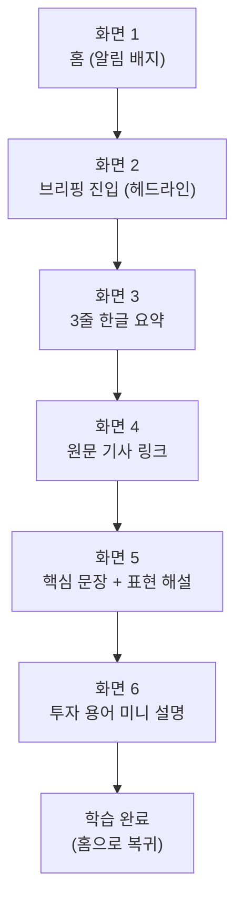

# 기획서 — 해외주식투자 & 실전영어 학습 브리핑 서비스

## 문제 정의

해외주식에 관심이 생긴 투자 초보 대학생은, 정보를 얻기 위해 야후 파이낸스 등 영어 뉴스를 찾아 읽어도 금융 전문용어와 실전 영어 표현을 동시에 해석해야 하는 이중 부담 때문에 기사 하나를 소화하는 데 오래 걸리고, 결국 꾸준히 읽지 못해 투자 감각도 영어 실력도 쌓이지 않는다.

- **누가**: 해외주식에 관심 있는 투자 초보 대학생 (영어 실력 확장 + 해외투자 입문을 동시에 원하는 사용자)
- **어떤 상황에서**: 야후 파이낸스 등 해외 영어 뉴스로 정보를 얻으려 할 때
- **무슨 불편**: 금융 전문용어와 실전 영어 표현의 이중 장벽으로 기사 이해가 느리고, 꾸준한 학습·투자 습관으로 이어지지 못함

## 사용자 시나리오

**핵심 시나리오: 데일리 브리핑 학습 (MVP)**

서비스에 로그인한 사용자가 매일 아침 자신의 관심 종목 관련 뉴스를 브리핑 형태로 학습하는 흐름.

1. 앱에 로그인하면 홈 화면에 "오늘의 브리핑" 알림 배지가 떠 있다.
2. 오늘의 브리핑을 연다.
3. 오늘의 관심 종목 뉴스 헤드라인과 3줄 한글 요약을 본다.
4. 원문 기사 링크를 확인한다. (클릭 시 새 탭으로 야후 파이낸스 원문 이동)
5. 핵심 문장 발췌와 표현 해설을 스크롤하며 읽는다.
6. 문장 속 투자 용어(예: EPS, guidance) 미니 설명을 확인한다.

> 퀴즈/정답확인/스트릭 갱신 단계는 Phase 2로 유보 (MVP는 "읽고 이해하는 것"까지를 핵심 가치로 설정)

## 핵심 기능 (2개)

**선정 기준**: ① 필수성 — 이게 없으면 서비스가 안 돌아가는가 / ② 적합성 — 문제 정의를 정확히 해결하는가

- **기능 A. 관심종목/섹터 기반 뉴스 큐레이션**
  - 필수성: 뉴스 수집기가 "무엇을 가져올지" 결정하는 유일한 입력값. 없으면 콘텐츠 생성 파이프라인이 시작되지 않음
  - 적합성: 문제 정의의 대상("해외주식에 관심이 생긴 대학생")이 이미 개인화된 관심 대상을 전제로 함

- **기능 B. 난이도별 콘텐츠/표현 조절**
  - 필수성: 고정 난이도로도 형식적으로는 서비스가 작동하지만, 그 경우 문제 정의가 실질적으로 해결되지 않음
  - 적합성: 문제 정의의 핵심 문장인 "금융 전문용어와 실전 영어 표현의 이중 부담"을 정면으로 해결하는 유일한 기능

## 화면 흐름

> 상세 와이어프레임은 Figma 참고: `[Figma 링크 삽입]`

---

## 부록 (참고용)

### 서비스 목표 (MVP KPI)
- North Star: 브리핑 열람 완료율 (화면 6까지 도달한 비율)
- 보조 지표: 브리핑 오픈율, 평균 체류시간, 4주 차 리텐션율

### 주요 엣지케이스
- 관심 종목에 뉴스가 없는 날의 콘텐츠 대체 로직
- AI 요약/해석 오류에 대한 검증 프로세스
- 투자자문업 규제 경계 및 저작권(짧은 발췌 원칙) 준수
- 크롤링 소스 의존 리스크 (야후 파이낸스 정책 변경 대응)

### 향후 확장 후보 (Phase 2)
- 확인 퀴즈 및 학습 완료율 측정
- 망각곡선 기반 자동 복습 스케줄링
- 경제 캘린더 연동 (실적발표/금리결정 등 이벤트 기반 콘텐츠 기획)
