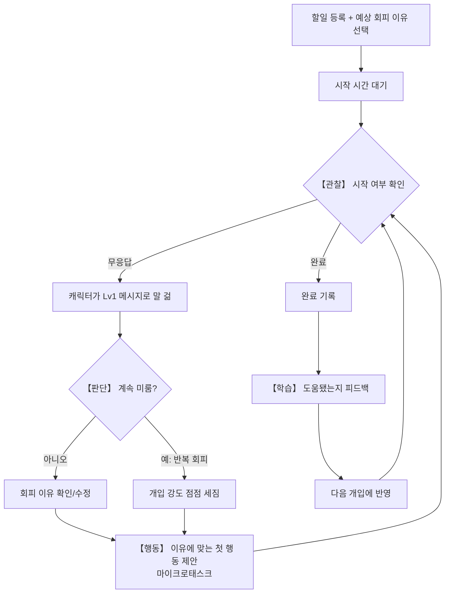

# 잔소리봇 기획 정리

## 1. 문제 정의

대학생은 할 일을 시작하려는 순간 막막함, 하기 싫음, 놀고 싶음 등 서로 다른 이유로 미루곤 한다. 하지만 이러한 회피 이유는 사람마다, 상황마다 다르다.

기존의 리마인더 앱은 정해진 시간에 알림을 보내는 기능은 제공하지만, 사용자가 왜 시작하지 못하는지 파악하거나 그 이유에 맞는 해결책을 제안하지는 못한다. 결국 사용자는 같은 이유로 반복해서 **할 일을 미루게 된다.**

잔소리봇의 핵심은 **회피 이유에 맞는 행동을 제안하는 맞춤 개입**이다. 기존 앱이 단순히 "시간이 됐어요."라는 알림을 보내는 데 그친다면, 잔소리봇은 사용자가 **왜 시작하지 못하는지**를 파악하고, 그 이유에 맞는 **첫 행동(마이크로태스크)** 을 제안해 실제로 시작할 수 있도록 돕는다.

## 2. 사용자 시나리오

1. **할일 등록**: 사용자가 할 일(과제/시험공부/프로젝트 등)를 등록하고, 시작할 시간과 예상되는 회피 이유를 함께 선택한다.

2. **시작 시간 도달**: 설정한 시간이 되었는데 사용자가 할 일을 시작하지 않으면, 캐릭터가 **Lv1** 단계의 가벼운 메시지로 시작을 유도한다.

3. **계속 반응이 없으면 단계별 개입**: 무응답 시간이 길어질수록 캐릭터의 개입 강도가 **Lv2 → Lv3**로 높아지고, 회피 이유에 맞는 행동을 제안한다.
   - **막막함** → "일단 자료부터 열어볼까요?"
   - **하기 싫음** → "지난번에도 이 유형의 할 일을 오래 미뤘었어요. 이번엔 5분만 해볼까요?"
   - **놀고 싶음** → "지금 보던 건 10분만 미뤄두고 이것부터 해볼까요?"

4. **제안을 받아들임**: 사용자가 제안한 첫 행동을 수행하거나 체크인하면 캐릭터가 칭찬 메시지를 보내고, 개입 단계는 다시 **Lv1**으로 초기화된다.

5. **끝까지 반응이 없음**: 계속 반응이 없으면 **Lv4**까지 개입 강도가 높아지고, 마감이 임박했음을 알려주며 마지막으로 시작을 유도한다.

6. **피드백**: 개입이 끝나면 사용자는 "도움됐음" 또는 "귀찮았음"을 선택할 수 있으며 이 기록은 다음 개입의 말투와 강도를 조정하는 데 활용된다.

## 3. 핵심 기능

### ① 시작을 도와주는 아주 작은 할 일(마이크로태스크) 자동 생성

- **어떻게 만드나**: 과제 제목·설명·유형을 보고 AI가 분석해서 만든다. 이때 전체 계획을 미리 다 짜주는 게 아니라, 회피가 감지될 때마다 "다음에 할 행동 딱 하나"만 그때그때 새로 만들어준다.
- **구현 계획**:
  - 1단계(P0): 템플릿 기반 생성
  - 2단계(P1): AI 모델(Gemini API)을 이용해 실제로 AI가 직접 만들어주는 방식
- 사용자가 막막함을 느끼는 순간, 바로 실행할 수 있는 첫 행동을 제안해 실제 시작으로 이어지도록 돕는다.

### ② 왜 미루는지 이유 기록 + 이유에 맞춘 맞춤 개입

- **어떻게 기록하나**: 사용자가 직접 답하는 방식을 쓴다. 과제 등록할 때 "미리 예상되는 회피 이유"를 한 번 고르고, 실제로 처음 미루는 순간이 왔을 때 "탭 한 번으로 이유를 다시 확인/수정"하는 걸로 한 번 더 물어본다.
  - 현재는 사용자가 직접 회피 이유를 선택하지만, 향후에는 사용자의 행동 데이터를 바탕으로 AI가 회피 이유를 자동으로 추론하도록 발전시킬 계획이다.
- 같은 알림을 반복하는 것이 아니라, 사용자가 미루는 이유에 맞게 개입해야 실제 행동 변화를 유도할 수 있다.

이 두 기능(①마이크로태스크 자동 생성 + ②회피 이유 기록)이 합쳐져야 "미루는 순간을 포착해서 이유에 맞는 해결책을 준다"는 문제 정의 전체가 완성된다.

## 4. 화면 흐름

이 흐름은 관찰(착수 확인) → 판단(회피 이유 태깅) → 행동(마이크로태스크 제안) → 학습(피드백을 다음 개입에 반영)이라는 사이클로 반복됩니다.

## 5. 향후 확장

서비스가 자리 잡은 이후에는 다음과 같은 기능으로 확장할 수 있다.

1. **회피 이유 자동 추론**: 사용자의 행동 데이터를 바탕으로 AI가 회피 이유를 자동으로 추론하여, 직접 선택하지 않아도 맞춤 개입을 제공한다.

2. **대체 행동 제안 및 보상**: 놀고 싶음 트리거일 때 이미 제안하는 대체 행동에, 완료 시 스트릭 등 작은 보상을 추가로 얹어 동기를 더 강화한다.

3. **개입 전략 개인화**: 사용자 피드백을 반영해 개입 강도와 말투를 자동으로 조정하고, 사용자에게 가장 효과적인 개입 방식을 학습한다.

4. **성공 요인 학습**: 사용자가 바로 시작할 수 있었던 환경(장소, 시간, 음악 등)을 기록해, 비슷한 상황에서 먼저 추천하는 개인화 기능을 제공한다.
