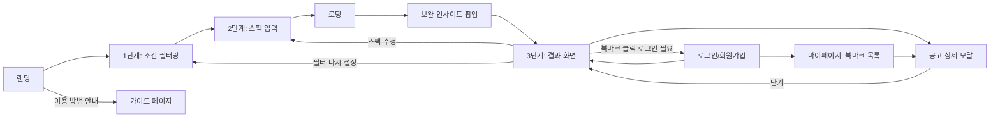

# 스펙핏(SpecFit) 기획서

## 문제 정의
재학생(3학년 기준)은 "지금 뭘 준비해야 졸업 전에 지원 가능한 공고가 늘어나는지" 판단할 기준이 없다. 기존 취업 플랫폼은 "지금 지원 가능한 공고 추천"에 집중돼 있어, 아직 시간이 남은 재학생에게 필요한 "무엇을 먼저 보완할지" 가이드가 없다.

## 사용자 시나리오

| 단계 | 화면 | 사용자 행동 | 결과 |
|---|---|---|---|
| 0 | 랜딩 | "갭 분석 시작하기" 클릭 (이전 기록 있으면 "지난 분석 이어하기" 버튼으로 저장된 단계까지 바로 재진입) | 1단계로 이동 |
| 1 | 조건 필터링 | 직종/인턴 여부 선택 (비워두면 전체 공고 대상 — 지역/급여는 데이터 자체가 없어 필터 제공 안 함) | 분석 대상 공고 확정 |
| 2 | 스펙 입력 | 학력·경력·자격증·전공(+부전공)·외국어(시험 복수 입력 가능)를 입력 (컴퓨터활용능력은 참고용, 판정에 미반영) | "결과 보기" 클릭 시 분석 실행 |
| 3 | 로딩 | (자동, 약 0.5초) | 갭 분석 계산 |
| 4 | 보완 인사이트 팝업 | (자동 노출 — 아래 표 참고) | 확인 클릭 시 결과 화면 노출 |
| 5 | 결과 화면 | 공고 카드 클릭 / 탭·정렬 변경 / 스펙 수정 / 북마크 토글 | 상세 체크리스트 확인, 미충족 항목별 참고링크로 이동, 또는 재입력 |

### 4단계: 보완 인사이트 팝업 — 상황별 분기 (4가지)
| 상황 | 팝업 메시지(예시) | 유도하는 다음 행동 |
|---|---|---|
| 항목 1개만 보완하면 지원 가능한 공고가 늘어남 | 😊 "{항목}만 채우면 지원 가능한 공고가 +N건 더 늘어나요!" | 결과 화면에서 자세히 보기 |
| 이미 모든 항목 충족 | 🎉 "이미 모든 항목을 꽉 채우고 있어요!" | 결과 화면 확인 |
| 여러 항목을 동시에 보완해야 하는 공고만 있음 | 🧩 "여러 항목을 함께 보완해야 하는 공고가 있어요" | 결과 화면에서 공고별 미충족 항목 확인 |
| 대상 공고 0건 | 💪 "지금 조건엔 맞는 공고가 없어요" | 필터 다시 설정 유도 |

> "이미 모든 항목 충족"과 "여러 항목을 함께 보완해야 함"은 서로 다른 상태다. 보완 우선순위 집계(아래 ③)는 **딱 1개 항목만 미충족인 공고만** 카운트하므로(확정 사항), 지원 가능 비율이 100%가 아니어도 "1개만 채우면 늘어나는" 팁이 하나도 없을 수 있다 — 그게 4번째 분기(🧩)다.

## 핵심 기능
서비스 파이프라인은 아래 기능으로 구성되지만 기존 취업 플랫폼과 스펙핏을 구분 짓는 **차별화 핵심은 ③④번**이다.

- ① 스펙 입력 — 학력, 경력, 자격증/면허, 전공(+부전공), 외국어 성적(시험별 복수 입력), 컴퓨터활용능력 등
- ② 조건 필터링 — 직종, 인턴 여부
- **③ 갭 분석 엔진 (핵심★)** — 스펙-요구사항 5개 항목(학력·경력·자격증/면허·전공·외국어) AND 대조로 지원 가능 비율 계산, 항목별 보완 시 늘어나는 공고 수 시뮬레이션(1개 항목만 미충족인 공고만 대상). 컴퓨터활용능력은 우대 항목이라 판정 제외.
- **④ 시각화 결과 화면 (핵심★)** — 도넛 차트, 보완 우선순위 막대그래프, 보완 인사이트 팝업(4분기), 필터·정렬 가능한 공고 리스트, 공고별 충족/미충족 체크리스트 모달, 미충족 항목별 외부 참고링크(어학 시험 공식 사이트/링커리어/큐넷/학점은행제)
- ⑤ 로그인 · 북마크 (선택 기능) — 이메일 회원가입/로그인/비밀번호 재설정, 관심 공고 북마크 후 마이페이지에서 재확인

> 기존 플랫폼은 "공고 추천"에 그치지만 스펙핏은 ③갭 분석 + ④시각화로 "자기 진단 + 재학 중 액션 플랜"을 제공한다.

## 화면 흐름

### 결과 화면 구성
| 영역 | 구성 요소 |
|---|---|
| 팝업(진입 즉시) | 위 "4단계" 표 참고 |
| 좌측 | 통계 카드 3개(전체/지원가능/비율) · 도넛 차트 · 보완 우선순위 막대그래프(5항목, 2개 이상 동시 미충족 공고는 제외) |
| 우측 | 상태 탭(전체/지원가능/미충족) · 정렬(기본/지원가능 우선/지원 불가능 우선) · 공고 카드 리스트(북마크 토글 포함) |
| 공고 상세 모달 | 5개 항목 각각 "요구 vs 보유" 문장 + 컴퓨터활용능력 참고 정보(판정 미반영 고지) + 미충족 항목별 외부 참고링크. ESC/포커스 트랩 지원 |
| 빈 상태 | 필터 결과 0건 / 탭 필터 결과 0건 — 각각 안내 문구 + 액션 버튼 |

## 로그인 · 북마크 (선택 기능)

핵심 갭 분석 시나리오(①~④)는 로그인 없이도 지금과 동일하게 100% 이용 가능하다. 로그인은 아래 기능에만 필요한 **선택 사항**이며, 상세 작업 분해는 `checklist.md`의 Part 2(로그인·북마크 확장) 참고.

- 로그인/회원가입(이메일+비밀번호, Supabase Auth 기반) + 비밀번호 재설정(이메일 링크). 계정 없이도 서비스 이용에는 지장 없음.
- 북마크: 결과 화면의 공고 카드/상세 모달에 북마크 토글 버튼(원+체크 아이콘). 로그인 사용자만 사용 가능 — 비로그인 상태에서 클릭하면 로그인 페이지로 유도, 로그인 성공 시 원래 화면으로 복귀.
- 마이페이지(`/bookmarks`): 북마크한 공고를 **현재 저장된 스펙 기준으로 재평가**해 결과 화면과 동일한 체크리스트/상태로 보여준다(북마크 시점 스펙의 스냅샷은 따로 저장하지 않음). 상단에 보완 우선순위 인사이트를 상시 배너로 노출(팝업과 달리 닫아도 사라지지 않음).
- 가이드(`/guide`): 서비스 이용 방법을 화면 스크린샷과 함께 설명하는 별도 안내 페이지. 랜딩 히어로에서 진입.
- 화면 흐름 변화: 헤더에 로그인/회원가입 진입점 추가, 로그인 시 사용자 메뉴(로그아웃)로 전환. 기존 5단계 핵심 흐름(랜딩→필터→스펙→로딩→팝업→결과)에는 변화 없음.
