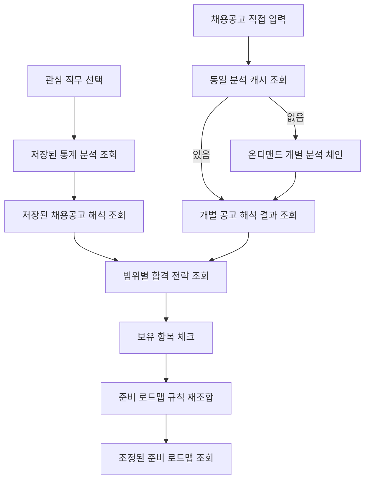

# CareerSignal 기획서

## 1. 프로젝트 개요

CareerSignal은 채용공고의 기준선과 편차를 해석해, 직무·기업군·개별 공고가 실제로 원하는 수준과 준비 방법을 알려주는 진로탐색 리서치 에이전트입니다.

사용자는 관심 직무를 선택하고, 서비스는 채용공고에 반복되는 기술·경험·자격요건·우대사항을 분석합니다. 기술 이름의 빈도와 함께 구현 범위, 필수·우대 우선순위, 기업군별 강조점을 정리해 학습·프로젝트·지원 준비의 다음 행동으로 연결합니다. 반복되는 요구사항과 기업군·공고별 편차를 해석하고, 자소서·포트폴리오·면접에서 지원자가 무엇을 보여줘야 하는지까지 제시합니다.

서비스는 채용공고와 근거 자료가 갱신될 때 분석 결과를 미리 생성·검증해 저장하고, 일반 사용자에게 같은 데이터 버전의 결과를 제공합니다. 백엔드 직무로 핵심 흐름을 검증한 뒤 동일한 화면·데이터·에이전트 계약으로 다른 직무를 확장합니다.

- [아키텍처](architecture.md)
- [에이전트 설계](agent-design.md)
- [지식·저장 구조](knowledge-schema.md)
- [통계 모델](statistics-model.md)
- [데이터 전략](data-strategy.md)
- [디자인 컨셉](design-concept.md)
- [디자인 토큰](design-tokens.md)
- [개발 백로그](backlog.md)
- [검증 체크리스트](checklist.md)
- [결정 기록](adr/)

## 2. 문제 발견

대학생은 진로를 준비할 때 실제 채용시장의 요구와 자신의 준비 방향 사이의 차이를 파악하기 어렵습니다. 채용공고는 많지만 공고마다 표현이 다르고 요구사항이 흩어져 있어 직접 비교하고 정리하는 데 시간이 많이 듭니다.

특히 다음 문제가 반복됩니다.

- 관심 직무에 필요한 기술과 경험을 한눈에 파악하기 어렵다.
- 기술 이름은 알아도 데이터 흐름, 예외 처리, 협업 방식까지 어느 범위를 구현해야 하는지 판단하기 어렵다.
- 여러 공고에서 반복되는 필수 요구사항과 우대사항을 직접 구분해야 한다.
- 같은 프로젝트라도 기업군별로 무엇을 강조해야 하는지 알기 어렵다.
- 진로 탐색 결과가 정보 수집에서 끝나고 구체적인 학습·프로젝트·지원 행동으로 이어지기 어렵다.
- 채용공고 요구사항 뒤에 숨은 회사의 인재상을 읽어내기 어려워 자소서·포트폴리오·면접에 무엇을 담아야 할지 판단하기 어렵다.

## 3. 문제 정의

대학생은 채용공고의 표면적 스택 나열 뒤에 숨은 회사의 실제 요구 수준과 인재상을 읽어내기 어려워서, 무엇을 얼마나 깊게 준비하고 자소서·포트폴리오·면접에 무엇을 담아야 할지 결정하기 힘듭니다.

## 4. 타깃 사용자

### 4.1 주요 사용자

- 디지털·기술 분야 취업을 준비하는 대학생
- 관심 직무는 있지만 무엇부터 준비해야 할지 막막한 학생
- 채용공고를 읽어 봤지만 요구 역량을 체계적으로 정리하기 어려운 학생
- 프로젝트나 포트폴리오 경험을 어떤 직무에 어떻게 연결할지 고민하는 학생

### 4.2 사용자 특성

- 직무명, 기술 스택, 우대사항 등의 용어는 알고 있지만 무엇이 중요한지 판단하기 어렵다.
- 채용공고의 요구사항을 이해하더라도 실제로 어느 수준까지 준비해야 하는지 알기 어렵다.
- 학습해야 할 내용은 많지만 무엇부터, 어느 정도 깊이까지 공부해야 하는지 결정하기 어렵다.
- 실제 기업의 요구사항을 기준으로 진로와 학습 방향을 설계하고 싶다.
- 단순한 직무 설명보다 채용공고를 기반으로 한 분석과 구체적인 실행 계획을 원한다.

## 5. 사용자 시나리오

사용자는 직무를 고르면 통계 분석 → 채용공고 해석 → 합격 전략 → 준비 로드맵 순으로, 전체에서 기업군·개별 공고로 좁혀가며 준비 기준과 다음 행동을 받습니다. 각 단계는 같은 채용 데이터 버전에서 생성·검증된 결과로 이어집니다. 서비스는 채용공고와 근거 자료가 갱신될 때 분석 결과를 함께 갱신하고, 일반 조회에서는 저장된 결과를 제공합니다.

### 5.1 채용공고 통계 분석

사용자가 관심 직무를 선택하면, 서비스는 여러 채용공고에서 반복되는 기술, 업무 경험, 자격요건, 우대사항의 빈도와 조합, 시계열 변화를 전체와 기업군 단위로 보여 줍니다. 기술 이름의 나열을 넘어, 그 기술을 어느 구현 범위(데이터 흐름, 예외 처리, 협업 방식)까지 다뤄야 하는지 정리해 준비 수준을 이해하도록 돕습니다.

### 5.2 채용공고 해석

전체 뷰는 이 직무의 공통 기대치(baseline)를 보여 주고, 기업군이나 개별 공고를 고르면 그 기준 위에서 더 높게 또는 추가로 요구되는 부분을 편차로 강조해 보여 줍니다. 개별 공고를 선택하면 원문과 함께 편차 해석·근거 문장·신뢰도를 확인합니다. 사용자는 이 회사·직무가 실제로 원하는 인재상을 근거와 함께 읽어 냅니다.

### 5.3 합격 전략: 체크리스트·자소서·포트폴리오·면접

사용자는 공고 해석 결과를 자소서·포트폴리오·면접으로 연결한 체크리스트를 받습니다. 목표 기업군·개별 공고로 범위를 좁히면 체크리스트와 활용처별 전략이 조정됩니다. 각 항목의 보유·미보유 체크는 준비 현황과 준비 로드맵에 반영되며, 포트폴리오·자소서·면접 전략의 내용은 바꾸지 않습니다.

### 5.4 준비 로드맵 설계

사용자는 미체크 항목을 채우기 위한 학습 주제와 프로젝트를 추천받습니다. 각 추천은 그것을 하면 어떤 미체크 항목이 채워지는지 연결해 보여 주고, 필수 항목을 먼저 채우도록 우선순위를 매깁니다. 목표 기업군이나 개별 공고를 고르면 기본 로드맵과 학습 전략이 해당 범위에 맞게 바뀝니다. 체크 상태는 저장된 프로젝트·학습 후보의 완료 여부와 순서만 조정하며 새로운 분석을 생성하지 않습니다. 사용자는 막연한 공부 목록이 아니라 우선순위가 있는 학습·프로젝트 로드맵을 얻습니다.

## 6. 핵심 기능

핵심 기능은 채용공고를 통계적으로 분석하고 직무 기준선 대비 편차를 해석해, 지원자가 자소서·포트폴리오·면접에서 보여줘야 할 것을 정의한 뒤, 그것을 채울 학습·프로젝트 로드맵을 제시하는 네 단계로 이어집니다. 각 단계의 뷰는 전체 → 기업군 → 개별 공고로 좁혀집니다. 각 화면의 정보 구성은 9장(화면 목록)에서, 데이터·분석 방법 등 구현 세부는 [설계 문서](architecture.md)에서 다룹니다.

### 6.1 채용공고 통계 분석

여러 채용공고에서 반복되는 기술·경험·자격요건·우대사항의 빈도와 조합, 함께 요구되는 기술 조합(예: Spring Boot + JPA + MySQL), 시계열 변화를 전체·기업군 단위로 종합해 보여 줍니다. 공고 원문만으로 집계하며, 이 결과는 baseline 후보를 뽑는 데에도 함께 쓰입니다.

### 6.2 채용공고 해석

전체 뷰는 직무 공통 기대치(baseline)를, 기업군·개별 공고 뷰는 그 기준 위에서 더 높거나 추가로 요구되는 편차를 강조해 보여 줍니다. 편차는 회사 공식 자료와 공공·표준 자료로 근거·해석을 보강하고, 근거가 약하면 신뢰도를 낮춰 표시합니다. 각 편차에는 "같은 직무 공고 중 몇 %가 비슷한 표현을 쓰는지" 지표를 붙입니다. 기업군은 사람이 정한 태그로 묶습니다. LLM 에이전트는 채용 데이터 갱신 시 범위별 해석을 생성·검증하고 서비스는 저장된 결과를 제공합니다.

### 6.3 합격 전략

공고 해석 결과의 각 요구 항목을 자소서·포트폴리오·면접 중 맞는 곳으로 보냅니다. 산출물로 증명 가능한 항목(배포 URL·README·GitHub 작업 기록 등)은 포트폴리오 강조점으로, 가치관·과정·성장 서사형 항목은 자소서 소재로, 이론·원리형이거나 편차로 강조된 심화 항목은 면접 예상 꼬리질문으로 보냅니다. 한 항목이 여러 곳에 동시에 들어갈 수 있습니다. 결과는 [요구 항목 · 필요 산출물/활동 · 활용처(자소서/포트폴리오/면접) · 보유 여부] 체크리스트와 함께, 활용처별로 무엇을 써야 하는지(자소서 소재, 포트폴리오 강조점, 예상 면접 질문)를 정리해 제공합니다. 목표 기업군·회사를 좁히면 맞춤 전략으로 조정됩니다.

### 6.4 준비 로드맵

체크리스트의 미체크 항목을 채우기 위한 학습 주제와 프로젝트를 제시합니다. 여러 항목을 함께 채우는 프로젝트 후보, 학습 깊이, 선수 관계를 미리 구성하고, 사용자의 체크 상태에 따라 필수 항목·선행 관계·충족 범위를 계산해 프로젝트 로드맵과 학습 전략의 순서를 조정합니다. 이미 완료한 항목도 함께 보여, 사용자가 채운 것과 남은 것을 한눈에 봅니다.

## 7. 프로토타입

프로토타입은 핵심 기능의 전체 흐름(직무 선택 → 통계 분석 → 채용공고 해석 → 합격 전략 → 준비 로드맵)을 백엔드 직무 기준으로 시연하는 **HTML/CSS 정적 프로토타입**입니다. 실제 분석 로직 없이 정보 구조와 화면 흐름을 검증합니다.

### 7.1 구현 범위

9장 화면 목록에 대응하는 다섯 화면을 정적으로 구성합니다.

- 직무 선택 — 직무 선택 영역, 예시 직무 버튼, 분석 범위 미리보기, 분석 시작 CTA
- 통계 분석 — 지표 카드, 기술 빈도, 함께 요구되는 기술 조합, 시계열 추세
- 채용공고 해석 — 직무 기준선과 편차, 숨은 요구, 근거 문장, 신뢰도
- 합격 전략 — 자소서·포트폴리오·면접 체크리스트와 활용처별 내용
- 준비 로드맵 — 단계별 학습·프로젝트와 우선순위, 완료·미체크 표시
- 공통 — 고정 상단바, 글래스 목차, 반응형 본문 레이아웃

### 7.2 제외 범위

프로토타입은 정적이므로 아래는 다루지 않고 MVP에서 구현합니다.

- 실제 입력값에 따른 동적 분석과 화면 상태 변화
- JavaScript·React 상태 관리
- 실제 LLM 기반 공고 해석과 실제 채용공고 수집

예시 직무 버튼과 분석 결과는 화면 흐름을 보여 주는 정적 표현이며, 입력에 따라 바뀌지 않습니다.

## 8. MVP 및 확장 계획

프로토타입으로 핵심 사용자 흐름과 정보 구조를 검증한 뒤, 네 단계 핵심 기능을 실제로 구현합니다.

### 8.1 프로토타입 — 핵심 사용자 경험 검증

사용자가 직무 선택부터 통계 분석·채용공고 해석·합격 전략·준비 로드맵까지 확인하는 정적 화면으로, 어떤 정보를 어떤 순서로 보여줄지 검증합니다.

### 8.2 MVP — 핵심 4단계 구현

프로토타입에서 검증한 흐름을 실제 서비스로 구현합니다. 직무는 **백엔드 하나**로 좁히고, fixture로 시스템 계약을 검증하며 기업 공식 채용공고 18~30건으로 네 단계의 분석 품질을 평가합니다.

**주요 개발 범위**

- 관심 직무 선택과 선택 상태 화면 반영(백엔드 직무, 예시 직무 버튼)
- fixture와 기업 공식 채용공고 데이터 관리 및 직무별 조회(두 시점 스냅샷: 최근 1년 / 이전 1년)
- 통계 분석: 기술·필수·우대·조합·시계열을 규칙 기반으로 집계(전체·기업군)
- 채용공고 해석: 직무 기준선 대비 편차·숨은 요구·근거·해석을 전체·기업군·개별 공고 단위로 생성·검증해 저장
- 합격 전략: 범위별 체크리스트와 자소서·포트폴리오·면접 전략 저장
- 준비 로드맵: 항목별 학습·프로젝트 후보 저장과 체크 상태 기반 우선순위 조정(완료 항목 표시)
- 데이터·지식 구축: 원문·출처, Wiki, 벡터 인덱스, 지식 그래프를 직무·기업·공고 범위로 관리
- 분석 실행: 데이터 변경의 영향 범위를 계산하고 여섯 에이전트의 결과를 검증된 버전으로 활성화
- 기업군 태그 6종 기준 분류(빅테크·플랫폼 / 스타트업 / B2B SaaS / 핀테크·금융 / SI·대기업 / 게임사)
- React·Express·저장된 분석 산출물 연동, 로딩·오류·지원하지 않는 직무·빈 결과 상태 처리

### 8.3 확장 계획

MVP 검증 뒤 아래를 단계적으로 추가합니다.

- 백엔드 외 직무의 채용 데이터와 범위별 분석 산출물 구축
- 실제 채용공고 데이터 수집·갱신과 연도별 추이 분석
- 비로그인 사용자의 채용공고 원문 입력과 개별 공고 해석, 동일 원문 분석 결과 재사용

로그인·사용자별 영구 저장은 공고 입력과 분리합니다. 개인화 Gap 분석, 로그인·저장, 자동 클러스터링, 권고/선택 구분, 직무 자유 입력은 별도 확장 후보입니다.

## 9. 화면 목록(IA)

### 9.1 직무 선택 화면

관심 직무를 선택하고 분석을 시작하는 화면입니다. 직무 선택창, 예시 직무 버튼, 분석 범위 미리보기, 분석 시작 버튼을 포함합니다.

### 9.2 채용공고 통계 분석 화면

해당 직무에서 반복되는 요구를 리얼리티 체크 중심의 10개 블록으로 보여 줍니다. 화면 순서는 리얼리티(①KPI ②직무 외 요구 범위 ③필수 인플레이션 ④숨은 난이도) → 기술(⑤기술 빈도 ⑥조합·구현 수준 ⑦증가/유지/감소 추이) → 해석(⑧라벨 vs 현실 ⑨기업군 성향 히트맵) → 데이터(⑩요구 항목 전체표, 기본 접힘)입니다. ⑩은 채용공고 해석의 입력과 같은 데이터이며, 각 블록에는 표본 수와 신뢰도를 함께 표기합니다.

### 9.3 채용공고 해석 화면

전체 baseline, 기업군 편차, 개별 공고의 세 섹션을 항상 표시하고, 기업군 선택이 아래 두 섹션의 내용을 바꿉니다. baseline 카드는 통계 근거(등장률·필수율)를 병기하고, 편차 카드는 편차 없음 항목까지 명시합니다. 개별 공고는 목록(검색·건수 표기)에서 선택하며, 원문의 모든 문장에 세 종류 주석 — 직무 공통(회색 번호+라벨) · 숨은 의미(파란 하이라이트) · 회사 특징(노란 하이라이트) — 을 달고, 종합 해석과 함께 주석 종류별 해석 탭으로 보여 줍니다.

### 9.4 합격 전략 화면

공고 해석 결과를 자소서·포트폴리오·면접으로 배정한 화면입니다. 범위(직무 전체·기업군·개별 공고)를 고르면 내용이 조정됩니다. 준비 현황 카드(보유·필수 미보유 수, 체크 시 실시간 갱신), [요구 항목 · 근거 · 필요 산출물/활동 · 활용처 · 보유] 체크리스트(편차 항목 강조), 포트폴리오 전략(강조점 카드·기업군별 소개 순서), 자소서 전략(문제→해결→성장 서사 구조·예시 문장), 면접 전략(예상 질문·꼬리질문 트리·답변 포인트)을 포함하며, 각 전략 카드는 체크리스트 항목과 연결 표시됩니다. 체크리스트에는 산출물로 증명하는 프로젝트형·서사형 항목과 함께, 면접에서 검증되는 학습형 항목(CS·이론)이 포함됩니다.

### 9.5 준비 로드맵 화면

미보유 항목을 채우는 준비를 두 트랙으로 보여 줍니다. 프로젝트 로드맵(순서형 타임라인 — 기간·우선순위·산출물·채워지는 항목·추천 이유)과 학습 전략(병행형 — CS·프레임워크 주제별 "어디까지" 깊이 기준, 면접 검증 연결)입니다. 범위(직무 전체·기업군·개별 공고)를 고르면 전체 내용이 조정되고, 화면 안의 체크리스트에서 보유를 체크하면 브라우저 상태에 반영되며 로드맵 재구성은 적용 버튼으로 반영됩니다. 보유 항목은 완료로 표시됩니다.

## 10. 화면 흐름(User Flow)

일반 흐름은 전체 → 기업군 → 개별 공고로 좁혀가며 저장된 분석 결과를 조회합니다. 직접 입력 흐름은 동일 분석을 재사용하거나 공고 추출·채용공고 해석·합격 전략·준비 로드맵으로 구성된 온디맨드 개별 분석 체인을 실행합니다.

## 11. 화면 설계 참고

- [디자인 컨셉](design-concept.md)
- [디자인 토큰](design-tokens.md)

## 12. 프로토타입 링크

- [Vercel 프로토타입 배포 링크](https://careersignal-prototype.vercel.app/)
- [로컬 HTML 프로토타입 확인](../prototype/index.html)
