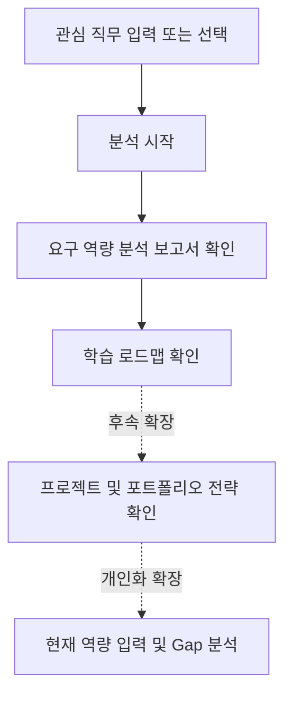

# 채용공고 기반 대학생 진로탐색 리서치 에이전트 기획서

## 1. 프로젝트 개요

이 프로젝트는 대학생이 관심 직무를 준비할 때, 실제 채용공고에 나타나는 요구 역량을 바탕으로 학습 방향과 프로젝트 방향을 정리하도록 돕는 AI 리서치 에이전트입니다.

사용자는 관심 직무를 입력하고, 서비스는 샘플 채용공고 데이터를 분석해 자주 등장하는 기술, 경험, 자격요건, 우대사항을 정리합니다. 분석 결과를 바탕으로 사용자가 무엇을 어떤 순서와 수준으로 준비해야 하는지 학습 로드맵을 제안하고, 프로젝트 및 포트폴리오 전략까지 연결합니다.

초기 버전은 실제 채용공고 자동 수집보다 사용자 흐름과 핵심 기능 검증에 집중합니다.

<!-- TODO: 기술 구조 상세 문서(docs/architecture.md)와 연결되는 문서 링크를 추가합니다. -->

## 2. 문제 발견

대학생은 진로를 준비할 때 실제 채용시장의 요구와 자신의 준비 방향 사이의 차이를 파악하기 어렵습니다. 채용공고는 많지만, 공고마다 표현이 다르고 요구사항이 흩어져 있어 직접 비교하고 정리하는 데 시간이 많이 듭니다.

특히 다음 문제가 반복됩니다.

- 관심 직무에 필요한 기술과 경험을 한눈에 파악하기 어렵다.
- 여러 채용공고에서 반복되는 핵심 요구사항을 직접 정리해야 한다.
- 채용공고의 요구사항을 학습 계획이나 프로젝트 주제로 연결하기 어렵다.
- AI가 조언을 해도 채용공고 기반 근거가 보이지 않으면 신뢰하기 어렵다.
- 진로 탐색 결과가 정보 수집에서 끝나고 구체적인 다음 행동으로 이어지기 어렵다.

## 3. 문제 정의

대학생은 관심 직무를 준비하고 싶지만, 실제 채용공고에 담긴 직무 요구사항을 구조화해서 이해하기 어렵고, 그 결과 무엇을 우선적으로 학습하고 어떤 프로젝트를 준비해야 하는지 구체적으로 결정하기 어렵습니다.

## 4. 타깃 사용자

### 4.1 주요 사용자

- 컴퓨터·소프트웨어 분야 취업을 준비하는 대학생
- 관심 직무는 있지만 무엇부터 준비해야 할지 막막한 학생
- 프로젝트나 포트폴리오 주제를 정해야 하는 학생
- 채용공고를 읽어봤지만 요구 역량을 체계적으로 정리하기 어려운 학생

### 4.2 사용자 특성

- 직무명, 기술 스택, 우대사항 등의 용어는 알고 있지만 무엇이 중요한지 판단하기 어렵다.
- 채용공고의 요구사항을 이해하더라도 실제로 어느 수준까지 준비해야 하는지 알기 어렵다.
- 학습해야 할 내용은 많지만 무엇부터, 어느 정도 깊이까지 공부해야 하는지 결정하기 어렵다.
- 실제 기업의 요구사항을 기준으로 진로와 학습 방향을 설계하고 싶다.
- 단순한 직무 설명보다 채용공고를 기반으로 한 분석과 구체적인 실행 계획을 원한다.

## 5. 사용자 시나리오

### 5.1 관심 직무 요구 역량 파악

사용자는 관심 있는 직무를 입력합니다. 서비스는 여러 채용공고를 분석하여 해당 직무에서 반복적으로 요구되는 기술 스택, 업무 경험, 자격요건, 우대사항을 종합해 보여줍니다. 또한 각 요구 역량이 얼마나 자주 등장하는지와 어떤 의미를 가지는지 함께 제공하여 사용자가 해당 직무에서 중요하게 요구되는 역량을 빠르게 이해할 수 있도록 돕습니다.

### 5.2 학습 방향 설계

사용자는 요구 역량 분석 결과를 확인한 뒤, 서비스가 제안하는 학습 방향을 참고합니다. 서비스는 요구 빈도와 중요도를 바탕으로 무엇을 먼저 공부해야 하는지, 어느 정도 수준까지 준비해야 하는지, 관련 전공지식과 기술 스택을 어떤 순서로 학습하면 좋을지를 제안합니다. 사용자는 막연한 공부 목록이 아니라 우선순위가 있는 학습 로드맵을 얻습니다.

### 5.3 프로젝트 및 포트폴리오 전략 수립

사용자는 요구 역량과 학습 방향을 바탕으로 포트폴리오 전략을 계획합니다. 서비스는 채용공고에서 자주 요구되는 기술과 경험을 효과적으로 보여줄 수 있는 프로젝트 아이디어를 추천하고, 각 프로젝트를 통해 어떤 역량을 증명할 수 있는지도 함께 제공합니다. 사용자는 단순한 프로젝트 목록이 아니라 취업 준비에 도움이 되는 포트폴리오 방향을 구체적으로 설계할 수 있습니다.

## 6. 핵심 기능

### 6.1 관심 직무 선택

사용자는 자신이 준비하고 싶은 관심 직무를 입력하거나 예시 직무를 선택합니다.

### 6.2 요구 역량 분석 보고서

서비스는 여러 채용공고를 분석하여 해당 직무에서 반복적으로 요구되는 기술, 경험, 자격요건, 우대사항을 종합한 요구 역량 분석 보고서를 제공합니다.

또한 각 요구 역량이 얼마나 자주 등장하는지와 무엇을 의미하는지를 함께 제시하여 사용자가 해당 직무에서 중요하게 요구되는 역량을 이해할 수 있도록 돕습니다.

**포함 정보**

- 분석한 샘플 공고 수
- 자주 등장한 기술 스택
- 주요 업무 및 경험
- 자격요건 및 우대사항
- 요구 역량의 중요도와 의미

### 6.3 학습 로드맵

서비스는 요구 역량 분석 결과를 바탕으로 사용자가 무엇을 먼저, 어느 정도 수준까지 학습해야 하는지 제안합니다.

또한 관련 전공지식과 기술 스택을 어떤 순서로 학습하면 좋을지 함께 제시하여 사용자가 우선순위에 따라 학습 계획을 수립할 수 있도록 돕습니다.

**포함 정보**

- 우선 학습 키워드
- 추천 학습 순서
- 권장 학습 수준
- 추천 이유

## 7. 프로토타입

1주차 프로토타입은 사용자가 관심 직무를 선택하고 요구 역량 분석 결과와 학습 로드맵을 확인하는 핵심 사용자 경험(UI/UX)을 검증하기 위한 **HTML/CSS 기반의 정적 프로토타입**입니다.

### 7.1 구현 범위

- 관심 직무 입력 영역
- 예시 직무 선택 버튼
- 분석 시작 버튼
- 분석 대상 공고 수 표시
- 요구 역량 분석 보고서
  - 자주 등장한 기술 스택
  - 주요 업무 및 경험
  - 자격요건 및 우대사항
  - 요구 역량의 중요도와 의미
- 학습 로드맵
  - 우선 학습 키워드
  - 추천 학습 순서
  - 권장 학습 수준
  - 추천 이유

### 7.2 제외 범위

- 실제 입력값에 따른 동적 분석
- JavaScript 및 React 상태 관리
- 실제 분석 로직
- 실제 AI 분석
- 실제 채용공고 수집
- 프로젝트 및 포트폴리오 전략 추천
- 사용자 역량 비교 및 Gap 분석
- 로그인 및 사용자 정보 저장

## 8. 개발 단계 및 확장 계획

프로토타입을 통해 핵심 사용자 흐름과 정보 구조를 먼저 확인한 뒤, 요구 역량 분석과 학습 로드맵 생성 기능을 실제로 구현합니다.

이후에는 프로젝트 및 포트폴리오 전략, 사용자 현재 역량을 반영한 개인화 기능, 실제 채용공고 데이터 연동 순으로 조금씩 확장합니다.

### 8.1 프로토타입 — 핵심 사용자 경험 검증

사용자가 관심 직무를 선택하고, 요구 역량 분석 보고서와 학습 로드맵을 확인하는 핵심 흐름을 HTML/CSS 기반의 정적 화면으로 구현합니다.

실제 분석 기능을 구현하기 전에 사용자가 어떤 정보를 먼저 확인해야 하는지, 분석 결과와 학습 로드맵을 어떤 순서로 보여줄지 확인합니다.

**주요 개발 범위**

- 관심 직무 입력 및 선택 화면
- 분석 시작 과정 표현
- 요구 역량 분석 보고서 화면
- 학습 로드맵 화면
- 화면 흐름 및 정보 구조 검증
- 사용자 및 동료 피드백을 통한 기획 개선

### 8.2 MVP — 핵심 기능 구현

프로토타입에서 검증한 사용자 흐름을 실제로 동작하는 서비스로 구현합니다.

사용자가 관심 직무를 선택하면 샘플 채용공고 데이터를 분석하여 요구 역량 분석 보고서를 생성하고, 분석 결과를 바탕으로 학습 로드맵을 제공합니다.

이 단계에서는 채용공고에 흩어진 요구사항을 사용자가 실행할 수 있는 학습 방향으로 연결하는 핵심 가치를 검증합니다.

**주요 개발 범위**

- 관심 직무 입력 및 선택
- 샘플 채용공고 데이터 관리
- 직무별 채용공고 분석
- 기술 스택, 주요 업무 및 경험 추출
- 자격요건 및 우대사항 분석
- 반복되는 요구 역량과 중요도 분석
- 요구 역량의 의미와 준비 수준 정리
- 요구 역량 분석 보고서 생성
- 우선 학습 키워드 선정
- 추천 학습 순서 구성
- 권장 학습 수준 및 추천 이유 제시
- 학습 로드맵 생성

### 8.3 프로젝트 및 포트폴리오 전략 확장

MVP 이후에는 요구 역량 분석과 학습 로드맵을 바탕으로 사용자가 학습한 역량을 프로젝트와 포트폴리오로 연결할 수 있도록 기능을 확장합니다.

단순히 프로젝트 주제를 추천하는 것이 아니라, 각 프로젝트를 통해 어떤 직무 역량을 학습하고 증명할 수 있는지를 함께 제시합니다.

**주요 개발 범위**

- 요구 역량 기반 프로젝트 아이디어 추천
- 프로젝트별 목표 역량 제시
- 프로젝트에서 활용할 기술과 경험 연결
- 프로젝트 난이도 및 권장 범위 제안
- 프로젝트를 통해 증명할 수 있는 역량 설명
- 포트폴리오 구성 방향 제안

### 8.4 개인화 기능 확장

사용자의 현재 역량과 경험을 입력받아 채용공고의 요구사항과 비교하고, 사용자별 준비 상태에 맞는 진로 준비 전략을 제공합니다.

기존의 공통 학습 로드맵을 사용자별 우선순위가 반영된 개인화된 로드맵으로 발전시킵니다.

**주요 개발 범위**

- 사용자 현재 역량 입력
- 보유 기술 및 학습 경험 입력
- 프로젝트 및 포트폴리오 경험 입력
- 요구 역량과 현재 역량 비교
- 부족한 역량에 대한 Gap 분석
- 사용자별 학습 우선순위 조정
- 개인화된 학습 로드맵 제공
- 사용자 수준에 맞는 프로젝트 및 포트폴리오 전략 제안

### 8.5 실제 데이터 연동 및 서비스 고도화

샘플 채용공고 데이터를 기반으로 만든 분석 구조를 실제 채용공고 데이터와 연결하고, 지속적으로 사용할 수 있는 서비스로 발전시킵니다.

데이터의 범위와 최신성을 높이고 사용자의 분석 결과와 학습 과정을 지속적으로 관리할 수 있도록 기능을 확장합니다.

**주요 개발 범위**

- 실제 채용공고 데이터 수집 및 갱신
- 다양한 채용공고 출처 연동
- 직무별 채용시장 변화 분석
- 사용자 계정 및 분석 결과 저장
- 학습 로드맵 저장 및 진행 상황 관리
- 여러 직무의 요구 역량 비교
- GitHub 프로젝트 및 사용자 이력 분석 연동
- 새로운 채용공고를 반영한 분석 결과 업데이트
- 사용자 진행 상황에 따른 학습 로드맵 조정

## 9. 화면 목록(IA)

### 9.1 직무 선택 화면

사용자가 관심 직무를 직접 입력하거나 예시 직무를 선택하고 분석을 시작하는 화면입니다.

**포함 요소**

- 직무명 입력창
- 예시 직무 선택 버튼
- 분석 시작 버튼

### 9.2 요구 역량 분석 보고서 화면

채용공고 분석 결과를 바탕으로 해당 직무에서 중요하게 요구되는 역량을 보여주는 화면입니다.

**포함 요소**

- 분석한 샘플 공고 수
- 자주 등장한 기술 스택
- 주요 업무 및 경험
- 자격요건 및 우대사항
- 요구 역량의 중요도와 의미

### 9.3 학습 로드맵 화면

요구 역량 분석 결과를 바탕으로 사용자가 무엇을 어떤 순서와 수준으로 학습하면 좋을지 제안하는 화면입니다.

**포함 요소**

- 우선 학습 키워드
- 추천 학습 순서
- 권장 학습 수준
- 추천 이유

### 9.4 프로젝트 및 포트폴리오 전략 화면

요구 역량과 학습 로드맵을 바탕으로 프로젝트 아이디어와 포트폴리오 방향을 제안하는 화면입니다.

이 화면은 후속 확장 범위이며 1주차 프로토타입에서는 구현하지 않습니다.

### 9.5 개인화 분석 화면

사용자의 현재 역량과 채용공고의 요구 역량을 비교하여 부족한 역량과 우선 학습 방향을 보여주는 화면입니다.

이 화면은 후속 확장 범위이며 1주차 프로토타입에서는 구현하지 않습니다.

## 10. 화면 흐름(User Flow)

## 11. 와이어프레임

- 와이어프레임 링크: TODO

## 12. 프로토타입 링크

- 프로토타입 링크: `prototype/index.html`
- TODO: 1주차 정적 HTML/CSS 프로토타입 구현 후 README의 폴더 역할 설명과 함께 최신 상태로 유지합니다.
