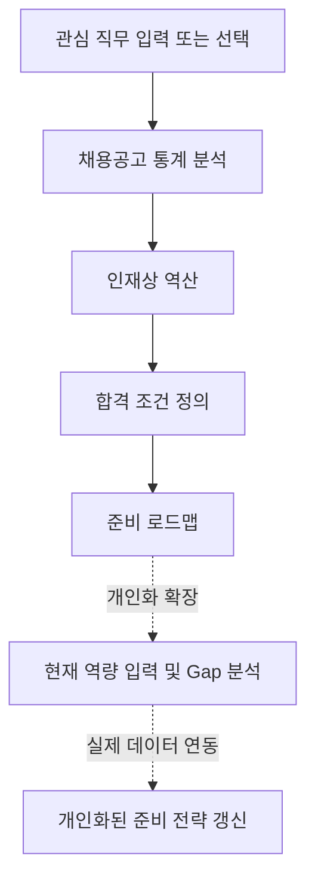

# CareerSignal 기획서

## 1. 프로젝트 개요

CareerSignal은 대학생이 관심 직무의 채용공고를 읽을 때, 무엇을 어느 수준까지 준비해야 하는지 판단하도록 돕는 진로탐색 리서치 에이전트입니다.

사용자는 관심 직무를 입력하고, 서비스는 채용공고에 반복되는 기술·경험·자격요건·우대사항을 분석합니다. 이때 기술 이름의 빈도만 보여 주는 것이 아니라, 기술이 함께 요구되는 구현 범위, 필수와 우대의 우선순위, 기업군별 강조점을 정리해 학습·프로젝트·지원 준비의 다음 행동으로 연결합니다. 나아가 반복되는 요구사항 뒤에 숨은 회사의 인재상을 역산해, 자소서·포트폴리오·면접에서 지원자가 무엇을 보여줘야 하는지까지 제시합니다.

초기 단계에서는 실제 채용공고 자동 수집보다 사용자 흐름과 정보 구조를 검증하고, 이후 React·Express 기반 제품으로 분석 기능을 구현합니다.

- [설계 문서](architecture.md)
- [디자인 컨셉](design-concept.md)
- [디자인 토큰](design-tokens.md)
- [개발 백로그](backlog.md)

## 2. 문제 발견

대학생은 진로를 준비할 때 실제 채용시장의 요구와 자신의 준비 방향 사이의 차이를 파악하기 어렵습니다. 채용공고는 많지만 공고마다 표현이 다르고 요구사항이 흩어져 있어 직접 비교하고 정리하는 데 시간이 많이 듭니다.

특히 다음 문제가 반복됩니다.

- 관심 직무에 필요한 기술과 경험을 한눈에 파악하기 어렵다.
- 기술 이름은 알아도 화면, 데이터 흐름, 실패 상태까지 어느 범위를 구현해야 하는지 판단하기 어렵다.
- 여러 공고에서 반복되는 필수 요구사항과 우대사항을 직접 구분해야 한다.
- 같은 프로젝트라도 기업군별로 무엇을 강조해야 하는지 알기 어렵다.
- 진로 탐색 결과가 정보 수집에서 끝나고 구체적인 학습·프로젝트·지원 행동으로 이어지기 어렵다.
- 채용공고 요구사항 뒤에 숨은 회사의 인재상을 읽어내지 못해 자소서·포트폴리오·면접에 무엇을 담아야 할지 판단하기 어렵다.

## 3. 문제 정의

대학생은 채용공고의 표면적 스택 나열 뒤에 숨은 회사의 실제 요구 수준과 인재상을 읽어내기 어려워서, 무엇을 얼마나 깊게 준비하고 자소서·포트폴리오·면접에 무엇을 담아야 할지 결정하기 힘듭니다.

## 4. 타깃 사용자

### 4.1 주요 사용자

- 컴퓨터·소프트웨어 분야 취업을 준비하는 대학생
- 관심 직무는 있지만 무엇부터 준비해야 할지 막막한 학생
- 채용공고를 읽어 봤지만 요구 역량을 체계적으로 정리하기 어려운 학생
- 프로젝트나 포트폴리오 경험을 어떤 직무에 어떻게 연결할지 고민하는 학생

### 4.2 사용자 특성

- 직무명, 기술 스택, 우대사항 등의 용어는 알고 있지만 무엇이 중요한지 판단하기 어렵다.
- 채용공고의 요구사항을 이해하더라도 실제로 어느 수준까지 준비해야 하는지 알기 어렵다.
- 학습해야 할 내용은 많지만 무엇부터, 어느 정도 깊이까지 공부해야 하는지 결정하기 어렵다.
- 실제 기업의 요구사항을 기준으로 진로와 학습 방향을 설계하고 싶다.
- 단순한 직무 설명보다 채용공고를 기반으로 한 분석과 구체적인 실행 계획을 원한다.

## 5. 사용자 시나리오

### 5.1 채용공고 통계 분석

사용자는 관심 있는 직무를 입력합니다. 서비스는 여러 채용공고에서 반복되는 기술, 업무 경험, 자격요건, 우대사항을 종합해 보여 줍니다. 기술이 어떤 화면·데이터 흐름·협업 방식과 함께 요구되는지 정리해 사용자가 준비해야 할 구현 범위를 이해하도록 돕습니다.

### 5.2 인재상 파악

사용자는 통계 분석 결과가 직무 공통 기준(baseline)과 비교했을 때 이 공고에서 유독 강조되는 지점이 무엇인지 확인합니다. 서비스는 그 근거를 공고 문장과 함께 제시해, 이 회사가 실제로 원하는 인재상을 보여줍니다.

### 5.3 합격 조건 정의: 자소서·포트폴리오·면접 전략

사용자는 인재상 역산 결과를 바탕으로 무엇을 자소서에 쓰고, 포트폴리오에서 어떻게 강조하고, 면접에서 어떤 질문에 대비해야 하는지 확인합니다. 서비스는 각 요구사항 항목이 자소서 소재, 포트폴리오 강조점, 예상 면접 질문 중 어디에 해당하는지 정리한 체크리스트를 제공합니다. 사용자는 프로젝트 주제나 소개 순서만 고르는 것이 아니라, 지원 준비에서 무엇을 어디에 담아야 하는지 구체적으로 파악합니다.

### 5.4 준비 로드맵 설계

사용자는 합격 조건 체크리스트에서 아직 채우지 못한 항목을 확인한 뒤, 서비스가 제안하는 준비 방향을 참고합니다. 서비스는 필수 요구사항을 먼저 충족하고 우대사항으로 완성도를 높이는 순서, 권장 구현 수준, 추천 이유를 제시합니다. 사용자는 막연한 공부 목록이 아니라 우선순위가 있는 학습·프로젝트 로드맵을 얻습니다.

## 6. 핵심 기능

핵심 기능은 채용공고를 통계적으로 분석하고 그 이면의 인재상을 역산해, 지원자가 자소서·포트폴리오·면접에서 보여줘야 할 것을 먼저 정의한 뒤, 그것을 달성할 공부·프로젝트 로드맵을 제시하는 네 단계로 이어집니다.

1. **채용공고 통계 분석**: 이 직무 공고들에서 어떤 스택과 조건이 얼마나 반복되는지 빈도를 근거로 정리합니다.
2. **인재상 역산**: 직무 공통 baseline과 비교해 이 공고가 유독 강조하는 지점을 공고 문장과 회사 공식 콘텐츠를 근거로 밝힙니다.
3. **합격 조건 정의**: 인재상 역산 결과를 자소서, 포트폴리오, 면접 중 어디에 어떻게 쓸지 라우팅합니다.
4. **준비 로드맵**: 그 조건을 채우기 위해 필요한 공부와 프로젝트를 제시합니다.

각 단계의 세부 데이터 흐름과 에이전트 입출력은 구현 시점에 [설계 문서](architecture.md)에서 확정합니다. 아래는 각 단계에서 사용자에게 무엇을 보여주는지 정리한 것입니다.

### 6.1 채용공고 통계 분석

여러 채용공고에서 반복되는 기술, 업무 경험, 자격요건, 우대사항을 통계적으로 종합해 보여줍니다.

**항목·내용**

- 분석한 공고 수와 반복 등장 비율
- 회사 분류(규모·산업·서비스 형태), 언어·프레임워크·DB·인프라, 필수·우대 구분, 경력·학력 조건의 빈도와 조합
- 기술이 함께 등장하는 구현 범위 조합
- 시계열 분석: 이 직군 공고 수의 시간별 변화, 전체 채용시장 대비 이 직군 비중 변화, 주요 기술스택·요구사항·우대사항 등장 빈도의 시간별 변화

**화면 구성**: 분석 공고 수 등 지표 카드, 구현 범위 조합 카드, 기술 빈도 차트에 더해 추세선 차트(직군 공고 수 추이, 기술별 등장 빈도 추이)를 보여줍니다.

**데이터**: mock 채용공고 자료(최소 두 시점 스냅샷)를 사용합니다. 실제 서비스에서는 실제 채용공고 수집으로 대체합니다(9.5 실제 데이터 연동 및 서비스 고도화 참고).

**분석 방법**: 대부분 rule 기반 집계로 가능합니다(회사 규모·산업 같은 비정형 항목 태깅에만 보조적인 해석이 필요할 수 있습니다). 출력은 항목별 빈도·조합 빈도·시계열 변화를 담은 구조화 데이터이며, 이 결과는 7장의 베이스라인 후보 추출에도 함께 사용합니다.

### 6.2 인재상 역산

통계 분석 결과 뒤에서 이 회사·직군이 실제로 원하는 사람의 특징을 밝힙니다. 직무 공통 baseline(7장 참고)과 개별 공고를 비교해, baseline보다 구체적이거나 깊은 표현, 또는 baseline에 없는 새 항목이 있으면 편차로 표시합니다. 편차 항목만 회사 공식 콘텐츠로 근거·해석을 보강하고, 근거가 없으면 확신도를 낮춰 표시합니다. 편차 항목마다 6.1의 통계 결과를 조회해 "같은 직군 공고 중 몇 %가 비슷한 표현을 쓰는지" 참고 지표를 함께 보여줍니다.

기본 표시 단위는 사용자가 입력한 개별 공고(회사 하나)입니다. 회사를 유사군으로 묶어 그룹 단위로 인재상을 보여주는 것은 후속 확장입니다.

**항목·내용**

- 기술이 함께 요구되는 구현 범위와 baseline 대비 요구 깊이
- 필수 요구사항과 우대사항
- 학력·경력 조건과 기업군별 강조점
- baseline 대비 편차 항목과 근거 문장, 해석, 확신도

**화면 구성**: 항목별 카드 [항목명 | baseline 수준 | 편차 여부 | 근거 문장 | 해석 | 확신도 | 같은 직군 내 등장 비율]. 편차 없는 항목은 접어서 보여주고 편차 있는 항목만 펼쳐 보여줍니다.

**데이터**: mock 채용공고 1건(사용자가 선택한 공고) + 회사 공식 콘텐츠(있는 경우) + 6.1의 통계 결과.

**분석 방법**: 이 단계부터 LLM 기반 해석이 필요합니다(baseline 비교, 근거 추출, 자연어 해석 생성). 세부 프롬프트·추론 절차는 구현 시점에 확정합니다.

### 6.3 합격 조건 정의

인재상 역산 결과를 자소서, 포트폴리오, 면접 중 어디에 어떻게 쓸지 라우팅합니다. 산출물로 직접 증명 가능한 항목(배포 URL, README, GitHub 작업 기록 등)은 포트폴리오 강조점으로, 가치관·과정·성장 서사형 항목은 자소서 소재로, 이론·원리형이라 산출물로 보여주기 어렵거나 baseline 대비 편차로 강조된 심화 항목은 면접 예상 꼬리질문으로 라우팅합니다. 하나의 항목이 성격에 따라 여러 채널에 동시에 들어갈 수 있습니다.

**항목·내용**

- 요구사항과 연결되는 자소서 소재
- 배포 URL, README, GitHub 작업 기록 등 포트폴리오 확인 항목과 스타트업, B2B SaaS, 플랫폼·기술 기업별 강조 순서
- 지원 공고에 맞춘 포트폴리오 소개 방향
- 기술 스택·문제 해결 경험을 중심으로 한 예상 면접 질문과 꼬리질문

**화면 구성**: 체크리스트 표 [신호 | 요구되는 증거 | 채널(자소서/포트폴리오/면접) | 체크 상태]. 미체크 항목은 6.4 준비 로드맵으로 전달됩니다.

**데이터**: 6.2의 출력만 있으면 됩니다(추가 수집 불필요).

**분석 방법**: 채널 라우팅 규칙은 rule 기반(항목 성격 태그로 분류)으로 시작할 수 있고, 예상 면접 질문 문구 생성에는 LLM이 필요합니다.

### 6.4 준비 로드맵

합격 조건 체크리스트에서 아직 채우지 못한 항목을 채우기 위해 무엇을, 어느 정도 수준까지 준비해야 하는지 제안합니다.

**항목·내용**

- 우선 준비할 필수 요구사항
- 우대사항을 적용해 완성도를 높이는 순서
- 권장 구현 수준과 산출물
- 추천 학습 순서와 이유

**화면 구성**: 세로 타임라인 카드 [단계 | 기간 | 목표(어떤 미체크 항목을 채우는지) | 권장 구현 범위·산출물 | 우선순위 | 추천 이유]. 각 카드는 합격 조건 체크리스트 항목과 연결됩니다.

**데이터**: 6.3의 출력만 있으면 됩니다.

**분석 방법**: 우선순위 규칙(필수 우선)은 rule 기반이며, 구체적 학습 주제·프로젝트 추천 문구 생성에는 LLM이 필요합니다.

### 6.5 사용자가 받는 것

- 직무별 요구사항 통계 리포트
- 근거 문장이 딸린 인재상 해석
- 자소서 소재, 포트폴리오 강조점, 예상 면접 질문으로 구성된 합격 조건 체크리스트
- 그것을 채우기 위한 공부·프로젝트 준비 로드맵

## 7. 데이터 자산과 베이스라인

### 7.1 데이터 자산 구분

- **베이스라인 자료**(`baseline/backend-baseline.md` 등): 직무 단위 기준표입니다. 회사·공고와 무관하게 유지되며, 아래 7.2 절차로 만듭니다.
- **Mock 채용공고 자료**(`mock-data/backend-postings.json` 등): 특정 회사를 흉내 낸 표본 공고 집합입니다. 6.1 통계 분석과 6.2 편차 탐지의 입력으로 씁니다. 시계열 분석을 위해 최소 두 시점 스냅샷(예: 최근 3개월 / 이전 3개월)으로 구성합니다.

### 7.2 베이스라인 구축

베이스라인은 두 갈래로 만듭니다.

1. **통계 기반 후보 추출**: 6.1 통계 분석 결과에서 다수 공고에 공통으로 등장하는 항목을 자동으로 베이스라인 후보로 뽑습니다.
2. **외부 자료로 검증·보완**: 현직자 특강, 채용 트렌드 리포트, 개발자 커뮤니티의 "신입 기대 수준" 논의, 부트캠프·대학 커리큘럼 목차를 참고해 사람이 후보를 다듬습니다.

베이스라인은 고정 자료가 아니라 주기적으로(예: 분기 1회) 갱신하는 것을 원칙으로 합니다.

## 8. 프로토타입

1주차 프로토타입은 전체 서비스의 핵심 기능 중 요구사항 분석과 학습 로드맵(현재 6장 기준으로는 채용공고 통계 분석·인재상 역산과 준비 로드맵에 해당)의 정보 구조·화면 흐름을 검증하기 위한 **HTML/CSS 기반의 정적 프로토타입**입니다.

### 8.1 구현 범위

- 관심 직무 입력 영역과 예시 직무 버튼
- 분석 항목 미리보기와 분석 시작 CTA
- 요구사항 분석 보고서
  - 24건 mock 리서치 표기와 5개 지표 카드
  - 반복되는 구현 범위 조합과 기술 빈도
  - 필수 요구사항, 우대사항, 기업군별 강조점
- 4단계 학습 로드맵
  - 필수 흐름 완성, 데이터 흐름, 우대사항 적용, 기업군 맞춤 소개
- 고정 상단바, 오른쪽 글래스 목차, 반응형 본문 레이아웃

### 8.2 제외 범위

- 실제 입력값에 따른 동적 분석
- JavaScript 및 React 상태 관리
- mock data 조회와 rule 기반 분석 로직
- 실제 AI 분석과 실제 채용공고 수집
- 프로젝트·포트폴리오 전략의 동적 추천
- 사용자 역량 비교 및 Gap 분석
- 로그인과 사용자 정보 저장

예시 직무 버튼은 선택 상태를 보여 주는 정적 표현이며, 입력값이나 분석 결과를 바꾸지 않습니다. 보고서 데이터는 최근 3개월의 주니어 프론트엔드 공고 24건을 가정한 mock 리서치입니다.

## 9. MVP 및 확장 계획

프로토타입을 통해 핵심 사용자 흐름과 정보 구조를 검증한 뒤, 요구사항 분석과 학습 로드맵 생성 기능을 실제로 구현합니다.

### 9.1 프로토타입 — 핵심 사용자 경험 검증 완료

사용자가 관심 직무를 선택하고 요구사항 분석 보고서와 학습 로드맵을 확인하는 정적 화면을 구현했습니다. 이를 통해 사용자가 어떤 정보를 먼저 확인해야 하는지, 분석 결과와 다음 행동을 어떤 순서로 보여줄지 검증합니다.

### 9.2 MVP — 핵심 기능 구현

정적 프로토타입에서 검증한 사용자 흐름을 React와 Express 기반의 실제 서비스로 구현합니다.

**주요 개발 범위**

- 관심 직무 입력 및 선택 상태 관리
- 샘플 채용공고 데이터 관리와 직무별 조회
- 기술, 필수·우대사항, 기업군별 강조점 분석
- 구현 범위 조합과 준비 우선순위 생성
- 요구사항 분석 보고서와 학습 로드맵 렌더링
- 로딩, 오류, 빈 결과 상태 처리

### 9.3 합격 조건 정의 및 포트폴리오 전략 확장

MVP 이후에는 요구사항 분석과 학습 로드맵을 바탕으로 사용자가 학습한 역량을 프로젝트와 포트폴리오, 자소서, 면접 준비로 연결하도록 확장합니다.

**주요 개발 범위**

- 요구사항 기반 프로젝트 방향 제안
- 프로젝트별 목표 역량과 권장 구현 범위 제시
- 배포 URL, README, GitHub 기록 등 결과물 구성 안내
- 기업군별 포트폴리오 강조 순서 제안
- baseline 대비 편차를 탐지하는 인재상 역산 로직 구현
- 인재상 역산 결과를 자소서 소재·포트폴리오 강조점·예상 면접 질문으로 라우팅하는 합격 조건 체크리스트 구현

### 9.4 개인화 기능 확장

사용자의 현재 역량과 경험을 입력받아 채용공고의 요구사항과 비교하고, 사용자별 준비 상태에 맞는 진로 준비 전략을 제공합니다.

**주요 개발 범위**

- 보유 기술, 프로젝트, 학습 경험 입력
- 요구사항과 현재 역량 비교
- 부족한 역량에 대한 Gap 분석
- 사용자별 학습 우선순위와 로드맵 조정

### 9.5 실제 데이터 연동 및 서비스 고도화

샘플 공고 데이터를 기반으로 만든 분석 구조를 실제 채용공고 데이터와 연결하고, 지속적으로 사용할 수 있는 서비스로 발전시킵니다.

**주요 개발 범위**

- 실제 채용공고 데이터 수집과 갱신
- 다양한 채용공고 출처 연동
- LLM 기반 요구사항 추출과 해설 생성
- 사용자 계정, 분석 결과, 학습 로드맵 저장
- 여러 직무 비교와 사용자 진행 상황에 따른 추천 갱신
- 회사 유사군 클러스터링 기반 인재상 역산
- 잡플래닛·블라인드 등 3단계 출처 연동과 연봉·워라벨 통계

## 10. 화면 목록(IA)

### 10.1 직무 선택 화면

사용자가 관심 직무를 직접 입력하거나 예시 직무를 선택하고 분석을 시작하는 화면입니다.

**포함 요소**

- 직무명 입력창
- 예시 직무 선택 버튼
- 분석 범위 미리보기
- 분석 시작 버튼

### 10.2 채용공고 통계 분석 화면

채용공고 통계 분석 결과를 바탕으로 해당 직무에서 중요하게 요구되는 준비 기준을 보여주는 화면입니다.

**포함 요소**

- 분석한 공고 수와 핵심 지표
- 구현 범위 조합과 기술 빈도
- 시계열 추세 차트(공고 수 추이, 기술별 등장 빈도 추이)
- 학력·경력 조건 분포

현재 정적 프로토타입의 `report.html`은 이 화면과 10.3 인재상 역산 화면의 내용(필수 요구사항, 우대사항, 기업군별 강조점, 공고 문장 확인 항목)을 하나의 보고서 화면으로 함께 보여줍니다. 두 화면으로 분리하는 것은 다음 프로토타입·MVP 단계의 과제입니다.

### 10.3 인재상 역산 화면

채용공고 통계 분석 결과를 직무 공통 baseline과 비교해, 이 공고가 유독 강조하는 지점과 그 근거를 보여주는 화면입니다.

**포함 요소**

- 필수 요구사항과 우대사항
- 학력·경력 조건과 기업군별 강조점
- baseline 대비 편차 항목, 근거 문장, 해석, 확신도
- 공고 문장 확인 항목

이 화면은 후속 확장 범위이며 현재 정적 프로토타입에는 구현하지 않습니다.

### 10.4 합격 조건 정의 화면

요구사항과 인재상 역산 결과를 자소서, 포트폴리오, 면접 준비로 라우팅해 보여주는 화면입니다.

**포함 요소**

- 신호별 체크리스트(신호, 요구되는 증거, 채널, 체크 상태)
- 자소서 소재
- 배포 URL, README, GitHub 작업 기록 등 포트폴리오 확인 항목과 기업군별 강조 순서
- 예상 면접 질문과 꼬리질문

이 화면은 후속 확장 범위이며 현재 정적 프로토타입에는 구현하지 않습니다.

### 10.5 준비 로드맵 화면

합격 조건 체크리스트의 미체크 항목을 바탕으로 사용자가 무엇을 어떤 순서와 수준으로 준비하면 좋을지 제안하는 화면입니다.

**포함 요소**

- 단계별 준비 목표와 기간
- 권장 구현 범위와 결과물
- 우선순위와 추천 이유
- 기업군에 맞춘 프로젝트 소개 방향

### 10.6 개인화 분석 화면

사용자의 현재 역량과 채용공고의 요구 역량을 비교하여 부족한 역량과 우선 학습 방향을 보여주는 화면입니다.

이 화면은 후속 확장 범위이며 현재 정적 프로토타입에는 구현하지 않습니다.

## 11. 화면 흐름(User Flow)

현재 정적 프로토타입은 `관심 직무 선택 → 요구사항 분석 보고서(통계 분석과 인재상 역산 요소를 아직 분리하지 않은 초기 버전) → 학습 로드맵`의 세 화면을 시연합니다. 인재상 역산과 합격 조건 정의를 별도 화면으로 분리하는 것은 다음 프로토타입·MVP 단계의 과제입니다.

## 12. 와이어프레임(Figma)

- 와이어프레임 링크: 작성 예정

## 13. 프로토타입 링크

- [Vercel 프로토타입 배포 링크](https://careersignal-prototype.vercel.app/)
- [로컬 HTML 프로토타입 확인](../prototype/index.html)
