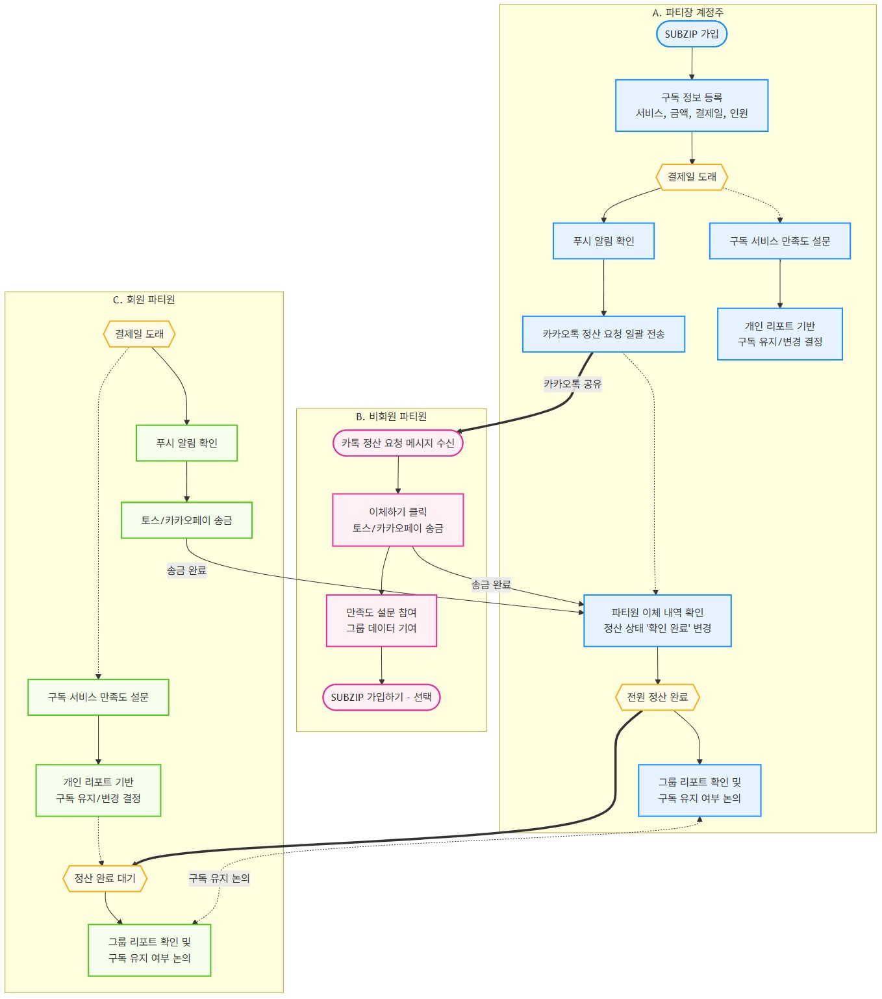

# SUBZIP

**구독 서비스 비용을 간편하게 정산하고, AI 기반 구독 만족도 리포트를 제공하여 의사결정을 돕는 플랫폼**

## 1. 문제 정의

최근 다수의 구독 서비스를 이용하며 타인과 계정을 공유해 비용을 절약하는 소비 형태가 보편화됨. 그러나 매달 직접 정산을 해야 하는 번거로움이 크고, 서비스별 만족도와 개인의 실제 고정 지출을 정확히 파악하기 어렵다는 문제가 있음.

- **정산의 번거로움**: 파티장(계정주)은 매달 정산을 요청하고 입금 확인을 반복해야 하며, 파티원 역시 매달 이체를 반복해야 한다.
- **만족도 분석의 어려움**: 구독 서비스에 대한 만족도를 일일이 파악하기 어렵고, 특히 계정을 공유하는 경우 개인의 만족도를 그룹의 의사결정에 반영하기 힘들다.
- **부정확한 고정 지출 파악**: 기존 금융/구독 관리 서비스는 공유 계정의 전체 결제 금액을 파티장 1인의 소비로만 인식하거나, 파티원의 이체 내역을 지출로 처리하지 못해 개인이 실제로 부담하는 고정 지출을 파악하기 어렵다.

## 2. 핵심 타겟

- **2개 이상의 유료 구독 서비스를 이용하며, 합리적인 소비를 지향하는 청년들**
- 구독 서비스 계정을 타인과 공유하는 **파티장(계정주)**
- 구독 서비스 계정을 공유받아 이용 중인 **파티원**

## 3. 핵심 기능

### A. 원클릭 정산

- **맞춤형 알림 제공**
    - 결제일에 맞춰 파티장에게는 정산 시작 알림을, 플랫폼에 가입한 파티원에게는 간편 이체 링크가 포함된 PWA 푸시 또는 이메일 알림을 제공
- **카카오톡 기반 원클릭 정산 요청**
    - 플랫폼에 미가입 파티원에게는 파티장이 카카오톡 공유 기능을 활용하여 정산 요청 메시지를 일괄 전송
- **딥링크 기반 간편 이체**
    - 파티원은 카카오톡 메시지의 '이체하기' 또는 푸시 알림을 통해 토스, 카카오페이의 딥링크로 연결되어 이체

### B. AI 기반 구독 만족도 리포트 및 의사결정 지원

- **1초 만족도 설문**
    - 정산 요청 또는 이체 완료 직후 화면에서 이모티콘 터치 한 번으로 빠르게 만족도 설문에 참여
    - 예시: "이번 달 xxx nn원, 만족하셨나요?" → [😊 만족] [😐 보통] [😞 불만족]
- **개인 만족도 리포트**
    - 개인의 월별 만족도 추이를 분석하여 구독 유지 여부에 대한 객관적인 의사결정 지원하며, 서비스 변경을 고려하는 사용자에게는 최적의 대체 서비스를 제안
- **그룹 만족도 리포트**
    - 파티원들의 만족도를 익명으로 종합하여 그룹 전체의 구독 유지 여부에 대한 객관적인 지표를 제공하고, 대체 서비스를 제안

## 4. 서브 기능

### A. ‘내 진짜 몫’ 기준 구독 지출 대시보드

- **실제 지출 금액 계산**: 구독 서비스, 총 결제 금액, 결제일, 파티원 수를 입력하면 1/n 기준 실제 지출 금액을 자동 계산
- **실제 고정 구독 지출 시각화**: 전체 결제 금액이 아닌, 사용자가 실제로 지출하는 금액만을 모아 월별 구독 지출 현황을 대시보드로 시각화

## 5. 사용자 시나리오

### A. 파티장(계정주)

1. SUBZIP에 가입하여 구독 서비스, 총 결제 금액, 결제일, 파티원 수를 등록한다.
2. 결제일이 되면 푸시 알림을 확인한 후, 카카오톡 공유 기능을 통해 파티원들에게 정산 요청 메시지를 일괄 전송한다. 
3. 구독 서비스에 대한 만족도 설문을 완료하고, 개인 만족도 리포트를 기반으로 구독 유지 및 변경 여부를 결정한다. 
4. 파티원의 이체가 확인되면 정산 상태를 ‘확인 완료’로 변경한다.
5. 정산이 완료된 후 그룹 만족도 리포트를 확인하고, 파티원들과 구독 유지 여부를 논의한다.

### B. 비회원 파티원

1. SUBZIP 가입 없이, 파티장이 보낸 카카오톡 메시지의 ‘이체하기’를 통해 토스·카카오페이로 이동하여 이체한다. 
2. 구독 서비스에 대한 만족도 설문에 참여하여 그룹 데이터에 기여하고, ‘SUBZIP 가입하기’를 통해 SUBZIP에 가입할 수 있다. 

### C. 회원 파티원

1. 결제일이 되면 푸시 알림을 통해 토스·카카오페이로 이동하여 이체한다. 
2. 구독 서비스에 대한 만족도 설문을 완료하고, 개인 만족도 리포트를 기반으로 구독 유지 및 변경 여부를 결정한다. 
3. 정산이 완료된 후 그룹 만족도 리포트를 확인하고, 파티원들과 구독 유지 여부를 논의한다.

## 6. 플로우차트

## 7. 프로토타입
[웹 프로토타입 보기](https://hyunjinch.github.io/hub/docs/prototype/index.html)
