# 🚀 프로젝트 기획서: 브리플리 (Briefly)

**영문 뉴스 기반 해외 주식 모의 투자 학습 AI 에이전트**

---

## 1. 문제 발견 (Pain Points)

초보자가 해외 영문 뉴스를 통해 영어와 주식을 동시에 배우고자 할 때 겪는 세 가지 주요 장벽입니다.

- **언어적 측면 (전문 용어의 벽):** 경제 기사 특유의 은유적 표현(Bear/Bull)과 전문 용어(Ticker, Guidance)로 인해 번역기를 돌려도 문맥 파악이 어렵습니다.
- **정보적 측면 (정보 과부하):** 하루에도 쏟아지는 수많은 외신 중 어떤 뉴스가 주가에 실질적인 영향을 미치는지 선별할 기준이 없습니다.
- **경험적 측면 (인지적 충돌):** '어려운 영어 문장을 해석하는 것'과 '기업의 투자 가치를 분석하는 것'은 모두 뇌의 에너지를 심하게 소모하는 고부하 작업입니다. 이 두 가지를 동시에 하려다 보면 쉽게 피로해지고, 결국 주식도 영어도 흥미를 잃고 포기하게 됩니다.

## 2. 문제 정의 (Problem Definition)

- **누가:** 해외 주식 투자와 영문 뉴스 읽기에 처음 입문하려는 초보자가
- **어떤 상황에서:** 글로벌 시장 흐름을 파악하고 첫 투자 종목을 고르기 위해 외신에 접근할 때
- **무슨 불편을 겪는가:** 낯선 금융 영어와 방대한 정보량으로 인해 인지적 과부하를 겪으며 쉽게 지치고 포기하게 된다.

> **💡 통합 문제 정의**
> "해외 주식 및 영문 뉴스 초보자가 투자 정보를 얻기 위해 외신에 접근할 때, 금융 영어의 장벽과 정보 과부하로 인한 인지적 피로감 때문에 학습과 투자를 지속하지 못하고 포기한다."

## 3. 킥오프 목표

- **서비스 형태:** 웹 브라우저 (Web Browser)
- **정성적 목표:** 사용자가 영어 뉴스 읽기와 주식 분석을 '스트레스'가 아닌 '쉬운 큐레이션'으로 느끼게 한다.
- **정량적 성공 기준:** 사용자가 하루에 최소 1개의 영문 기사를 끝까지 읽고(완독률), 해당 종목에 대한 모의 투자 판단(매수/관망/매도) 인터랙션을 수행한다.

## 4. 타겟 페르소나 및 제품 스코프

- **페르소나:** 영어 원문 기사와 해외 주식 투자 모두 경험이 없는 완전 초보자.
- **제품 스코프 (스코프 크리프 방어 논리):** 본 서비스는 실제 증권사 API와 연동된 매매 시스템이 아닌, 안전하게 시장을 학습하고 감각을 기르는 '모의 투자 판단 훈련 도구'임을 명확히 합니다.

## 5. 핵심 기능 및 MVP 우선순위

"이게 없으면 서비스가 굴러가는가?(필수성)"와 "문제 정의를 정확히 해결하는가?(적합성)"를 기준으로 도출된 3대 핵심 기능입니다.

### ① 원문 리더뷰 + 전문용어 인라인 해설 (최우선순위)

- **기능:** 뉴스 원문을 렌더링하되, 금융 전문용어를 자동 하이라이트하고 탭 하면 팝업으로 쉬운 한글 설명 제공.
- **정책:** 툴팁 카피는 "직관적 비유 1줄 + 명확한 뜻 1줄"로 작성. (예: 베어마켓 - 곰이 앞발로 내려찍는 모습에서 유래했어요. 주식 시장이 하락세라는 뜻입니다.)
- **필수성:** 사전을 따로 찾거나 번역기를 돌리는 이탈 지점을 기사 화면 안에서 바로 없애는, 브리플리만의 유일한 존재 이유입니다.
- **적합성:** 첫 번째 문제인 "금융 영어의 장벽"을 1:1로 정확히 겨냥합니다.

### ② AI 문단 요약 + 종목 영향 한 줄 해설

- **기능:** 문단별 3줄 불릿(Bullet) 요약 제공 및 기사 하단에 "이 기사가 주가에 미치는 영향"을 AI가 한 줄로 브리핑.
- **필수성:** 용어 뜻만 알고 주가 영향을 스스로 연결하지 못하면 피로가 가중됩니다. '언어 해석'과 '투자 가치 분석'이라는 두 인지 작업 사이의 다리를 놓는 필수 장치입니다.
- **적합성:** 정보 과부하와 인지적 충돌 문제를 동시에 낮추어 뇌의 에너지 소모를 방지합니다.

### ③ 완독 후 투자심리 인터랙션 (매수/관망/매도 버튼)

- **기능:** 기사 최하단에서 모의 투자 판단을 선택하고 마이페이지에 히스토리로 기록.
- **필수성:** 킥오프에서 합의한 정량적 성공 기준을 실제로 측정할 수 있는 유일한 데이터 포인트입니다.
- **적합성:** 능동적 행동을 유도해 "나도 투자자처럼 생각했다"는 완결감을 부여하며, 서비스 이탈을 막고 지속성을 만듭니다.

## 6. 핵심 사용자 시나리오

**시나리오 목표:** 번역기나 사전 없이 브리플리 화면 안에서 영문 기사를 완독하고, 주가 영향을 이해한 뒤 모의 투자 판단을 내리는 것.

**Step 1: 기사 진입 (리더뷰 시작)**
사용자가 대시보드에서 큐레이션 된 외신 카드(로고+영문 제목+한 줄 번역)를 클릭합니다. 불필요한 요소가 제거된 깔끔한 리더뷰 형태의 원문이 실시간 파싱되어 렌더링됩니다.

**Step 2: 원문 독해 및 언어 장벽 해소 (인라인 해설)**
기사를 읽다 낯선 금융 영단어(하이라이트)를 탭합니다. 브라우저 이탈 없이 단어 위에 직관적인 비유가 포함된 한글 툴팁이 즉시 팝업되며, 툴팁 확인 후 매끄럽게 독해를 이어갑니다.

**Step 3: 정보 소화 및 투자 가치 연결 (AI 요약 + 종목 영향)**
AI 3줄 요약을 활용해 맥락을 파악하며 기사 끝까지 스크롤합니다. 기사 하단의 'AI 인사이트 패널'에서 이 뉴스가 단기적으로 주가에 어떤 영향을 미칠지 AI의 한 줄 브리핑을 확인하여 인지적 부담을 해소합니다.

**Step 4: 의사결정 및 히스토리 보존 (투자 판단 기록)**
기사와 브리핑을 바탕으로 하단의 **[ 매수 📈 ] / [ 관망 ➖ ] / [ 매도 📉 ]** 버튼 중 하나를 클릭하여 모의 투자 판단을 내립니다. 클릭 즉시 서버에 `기사 URL`, `AI 요약본`, `나의 선택`이 데이터로 저장됩니다. 저장이 성공적으로 완료되면 "오늘의 모의 투자 판단 완료!" 토스트 팝업이 노출됩니다. 추후 기사 원문 URL이 페이월(Paywall)에 막히거나 만료되더라도, 함께 저장된 'AI 요약본과 판단 기록'을 통해 학습 복기가 가능합니다.

## 7. 사용자 플로우차트 (Mermaid)

> 💡 **안내:** 위 6번의 '핵심 사용자 시나리오'를 바탕으로, 개발 및 디자인 파트와의 명확한 소통을 위해 화면(노랑)·사용자 행동(초록)·AI 로직(파랑)·결과 및 데이터(보라)의 흐름을 시각적으로 도식화한 다이어그램입니다.

```mermaid
graph TD
    Start([시작: 메인 대시보드 진입]) --> Feed[화면: 오늘의 핵심 외신 3개 노출]
    Feed --> ClickCard{행동: 관심 기사 클릭}
    ClickCard --> ReaderView[화면: 기사 상세 - 실시간 원문 파싱 및 리더뷰 렌더링]

    ReaderView --> Jargon{행동: 어려운 용어 발견?}
    Jargon -- 단어 탭 --> Tooltip[AI 로직: 문맥 맞춤형 한글 툴팁 팝업 <br> *정책: 비유 1줄 + 뜻 1줄*]
    Tooltip --> ContinueReading[행동: 이해 후 독해 재개]
    Jargon -- 넘어가기 --> ContinueReading

    ContinueReading --> Summary{행동: 문단 요약 필요?}
    Summary -- 버튼 클릭 --> ShowSummary[AI 로직: 문단 요약 3줄 확인]
    ShowSummary --> ScrollDown[행동: 기사 끝까지 스크롤]
    Summary -- 스스로 해석 --> ScrollDown

    ScrollDown --> InsightPanel[AI 로직: 종목 영향 한줄 해설 확인]
    InsightPanel --> Decision{행동: 나의 모의 투자 판단}

    Decision -- 매수 📈 --> ActionRecord[행동: 버튼 클릭 및 서버 전송]
    Decision -- 관망 ➖ --> ActionRecord
    Decision -- 매도 📉 --> ActionRecord

    ActionRecord --> SaveData[결과: 데이터 저장 로직 성공 <br> *URL + AI 요약 + 내 판단*]
    SaveData --> Toast[화면: 완료 토스트 팝업 알림]

    Toast --> End([종료: 마이페이지 히스토리 등록])

    %% 엣지케이스 대응 흐름
    End -.-> MyPageRevisit{행동: 마이페이지 재방문 및 복기}
    MyPageRevisit -- "링크 만료 / 페이월 발생 시" --> Fallback[결과: 저장된 'AI 요약본'으로 <br> 과거 판단 근거 복기 가능]

    %% Figjam 컬러 가이드 연동 스타일링
    %% 화면(노랑), 행동(초록), AI로직(파랑), 결과/데이터(보라)
    classDef screen fill:#FFF2CC,stroke:#D6B656,stroke-width:2px,color:#333
    classDef action fill:#D5E8D4,stroke:#82B366,stroke-width:2px,color:#333
    classDef aiLogic fill:#DAE8FC,stroke:#6C8EBF,stroke-width:2px,color:#333
    classDef result fill:#E1D5E7,stroke:#9673A6,stroke-width:2px,color:#333

    class Start,Feed,ReaderView,Toast screen;
    class ClickCard,Jargon,ContinueReading,Summary,ScrollDown,Decision,ActionRecord,MyPageRevisit action;
    class Tooltip,ShowSummary,InsightPanel aiLogic;
    class SaveData,End,Fallback result;
```

