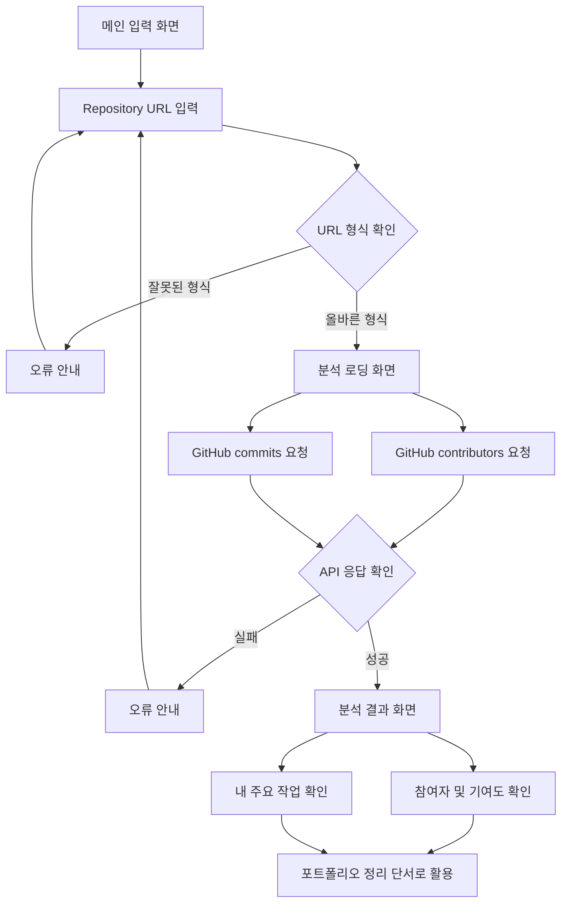

# PtoP 기획서

## 1. 문제 정의

프로젝트 경험을 쌓는 대학생 개발자는 프로젝트가 끝난 뒤 시간이 지나면 자신이 맡은 역할, 기여도, 핵심 구현 내용, 문제 해결 과정을 정확히 기억하고 정리하기 어렵다.

## 2. 서비스 목표

PtoP(Project to Portfolio)는 GitHub Repository를 기반으로 프로젝트 참여 정보와 작업 흔적을 빠르게 확인하고, 나중에 포트폴리오와 회고로 확장할 수 있는 프로젝트 정리 초안을 만드는 서비스다.

이번 단계에서는 기능을 넓히기보다 다음 두 흐름을 명확하게 만든다.

- Repository를 입력하면 참여자, 기여도, 주요 커밋 흐름을 확인한다.
- 분석 결과를 바탕으로 내가 어떤 작업을 했는지 설명할 수 있는 단서를 제공한다.

## 3. 사용자 관점 동작 시나리오

1. 사용자는 프로젝트가 끝난 뒤 포트폴리오에 정리할 내용이 필요하다고 느낀다.
2. 사용자는 PtoP 첫 화면에서 GitHub Repository URL을 입력한다.
3. 사용자는 `분석 시작` 버튼을 누르고, 로딩 상태를 보며 Repository 분석이 진행 중임을 확인한다.
4. PtoP는 GitHub 공개 API를 통해 참여자 정보와 최근 커밋 정보를 가져온다.
5. 사용자는 분석 결과 화면에서 프로젝트 참여자, 기여도, 자신의 주요 커밋 메시지를 확인한다.
6. 사용자는 결과를 보며 “내가 주로 어떤 일을 했는지”를 빠르게 복기한다.
7. 이후 사용자는 이 정보를 바탕으로 회고, 포트폴리오, 자기소개서에 쓸 내용을 정리한다.

## 4. 핵심 기능 2개

### 4.1 Repository 분석 기능

사용자가 GitHub Repository URL을 입력하면 프로젝트의 참여자와 작업 흐름을 분석한다.

입력:

- GitHub Repository URL
- 사용자가 입력한 URL 형식

분석 대상:

- GitHub Repository 기본 정보
- contributors API의 참여자별 commit 수
- 최근 commits API의 commit 작성자와 commit message

사용자에게 보여줄 결과:

- Repository 이름
- GitHub Repository 원문 링크
- 참여자 목록
- 참여자별 commit 수
- 참여자별 기여도 퍼센트
- Repository owner 기준 최근 주요 commit message

선정 이유:

- 프로젝트 정리를 시작하려면 먼저 “누가 참여했고, 내가 어느 정도 작업했는지”를 빠르게 확인해야 한다.
- commit 수와 commit message는 사용자가 프로젝트 경험을 복기할 때 가장 먼저 확인할 수 있는 객관적인 단서다.
- 이 기능이 있어야 다음 단계인 회고/포트폴리오 초안 생성이 가능하다.

주의할 점:

- commit 수는 작업량을 보여주는 참고 지표이지, 실제 난이도나 기여 품질을 완전히 설명하지 않는다.
- GitHub API 요청 실패, 비공개 Repository, API rate limit 상황에서는 임의 결과를 만들지 않고 오류를 안내한다.

### 4.2 작업 내용 정리 기능

Repository 분석 결과를 바탕으로 사용자가 자신이 맡은 작업을 빠르게 파악할 수 있게 정리한다.

입력:

- Repository 분석 결과
- 참여자별 기여도
- 최근 commit message

정리 대상:

- 내가 주로 남긴 commit message
- 반복적으로 등장하는 작업 흐름
- 포트폴리오에 옮길 수 있는 작업 단서

사용자에게 보여줄 결과:

- “내 주요 작업” 목록
- 커밋 메시지 기반 작업 힌트
- 이후 회고/포트폴리오 초안으로 확장 가능한 요약 정보

선정 이유:

- 사용자가 최종적으로 필요한 것은 단순한 Repository 정보가 아니라 “내가 무엇을 했는지 설명할 수 있는 근거”다.
- commit message를 먼저 보여주면 사용자가 실제 경험과 맞는지 빠르게 검증할 수 있다.
- AI가 과장된 역할을 생성하기 전에, 사용자가 직접 확인 가능한 작업 단서를 먼저 제공할 수 있다.

주의할 점:

- 현재 단계에서는 AI가 역할을 단정하지 않는다.
- commit message가 부족하거나 작성자가 GitHub 계정과 연결되지 않은 경우 “찾지 못함”을 명확히 보여준다.

## 5. 화면 구조(UI)

| 화면 | 주요 UI | 사용자 동작 | 시스템 동작 | 다음 흐름 |
| --- | --- | --- | --- | --- |
| 메인 입력 화면 | PtoP 로고, Repository URL 입력창, 분석 시작 버튼 | GitHub Repository URL을 입력한다. | URL 형식을 확인한다. | 로딩 화면 |
| 분석 로딩 화면 | 서비스 컬러 기반 spinner, 분석 중 메시지 | 분석 진행 상태를 기다린다. | GitHub API로 contributors와 commits를 요청한다. | 결과 화면 또는 오류 화면 |
| 분석 결과 화면 | Repository 이름, GitHub 링크, 참여자/기여도, 주요 작업 목록 | 참여자와 자신의 작업 내용을 확인한다. | API 결과를 화면에 요약한다. | 서비스 소개 섹션으로 스크롤 |
| 오류 안내 화면 | 오류 메시지, 입력창 | URL을 다시 확인하고 수정한다. | 임의 데이터를 만들지 않고 실패 이유를 안내한다. | 메인 입력 화면 |
| 서비스 소개 섹션 | 문제 정의, 핵심 기능, 문서 링크 | 서비스 목적과 기획 문서를 확인한다. | 정적 정보를 제공한다. | 기획서/프로토타입/Wiki 이동 |

## 6. 화면 흐름



## 7. 화면 단위 와이어프레임

```text
[메인 입력 화면]
┌──────────────────────────────────────┐
│              PtoP Logo               │
│ ┌──────────────────────────────────┐ │
│ │ https://github.com/user/repo     │ │
│ └────────────────────── [분석 시작] ┘ │
└──────────────────────────────────────┘

[분석 로딩 화면]
┌──────────────────────────────────────┐
│          Mint Spinner                │
│ Repository를 분석하고 있어요           │
│ 참여자, 기여도, 최근 커밋 흐름 확인 중 │
└──────────────────────────────────────┘

[분석 결과 화면]
┌──────────────────────────────────────┐
│ Repository: user/repo                │
│ [GitHub에서 보기]                     │
├──────────────────┬───────────────────┤
│ 프로젝트 참여자   │ 내 주요 작업        │
│ userA 60%        │ feat: ...         │
│ userB 40%        │ docs: ...         │
└──────────────────┴───────────────────┘

[오류 안내 화면]
┌──────────────────────────────────────┐
│ 분석할 수 없습니다                    │
│ 공개 Repository인지 URL을 확인해 주세요 │
└──────────────────────────────────────┘
```

## 8. 프로토타입

현재 프로토타입은 두 가지 형태로 확인할 수 있다.

- 메인 페이지: Repository URL 입력 후 로딩 상태와 결과 화면을 같은 페이지에서 확인한다.
- [동작 프로토타입](../prototype/index.html): 참여자별 기여도와 최근 커밋 기반 작업 내용을 별도 페이지에서 확인한다.

프로토타입 동작 범위:

- GitHub Repository URL 입력
- GitHub API 기반 참여자 조회
- commit 수 기준 기여도 계산
- 최근 commit message 기반 주요 작업 표시
- API 실패 시 임의 결과를 만들지 않고 오류 표시

## 9. 이번 단계에서 제외하는 것

핵심 기능을 먼저 탄탄히 하기 위해 다음 기능은 확장 후보로만 둔다.

- 프로젝트 폴더 업로드
- README 전체 분석
- 코드 파일 내용 분석
- AI 기반 회고 문장 자동 생성
- Notion, GitHub Pages 내보내기
- 여러 프로젝트 비교

## 10. 관련 문서

- [GitHub Wiki](https://github.com/SubJeeLee/hub/wiki)
- [1주차 작업 체크리스트](./checklist.md)
- [Git Repository 분석 학습 노트](./repo-analysis-study.md)
- [PtoP 테스트 케이스](./test-cases.md)
- [기획하기 with AI 가이드](./planning-tip.md)
