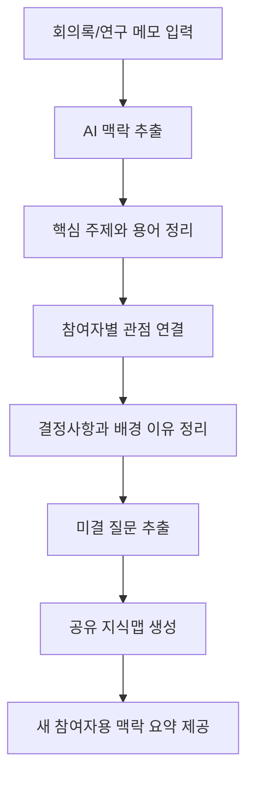

# 모두의 뇌 기초 개발 기획서

## 1. 프로젝트 주제

**모두의 뇌 - 협업 맥락 공유 AI 에이전트**

모두의 뇌는 여러 사람이 하나의 프로젝트를 함께 진행할 때, 문서와 회의에 흩어진 배경지식, 결정사항, 용어, 미결 질문을 하나의 공유 지식망으로 정리해주는 AI 에이전트이다.

이 서비스의 목표는 회의를 짧게 요약하는 것이 아니라, 팀 전체가 같은 맥락을 이해하도록 돕는 공유 두뇌를 만드는 것이다.

## 2. 문제 정의

여러 사람이 하나의 프로젝트를 함께 진행하면 각자 다른 역할, 전공, 경험을 바탕으로 같은 내용을 다르게 이해한다. 같은 단어를 써도 의미가 다르게 받아들여지고, 이전 결정의 이유가 공유되지 않으면 반복 설명, 중복 조사, 재작업, 의사결정 지연이 발생한다.

특히 대학생 팀 프로젝트, 공모전, 연구실 공동 연구, 창업팀처럼 여러 사람이 빠르게 협업해야 하는 환경에서는 프로젝트 맥락이 개인 메모, 회의록, 채팅, 문서에 흩어지기 쉽다.

### 문제 정의 한 문장

> 여러 사람이 하나의 프로젝트를 함께 진행할 때 각자 알고 있는 맥락과 판단 근거가 문서, 회의, 메모에 흩어져 있어 서로의 의도를 정확히 이해하지 못하고 반복 설명과 재작업이 발생한다.

## 3. 목표 사용자

- 팀 프로젝트를 진행하는 대학생
- 공모전이나 해커톤을 준비하는 팀
- 연구실에서 하나의 주제를 여러 세부 역할로 나눠 진행하는 연구자
- 창업팀, 동아리, 산학 프로젝트처럼 여러 역할이 얽힌 팀
- 새 팀원이 자주 합류하거나 프로젝트 히스토리를 빠르게 공유해야 하는 팀

## 4. 서비스 목표

회의록, 연구 메모, 팀 피드백, 보고서, 공지 내용을 입력하면 AI가 다음 정보를 정리한다.

- 프로젝트의 핵심 주제는 무엇인가
- 참여자별로 중요하게 보는 관점은 무엇인가
- 지금까지 어떤 결정이 내려졌고, 그 이유는 무엇인가
- 서로 이해가 갈린 부분은 무엇인가
- 아직 답하지 못한 질문은 무엇인가
- 새로 합류한 사람이 가장 먼저 알아야 할 맥락은 무엇인가

## 5. 사용자 시나리오

1. 팀이 공모전 또는 연구 프로젝트 회의를 진행한다.
2. 회의 후 회의록, 채팅 요약, 자료 조사 메모, 멘토 피드백이 여러 곳에 흩어진다.
3. 팀장은 관련 텍스트를 모두의 뇌에 입력한다.
4. AI가 주요 용어, 결정사항, 배경 맥락, 참여자별 관점, 미결 질문을 추출한다.
5. 사람/역할/주제별로 연결된 공유 지식맵이 생성된다.
6. 팀원은 지식맵을 보며 서로의 맥락 차이와 미결 질문을 확인한다.
7. 새로 합류한 사람도 지금까지의 흐름을 빠르게 이해한다.

## 6. 핵심 기능 2개

### 기능 1. 프로젝트 맥락 추출

사용자가 회의록, 연구 메모, 팀 피드백, 보고서 내용을 텍스트로 입력하면 AI가 프로젝트 맥락을 구성하는 정보를 추출한다.

추출 항목:

- 핵심 주제
- 중요한 용어와 쉬운 설명
- 결정사항
- 결정의 배경 또는 이유
- 참여자/역할별 관점
- 이해가 갈린 지점
- 미결 질문

### 기능 2. 공유 지식맵 생성

추출한 정보를 사람, 역할, 주제, 결정, 질문 단위로 연결해 팀 전체가 볼 수 있는 지식 구조로 만든다.

생성 항목:

- 프로젝트 맥락 요약
- 사람/역할별 관점 표
- 주제 간 연결 관계
- 미결 질문 목록
- 새 참여자 온보딩 요약

## 7. MVP 범위

### 포함 범위

- 회의록/연구 메모/팀 피드백 텍스트 입력
- 핵심 주제, 용어, 결정사항, 미결 질문 추출 결과 표시
- 사람/역할별 관점 표 표시
- 공유 지식맵 형태의 시각화
- 새 참여자용 맥락 요약 표시

### 제외 범위

- 카카오톡, 슬랙, 노션 자동 수집
- 음성 회의 자동 녹음 및 분석
- 실제 문서 시스템 자동 연동
- 법적 책임이 필요한 계약/공문 검토
- 사람의 승인 없이 자동으로 의사결정을 내리는 기능

## 8. 예시 입력

```text
오늘 프로젝트 회의에서 팀원 A는 사용자가 처음 들어왔을 때 무엇을 해야 하는지 바로 보여주는 화면이 중요하다고 말했다.
팀원 B는 기능이 많아지면 구현 시간이 부족하니 MVP에서는 입력과 분석 결과 화면만 먼저 만들자고 제안했다.
팀원 C는 발표에서 문제 정의와 차별점이 잘 보여야 한다고 했다.
멘토는 기능 설명보다 사용자가 겪는 불편함과 해결 흐름을 먼저 보여주라고 피드백했다.
아직 어떤 화면을 첫 번째로 만들지, 분석 결과를 표로 보여줄지 지식맵으로 보여줄지는 결정되지 않았다.
```

## 9. 예시 출력

### 프로젝트 맥락 요약

- 핵심 주제: 프로젝트 MVP 화면과 발표 방향 결정
- 주요 갈등: 기능 범위를 줄이는 것과 서비스 차별점을 충분히 보여주는 것 사이의 균형
- 현재 결정: 입력 화면과 분석 결과 화면을 먼저 만들고, 지식맵은 MVP의 핵심 시각화로 유지
- 미결 질문: 첫 화면 구성, 분석 결과 표현 방식, 발표에서 강조할 메시지

### 참여자별 관점

| 참여자/역할 | 중요하게 보는 점 | 현재 우려 | 연결된 질문 |
| --- | --- | --- | --- |
| 팀원 A | 사용자가 바로 이해하는 첫 화면 | 첫 화면이 복잡해질 수 있음 | 첫 화면에서 무엇을 보여줄 것인가 |
| 팀원 B | 구현 가능한 MVP 범위 | 기능이 많아져 완성도가 낮아질 수 있음 | 어떤 기능을 제외할 것인가 |
| 팀원 C | 발표에서 보이는 차별점 | 단순 요약 도구처럼 보일 수 있음 | 차별점을 어떻게 시각화할 것인가 |
| 멘토 | 문제 정의와 사용자 흐름 | 기능 설명만 많아질 수 있음 | 사용자의 불편함을 어떻게 먼저 보여줄 것인가 |

### 미결 질문

- 첫 화면에서 입력창을 먼저 보여줄 것인가, 예시 결과를 먼저 보여줄 것인가?
- 분석 결과는 표, 카드, 지식맵 중 무엇을 중심으로 보여줄 것인가?
- 발표에서 모두의 뇌를 회의 요약 도구와 어떻게 구분할 것인가?

## 10. 사용자 흐름



## 11. 화면 구성

| 화면 | 목적 | 주요 요소 |
| --- | --- | --- |
| 홈 화면 | 서비스 목적 설명 | 서비스 이름, 한 줄 설명, 시작 버튼 |
| 문서 입력 화면 | 회의록/연구 메모 입력 | 텍스트 입력창, 예시 입력 버튼, 분석 버튼 |
| 맥락 분석 화면 | 추출 결과 확인 | 핵심 주제, 용어, 결정사항, 참여자별 관점 |
| 공유 지식맵 화면 | 맥락 연결 구조 확인 | 사람/역할/주제 노드, 연결선, 미결 질문 |
| 온보딩 요약 화면 | 새 참여자 빠른 이해 | 지금까지의 결정, 알아야 할 용어, 질문 목록 |

## 12. 시장 조사 기반 기획 타당성

협업 도구 시장에는 Notion, Confluence, Mem, Obsidian처럼 지식 저장과 검색을 돕는 도구가 이미 있다. 하지만 모두의 뇌는 단순 문서 저장이나 회의 요약이 아니라, 여러 참여자의 관점 차이와 결정 배경을 연결해주는 것을 목표로 한다.

시장 조사에서 확인한 핵심 근거는 다음과 같다.

- 지식 노동자는 업데이트 확인, 불필요한 회의, 도구 전환 같은 `work about work`에 많은 시간을 쓴다.
- 팀 지식이 여러 도구에 흩어지면 맥락을 다시 찾고 설명하는 시간이 늘어난다.
- Notion AI, Confluence AI, Mem처럼 팀 지식을 AI로 검색하고 재사용하려는 흐름이 이미 존재한다.
- Obsidian식 세컨드 브레인과 지식 그래프는 개인 지식 관리에는 강하지만, 프로젝트 참여자 간 관점 차이를 조율하는 팀 단위 맥락 관리에는 별도 설계가 필요하다.

자세한 분석은 [시장 조사 및 경쟁 분석](market-research.md)에 정리한다.

## 13. 디자인 산출물

대표 이미지는 GPT 생성 이미지가 아니라 직접 만든 벡터 SVG를 PNG로 렌더링해 사용한다. 이렇게 하면 GitHub PR 본문에서 바로 보이고, 브라우저별 SVG 렌더링 문제를 줄일 수 있다.

- 대표 PNG: `docs/images/modu-brain-cover.png`
- 벡터 원본: `docs/images/modu-brain-cover.svg`
- Canva 편집 디자인: `https://www.canva.com/d/vv5pLSUhq50coma`
- Figma FigJam 흐름도: `https://www.figma.com/board/V5Jke4dsqaoMUOiTEg57tM`

## 14. 세부 기획 문서

- [PRD](prd.md): 제품 요구사항, 목표 사용자, MVP 범위, 성공 기준
- [TRD](trd.md): 기술 구조, 타입 정의, 컴포넌트 구조, 테스트 계획
- [프롬프트 디자인](prompt-design.md): LLM 프롬프트, JSON 스키마, 검증 기준

## 15. React 컴포넌트 개발

시장 조사와 관련 사례를 보여주는 카드 UI를 만들기 위해 `NewsCard` 컴포넌트를 추가한다.

요구사항:

- React + TypeScript
- 파일 위치: `src/components/NewsCard.tsx`
- props: `title: string`, `source: string`, `thumbnail: string`
- CSS Modules 사용
- 외부 UI 라이브러리 사용 금지

렌더 확인용 샘플 props는 다음과 같다.

```tsx
{
  title: "업데이트 확인과 도구 전환이 실제 작업 시간을 잠식한다",
  source: "Asana Anatomy of Work",
  thumbnail: "/images/research-work.svg"
}
```

## 16. 개발 작업 분해

- 기획서 제목과 문제 정의를 모두의 뇌 방향으로 정리
- 시장 조사 및 경쟁 분석 문서 작성
- Apple 스타일의 단순 벡터 대표 이미지 제작
- Canva에서 편집 가능한 디자인 생성
- Figma FigJam에서 협업 맥락 흐름도 생성
- README와 PR 본문에서 대표 PNG가 바로 보이도록 구성
- React + TypeScript 개발 환경 구성
- `NewsCard.tsx` 컴포넌트 작성
- CSS Modules 스타일 작성
- `npm run build`로 타입/빌드 검증
- `npm run dev` 확인 시나리오 정리

## 17. 완료 기준

- 기존 회의 요약/업무표 에이전트와 다른 차별점이 분명하다.
- 문제 정의가 협업 맥락 손실과 노동력 낭비를 직접 다룬다.
- 시장 조사와 경쟁 분석이 기획 타당성을 뒷받침한다.
- README에서 모든 문서와 대표 이미지에 접근할 수 있다.
- `NewsCard` 컴포넌트가 TypeScript props 기준에 맞게 동작한다.
- `npm run build`가 성공한다.

## 18. 최종 요약

모두의 뇌는 팀 전체가 함께 쓰는 두 번째 뇌를 만드는 협업 맥락 AI 에이전트이다. 회의록과 문서를 단순히 요약하는 것이 아니라, 프로젝트 안의 사람, 역할, 용어, 결정사항, 미결 질문을 연결해 모두가 같은 맥락을 이해하도록 돕는다.
