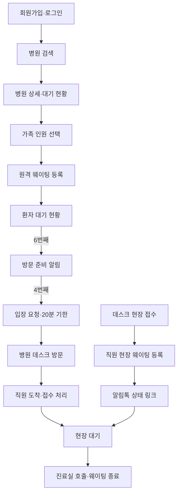

# 바로진료 서비스 기획서

## 문제 정의

동네 병원을 이용하려는 환자는 방문 전에 실제 진료 대기 상황을 확인하거나 순번을 등록하기 어려워, 병원에 먼저 도착한 뒤 장시간 현장에서 기다리는 불편을 겪습니다.

## 서비스 정의

바로진료는 로그인한 환자가 동네 병원의 당일 진료 대기열에 원격으로 참여하고, 병원 직원이 원격 환자와 현장 환자를 하나의 실제 순서로 관리하는 웹 서비스입니다.

예약 시간 판매, 진료 내용 관리, 보험·결제 처리는 하지 않습니다. 환자가 병원 밖에서 기다리다가 적절한 시점에 입장하고, 도착 후 병원 데스크에서 정식 접수를 마치도록 돕는 것이 목적입니다.

## 사용자

| 사용자 | 역할 |
|---|---|
| 환자 | 병원 검색, 원격 웨이팅 등록, 상태 확인, 미루기·취소 |
| 병원 관리자 | 병원 입점 신청, 날짜별 대기열 운영, 현장 접수, 환자 상태 처리 |
| 플랫폼 관리자 | 확장 기능에서 병원 신청 승인·거절·이용 중지 |

환자용 화면과 병원 관리자용 화면은 분리하지만 인증은 공통 Supabase Auth를 사용하고 역할·전화번호·상태는 `profiles`에서 관리합니다. MVP에서 병원 승인은 mock 또는 DB에서 수동 처리합니다.

## 사용자 시나리오

### 원격 환자

1. 환자가 이메일과 비밀번호로 회원가입하고 Brevo SMTP로 받은 인증 링크를 확인한 뒤 로그인합니다.
2. 병원명, 지역, 대표 진료과로 병원을 검색하고 현재 대기 인원과 참고용 예상 시간을 확인합니다.
3. 소아·성인·노인 인원수를 선택해 가족 단위 원격 웨이팅을 등록합니다.
4. 서비스는 가족 전체에 하나의 접수번호를 발급하고 당일 통합 대기열 마지막에 추가합니다.
5. 환자는 병원 밖에서 현재 진료 대기 순서와 예상 시간을 확인합니다.
6. 6번째가 되면 카카오 알림톡 mock으로 남은 예상 시간과 방문 준비 안내를 받습니다.
7. 4번째가 되면 입장 요청 알림을 받고 20분 안에 병원 데스크로 이동합니다.
8. 병원 직원이 도착과 정식 접수를 확인하면 환자 상태가 현장 대기로 바뀝니다.
9. 직원이 환자를 진료실로 호출하면 웨이팅이 종료되고 뒤 환자의 순서와 예상 시간이 갱신됩니다.
10. 환자는 입장 전 순서를 한 번 미루거나 웨이팅을 직접 취소할 수 있습니다.

### 현장 환자

1. 환자가 병원 데스크에서 정식 접수를 진행합니다.
2. 병원 직원이 전화번호와 소아·성인·노인 인원수를 입력해 현장 웨이팅을 등록합니다.
3. 환자는 접수 완료 알림톡 mock의 `현재 대기 상태 보기` 링크를 받습니다.
4. 링크에서 병원 정보, 접수번호, 현재 순서, 예상 시간과 상태를 확인합니다.
5. 4번째가 되면 대기실에서 진료를 준비하라는 진료 임박 알림을 받습니다.
6. 현장 상태 화면에는 직접 취소 버튼이 없으며, 취소가 필요하면 화면의 병원 전화번호로 연락합니다.
7. 병원이 요청을 확인한 뒤 직원 화면에서 웨이팅을 취소합니다.
8. 웨이팅이 호출 또는 취소로 종료되면 상태 조회 링크는 즉시 무효화됩니다.

### 병원 관리자

1. 병원 관리자가 계정을 만들고 병원 정보, 사업자등록정보, 요양기관기호와 증빙 이미지를 제출합니다.
2. MVP에서는 mock 검증 결과로 승인 상태를 만들고 승인된 병원만 검색 결과에 노출합니다.
3. 병원은 매일 하나의 통합 대기열을 열고 평균 진료시간과 원격 접수 한도를 설정합니다.
4. 직원은 원격·현장 환자를 같은 순서에서 보고 현장 접수, 도착 처리, 호출, 보류, 취소와 순서 조정을 수행합니다.

## 핵심 기능 (2개)

### 1. 환자의 원격 웨이팅 등록과 상태 확인

- 이메일·비밀번호 회원가입, 이메일 확인과 로그인
- 병원명·지역·대표 진료과 검색
- 소아·성인·노인 가족 인원 선택
- 계정당 활성 원격 웨이팅 1건 제한
- 실제 환자 수 기반 현재 순서와 예상 시간
- 6번째 준비 알림과 4번째 입장 요청 mock 알림톡
- 순서 1회 미루기와 직접 취소

### 2. 병원의 원격·현장 통합 대기열 관리

- 병원별 하루 1개 통합 대기열
- 원격·현장 환자의 단일 순서 관리
- 직원의 현장 웨이팅 등록과 상태 조회 링크 발급
- 원격 환자의 도착·데스크 접수 처리
- 진료실 호출과 다음 순번 진행
- 보류, 취소, 우선 호출과 순서 조정
- mock 알림톡 발송 결과와 상태 변경 이력

## 핵심 운영 규칙

- 예약 진료를 제외하고 당일 순번 접수만 다룹니다.
- 가족은 하나의 접수번호와 상태로 관리하지만 대기 계산에는 실제 환자 수를 사용합니다.
- 현재 진료 대기 순서는 앞선 활성 웨이팅의 환자 수 합계에 1을 더해 계산합니다.
- 예상 시간은 `앞에 남은 실제 환자 수 × 날짜별 평균 진료시간`이며 확정 진료 시각이 아닙니다.
- 병원별 평균 진료시간 기본값은 10분이고 5분 단위로 설정합니다.
- 준비 알림 기준은 기본 6번째, 입장 요청 기준은 기본 4번째이며 병원이 변경할 수 있습니다.
- 순서가 급격히 줄어 준비 기준을 건너뛰면 준비 알림을 생략하고 입장 요청만 보냅니다.
- 입장 요청 후 20분 안에 도착하지 않으면 한 번 대기열 마지막으로 이동하고, 기한이 지나면 자동 취소합니다.
- 원격 환자의 도착 처리는 병원 직원만 수행합니다. 현장 코드와 환자 직접 도착 인증은 사용하지 않습니다.
- 환자 계정 하나에는 병원과 관계없이 활성 원격 웨이팅을 1건만 허용합니다.
- 환자와 직원 화면은 Express API를 10초마다 조회해 최신 순서와 상태를 반영합니다.
- 20분 도착 기한 만료는 Express 백그라운드 작업이 1분마다 검사하고 PostgreSQL advisory lock으로 중복 실행을 막습니다.
- 모든 시각은 `timestamptz`로 UTC 저장하고 병원 운영일은 `Asia/Seoul` 기준으로 계산합니다.
- 원격 접수 한도 기본값은 실제 환자 20명이며 현장 접수에는 적용하지 않습니다.
- 현장 조회 링크는 호출 또는 취소 시 즉시 무효화하고 운영 이력은 유지합니다.
- 진료실 호출은 진료 완료를 의미하지 않으며 웨이팅 서비스의 활성 대기열에서 빠지는 동작입니다.

## 화면 흐름

상세 User Flow, IA와 화면별 와이어프레임은 [`ux-structure.md`](./ux-structure.md), 데이터 구조는 [`erd.md`](./erd.md)에서 관리합니다.

## 주요 화면

1. 환자 회원가입·로그인
2. 병원 검색과 `내 주변` mock 영역
3. 병원 상세·대기 현황
4. 원격 웨이팅 등록
5. 원격 환자 대기 현황
6. 현장 환자 링크용 대기 현황
7. 병원 관리자 통합 대기열
8. 현장 환자 등록
9. 병원 입점 신청
10. 대기열 운영 설정

## 디자인 시안

기존 디자인 이미지는 전체적인 정보 우선순위와 시각적 톤을 위한 참고 시안입니다. 회원가입, 자동 2단계 알림, 현장 상태 링크와 병원 입점 신청은 새 정책에 맞춰 개발 화면에서 보완합니다.

- [디자인 시스템](./design-system.md)
- [환자 등록 데스크톱](./assets/design/patient-registration-desktop.png)
- [환자 상태 모바일](./assets/design/patient-waiting-mobile.png)
- [병원 관리자 대기열 데스크톱](./assets/design/staff-queue-desktop.png)

## 우선순위

### P0

- 환자 이메일 회원가입·확인·로그인과 계정당 활성 웨이팅 제한
- 가족 단위 원격 웨이팅과 10초 주기 상태 확인
- 병원의 원격·현장 통합 대기열 관리
- 직원 현장 접수와 원격 환자 도착 처리
- 6번째·4번째·현장 접수·현장 4번째 mock 알림톡

### P1

- 병원명·지역·진료과 검색과 `내 주변` mock 영역
- 병원 입점 신청, 증빙 mock 업로드와 mock 승인
- 웨이팅 시작·일시 중지·마감과 원격 접수 한도
- 환자 미루기·취소, 미도착 자동 처리
- 직원 보류·우선 호출·순서 변경
- 상태 변경·알림 발송 이력과 오류 상태

### P2

- 실제 카카오 알림톡·SMS 중계 API와 SMS 대체 발송
- 카카오·구글 소셜 로그인
- 플랫폼 관리자 병원 승인·거절·이용 중지 화면
- 국세청 사업자 진위·휴폐업 API와 심평원 병원정보 교차 검증
- 비공개 증빙 저장소, 악성 파일 검사와 자동 파기
- GPS·지도 API를 이용한 실제 내 주변 검색
- 여러 의사·진료과별 대기열과 간단한 증상 입력
- 병원 전산 연동, 운영 통계와 다지점 관리
- Supabase Cron과 PostgreSQL 함수 기반 자동 만료 처리
- 외부 공개 배포와 운영용 Supabase 프로젝트 분리

## MVP 제외 범위

- 예약 진료
- 결제와 보험 확인
- 처방전과 진료기록 관리
- 환자 이름, 생년월일, 증상 수집
- 병원 리뷰
- 실제 알림톡·SMS 발송
- 실제 사업자·의료기관 API 검증
- 실제 지도·GPS 검색
- 여러 의사·진료과 대기열
