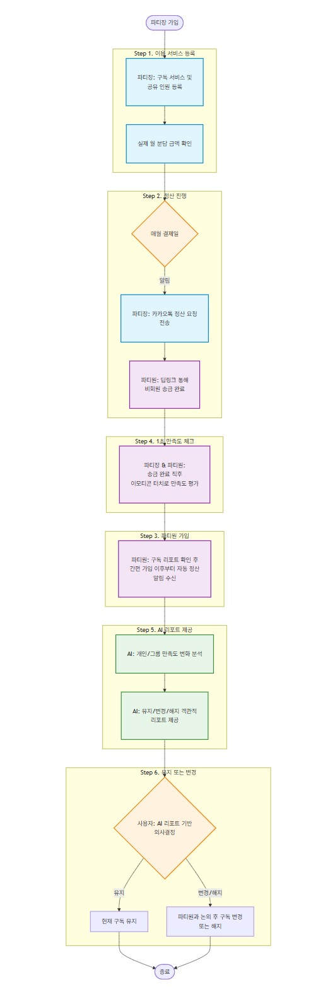

## SUBZIP

**매달 지출하는 실제 구독료를 관리하고, 공유 구독 정산과 그룹의 구독 의사결정을 돕는 서비스**

### 1. 문제 정의

매달 구독료로 얼마를 쓰는지 파악하기 어렵고, 지인 간 공유 계정 정산의 피로도와 구독 유지에 대한 심리적 장벽이 존재한다.

- **부정확한 지출 파악**: 기존 금융/구독 관리 서비스는 공유 계정의 전체 결제 금액을 1인의 소비로 인식하거나, 파티원의 이체 내역을 소비로 처리하지 못해 실제 내가 부담하는 고정 지출을 정확하게 파악하기 어렵다.
- **정산 관리의 피로도**: 파티장은 매달 반복되는 정산 요청과 입금 확인을 직접 관리해야 하며, 파티원 역시 반복적인 송금 과정이 번거롭다.
- **구독 유지에 대한 의사결정의 어려움**: 파티원들은 매달 구독료를 지불하면서도 실제로 만족하며 이용하고 있는지 객관적으로 판단하기 어렵다. 또한 개인적으로 해지를 원하더라도 지인들과 함께 이용하는 서비스라는 특성 때문에 쉽게 의견을 꺼내기 어렵다.

### 2. 핵심 타겟

- 2개 이상의 유료 구독 서비스를 이용하는 20~30대
- 가족·친구·지인과 구독 서비스를 공유하는 **파티장**
- 매월 정산에 참여하며 자신의 구독이 합리적인 소비인지 확인하고 싶은 **파티원**

### 3. 핵심 기능

#### A. 실제 분담 금액(내 진짜 몫) 기준 대시보드

- 구독 서비스, 총 결제 금액, 결제일, 공유 인원을 입력하면 AI가 1/n 기준 실제 부담 금액을 자동 계산한다.
- 전체 결제 금액이 아닌 '내가 실제로 부담하는 월 구독료'를 기준으로 대시보드를 구성하여 정확한 고정 지출을 확인할 수 있다.

#### B. 원클릭 그룹 정산 & 점진적 가입(Progressive Onboarding)

- **카카오톡 기반 원클릭 정산 요청**
    - 결제일에 맞춰 파티장에게 정산 시작 알림을 제공한다.
    - 파티장은 카카오톡 공유 기능을 통해 정산 요청 메시지를 한 번에 전송한다.
- **비회원 딥링크 송금**
    - 파티원은 별도의 회원가입 없이 메시지의 '송금하기' 버튼을 눌러 토스·카카오페이 딥링크를 통해 즉시 송금한다.
- **가입 유도**
    - 송금 완료 후 "매달 내는 구독료, 정말 만족하며 사용하고 계신가요?"와 함께 무료 구독 리포트를 제공하며 간편 가입을 유도한다.
    - 가입한 파티원은 이후부터 카카오톡 대신 SUBZIP의 PWA 푸시 또는 이메일을 통해 자동 정산 알림을 받을 수 있다.

### 4. 서브 기능

#### A. AI 기반 구독 만족도 관리 및 그룹 의사결정 지원

- **송금 직후 '1초 만족도 체크' (초간편 UX/UI 적용)**
    - **송금 완료 직후** 가벼운 UX를 제공한다.
    - 화면 이탈 전, 이모티콘 터치 한 번으로 빠르게 평가를 완료할 수 있도록 구성한다.
    - 예시: "이번 달 xxx nn원, 만족하셨나요?" → [😊 충분히 만족] [😐 보통] [😞 거의 안 씀]
- **개인 만족도 리포트**
    - AI는 월별 만족도 변화를 분석하여 구독 만족도가 지속적으로 낮아지는 서비스를 알려준다.
    - 예시: "최근 3개월 동안 만족도가 지속적으로 낮아졌습니다. 다음 달에도 이용 계획이 없다면 잠시 해지를 고려해 보세요."
- **그룹 만족도 분석**
    - 파티원들의 만족도를 익명으로 종합하여 그룹 전체의 만족도를 제공한다.
    - 예시: "파티원 4명 중 3명이 이번 달 만족도가 낮다고 응답했습니다."
- **AI 의사결정 리포트**
    - 개인과 그룹의 만족도 추이를 종합하여 현재 구독을 유지할지, 다음 달 해지를 논의할지, 다른 서비스를 고려할지 객관적인 의사결정을 지원한다.
    - 예시: "최근 그룹 만족도가 지속적으로 감소하고 있습니다. 다음 결제 전에 파티원들과 구독 유지 여부를 논의해 보는 것을 추천합니다."
- **구독 전환 정보 제공**
    - 구독 유지 대신 다른 서비스를 고려하는 사용자를 위해 동일하거나 유사한 가격대의 대체 서비스를 함께 제안한다.
    - 예시: "이번 달은 넷플릭스 대신 티빙을 이용하면 비슷한 가격으로 최신 콘텐츠를 즐길 수 있습니다."

### 4. 사용자 시나리오

1. **파티장 등록**: 파티장이 SUBZIP에 구독 서비스와 공유 인원을 등록하고 자신의 실제 월 구독 지출을 확인한다.
2. **정산 진행**: 결제일이 되면 카카오톡으로 정산 요청을 전송하고, 파티원은 별도 가입 없이 송금을 완료한다.
3. **파티원 가입**: 송금 후 제공되는 무료 구독 리포트를 통해 간편 가입을 진행한다. 이후부터는 SUBZIP에서 자동으로 정산 알림을 받는다.
4. **1초 만족도 체크**: 송금이 완료된 직후 화면에서, 파티장과 파티원이 이모티콘 터치 한 번으로 1초 만족도 평가를 직관적으로 진행한다.
5. **AI 리포트 제공**: AI는 개인과 그룹의 만족도 변화를 분석하여 현재 구독을 유지할지, 함께 해지를 논의할지, 다른 서비스를 고려할지 객관적인 리포트를 제공한다.
6. **유지 또는 변경**: 사용자는 AI 리포트를 참고하여 구독을 유지하거나, 파티원들과 함께 구독 변경 또는 해지를 결정한다.

### 5. 플로우차트
