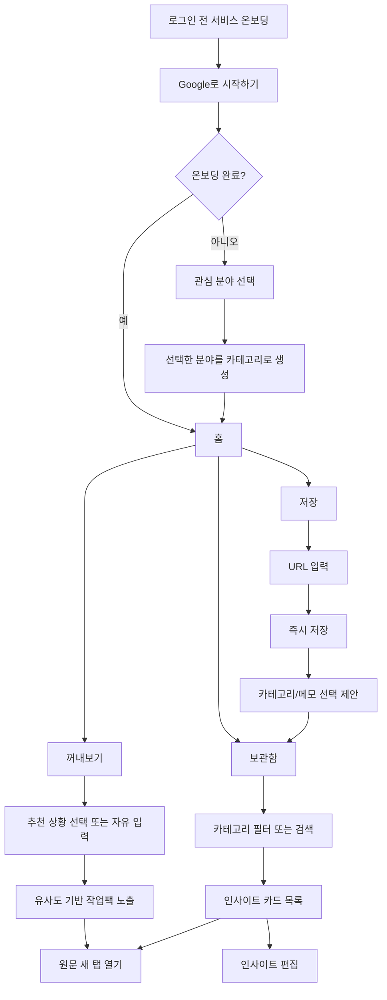

# 아맞다 MVP 기획서

## 프로젝트 개요

**서비스명:** 아맞다

**한 줄 요약:** 아맞다는 사용자가 저장한 인사이트를 현재 상황이나 목적에 맞게 다시 꺼내볼 수 있도록 돕는 인사이트 저장소다.

**핵심 기능:** 링크 기반 인사이트 저장, 카테고리 기반 보관함, 상황/용도 기반 `꺼내보기`

## 문서 역할

이 문서는 아맞다 MVP의 제품 기획서다. 문제 정의, 타겟 사용자, 핵심 가치, 사용자 시나리오, 핵심 기능, 화면 흐름, MVP 범위를 설명하는 데 목적이 있다.

이 문서에는 제품 방향을 이해하는 데 필요한 수준의 구현 전제만 포함한다. 세부 작업 분해, 상세 기술 설계, 보안 정책, 실패 처리, 백로그 관리는 별도 문서에서 다룬다.

## 1. 문제 정의

### 문제 상황

대학생과 개인 창작자는 인스타그램, 유튜브, 블로그, 웹사이트 등에서 과제, 팀 프로젝트, 공부, 개발, 디자인, 취업 준비에 도움이 될 만한 정보를 자주 저장한다. 하지만 시간이 지나면 무엇을 저장했는지 잊거나, 필요한 순간에 다시 찾지 못해 저장한 정보가 실제 행동으로 이어지지 않는 경우가 많다.

### 문제 원인

- 저장은 쉽지만, 저장한 이유와 나중에 쓸 상황이 함께 남지 않는다.
- 기존 북마크나 메모 도구는 사용자가 직접 분류하고 다시 검색해야 한다.
- 검색하려면 제목, 키워드, 저장 위치를 기억해야 하는데, 사용자는 그 단서 자체를 잊는 경우가 많다.
- 저장물이 쌓일수록 다시 정리하거나 찾아보는 부담이 커진다.
- 단순 알림은 필요한 상황과 연결되지 않으면 쉽게 무시된다.

### 우리가 해결하고자 하는 바

아맞다는 사용자가 저장한 인사이트를 단순히 보관하는 데서 끝내지 않고, 나중의 상황이나 용도와 연결해 필요한 순간에 다시 꺼내볼 수 있게 돕는다.

### 우리가 제공하는 가치

- 유용한 링크와 정보를 빠르게 보관할 수 있다.
- 카테고리로 직접 정리할 수 있다.
- 키워드를 정확히 기억하지 못해도 상황이나 용도를 입력해 관련 인사이트를 다시 발견할 수 있다.
- 저장한 정보를 다시 열어보고 실제 작업, 공부, 기획, 개발, 디자인에 활용할 가능성을 높인다.

### 한 문장 문제 정의

사용자는 유용한 정보를 저장해두지만, 필요한 순간에 다시 찾지 못해 저장한 인사이트를 실제로 활용하지 못한다.

## 2. 근본 원인 분석: 5 Whys

**문제:** 사용자는 저장한 인사이트를 필요한 순간에 다시 활용하지 못한다.

1. 왜 다시 활용하지 못하는가?  
   저장했다는 사실이나 저장 위치를 잊어버리기 때문이다.

2. 왜 저장 위치를 잊어버리는가?  
   여러 서비스에 흩어져 저장하고, 저장 당시의 맥락을 함께 남기지 않기 때문이다.

3. 왜 저장 당시의 맥락을 남기지 않는가?  
   기존 도구는 빠른 저장이나 분류에는 집중하지만, "나중에 언제 쓸 것인지"를 자연스럽게 묻지 않기 때문이다.

4. 왜 "언제 쓸 것인지"가 중요한가?  
   사용자는 정보를 다시 찾을 때 정확한 제목보다 "지금 하려는 일"을 먼저 떠올리는 경우가 많기 때문이다.

5. 왜 기존 검색만으로 부족한가?  
   검색은 사용자가 이미 키워드를 알고 있을 때 강하지만, 저장한 정보의 존재나 표현을 잊은 상황에서는 약하기 때문이다.

따라서 핵심은 저장물을 더 많이 쌓는 것이 아니라, 저장한 인사이트와 미래의 사용 상황을 연결하는 것이다.

## 3. 타겟 사용자

### 페르소나

**이름:** 최재원  
**상황:** 대학생. 과제, 팀 프로젝트, 개발 공부, UI/UX 레퍼런스 탐색을 자주 한다.  
**행동:** 유튜브, 블로그, 인스타그램, GitHub, 디자인 레퍼런스 사이트에서 유용한 정보를 발견하면 저장해둔다.  
**현재 도구:** 브라우저 북마크, 카카오톡 나에게 보내기, Notion, 인스타그램 저장, 브라우저 탭 열어두기.  
**불편:** 저장은 많이 하지만, 막상 프로젝트를 시작하거나 공부할 때 예전에 저장한 자료를 다시 찾지 못한다.  
**기대:** 저장한 정보를 나중에 필요한 상황에서 다시 꺼내보고 싶다.

### JTBD

사용자가 과제, 팀 프로젝트, 공부, 개발, 디자인 같은 작업을 시작할 때, 예전에 저장해둔 인사이트를 다시 발견해 바로 참고하고 싶다.

### 현재 대안

- 브라우저 북마크
- Notion
- 카카오톡 나에게 보내기
- 인스타그램 저장
- 탭 열어두기

### 현재 대안의 한계

- 저장 위치가 흩어진다.
- 저장한 이유가 사라진다.
- 다시 찾으려면 사용자가 직접 기억하고 검색해야 한다.
- 카테고리 정리는 가능하지만, 현재 상황에 맞춰 다시 꺼내주는 경험은 약하다.

## 4. 경쟁사 분석 및 포지셔닝

### 기존 대안 비교

| 대안                   | 강점                             | 한계                                                   |
| ---------------------- | -------------------------------- | ------------------------------------------------------ |
| 브라우저 북마크        | 저장이 쉽고 기본 제공된다.       | 저장 이유와 활용 상황이 남지 않는다. 다시 찾기 어렵다. |
| Notion                 | 자유롭게 정리할 수 있다.         | 저장과 정리에 사용자의 노력이 많이 필요하다.           |
| 카카오톡 나에게 보내기 | 가장 빠르게 임시 저장할 수 있다. | 쌓이면 찾기 어렵고 구조화가 약하다.                    |
| 인스타그램 저장        | 앱 안에서 저장이 쉽다.           | 외부 자료와 통합 관리하기 어렵다.                      |

### 아맞다의 포지셔닝

아맞다는 단순 북마크 앱이 아니라, 저장한 인사이트를 필요한 순간에 다시 꺼내보게 하는 서비스다.

- 기존 도구가 "어디에 저장했는가"를 돕는다면, 아맞다는 "지금 무엇을 꺼내볼 것인가"를 돕는다.
- 카테고리는 수동 정리와 탐색을 위한 기준이다.
- `꺼내보기`는 상황이나 용도에 맞는 인사이트를 다시 발견하는 핵심 기능이다.

## 5. As-Is / To-Be

| 구분      | As-Is                                       | To-Be                                                         |
| --------- | ------------------------------------------- | ------------------------------------------------------------- |
| 저장      | 북마크, 카톡, Notion 등에 흩어져 저장한다.  | 아맞다에 링크 기반 인사이트를 모아 저장한다.                  |
| 분류      | 직접 폴더나 페이지를 만들어야 한다.         | 카테고리를 선택적으로 붙이고, 추천 칩으로 분류 부담을 줄인다. |
| 다시 찾기 | 제목, 키워드, 저장 위치를 기억해야 한다.    | 상황이나 용도를 입력해 관련 인사이트를 꺼내본다.              |
| 활용      | 저장한 자료가 다시 열리지 않는 경우가 많다. | 필요한 순간 원문을 새 탭으로 열어 바로 참고한다.              |
| 관리      | 쌓일수록 정리 부담이 커진다.                | 보관함, 검색, 카테고리, 미분류 필터로 관리한다.               |

## 6. MVP 핵심 경험

### 핵심 가치

필요한 순간에 저장해둔 인사이트를 다시 꺼내볼 수 있게 한다.

### Aha Moment

사용자가 "팀 프로젝트 앱 디자인 참고"처럼 현재 상황을 입력했을 때, 예전에 저장해둔 UI/UX 레퍼런스나 개발 참고 자료가 다시 나타나는 순간.

### MVP에서 반드시 검증할 흐름

1. 사용자가 링크를 저장한다.
2. 카테고리와 메모를 선택적으로 추가한다.
3. 사용자가 홈에서 `꺼내보기`를 실행한다.
4. 현재 상황이나 필요한 용도를 입력한다.
5. 관련 인사이트가 유사도 기반 작업팩으로 노출된다.
6. 사용자가 연결 단서를 확인하고 원문을 새 탭에서 열어본다.

### MVP 성공 기준

MVP는 많은 기능을 제공하는 것이 아니라, 저장한 인사이트가 현재 상황과 다시 연결되어 작업팩으로 나타나는 흐름이 자연스럽게 작동하는지를 보여줘야 한다.

## 7. 핵심 기능

멘토님 기본 기획서의 "핵심 기능 2개" 기준으로는 다음 두 기능을 핵심으로 본다.

### 기능 A. 인사이트 저장과 보관함

사용자는 유용한 링크를 인사이트로 저장하고, 보관함에서 카테고리와 검색을 통해 관리할 수 있다.

주요 범위:

- 링크 URL 저장
- URL 메타데이터 수집
- 제목, 썸네일, 도메인 기반 카드 표시
- 메모 선택 입력
- 카테고리 여러 개 선택
- 새 카테고리 생성
- 보관함의 `All`, 사용자 카테고리, `미분류` 필터
- 제목, 메모, 카테고리 수정
- 인사이트 삭제

### 기능 B. 꺼내보기

사용자는 현재 상황이나 필요한 용도를 입력해 저장된 인사이트 중 유사도가 높은 항목을 작업팩으로 다시 받을 수 있다.

주요 범위:

- 홈 화면의 `꺼내보기` 진입점
- 추천 상황 버튼
- 자유 입력
- MiniSearch 기반 유사도 검색
- 제목, 메모, 카테고리, 도메인, URL, 메타데이터 설명 기반 랭킹
- 최대 6개의 인사이트로 구성된 작업팩
- 짧은 연결 단서
- 원문 새 탭 열기

### 보조 기능

- Google 로그인
- 로그인 전 서비스 온보딩
- 최초 1회 관심 분야 온보딩
- 사용자별 Supabase 데이터 저장
- 반응형 웹
- 상단 프로필 메뉴와 로그아웃

## 8. 사용자 시나리오

### 시나리오 1. 인사이트 저장

1. 사용자가 웹에서 팀 프로젝트에 참고할 만한 UI/UX 레퍼런스 글을 발견한다.
2. 아맞다의 저장 화면에 URL을 붙여넣는다.
3. 저장 버튼을 누르면 링크가 즉시 보관된다.
4. 저장 후 카테고리 추천 칩이 표시된다.
5. 사용자는 `UI/UX`, `팀프로젝트` 카테고리를 선택하고 짧은 메모를 남긴다.
6. 인사이트는 보관함에 저장되고, 메타데이터가 수집되면 카드가 업데이트된다.

### 시나리오 2. 꺼내보기

1. 며칠 뒤 사용자는 팀 프로젝트 앱 기획을 시작한다.
2. 아맞다 홈에서 `꺼내보기`를 연다.
3. 추천 상황 버튼을 누르거나 "팀 프로젝트 앱 디자인 참고"라고 입력한다.
4. 아맞다는 저장된 인사이트 중 현재 상황과 유사한 항목을 작업팩으로 묶어 보여준다.
5. 사용자는 연결 단서를 확인하고 필요한 카드를 새 탭으로 열어 원문을 확인한다.

### 시나리오 3. 보관함 탐색

1. 사용자는 예전에 저장한 개발 참고 자료를 찾고 싶다.
2. 보관함으로 이동한다.
3. `개발` 카테고리를 선택하거나 검색어를 입력한다.
4. 관련 인사이트 목록을 확인하고 원문을 연다.

## 9. 유저 플로우

## 10. 화면 흐름

### 로그인 전 서비스 온보딩

- 상세 기준은 `docs/onboarding.md`를 따른다.
- 서비스 목적, 핵심 기능, 장점을 한 화면에서 보여준다.
- 로그인 CTA를 제공한다.
- 로그인 전 사용자가 홈이나 `꺼내보기`로 바로 이동하지 않게 한다.
- 긴 마케팅 랜딩 페이지는 만들지 않는다.

### 로그인 후 개인화 온보딩

- 최초 1회만 표시한다.
- 관심 분야를 선택하면 해당 항목을 카테고리로 생성한다.
- 아무것도 선택하지 않아도 시작할 수 있다.

### 홈

- 하단 내비게이션의 가운데 탭이다.
- `꺼내보기` 진입점이 핵심이다.
- 추천 상황 버튼과 자유 입력을 제공한다.
- 입력 상황과 저장된 인사이트의 유사도를 계산해 작업팩으로 보여준다.
- 최근 보관한 인사이트 일부를 보여준다.

### 보관함

- 저장된 인사이트를 탐색하고 관리하는 공간이다.
- 카테고리 칩, 검색창, 카드 목록을 제공한다.
- 카테고리 필터 순서는 `All`, 사용자 카테고리, `미분류`다.
- 기본 정렬은 최신 저장순이다.

### 저장

- 사용자가 URL을 입력해 인사이트를 저장한다.
- 저장 후 카테고리와 메모 입력을 선택적으로 제안한다.
- 저장 전 미리보기는 제공하지 않는다.

### 인사이트 편집

- 제목, 메모, 카테고리를 수정할 수 있다.
- URL은 수정할 수 없다.
- 잘못 저장한 URL은 삭제 후 다시 저장한다.

### 프로필 메뉴

- 계정 정보와 로그아웃을 제공한다.
- 별도 설정 페이지는 필수로 만들지 않는다.

## 11. MVP 범위

### 포함

- Google 로그인
- 로그인 전 서비스 온보딩
- Supabase 기반 사용자별 데이터 저장
- 최초 1회 온보딩
- 링크 저장
- URL 메타데이터 수집
- 보관함
- 카테고리 생성, 수정, 삭제
- 인사이트별 여러 카테고리 지정
- 메모 선택 입력
- 검색
- 꺼내보기
- 인사이트 카드 UI
- 반응형 웹
- 원문 새 탭 열기

### 멘토 확인 후 결정

- Chrome Extension 저장

Chrome Extension은 저장 마찰을 줄이는 강한 기능이지만, 3주 MVP에서 Supabase Auth와 연동하는 난이도를 멘토에게 확인한 뒤 포함 여부를 결정한다.

### MVP 범위에서 제외

- 이미지 직접 업로드
- 모바일 공유 확장
- 클립보드 자동 수집
- 캘린더 연동
- 이메일 알림
- 브라우저 푸시 알림
- AI 추천
- AI 자동 분류
- 그래프/생각 지도 화면
- 협업 보관함
- 휴지통/복구
- 정렬 옵션
- 추천 결과별 피드백
- 인사이트 URL 수정

## 12. MVP 1 Pager

### Use Case

사용자가 과제, 팀 프로젝트, 공부, 개발, 디자인 작업을 시작할 때 예전에 저장해둔 인사이트를 다시 꺼내본다.

### Problem

사용자는 유용한 정보를 저장하지만, 필요한 순간에 다시 찾지 못해 실제로 활용하지 못한다.

### Persona

웹에서 자료와 레퍼런스를 자주 저장하는 대학생, 개인 개발자, 디자이너 지망생, 창작자.

### Why

정확한 키워드를 기억하지 못해도 현재 상황이나 용도를 입력해 저장한 인사이트를 다시 발견할 수 있기 때문이다.

### Alternative

브라우저 북마크, Notion, 카카오톡 나에게 보내기, 인스타그램 저장, 탭 열어두기.

### Aha! Moment

"팀 프로젝트 앱 디자인 참고"라고 입력했을 때, 예전에 저장해둔 UI/UX 레퍼런스가 다시 나타나는 순간.

### Business Model

MVP에서는 수익화를 검증하지 않는다. 장기적으로는 AI 기반 꺼내보기, 이메일 리마인드, 협업 보관함, 고급 검색 같은 기능을 유료화 후보로 검토할 수 있다.

## 13. MVP 구현 전제

아래 내용은 제품 기획을 이해하는 데 필요한 최소 구현 전제다. 상세 기술 설계와 보안 정책은 별도 문서에서 다룬다.

### 프론트엔드

- React
- Vite
- TypeScript

### 인증과 데이터

- Supabase Auth
- Google OAuth
- Supabase Postgres
- RLS 기반 사용자 데이터 분리

### 검색과 추천

- `꺼내보기`는 MiniSearch 기반 유사도 검색을 우선 검토
- 보관함 검색은 직접 탐색용 검색 결과 목록으로 유지
- 제목, 메모, 카테고리, URL, 도메인, 메타데이터 설명 기반 랭킹
- 상세 기준은 `docs/retrieve.md`를 따름
- AI와 LLM은 MVP에서 제외

### 메타데이터 수집

- 저장 후 비동기 수집
- 실패해도 저장은 성공
- 브라우저 직접 크롤링 대신 서버 함수 또는 API 사용
