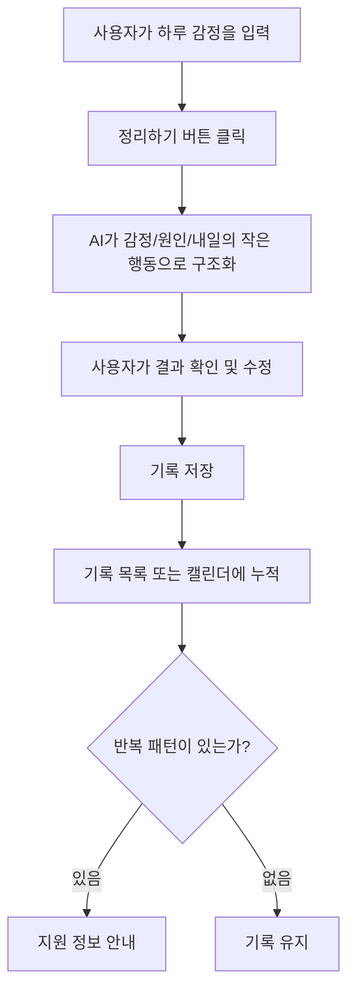

# 하루 체크아웃 — 기획서

## 문제 정의
학업과 취업 준비로 정신적 어려움을 겪는 대학생은 늘고 있으나 도움 통로는 제한적이다.
- 교내 학생상담센터: 무료지만 인력 부족으로 대기 수개월 (사례: 일부 대학 대기 ~5개월, 상담사 1인당 학생 2,000~5,000명 / 적정 비율은 500명당 1명)
- 공공 지원(심리상담 바우처, 청년 마음건강 지원사업): 존재하지만 의뢰서 발급 등 절차가 복잡해 학생이 스스로 찾아 이용하기 어려움
- 상담 이용에 대한 심리적 부담(낙인)도 여전함
그 결과 많은 학생이 AI 챗봇에 고민을 털어놓지만, 일반 챗봇은 사용자에게 과도하게 동조(sycophancy)하는 경향이 있고 대화가 휘발되어 자기 상태를 축적적으로 파악하기 어렵다.

## 서비스 정의
정리되지 않은 감정을 날것 그대로 입력하면 AI가 감정·원인·다음 행동으로 구조화해주는 대학생용 하루 체크아웃 도구.
- AI의 역할 제한: 조언·진단·위로 금지, 정리만 (출력 형식 고정 → 동조 편향 차단)
- 기록 누적 → 반복 감정/상황 패턴 표시
- 반복 신호 시 실제 지원(교내 상담센터, 심리상담 바우처) 안내 연결 — 치료가 아니라 도움을 찾기 전 단계의 문턱을 낮춤

## 핵심 사용자 시나리오
하루를 마친 사용자가 접속하면 입력창 하나가 표시된다. "팀플에서 의견이 계속 무시돼서 지쳤다"처럼 정리되지 않은 문장을 입력하고 [정리하기]를 누르면 결과가 세 개의 카드로 제시된다 — ①오늘의 감정 ②원인 ③내일의 작은 행동. 사용자는 맞지 않는 항목을 수정한 뒤 저장하고, 기록은 캘린더에 누적된다. 특정 감정이 반복되면 패턴 알림과 함께 교내 상담센터·바우처 등 지원 정보 안내가 표시된다.

## 사용자 흐름

## 핵심 기능 체크리스트 (의존성 순서)
- [ ] 1. 입력 화면: 텍스트 입력창 + 정리하기 버튼
- [ ] 2. 결과 화면: 감정/원인/행동 카드 3장 (목데이터)
- [ ] 3. AI 연동: 입력 → 구조화 결과 (출력 형식 고정)
- [ ] 4. 결과 수정 및 저장
- [ ] 5. 기록 목록/캘린더 뷰
- [ ] 6. 반복 패턴 표시 + 지원 정보 안내
- [ ] (여유 시) 회고/체크아웃 문장 변환

## 범위 제외 (하지 않는 것)
로그인, 커뮤니티, 감정 그래프 고도화, 상담 예약 연동, 진단·치료 기능
