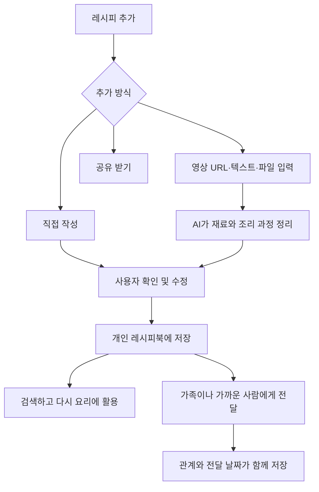

## 문제정의

사람들은 자신이 알고 있는 요리법, 인터넷에서 발견한 레시피, 가족에게 전해 들은 레시피를 여러 장소에 흩어진 형태로 보관한다. 하지만 다시 찾아 활용하기 어렵고, 영상이나 자유로운 문장으로 남아 있는 요리법은 실제 조리에 사용하기 좋은 형태로 정리하기도 번거롭다.

특히 부모님이나 할머니에게 전해 받은 마더 레시피는 단순한 조리 정보가 아니라 사람과 기억이 담긴 기록이지만, 일반적인 메모나 링크 공유 방식에서는 누가 전해준 레시피인지에 대한 연결과 의미가 쉽게 사라진다.

## 사용자 시나리오

### 시나리오 #1

#### 사용자

성준이는 유튜브에서 요리 영상을 자주 찾아본다. 마음에 드는 레시피가 있으면 ‘나중에 볼 영상’에 저장하거나 좋아요를 누른다. 하지만 시간이 지나면 다른 영상들과 섞여 금세 잊는다. 영상을 다시 찾더라도 재료와 조리 과정을 확인하기 위해 시간을 소모한다. 

#### 사용자 흐름

성준은 만들고 싶은 요리 영상 URL을 서비스에 입력한다. AI는 입력값을 분석하여 음식 이름, 재료, 수량, 조리 순서로 정리한다. 성준은 생성된 결과를 본인에 맞게 일부 수정한 뒤 개인 레시피북에 저장한다. 해당 URL은 레시피북에 출처로써 자동으로 저장된다.

며칠 후 성준은 레시피북에 저장된 요리들을 바로 정리된 재료와 조리 과정을 따라 요리한다. 

### 시나리오 #2

#### 사용자

지민이의 어머니는 오랫동안 가족에게 해준 김치찌개의 조리법이 있지만 정확한 계량 없이 감각적으로 요리한다. 그리고 지민이는 어머니의 레시피를 나중에도 직접 만들어먹고 싶지만 정확한 레시피를 기억하기 어렵다.

#### 사용자 흐름

지민의 어머니는 자신의 김치찌개 레시피를 자유롭게 작성한다. 서비스는 입력된 내용을 정리하고 계량이 모호한 부분은 확인이 필요한 항목으로 표시한다. 어머니만의 김치찌개는 어머니의 레시피북에 저장된다.

이후 공유 링크나 초대 코드를 이용해 지민이에게 레시피를 전달한다. 지민이의 레시피북에는 ‘엄마의 레시피’ 표시와 함께 김치찌개 레시피가 저장된다. 

### 해결되는 문제

- 내 취향에 맞는 여러 플랫폼에 흩어진 레시피들을 한 곳에 모아 일정한 구조로 보관할 수 있다.
- AI가 정리해줌으로 번거로움을 줄인다.
- 원본 출처가 함께 저장되어 다시 활용할 수 있다.
- 문서화되지 않은 가족의 레시피나 나만의 레시피를 보존할 수 있다.
- 레시피를 전해준 사람과 전달받은 관계를 보존할 수 있다.
- 전해 받은 레시피를 유지하면서 나만의 새로운 요리 경험으로 확장할 수 있다.

## 핵심 기능

### 1. 레시피 수집 및 정리

자신이 알고 있는 레시피를 직접 작성하거나 영상 URL, 텍스트, 텍스트 파일을 입력해 개인 레시피북에 추가할 수 있다. AI가 정리한 후 사용자가 확인하고 수정한 뒤 저장한다.

### 2. 관계 중심 레시피 공유

사용자는 자신이 직접 등록한 레시피를 링크나 초대 코드로 다른 사람에게 전달할 수 있다. 전달 받은 레시피는 단순히 복사되는 것이 아니라 누가 전해주었는지 (관계)와 전달 받은 날짜가 함께 저장된다. 전달받은 사용자는 레시피를 자신의 레시피북에서 열람하고 메모를 남길 수 있지만, 다른 사람에게 다시 공유할 수는 없다. 누군가 해당 레시피를 공유받고 싶다면 처음 레시피를 등록한 사람에게 요청해야 한다. 레시피가 단순한 정보가 아니라 사람 사이의 추억될 수 있었으면 좋겠다.

## 화면 흐름

