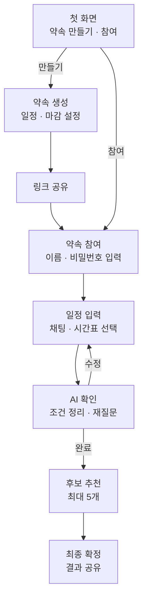

# 선호도 기반 AI 약속 시간 조율 서비스

## 문제 정의

여러 사람이 약속 시간을 정할 때 가능한 시간을 반복해서 주고받고, 그중 선호하는 시간을 반영하기 위해 다시 논의해야 하므로 조율 과정이 번거롭다.

## 사용자 시나리오

1. 사용자는 첫 화면에서 새 약속을 만들거나, 공유받은 링크와 코드를 통해 기존 약속에 참여한다.
2. 생성자는 약속 제목, 후보 날짜와 시간대, 응답 마감 시간을 설정한 뒤 참여 링크를 공유한다.
3. 참여자는 이름과 간편 비밀번호를 입력하고, AI 채팅 또는 시간표 선택으로 불가능·선호·비선호 시간을 입력한다.
4. AI는 입력 내용을 조건별로 정리하고, 모호하거나 서로 충돌하는 내용은 참여자에게 다시 확인받는다.
5. 모든 참여자의 응답이 모이면 서비스는 30분 단위로 참석 가능 인원과 선호도를 비교해 최대 5개의 후보 시간을 추천한다.
6. 생성자는 추천 후보 중 하나를 최종 일정으로 확정하고, 확정 결과와 선정 근거를 구성원에게 공유한다.

## 핵심 기능 (2개)

- **AI 일정 입력:** 자연어와 시간표 선택을 함께 받아 불가능·선호·비선호 조건으로 정리하고, 모호하거나 충돌하는 입력은 다시 확인한다.
- **약속 시간 추천:** 30분 단위 후보를 참석 가능 인원, 선호도, 비선호 인원 기준으로 비교해 최대 5개의 시간을 추천한다.

## 화면 흐름

