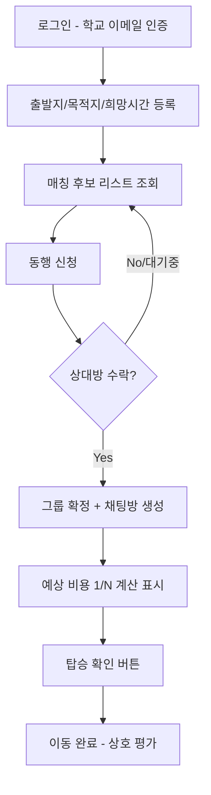

# 대학생 이동 경로 기반 동행자 매칭 서비스

## 문제 정의
대학생은 이동이 필요한 순간 주변에 방향이 겹치는 동행자가 있어도 이를 알 방법이 없어서, 비용을 절감할 수 있는 택시 동승 기회를 놓치고 있다.

## 사용자 시나리오
1. 조모임이 끝나고 지은은 앱을 켠다 → 학교 이메일로 로그인한다.
2. 출발 거점(정문/북문 중 선택)과 목적지(대구역/동대구역/기타 주요 거점), 희망 출발 시간, 도착 소요시간(예: 5분 이내)을 입력한다.
3. 앱이 같은 시간대(±15분)에 비슷한 목적지로 가려는 다른 학생들의 등록 현황을 보여준다.
4. 지은은 목적지가 겹치는 학생 2명을 발견하고 "동행 신청"을 누른다.
5. 상대방들이 신청을 수락하면 3명이 매칭된 채팅방이 열리고, 정확한 만남 장소와 시간을 조율한다.
6. 택시를 함께 타기로 하고, 앱이 예상 택시비를 3등분한 금액을 미리 보여준다.
7. 탑승 직전 "탑승 확인" 버튼을 누르고, 이동 후 "완료" 버튼을 눌러 상호 평가를 남긴다.

## 핵심 기능 (2개)
- **기능 A: 매칭 알고리즘** — 같은 거점 조합 + 희망 시간 ±15분 이내인 사용자를 자동으로 그룹핑해 후보로 보여준다. (필수성: 이게 없으면 서비스 자체가 성립하지 않음 / 적합성: "동행자를 실시간으로 알 방법이 없다"는 문제를 직접 해결)
- **기능 B: 동행 신청/수락 플로우** — 매칭 후보 확인 → 신청 → 상대 수락 → 그룹 확정까지 이어지는 절차. (필수성: 후보를 보여주는 것만으로는 그룹이 만들어지지 않음 / 적합성: "잠재 수요는 있지만 실행되지 않는 현실"을 실행으로 전환시킴)

## 추가 반영 기능 (MVP 보조 기능)
- **평점/리뷰 시스템** — 이동 완료 후 상호 평가, 노쇼/지각/취소 페널티의 기반이 됨
- **취소·노쇼 페널티** — 취소 시점(사전/임박)과 노쇼 여부에 따라 평가 점수 차등 차감
- **선호 필터 (성별 매칭)** — "동성끼리만 매칭 희망" 옵션으로 안전 문제에 대응
- **GPS 기반 도착 소요시간 계산 (Should Have)** — 기기 GPS로 현재 좌표를 가져와 하버사인 공식으로 거점까지 직선거리를 계산하고, 도보 속도(시속 4~5km) 기준으로 예상 도착 시간을 산출. 자기 신고형 시간 구간 선택을 대체/보완. 지도 SDK나 경로 탐색 API 없이 구현 가능해 4주 스코프에 부담 적음

## 이번 MVP에서 하지 않는 것
- 실제 결제/정산 연동 (PG사 연동 없이 "얼마씩 내야 하는지"만 표시)
- 노쇼 방지 보증금 시스템
- 실시간 위치 공유 (안심귀가)
- 경유지 자동 클러스터링 (정교한 라우팅 최적화) — 고정 거점 리스트로 단순화
- 카풀(자차 이용) 모드 — 택시 동승만 지원. 법적 리스크가 더 크고 구조가 달라 향후 확장 과제로 분리
- 지도 SDK 기반 실시간 경로 탐색 — 고정 거점 + GPS 직선거리 계산(Should Have)으로 대체

## 화면 흐름 (User Flow)
그림 파일: [user-flow.svg](user-flow.svg)

| 화면 | 동작 | 다음 화면 |
|---|---|---|
| 로그인 | 학교 이메일 입력 → 인증 메일 발송 | 이메일 인증 화면 |
| 이메일 인증 | 인증 코드/링크 확인 | 출발/도착 등록 화면 |
| 출발/도착 등록 | 거점·희망시간·도착 소요시간 입력 후 등록 | 매칭 후보 리스트 |
| 매칭 후보 리스트 | 후보 확인 → 동행 신청 | 매칭 후보 리스트 (신청 대기 상태) |
| 매칭 후보 리스트 (대기) | 상대방 수락 완료 알림 수신 | 그룹 채팅방 |
| 그룹 채팅방 | 만남 장소/시간 조율, 예상 비용 확인 | 탑승 확인 (출발 임박 시 버튼 노출) |
| 탑승 확인 | 탑승 확인 버튼 클릭 | 이동 중 (채팅방 유지) |
| 완료 및 평가 | 완료 버튼 → 별점/노쇼 신고 | 마이페이지 |
| 마이페이지 | 이용 이력·평점 확인 | 홈(출발/도착 등록)으로 복귀 |

## 화면 목록 (IA)
- **인증**
  - 로그인
  - 이메일 인증
- **매칭**
  - 출발/도착 등록 (홈)
  - 매칭 후보 리스트
- **동행 확정**
  - 그룹 채팅방
  - 탑승 확인
- **완료**
  - 완료 및 평가
- **마이페이지**
  - 이용 이력
  - 프로필/평점

## 와이어프레임
그림 파일: [wireframe.svg](wireframe.svg)

로그인 / 출발·도착 등록 / 매칭 후보 리스트 / 그룹 채팅방 / 완료 및 평가, 총 5개 핵심 화면의 대략적인 레이아웃을 스케치함.
- **로그인**: 이메일 입력 필드 1개 + 인증 메일 받기 버튼
- **출발/도착 등록**: 출발 거점, 목적지, 희망 시간, 도착 소요시간 4개 입력 필드 + 등록 버튼
- **매칭 후보 리스트**: 익명 표시된 후보 카드 목록(목적지·출발시간) + 카드별 신청 버튼
- **그룹 채팅방**: 채팅 말풍선 영역 + 예상 요금 안내 카드 + 하단 고정 탑승 확인 버튼
- **완료 및 평가**: 별점 입력 + 노쇼 신고 체크 + 완료 버튼

## 디자인 시스템
Claude design으로 제작한 디자인 핸드오프가 확정안: [design_handoff_ridesplit/README.md](../design_handoff_ridesplit/README.md)

대학 상징색인 레드/코랄(`#C8102E`) 기반, Pretendard 폰트, pill 버튼·칩, 얇은 테두리 카드 스타일. 색상·타이포그래피·간격 토큰과 화면별 상세 인터랙션(성별 필터, 방향 토글, 정원 배지, 그룹 채팅 동의 플로우 등)이 문서에 정리돼 있음.

## 프로토타입
클릭 가능한 순수 HTML/CSS 프로토타입: [prototype/index.html](prototype/index.html)

디자인 시스템(위 항목)을 실제로 적용해 제작. 핵심 기능(매칭 알고리즘, 동행 신청/수락 플로우)이 화면상에서 어떤 순서로 동작하는지 확인하는 것이 목적. 로그인 → 출발/도착 등록 → 매칭 후보 리스트(신청) → 그룹 채팅방(동의·수락 후) → 완료 및 평가 순서로 클릭해서 전체 흐름을 체험할 수 있음. 칩 선택, 성별 필터 토글, 정원 미달 시 "동의하고 출발 확정" 흐름, 별점·노쇼 체크 같은 화면 내 인터랙션도 실제로 동작함. 로컬에서는 `prototype` 폴더의 `index.html`을 브라우저로 열거나, GitHub Pages로 `docs/` 폴더를 배포하면 팀원에게 링크로 공유해 피드백을 받을 수 있음.

## 리스크 및 대응
| 리스크 | 대응 |
|---|---|
| 모르는 사람과 동승하는 안전 문제 (특히 심야, 이성 매칭) | 성별/최소정보 선택적 공개("알수없음" 옵션), 동승 기록(누가/언제/어디) 저장, "동성끼리만 매칭" 선호 필터 |
| 택시 합승의 법적 모호성 (여객자동차운수사업법) | 앱은 매칭·정보 제공까지만 담당, 실제 승차 여부는 사용자 자율 판단. 카풀 모드는 범위에서 제외 |
| 노쇼·지각·임박 취소로 그룹에 피해 | 탑승 확인 버튼 + 평가 점수 차등 차감(지각 소폭/노쇼·임박취소 대폭), 반복 시 매칭 우선순위 하락 |
| 초기 사용자 부족으로 매칭 밀도 낮음 (콜드스타트) | 거점을 소수로 좁혀 매칭 밀도 확보, 사용자 요청 기반으로 점진적 거점 확장 |
| 정원 초과 시 우선순위 분쟁 | 자기 신고형 "도착 소요시간" 구간으로 우선순위 부여, 허위 신고 반복 시 평가 점수 페널티 |
| 예상 요금과 실제 택시 미터기 요금 차이로 인한 분쟁 | "예상치일 뿐" 안내 문구 명시 |
