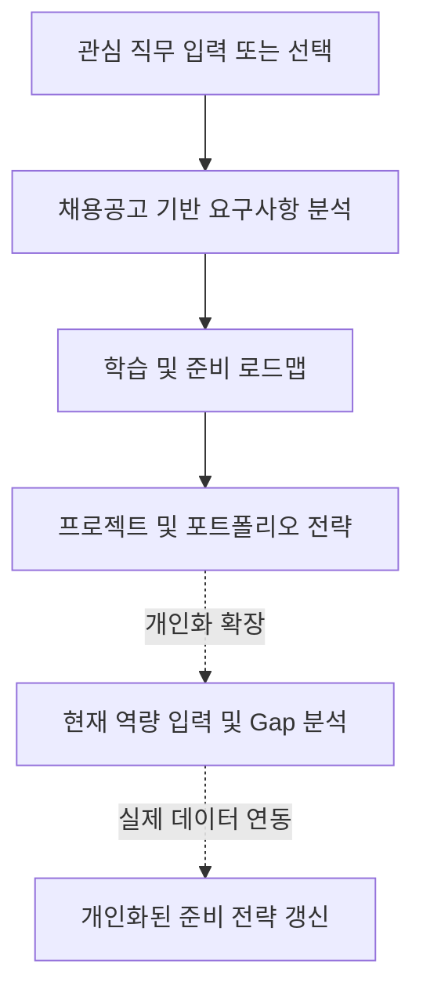

# CareerSignal 기획서

## 1. 프로젝트 개요

CareerSignal은 대학생이 관심 직무의 채용공고를 읽을 때, 무엇을 어느 수준까지 준비해야 하는지 판단하도록 돕는 진로탐색 리서치 에이전트입니다.

사용자는 관심 직무를 입력하고, 서비스는 채용공고에 반복되는 기술·경험·자격요건·우대사항을 분석합니다. 이때 기술 이름의 빈도만 보여 주는 것이 아니라, 기술이 함께 요구되는 구현 범위, 필수와 우대의 우선순위, 기업군별 강조점을 정리해 학습·프로젝트·지원 준비의 다음 행동으로 연결합니다.

초기 단계에서는 실제 채용공고 자동 수집보다 사용자 흐름과 정보 구조를 검증하고, 이후 React·Express 기반 제품으로 분석 기능을 구현합니다.

- [설계 문서](architecture.md)
- [디자인 컨셉](design-concept.md)
- [디자인 토큰](design-tokens.md)
- [개발 백로그](backlog.md)

## 2. 문제 발견

대학생은 진로를 준비할 때 실제 채용시장의 요구와 자신의 준비 방향 사이의 차이를 파악하기 어렵습니다. 채용공고는 많지만 공고마다 표현이 다르고 요구사항이 흩어져 있어 직접 비교하고 정리하는 데 시간이 많이 듭니다.

특히 다음 문제가 반복됩니다.

- 관심 직무에 필요한 기술과 경험을 한눈에 파악하기 어렵다.
- 기술 이름은 알아도 화면, 데이터 흐름, 실패 상태까지 어느 범위를 구현해야 하는지 판단하기 어렵다.
- 여러 공고에서 반복되는 필수 요구사항과 우대사항을 직접 구분해야 한다.
- 같은 프로젝트라도 기업군별로 무엇을 강조해야 하는지 알기 어렵다.
- 진로 탐색 결과가 정보 수집에서 끝나고 구체적인 학습·프로젝트·지원 행동으로 이어지기 어렵다.

## 3. 문제 정의

대학생은 관심 직무를 준비하고 싶지만, 채용공고에 담긴 요구사항을 구현 수준으로 구조화해 이해하기 어렵습니다. 그 결과 무엇을 먼저 학습하고, 어떤 프로젝트 경험을 보완하며, 지원할 때 무엇을 강조해야 하는지 구체적으로 결정하기 어렵습니다.

## 4. 타깃 사용자

### 4.1 주요 사용자

- 컴퓨터·소프트웨어 분야 취업을 준비하는 대학생
- 관심 직무는 있지만 무엇부터 준비해야 할지 막막한 학생
- 채용공고를 읽어 봤지만 요구 역량을 체계적으로 정리하기 어려운 학생
- 프로젝트나 포트폴리오 경험을 어떤 직무에 어떻게 연결할지 고민하는 학생

### 4.2 사용자 특성

- 직무명, 기술 스택, 우대사항 등의 용어는 알고 있지만 무엇이 중요한지 판단하기 어렵다.
- 채용공고의 요구사항을 이해하더라도 실제로 어느 수준까지 준비해야 하는지 알기 어렵다.
- 학습해야 할 내용은 많지만 무엇부터, 어느 정도 깊이까지 공부해야 하는지 결정하기 어렵다.
- 실제 기업의 요구사항을 기준으로 진로와 학습 방향을 설계하고 싶다.
- 단순한 직무 설명보다 채용공고를 기반으로 한 분석과 구체적인 실행 계획을 원한다.

## 5. 사용자 시나리오

### 5.1 관심 직무 요구사항과 구현 범위 파악

사용자는 관심 있는 직무를 입력합니다. 서비스는 여러 채용공고에서 반복되는 기술, 업무 경험, 자격요건, 우대사항을 종합해 보여 줍니다. 또한 기술이 어떤 화면·데이터 흐름·협업 방식과 함께 요구되는지 정리해 사용자가 준비해야 할 구현 범위를 이해하도록 돕습니다.

### 5.2 학습 및 준비 방향 설계

사용자는 요구사항 분석 결과를 확인한 뒤, 서비스가 제안하는 준비 방향을 참고합니다. 서비스는 필수 요구사항을 먼저 충족하고 우대사항으로 완성도를 높이는 순서, 권장 구현 수준, 추천 이유를 제시합니다. 사용자는 막연한 공부 목록이 아니라 우선순위가 있는 학습 로드맵을 얻습니다.

### 5.3 프로젝트 및 포트폴리오 전략 수립

사용자는 분석 결과와 학습 방향을 바탕으로 프로젝트와 포트폴리오 전략을 계획합니다. 서비스는 기업군별로 배포, 협업 기록, 성능·접근성 등 어떤 경험을 앞에 보여 줄지 제안합니다. 사용자는 프로젝트 주제만 고르는 것이 아니라 지원 직무에 맞춰 결과물과 소개 순서를 설계할 수 있습니다.

## 6. 핵심 기능

### 6.1 채용공고 기반 요구사항 분석

사용자가 관심 직무를 입력하거나 예시 직무를 선택하면, 서비스는 해당 직무의 채용공고를 분석한 요구사항 보고서를 제공합니다.

**포함 정보**

- 분석한 공고 수와 반복 등장 비율
- 자주 등장한 기술 스택과 주요 업무·경험
- 기술이 함께 등장하는 구현 범위 조합
- 필수 요구사항과 우대사항
- 기업군별 강조점과 프로젝트 확인 항목

### 6.2 학습 및 준비 로드맵

서비스는 요구사항 분석 결과를 바탕으로 사용자가 무엇을 먼저, 어느 정도 수준까지 준비해야 하는지 제안합니다.

**포함 정보**

- 우선 준비할 필수 요구사항
- 우대사항을 적용해 완성도를 높이는 순서
- 권장 구현 수준과 산출물
- 추천 학습 순서와 이유

### 6.3 프로젝트 및 포트폴리오 전략

서비스는 학습 로드맵을 프로젝트 결과물과 지원 메시지로 연결합니다.

**포함 정보**

- 요구사항과 연결되는 프로젝트 방향
- 배포 URL, README, GitHub 작업 기록 등 프로젝트 확인 항목
- 스타트업, B2B SaaS, 플랫폼·기술 기업별 강조 순서
- 지원 공고에 맞춘 포트폴리오 소개 방향

## 7. 프로토타입

1주차 프로토타입은 전체 서비스의 핵심 기능 중 요구사항 분석과 학습 로드맵의 정보 구조·화면 흐름을 검증하기 위한 **HTML/CSS 기반의 정적 프로토타입**입니다.

### 7.1 구현 범위

- 관심 직무 입력 영역과 예시 직무 버튼
- 분석 항목 미리보기와 분석 시작 CTA
- 요구사항 분석 보고서
  - 24건 mock 리서치 표기와 5개 지표 카드
  - 반복되는 구현 범위 조합과 기술 빈도
  - 필수 요구사항, 우대사항, 기업군별 강조점
- 4단계 학습 로드맵
  - 필수 흐름 완성, 데이터 흐름, 우대사항 적용, 기업군 맞춤 소개
- 고정 상단바, 오른쪽 글래스 목차, 반응형 본문 레이아웃

### 7.2 제외 범위

- 실제 입력값에 따른 동적 분석
- JavaScript 및 React 상태 관리
- mock data 조회와 rule 기반 분석 로직
- 실제 AI 분석과 실제 채용공고 수집
- 프로젝트·포트폴리오 전략의 동적 추천
- 사용자 역량 비교 및 Gap 분석
- 로그인과 사용자 정보 저장

예시 직무 버튼은 선택 상태를 보여 주는 정적 표현이며, 입력값이나 분석 결과를 바꾸지 않습니다. 보고서 데이터는 최근 3개월의 주니어 프론트엔드 공고 24건을 가정한 mock 리서치입니다.

## 8. MVP 및 확장 계획

프로토타입을 통해 핵심 사용자 흐름과 정보 구조를 검증한 뒤, 요구사항 분석과 학습 로드맵 생성 기능을 실제로 구현합니다.

### 8.1 프로토타입 — 핵심 사용자 경험 검증 완료

사용자가 관심 직무를 선택하고 요구사항 분석 보고서와 학습 로드맵을 확인하는 정적 화면을 구현했습니다. 이를 통해 사용자가 어떤 정보를 먼저 확인해야 하는지, 분석 결과와 다음 행동을 어떤 순서로 보여줄지 검증합니다.

### 8.2 MVP — 핵심 기능 구현

정적 프로토타입에서 검증한 사용자 흐름을 React와 Express 기반의 실제 서비스로 구현합니다.

**주요 개발 범위**

- 관심 직무 입력 및 선택 상태 관리
- 샘플 채용공고 데이터 관리와 직무별 조회
- 기술, 필수·우대사항, 기업군별 강조점 분석
- 구현 범위 조합과 준비 우선순위 생성
- 요구사항 분석 보고서와 학습 로드맵 렌더링
- 로딩, 오류, 빈 결과 상태 처리

### 8.3 프로젝트 및 포트폴리오 전략 확장

MVP 이후에는 요구사항 분석과 학습 로드맵을 바탕으로 사용자가 학습한 역량을 프로젝트와 포트폴리오로 연결하도록 확장합니다.

**주요 개발 범위**

- 요구사항 기반 프로젝트 방향 제안
- 프로젝트별 목표 역량과 권장 구현 범위 제시
- 배포 URL, README, GitHub 기록 등 결과물 구성 안내
- 기업군별 포트폴리오 강조 순서 제안

### 8.4 개인화 기능 확장

사용자의 현재 역량과 경험을 입력받아 채용공고의 요구사항과 비교하고, 사용자별 준비 상태에 맞는 진로 준비 전략을 제공합니다.

**주요 개발 범위**

- 보유 기술, 프로젝트, 학습 경험 입력
- 요구사항과 현재 역량 비교
- 부족한 역량에 대한 Gap 분석
- 사용자별 학습 우선순위와 로드맵 조정

### 8.5 실제 데이터 연동 및 서비스 고도화

샘플 공고 데이터를 기반으로 만든 분석 구조를 실제 채용공고 데이터와 연결하고, 지속적으로 사용할 수 있는 서비스로 발전시킵니다.

**주요 개발 범위**

- 실제 채용공고 데이터 수집과 갱신
- 다양한 채용공고 출처 연동
- LLM 기반 요구사항 추출과 해설 생성
- 사용자 계정, 분석 결과, 학습 로드맵 저장
- 여러 직무 비교와 사용자 진행 상황에 따른 추천 갱신

## 9. 화면 목록(IA)

### 9.1 직무 선택 화면

사용자가 관심 직무를 직접 입력하거나 예시 직무를 선택하고 분석을 시작하는 화면입니다.

**포함 요소**

- 직무명 입력창
- 예시 직무 선택 버튼
- 분석 범위 미리보기
- 분석 시작 버튼

### 9.2 요구사항 분석 보고서 화면

채용공고 분석 결과를 바탕으로 해당 직무에서 중요하게 요구되는 준비 기준을 보여주는 화면입니다.

**포함 요소**

- 분석한 공고 수와 핵심 지표
- 구현 범위 조합과 기술 빈도
- 필수 요구사항과 우대사항
- 학력·경력 조건과 기업군별 강조점
- 공고 문장 확인 항목

### 9.3 학습 로드맵 화면

요구사항 분석 결과를 바탕으로 사용자가 무엇을 어떤 순서와 수준으로 준비하면 좋을지 제안하는 화면입니다.

**포함 요소**

- 단계별 준비 목표와 기간
- 권장 구현 범위와 결과물
- 우선순위와 추천 이유
- 기업군에 맞춘 프로젝트 소개 방향

### 9.4 프로젝트 및 포트폴리오 전략 화면

요구사항과 학습 로드맵을 바탕으로 프로젝트 방향과 포트폴리오 구성 방식을 제안하는 화면입니다.

이 화면은 후속 확장 범위이며 현재 정적 프로토타입에는 구현하지 않습니다.

### 9.5 개인화 분석 화면

사용자의 현재 역량과 채용공고의 요구 역량을 비교하여 부족한 역량과 우선 학습 방향을 보여주는 화면입니다.

이 화면은 후속 확장 범위이며 현재 정적 프로토타입에는 구현하지 않습니다.

## 10. 화면 흐름(User Flow)

현재 정적 프로토타입은 `관심 직무 선택 → 요구사항 분석 보고서 → 학습 로드맵`의 앞선 세 화면을 시연합니다.

## 11. 와이어프레임(Figma)

- 와이어프레임 링크: 작성 예정

## 12. 프로토타입 링크

- [Vercel 프로토타입 배포 링크](https://careersignal-prototype.vercel.app/)
- [로컬 HTML 프로토타입 확인](../prototype/index.html)
