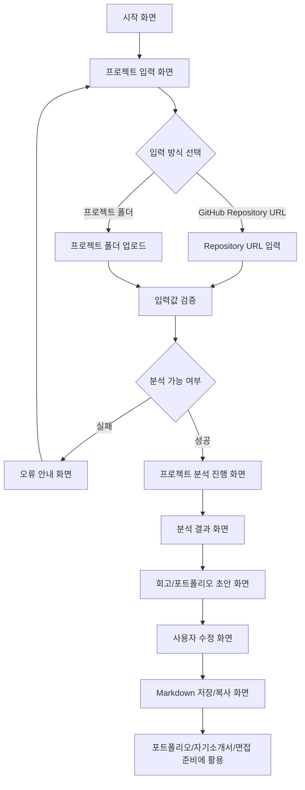

# PtoP 기획서

## 문제 정의

프로젝트 경험을 쌓는 대학생 개발자는 프로젝트가 끝난 뒤 시간이 지나면 자신이 맡은 역할, 핵심 구현 내용, 문제 해결 과정을 정확히 기억하고 정리하기 어렵다.

## 서비스 목표

PtoP(Project to Portfolio)는 GitHub Repository나 프로젝트 폴더를 바탕으로 프로젝트 경험을 빠르게 복기하고, 포트폴리오와 회고에 바로 활용할 수 있는 초안을 만드는 AI Agent 서비스다.

이번 단계에서는 기능을 많이 늘리기보다 다음 두 가지 핵심 흐름을 탄탄하게 잡는다.

- 프로젝트를 분석해 무엇을 만들었는지 정리한다.
- 분석 결과를 바탕으로 내가 설명할 수 있는 회고/포트폴리오 초안을 만든다.

## 사용자 시나리오

1. 사용자는 프로젝트가 끝난 뒤 포트폴리오에 정리할 내용이 필요하다고 느낀다.
2. 사용자는 PtoP에서 GitHub Repository URL 또는 프로젝트 폴더를 입력한다.
3. PtoP는 README, 폴더 구조, 설정 파일, 주요 코드 파일을 분석한다.
4. 사용자는 분석된 프로젝트 목적, 기술 스택, 핵심 기능, 역할 후보를 확인한다.
5. PtoP는 분석 결과를 바탕으로 회고/포트폴리오 초안을 생성한다.
6. 사용자는 초안에서 맞지 않는 표현을 수정하고 자신의 경험에 맞게 다듬는다.
7. 사용자는 최종 결과를 Markdown으로 복사해 포트폴리오, 자기소개서, 면접 준비에 활용한다.

## 핵심 기능 2개

### 1. 프로젝트 분석 기능

GitHub Repository 또는 프로젝트 폴더를 바탕으로 프로젝트의 핵심 정보를 정리한다.

분석 대상:

- README: 프로젝트 목적, 실행 방법, 주요 기능
- 폴더 구조: 프론트엔드, 백엔드, 설정, 문서 영역
- 설정 파일: 사용 기술, 프레임워크, 라이브러리
- 주요 코드 파일: 핵심 화면, 상태 관리, API 흐름, 주요 로직
- commit log: 작업 흐름과 기여 내용 후보

사용자에게 보여줄 결과:

- 프로젝트 한 줄 설명
- 사용 기술 스택
- 핵심 기능 요약
- 사용자가 확인해야 할 역할/기여 후보
- 분석 근거가 된 파일 또는 정보

선정 이유:

- Repository 분석이 되어야 회고와 포트폴리오 초안을 만들 수 있다.
- 사용자가 직접 코드와 README를 다시 뒤지는 시간을 줄여준다.
- 문제 정의에서 말한 "프로젝트 경험을 다시 기억하고 정리하기 어려움"을 해결하는 출발점이다.

### 2. 회고/포트폴리오 초안 생성 기능

분석 결과를 바탕으로 포트폴리오에 활용할 수 있는 문장 형태의 초안을 만든다.

생성 항목:

- 내가 한 일
- 어려웠던 점
- 해결 과정
- 배운 점
- 포트폴리오용 한 줄 설명
- Markdown 결과

사용자 확인이 필요한 항목:

- 실제 본인이 맡은 역할인지
- AI가 추론한 기여도가 과장되지 않았는지
- 문제 해결 과정이 실제 경험과 맞는지
- 자기소개서나 면접에서 설명 가능한 표현인지

선정 이유:

- 사용자가 최종적으로 필요한 것은 단순한 코드 요약이 아니라 포트폴리오에 쓸 수 있는 경험 정리다.
- 프로젝트 경험을 자기소개서나 면접에서 설명할 수 있는 형태로 바꿔준다.
- PtoP의 핵심 가치인 Project to Portfolio를 가장 직접적으로 보여준다.

## 화면 구조

| 화면 | 주요 UI | 사용자 동작 | 다음 흐름 |
| --- | --- | --- | --- |
| 시작 화면 | 서비스 한 줄 소개, 핵심 문제, 시작 버튼 | 서비스 목적을 이해하고 시작한다. | 프로젝트 입력 화면 |
| 프로젝트 입력 화면 | Repository URL 입력창, 폴더 업로드 영역, 분석 시작 버튼 | GitHub URL 또는 프로젝트 폴더를 입력한다. | 입력값 검증 |
| 입력값 검증 화면 | 입력값 상태, 오류 메시지 | 잘못된 입력이면 다시 수정한다. | 분석 진행 또는 오류 안내 |
| 분석 진행 화면 | 단계별 분석 상태, 분석 대상 목록 | README, 설정 파일, 코드 분석 과정을 확인한다. | 분석 결과 화면 |
| 분석 결과 화면 | 프로젝트 목적, 기술 스택, 핵심 기능, 역할 후보 | 분석 결과를 확인하고 틀린 부분을 표시한다. | 회고/포트폴리오 초안 화면 |
| 회고/포트폴리오 초안 화면 | 내가 한 일, 어려웠던 점, 해결 과정, 배운 점 | 초안을 읽고 자신의 표현으로 수정한다. | Markdown 저장/복사 화면 |
| Markdown 저장/복사 화면 | Markdown 미리보기, 복사 버튼 | 결과를 복사해 포트폴리오나 회고 문서에 붙여 넣는다. | 외부 문서 활용 |

## 화면 흐름



## 화면 단위 와이어프레임

```text
[시작 화면]
┌────────────────────────────┐
│ PtoP                       │
│ Project to Portfolio       │
│ 프로젝트 경험을 잊기 전에 정리 │
│ [프로젝트 분석 시작]          │
└────────────────────────────┘

[프로젝트 입력 화면]
┌────────────────────────────┐
│ GitHub Repository URL       │
│ [https://github.com/...]    │
│ 또는 프로젝트 폴더 업로드       │
│ [분석 시작]                  │
└────────────────────────────┘

[분석 결과 화면]
┌────────────────────────────┐
│ 프로젝트 목적                │
│ 기술 스택                    │
│ 핵심 기능                    │
│ 역할/기여 후보               │
└────────────────────────────┘

[회고/포트폴리오 초안 화면]
┌────────────────────────────┐
│ 내가 한 일                   │
│ 어려웠던 점                  │
│ 해결 과정                    │
│ 배운 점                      │
│ [Markdown 복사]              │
└────────────────────────────┘
```

## 프로토타입

Repository 분석 기능의 일부를 흉내낸 HTML/CSS와 Vanilla JavaScript 기반 프로토타입을 별도로 제공한다.

- 경로: [prototype/index.html](../prototype/index.html)
- 목적: 사용자가 Repository URL을 입력한 뒤 참여자, 기여도, 본인 작업 내용을 확인하는 흐름을 검증한다.
- 범위: Repository 입력, 분석 진행, 참여자별 기여도, 내 주요 작업 메시지, 복사용 요약을 한 페이지에 정리한다.
- 동작: 공개 GitHub API에서 contributors와 최근 commits 정보를 가져온다.
- 제한: API 요청 실패 시 임의 데이터를 생성하지 않고 오류 상태를 보여준다.

## 피드백 반영 계획

동료 피드백은 다음 기준으로 기획서에 반영한다.

- 사용자가 문제를 바로 이해하는가?
- 핵심 기능 2개가 문제 정의와 직접 연결되는가?
- 화면 흐름에서 빠진 단계가 없는가?
- 분석 결과와 회고 초안이 사용자가 실제로 수정할 수 있는 형태인가?
- 프로토타입을 보고 서비스 동작을 설명할 수 있는가?

## 확장 후보

핵심 기능이 안정된 이후 다음 기능을 검토한다.

- PR/Issue 기반 협업 경험 분석
- 커밋 기여도 시각화
- README 개선 제안
- 면접 답변 변환
- Notion 또는 GitHub Pages 내보내기

## 관련 문서

- [GitHub Wiki](https://github.com/SubJeeLee/hub/wiki)
- [1주차 작업 체크리스트](./checklist.md)
- [Git Repository 분석 학습 노트](./repo-analysis-study.md)
- [PtoP 테스트 케이스](./test-cases.md)
- [기획하기 with AI 가이드](./planning-tip.md)
