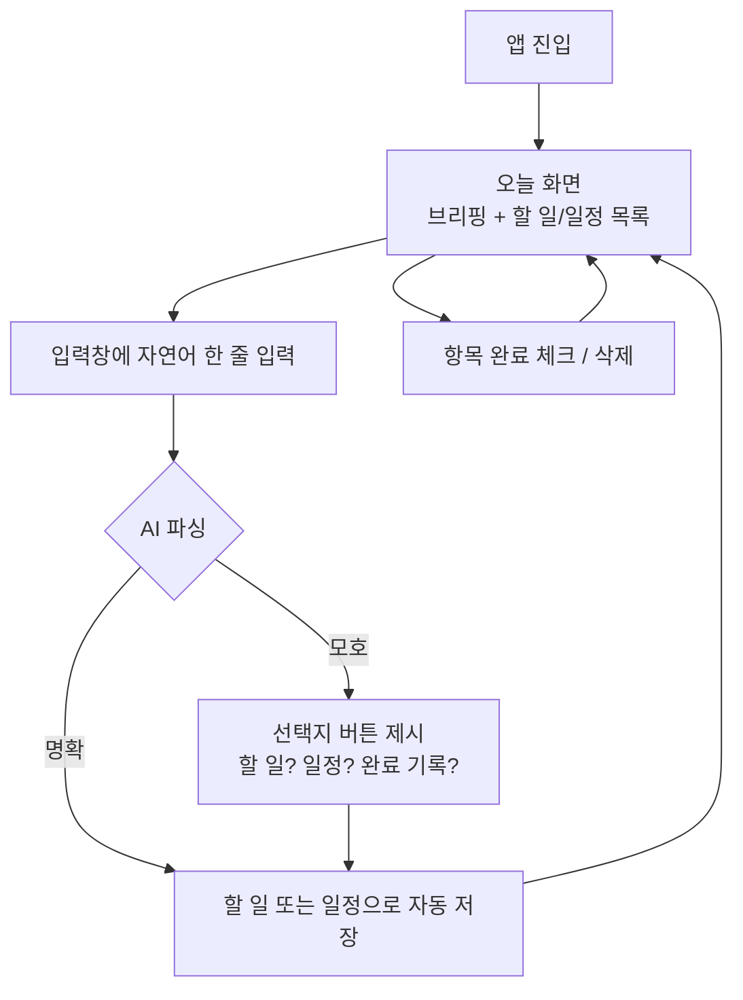

# Briefy — 자연어 라이프 매니저

> 말하듯 한 줄 적으면 정리되고, 아침이면 브리핑되는 나의 하루 관리 서비스

## 문제 정의

**관리할 게 많은 대학생이, 할 일·일정·루틴을 앱 3~4개에 나눠 기록하다가, 입력이 귀찮아 결국 아무것도 기록하지 않게 된다.**

- 근거(본인 경험): 자격증 실기 준비 + 팀플 + 운동 루틴 + 식단을 동시에 관리하며 리마인더·캘린더·운동 앱을 오가며 번거로움을 느낌
- 불편의 핵심: ① 폼 입력의 귀찮음(날짜 선택, 시간 설정, 반복 여부...) ② 앱마다 흩어져 오늘 할 일이 한눈에 안 보임

## 사용자 시나리오

1. 아침에 Briefy를 열면 오늘의 브리핑이 보인다 — "오늘 마감 2개, 치과 오후 3시"
2. 등굣길에 생각난 일을 입력창에 한 줄로 적는다 — "금요일까지 팀플 자료 만들기"
3. AI가 문장을 해석해 마감일 있는 할 일로 자동 저장한다 (폼 입력 없음)
4. "다음주 화요일 오후 치과, 전날 알려줘"라고 적으면 일정과 리마인더가 동시에 생성된다
5. "운동"처럼 애매하게 적으면 선택지 버튼("할 일 추가 / 완료 기록")이 떠서 탭 한 번으로 확정한다
6. 다음 날 아침, 새로 쌓인 항목까지 반영된 브리핑으로 하루를 시작한다

## 핵심 기능

### 기능 A. 자연어 입력 → 자동 분류·저장
- 입력창에 자연어로 입력하면 AI가 의도(할 일/일정)와 속성(제목, 마감일, 시간, 리마인더)을 JSON으로 파싱해 저장
- 상대 날짜("내일", "담주 금") 자동 변환
- 모호한 입력은 선택지를 제시하며 되묻기

**고른 이유**: 이 기능이 없으면 평범한 투두 앱이 된다(필수성). "입력이 귀찮다"는 문제를 정면으로 해결한다(적합성).

### 기능 B. 오늘 브리핑
- 저장된 할 일·일정을 종합해 오늘 화면 하나로 보여주고, AI가 한 문단 브리핑을 생성
- "오늘 마감 2개, 오후 3시 치과" — 조회가 아니라 요약

**고른 이유**: 저장만 하고 안 보면 기록은 무의미하다(필수성). "앱이 흩어져 한눈에 안 보인다"는 문제를 해결한다(적합성).

## 화면 흐름

**화면 목록 (IA)**
1. 오늘 화면 — 브리핑 문단 + 오늘의 할 일/일정 목록 + 입력창 (메인, 사실상 유일한 화면)
2. 되묻기 UI — 모호 입력 시 오늘 화면 위에 선택지 버튼으로 표시 (별도 화면 아님)

## 확장 계획 (이번 범위 제외)

- 음성 입력 (Web Speech API — 파서는 동일하므로 입력 채널만 추가)
- 운동/영어 루틴 (주간 반복, 스트릭)
- 주간 리포트 (달성률 + 패턴 발견)
- 식단 기록, 푸시 알림, 구글 캘린더 연동