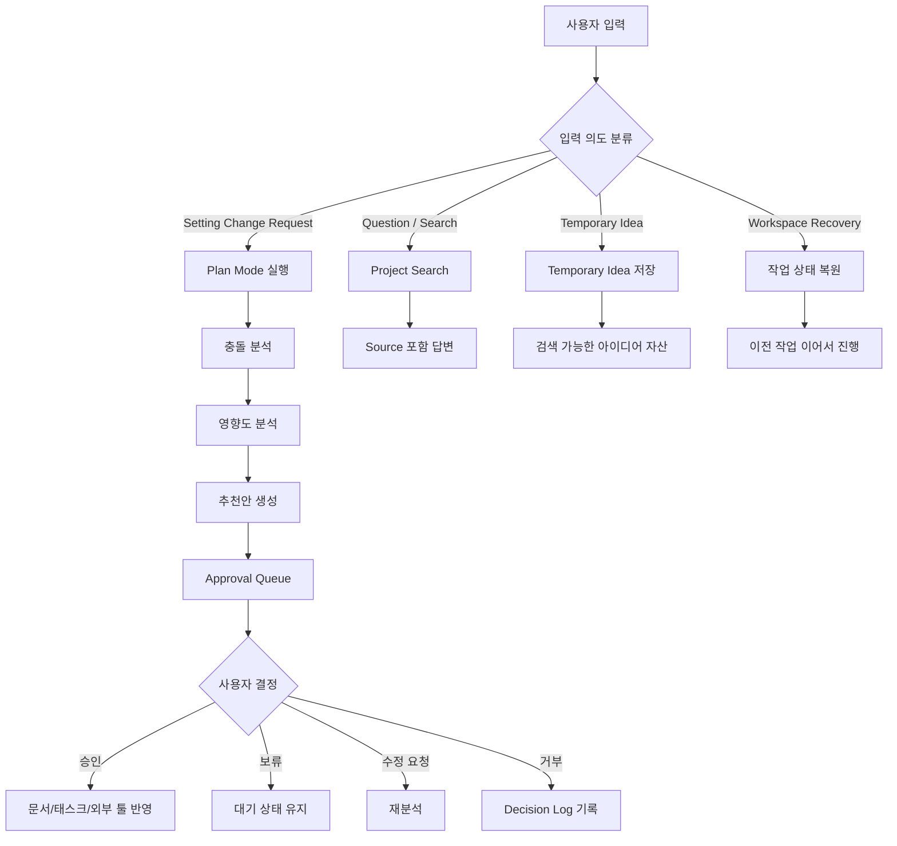
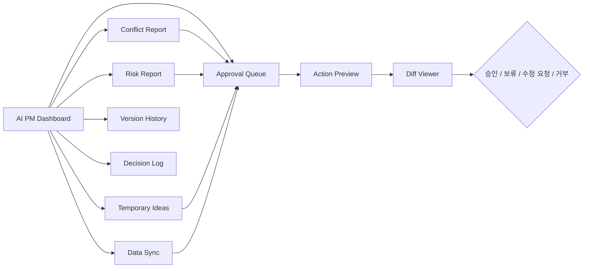
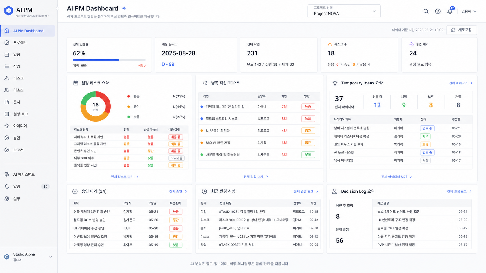
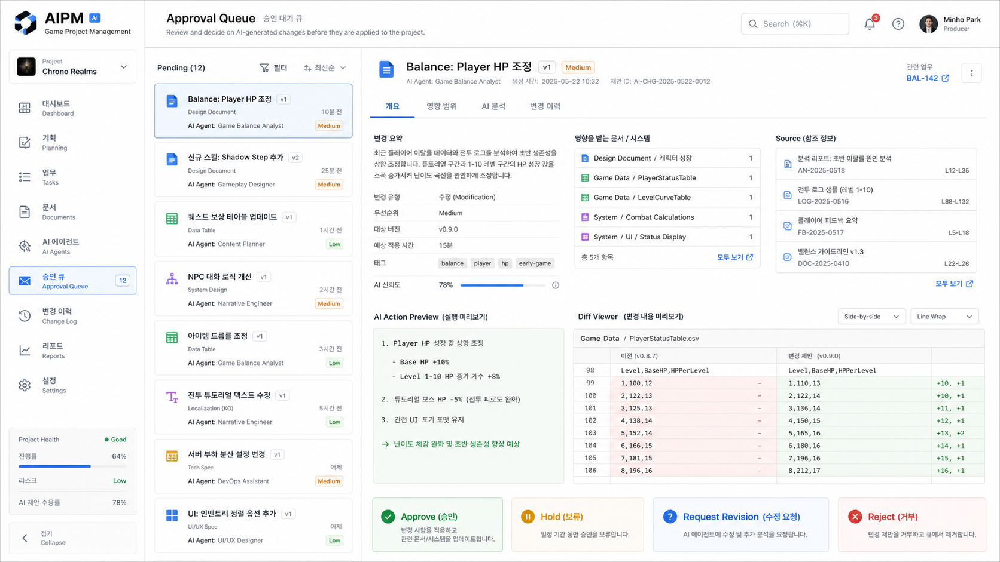
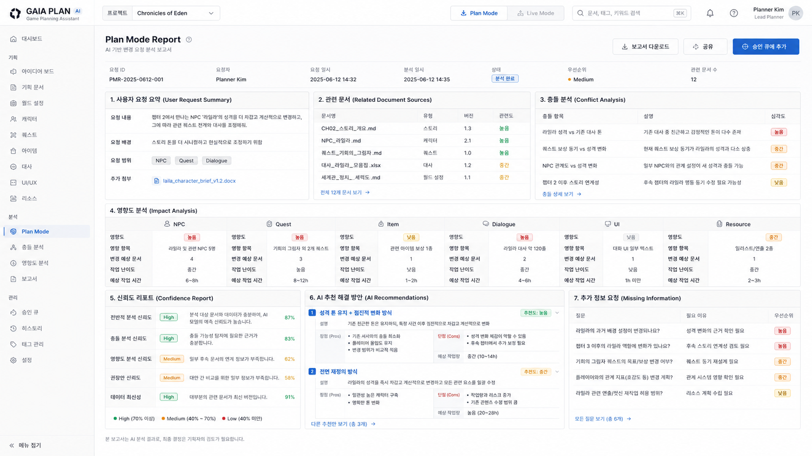
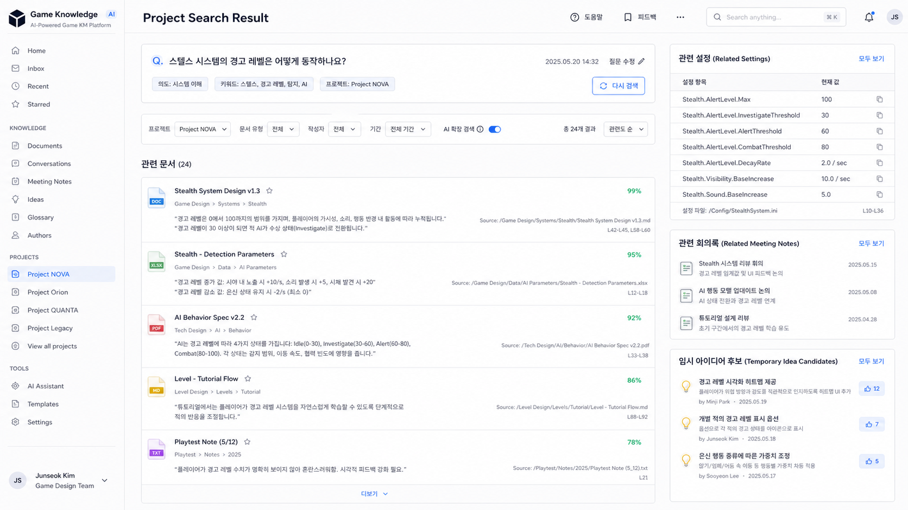

# AI Game Project Operating System 기획서

## 1. 문제 정의

게임 개발 프로젝트에서는 기획 문서, 회의록, 아이디어, 설정 변경, 일정, 개발 데이터가 지속적으로 생성되고 수정된다.

현재 문제는 다음과 같다.

- 프로젝트 정보가 문서, 메신저, 회의록, GitHub, Notion 등에 흩어진다.
- 확정되지 않은 아이디어와 실제 반영된 설정이 섞이기 쉽다.
- 설정 변경이 발생했을 때 기존 문서, NPC, Quest, Item, Dialogue, UI, Resource에 미치는 영향을 추적하기 어렵다.
- 회의록과 시나리오에서 필요한 리소스와 태스크를 반복적으로 수동 정리해야 한다.
- 일정 지연, 병목, 승인 대기 항목을 한 화면에서 파악하기 어렵다.
- AI가 바로 문서를 수정하면 의도하지 않은 변경이 발생할 수 있다.

따라서 이 플랫폼은 AI가 프로젝트 전체를 이해하고 분석하되, 모든 실제 변경은 사용자의 승인 이후에만 반영되는 **AI Project Partner**를 목표로 한다.

## 2. 목표 사용자

### 기획자

- 아이디어, 세계관, 시스템, NPC, Quest, Item, UI, 밸런스 문서를 관리한다.
- 설정 변경 요청 전 기존 문서와의 충돌 여부를 확인한다.
- 부족한 기획 정보를 AI 질문을 통해 보완한다.

### PM / 팀장

- 승인 대기 변경안, 일정 리스크, 병목, 진행률, 최근 변경 사항을 확인한다.
- AI가 생성한 문서 변경안, 태스크 후보, 외부 도구 반영안을 승인하거나 보류한다.
- Decision Log와 Version History를 통해 의사결정 근거를 추적한다.

### 개발자

- 승인된 기획 변경, 리소스 명세, 버그 리포트, 데이터 동기화 요청을 전달받는다.
- GitHub, Unity, Notion과 연결된 확정 작업만 처리한다.

### AI Agent

- 입력 의도를 분류한다.
- 프로젝트 문서를 검색하고 Source와 함께 답변한다.
- 충돌 분석, 영향도 분석, 추천안 생성, 리소스 추출, 태스크 후보 생성을 수행한다.
- 변경안은 Approval Queue에 등록하고 직접 실행하지 않는다.

## 3. 사용자 시나리오

### 시나리오 1: 확정되지 않은 아이디어 저장

1. 사용자가 채팅으로 신규 아이디어를 입력한다.
2. AI는 명시적인 반영 요청이 없다고 판단한다.
3. 입력은 Temporary Idea로 저장된다.
4. 실제 프로젝트 문서는 수정되지 않는다.
5. 이후 사용자는 저장된 아이디어를 검색하거나 설정 변경 후보로 전환할 수 있다.

### 시나리오 2: 설정 변경 요청 분석

1. 사용자가 기존 설정을 변경해달라고 요청한다.
2. AI는 Setting Change Request로 분류하고 Plan Mode를 실행한다.
3. 관련 문서를 검색한다.
4. 충돌 분석과 영향도 분석을 수행한다.
5. Confidence Report와 복수 추천안을 생성한다.
6. 변경안은 Approval Queue에 등록된다.
7. 사용자가 승인한 경우에만 문서 또는 외부 도구 반영 작업이 실행된다.

### 시나리오 3: 프로젝트 질문 검색

1. 사용자가 프로젝트 설정에 대해 질문한다.
2. AI는 Question / Search로 분류한다.
3. 현재 프로젝트의 문서만 검색한다.
4. 관련 문서, 실제 내용, 관련 설정, 회의록, Source를 함께 제공한다.

### 시나리오 4: 회의록 기반 리소스와 태스크 생성

1. 사용자가 회의록 또는 시나리오를 업로드한다.
2. AI는 NPC, Dialogue, Item, Quest, UI, Effect, Sound, Cutscene 후보를 추출한다.
3. 추출된 항목을 기획, 프로그래밍, 아트, 사운드, QA 태스크 후보로 변환한다.
4. 태스크 후보는 Approval Queue로 전달된다.
5. 승인된 항목만 실제 태스크로 생성된다.

### 시나리오 5: 일정 리스크와 리마인더

1. AI가 일정 데이터와 작업 상태를 분석한다.
2. 일정 지연, 병목, 리스크 후보를 감지한다.
3. PM Dashboard에 리스크 리포트를 표시한다.
4. 필요한 경우 Friendly Reminder 초안을 생성한다.
5. 리마인더는 사용자 승인 후에만 Slack, Discord 등으로 발송된다.

### 시나리오 6: Unity 버그 리포트

1. Unity 플레이 테스트 중 사용자가 AI 제보 버튼을 누른다.
2. Console Log, Inspector, Screenshot 정보가 수집된다.
3. AI가 버그 리포트를 생성한다.
4. GitHub Issue와 Notion Bug DB 등록안이 Approval Queue에 등록된다.
5. 승인된 등록안만 외부 도구에 반영된다.

### 시나리오 7: 작업 복구

1. 프로그램이 종료되거나 대화가 중단된다.
2. 다음 실행 시 Workspace Recovery가 실행된다.
3. 진행 중 작업, 승인 대기, Temporary Idea, Plan Mode, 최근 대화를 복원한다.
4. 사용자는 이전 작업 단위에서 이어서 진행한다.

## 4. 핵심 기능

### 4.1 Intelligent Knowledge Management

목적: 프로젝트의 모든 입력과 지식을 안전하게 분류, 저장, 검색한다.

- 사용자 입력: Chat, Markdown, PDF, DOCX, TXT, 기존 기획서, 회의록, 아이디어 메모, GitHub, Notion
- AI 처리: 입력 의도 분류, Temporary Idea 저장, Source 기반 검색
- 산출물: Temporary Idea, 검색 결과, Version History, Decision Log
- 승인 필요 여부: 실제 문서 반영 시 승인 필요
- 관련 화면: Project Search Result, Temporary Idea 목록, Version History, Decision Log

### 4.2 AI Planning Assistant

목적: 설정 변경이나 신규 기획 요청을 바로 반영하지 않고 분석과 추천을 먼저 제공한다.

- 사용자 입력: 설정 변경 요청, 신규 기획 요청, 문서 작성 요청
- AI 처리: Plan Mode, 충돌 분석, 영향도 분석, Confidence Report, 추천안 생성, 질문 생성
- 산출물: Plan Mode Report, 승인 대기 변경안, 문서 초안
- 승인 필요 여부: 문서 생성/수정 전 승인 필요
- 관련 화면: Plan Mode Report, Approval Queue, Diff Viewer

### 4.3 Resource Management

목적: 회의록과 시나리오에서 필요한 리소스와 태스크 후보를 자동으로 추출한다.

- 사용자 입력: 회의록, 시나리오, 신규 기획 문서
- AI 처리: NPC, Dialogue, Item, Quest, UI, Effect, Sound, Cutscene 추출
- 산출물: 리소스 후보, 태스크 후보
- 승인 필요 여부: 실제 Task 생성 전 승인 필요
- 관련 화면: Resource Extraction Panel, Approval Queue

### 4.4 Project Management

목적: 프로젝트 진행 상황, 일정 리스크, 병목, 작업 복구를 관리한다.

- 사용자 입력: 일정 데이터, 작업 상태, GitHub 활동, Notion 태스크
- AI 처리: 일정 지연 분석, 병목 탐지, 리마인더 초안 생성, Workspace Recovery
- 산출물: Risk Report, Friendly Reminder, Task Workspace
- 승인 필요 여부: 외부 메시지 발송 전 승인 필요
- 관련 화면: AI PM Dashboard, Risk Report, Workspace

### 4.5 Approval System

목적: AI가 생성한 모든 변경안을 사용자가 검토하고 결정하게 한다.

- 사용자 입력: 승인, 보류, 수정 요청, 거부
- AI 처리: Action Preview 생성, Diff Viewer 연결, Decision Log 기록
- 산출물: 승인 이력, 실행 큐, 보류/거부 기록
- 승인 필요 여부: 핵심 기능 자체가 승인 시스템
- 관련 화면: Approval Queue, AI Action Preview, Diff Viewer

### 4.6 Automation

목적: 승인된 변경 사항을 내부 문서, Notion, GitHub, Unity에 반영한다.

- 사용자 입력: 승인된 변경안, Unity 버그 제보, 데이터 동기화 요청
- AI 처리: Live Data Sync 변경안 생성, 버그 리포트 정리, 외부 도구 등록안 생성
- 산출물: 동기화 요청, GitHub Issue 등록안, Notion 업데이트 요청, Unity 데이터 변경안
- 승인 필요 여부: 모든 외부 반영 전 승인 필요
- 관련 화면: Data Sync, Unity Bug Report, Approval Queue

### 4.7 Multi Project Support

목적: 여러 프로젝트의 문서, 설정, 아이디어, Decision Log, Version History를 독립적으로 관리한다.

- 사용자 입력: 프로젝트 생성, 프로젝트 선택, RuleSet 설정
- AI 처리: Project_ID 기반 라우팅, 프로젝트별 검색 제한, RuleSet 적용
- 산출물: 독립 프로젝트 Workspace, 프로젝트별 분석 결과
- 승인 필요 여부: 프로젝트 설정 변경 시 승인 필요
- 관련 화면: Project Selector, RuleSet Settings, Project Workspace

### 4.8 Dashboard

목적: 프로젝트 전체 상태와 AI 분석 결과를 한 화면에서 관리한다.

- 사용자 입력: 프로젝트 선택, 리포트 필터, 승인 액션
- AI 처리: 진행률, 리스크, 승인 대기, 최근 변경, Decision Log, Data Sync 상태 집계
- 산출물: AI PM Dashboard, AI Control Tower
- 승인 필요 여부: Dashboard의 승인 액션에서 처리
- 관련 화면: AI PM Dashboard, Approval Queue, Conflict Report, Risk Report, Version History

## 5. 화면 흐름

### 5.1 전체 사용자 흐름

### 5.2 AI Control Tower 흐름

## 6. 예시 UI

아래 이미지는 실제 구현 화면이 아니라 기획 방향을 보여주는 UI mockup이다.

### 6.1 AI PM Dashboard

프로젝트 진행률, 일정 리스크, 병목, 승인 대기, Temporary Idea, 최근 변경, Decision Log를 한 화면에서 확인한다.

### 6.2 Approval Queue

AI가 생성한 변경안을 검토하고, Action Preview와 Diff Viewer를 확인한 뒤 승인, 보류, 수정 요청, 거부를 결정한다.

### 6.3 Plan Mode Report

설정 변경 요청에 대한 관련 문서, 충돌 분석, 영향도 분석, Confidence Report, 추천안, 추가 질문을 확인한다.

### 6.4 Project Search Result

프로젝트 질문에 대해 관련 문서, 실제 내용, Source, 관련 설정, 회의록, Temporary Idea 후보를 함께 확인한다.

## 7. MVP 범위

MVP는 모든 자동화를 완성하기보다, 승인 기반 AI Project Partner의 핵심 흐름을 검증하는 데 집중한다.

### 포함 범위

- 단일 프로젝트 기준 지식 입력과 검색
- Temporary Idea 저장
- Input Intent Classification 기본 규칙
- Plan Mode Report 생성
- Conflict Analysis와 Impact Analysis 기본 리포트
- Approval Queue
- AI PM Dashboard 초안
- Decision Log와 Version History 기본 기록

### 제외 또는 후순위 범위

- Google Docs, Slack, Discord, STT 회의록 직접 연동
- 완전 자동 Live Data Sync
- Unity In-Editor Bug Report 실제 플러그인
- 다중 프로젝트 운영 자동화
- 고급 RuleSet 편집 UI

## 8. 완료 기준

- README의 8개 Core Features가 기획서에 모두 반영되어 있다.
- 모든 실제 변경은 Approval Queue를 거친다는 원칙이 명시되어 있다.
- Temporary Idea는 실제 문서를 수정하지 않는다는 원칙이 명시되어 있다.
- Project Search는 Source를 함께 제공하는 흐름으로 정의되어 있다.
- Plan Mode는 충돌 분석, 영향도 분석, 추천안, Confidence Report를 포함한다.
- 화면 흐름은 Mermaid 다이어그램으로 표현되어 있다.
- 예시 UI 이미지는 `docs/assets/`에 저장되어 있고 본 문서에서 참조된다.
