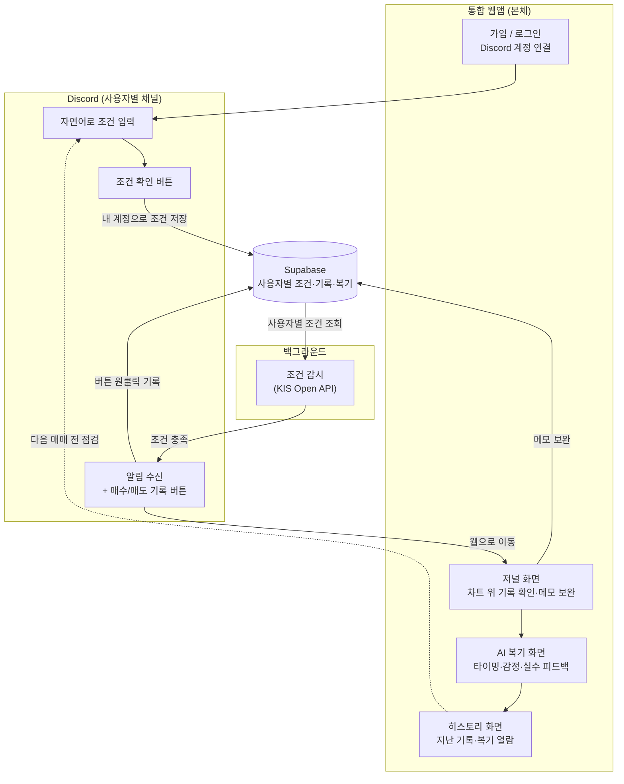

# Beacon 기획서

> 말을 걸면 지켜보고, 되돌아보게 하는 AI 투자 코치

기존 두 프로젝트를 하나의 서비스로 결합한다.

- [KIS_openapi](https://github.com/gyuwonlee1/KIS_openapi) — 자연어로 조건을 걸면 KIS Open API로 시장을 감시해 Discord로 알려주는 알림 봇 (감시하는 눈)
- [investment_journal](https://github.com/gyuwonlee1/investment_journal) — 매매 기록을 차트 위에 남기고 AI가 리스크를 복기해 주는 저널 (복기하는 코치)

## 서비스 형태

**웹 중심 + Discord 입출력 채널, Supabase 기반 다중 사용자.** 두 서비스를 병렬로 두지 않고 하나의 통합 웹앱으로 합친다.

- **통합 웹앱 (본체)**: 저널 차트, 매매 기록, AI 복기, 조건 관리 화면. 두 레포의 Next.js 코드를 하나로 통합
- **Discord (채널)**: 자연어 조건 입력과 알림 수신을 담당. 알림 메시지에 **매수/매도 기록 버튼**을 달아 원클릭으로 저널에 기록되게 한다 (가격·시각은 자동 저장, 메모는 웹에서 보완)
- **백그라운드 감시**: KIS Open API 조건 감시는 스케줄러(GitHub Actions)가 담당
- **Supabase (공유 데이터 계층)**: 조건·매매 기록·복기 결과를 모두 Supabase에 사용자별로 저장한다. Discord에서 건 조건과 웹에서 남긴 저널이 같은 계정 아래 연결되는 단일 저장소

### 다중 사용자 구조

- **계정**: Supabase Auth로 가입/로그인. 모든 테이블에 Row Level Security 적용
- **Discord 연결**: 웹에서 사용자별로 자신의 Discord 계정을 연결(계정 연동 + 알림 채널 등록). 조건 입력과 알림이 각자의 Discord에서 이뤄진다
- **데이터 공유**: Discord로 건 조건 → Supabase에 내 계정으로 저장 → 감시 봇이 사용자별 조건을 읽어 각자의 Discord로 알림 → 알림 버튼으로 남긴 매매 기록·AI 복기도 같은 계정에 쌓인다. 기존 `portfolio.json` 단일 파일 방식은 Supabase DB로 대체

### 구현 단계

기능 욕심을 줄이기 위해 구현은 두 단계로 나눈다. 기획은 다중 사용자 구조를 전제로 하되, 1단계에서 전체 루프를 먼저 완성한다.

- **1단계 (MVP · 1인용)**: 통합 웹앱 + 자연어 조건 알림 + 원클릭 기록 + AI 복기. 내 계정 하나 기준으로 감시 → 기록 → 복기 루프를 끝까지 돌린다. 조건 저장소는 처음부터 Supabase를 사용해 2단계 전환 비용을 줄인다
- **2단계 (다중 사용자)**: Supabase Auth·RLS 적용, 사용자별 Discord 연결과 알림 발송으로 확장

## 문제 정의

**개인 투자자가 장중에 시세를 계속 지켜볼 수 없어 매매 타이밍을 놓치고, 매매 후에는 판단 근거를 남기지 않아 같은 실수를 반복한다.**

- 알림 도구와 복기 저널은 각각 존재하지만, 신호를 받고 → 실행하고 → 되돌아보는 과정이 끊겨 있어 매매가 학습으로 이어지지 않는다.

## 사용자 시나리오

1. 웹에서 가입하고 내 Discord 계정을 연결한다
2. Discord에 "삼성전자가 8만 원이 되면 알려줘"라고 입력하고 버튼으로 조건을 확정한다
3. 목표가에 도달하면 내 Discord로 알림이 온다
4. 알림의 매수/매도 버튼을 눌러 원클릭으로 기록하고, 웹 저널에서 메모를 보완한다
5. AI가 그 매매를 복기해 타이밍·감정·반복 실수를 짚어준다
6. (다음 매매 전, 지난 기록과 복기를 다시 본다)

## 핵심 기능 (2개)

### 1. 자연어 조건 알림

평소 말투로 조건을 걸면 KIS Open API로 국내·미국 시장을 감시하다 조건 충족 시 Discord로 알림.

- **필수성**: 이게 없으면 "지켜봐 주는" 서비스가 성립하지 않는다 — 시나리오의 출발점
- **적합성**: "시세를 계속 지켜볼 수 없어 타이밍을 놓친다"는 문제의 앞부분을 직접 해결

### 2. AI 매매 복기

차트 위에 남긴 매매 기록을 AI가 분석해 진입 타이밍, 감정적 판단, 반복되는 실수 패턴을 피드백.

- **필수성**: 이게 없으면 알림 봇에 그친다 — "되돌아보게 한다"는 차별점의 본체
- **적합성**: "판단 근거를 남기지 않아 같은 실수를 반복한다"는 문제의 뒷부분을 직접 해결

> 매매 기록(저널링)은 복기의 입력이 되는 하위 수단으로 2번 기능에 포함한다. 기록이 끊기면 복기도 없으므로, Discord 알림의 매수/매도 버튼으로 원클릭 기록해 마찰을 최소화한다.

## 화면 흐름

## 좁히기에서 제외한 것 (로드맵)

핵심 2개에 집중하기 위해 아래는 이번 범위에서 뺀다.

- 체결 내역 연동 기반 완전 자동 기록 (지금은 알림 버튼 원클릭 기록)
- 실제 주문 실행 (알림·복기 전용 유지)
- 공휴일·휴장 캘린더 반영
