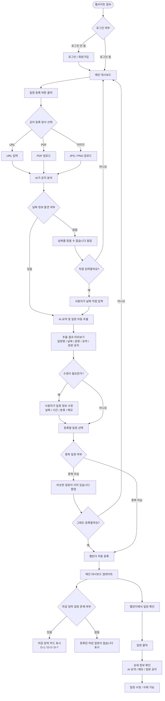
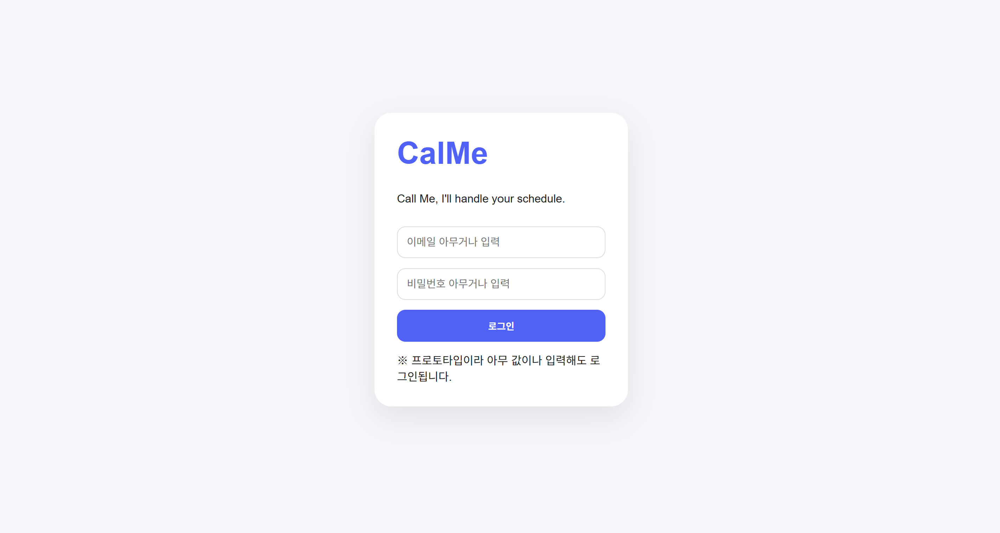
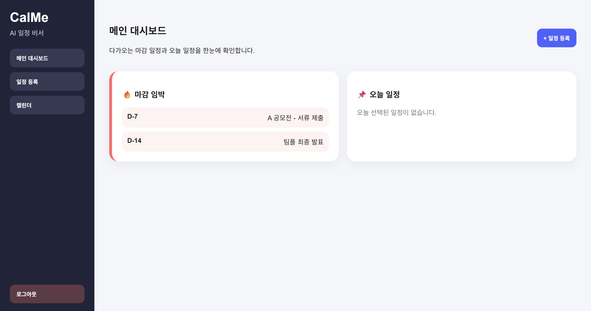
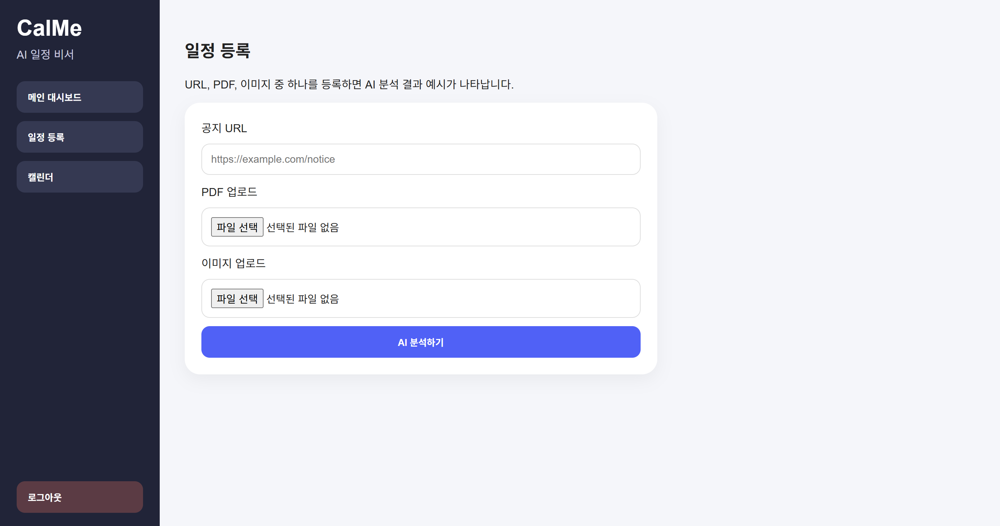
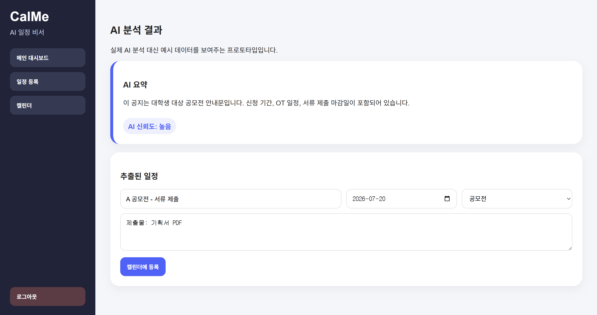
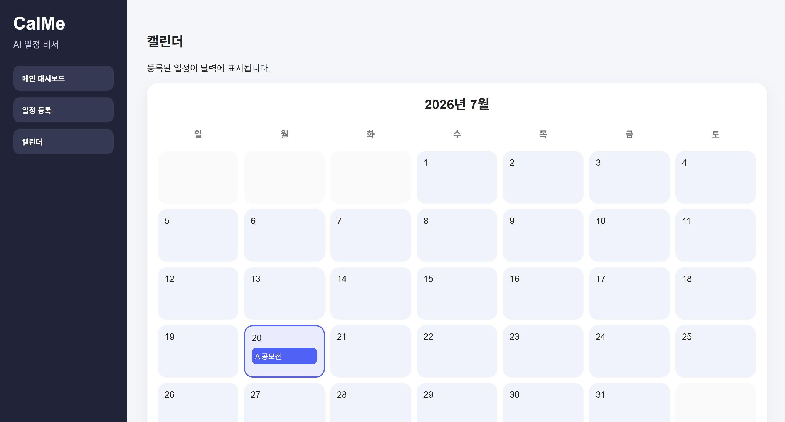
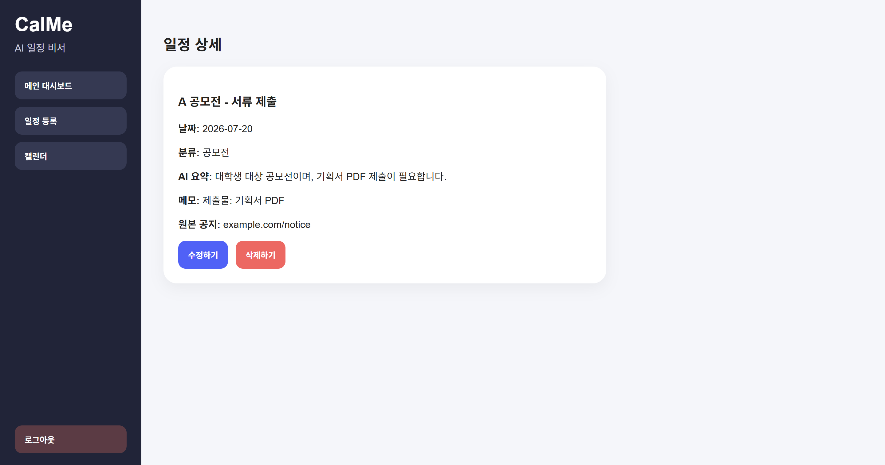

# CalMe

AI 기반 일정 관리 웹 서비스

사용자가 학교 공지, 공모전, 대외활동 등의 URL 또는 파일을 업로드하면 AI가 공지를 분석하여 일정을 자동으로 추출하고 웹 캘린더에 등록해주는 서비스이다.

# 기획안

## 문제 정의
대학생이 여러 공지와 안내문을 확인하는 과정에서 중요한 일정과 마감일을 놓치는 불편을 겪는다.

## 사용자 시나리오
1. 사용자가 CalMe 웹사이트를 실행한다.
2. 사용자가 '일정 등록' 버튼을 클릭한다.
3. 사용자가 학교 공지, 공모전, 대외활동, 팀플 일정이 담긴 URL / PDF / 이미지(JPG, PNG)를 업로드한다.
4. AI가 업로드된 공지를 분석하여 마감일, 신청 기간, 제출물, 일정 등 핵심 정보를 추출한다.
5. 사용자는 AI가 추출한 정보를 확인하고 '캘린더에 등록' 버튼을 누른다.
6. 일정이 웹 캘린더에 자동으로 등록된다.
7. 사용자가 캘린더에서 등록된 일정을 클릭하면 세부 정보와 원본 공지 요약을 확인할 수 있다.
8. 메인 대시보드에는 마감이 임박한 일정(D-30, D-7, D-1)이 표시되어 사용자가 한눈에 확인할 수 있다.

## 핵심 기능

### 1. AI 공지 분석 및 일정 자동 추출
사용자가 업로드한 공지를 AI가 분석하여 일정명, 마감일, 신청기간, 제출물 등의 핵심 정보를 자동으로 추출한다.

### 2. AI 기반 캘린더 자동 등록
AI가 추출한 일정을 사용자가 확인한 뒤 웹 캘린더에 자동 등록하여 일정 관리를 돕는다.

## 화면 흐름 (기획 시각화)

# 화면 구성

## 1. 로그인

## 2. 메인 대시보드

## 3. 일정 등록

## 4. AI 분석 결과

## 5. 캘린더

## 6. 일정 상세

