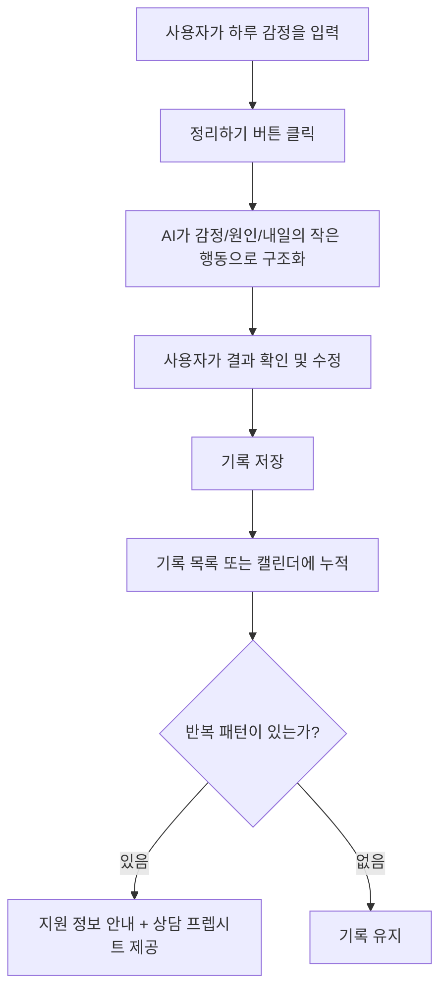

# 하루 체크아웃 — 기획서

## 문제 정의
학업과 취업 준비로 정신적 어려움을 겪는 대학생은 늘고 있으나 도움 통로는 제한적이다.
- 교내 학생상담센터: 무료지만 초중등학교와 달리 국가 차원의 통합 정신건강 지원 체계가 없어 개별 대학의 노력에만 의존하는 상황 (한국대학교육협의회 보도자료, 2025.9.17)
- 공공 지원(심리상담 바우처, 청년 마음건강 지원사업): 존재하지만 의뢰서 발급 등 절차가 복잡해 학생이 스스로 찾아 이용하기 어려움
- 상담 이용에 대한 심리적 부담(낙인)도 여전함
그 결과 많은 학생이 AI 챗봇에 고민을 털어놓지만, 일반 챗봇은 사용자에게 과도하게 동조(sycophancy)하는 경향이 있고 대화가 휘발되어 자기 상태를 축적적으로 파악하기 어렵다.

### 통계로 보는 문제의 크기
- **2024년 전국 대학생 정신건강 실태조사**(전국대학교학생상담센터협의회, 2024 / 한국대학교육협의회 2025.9.17 보도자료에서 재인용): 코로나 이후 조사 표본의 43.5%가 우울위험군, 16.4%가 자살위험군. 심리개입(상담·검사 등)이 "필요하다"는 응답이 "필요없다"는 응답보다 최대 2.7배 이상 높음
- **통계청 2024년 사망원인통계**(2025.9.25 발표): 자살사망자 14,872명, 사망률 29.1명/10만명 — 2011년 이후 최고치, 전년대비 +6.6%(+1.8명); OECD 평균(10.8명) 대비 2.4배로 OECD 회원국 중 최고 수준; 연령대별 자살률 증가율은 30대가 +14.9%로 가장 가팔라 청년층에서 특히 빠르게 악화 중

## 서비스 정의
정리되지 않은 감정을 날것 그대로 입력하면 AI가 감정·원인·다음 행동으로 구조화해주는 대학생용 하루 체크아웃 도구.
- AI의 역할 제한: 조언·진단·위로 금지, 정리만 (출력 형식 고정 → 동조 편향 차단)
- 기록 누적 → 반복 감정/상황 패턴 표시
- 반복 신호 시 실제 지원(교내 상담센터, 심리상담 바우처) 안내 연결 — 치료가 아니라 도움을 찾기 전 단계의 문턱을 낮춤
- **상담 프렙시트**: 최근 기록을 1탭으로 요약해 상담사에게 보여줄 수 있게 정리 — "내 상태를 어떻게 설명해야 할지 모르겠다"는 문제정의를 직접 해결

(참고: 비슷한 문제의식의 이전 사이드 프로젝트에서 관리자용·비AI 방식의 한계를 느꼈고, 이번엔 사용자가 직접 쓰는 AI 정리 도구로 방향을 바꿨다.)

## 벤치마킹
- **무디(Moodee, 국내)**: 사용자가 슬라이더로 감정을 직접 고르면 AI가 퀘스트 3개를 추천, 카드를 탭하면 뒤집히며 설명이 나오는 인터랙션이 있음. 하루체크아웃과 가장 가까운 카테고리지만, 감정을 사용자가 "고르는" 방식이라는 점이 다름 — 하루체크아웃은 날것의 문장에서 AI가 감정을 "찾아준다"는 게 차별점
- **마인디(Mindy, 국내)**: AI 친구 채팅형 감정일기, REBT 기반 무드트래커+주간 리포트
- **Reflectly(해외)**: 시간대/계절별로 바뀌는 그라디언트 배경 등 감성적인 비주얼로 평가가 좋음 — 결과 화면 배경(저녁 그라데이션)에 참고
- **Daylio(해외)**: 타이핑 없이 아이콘 탭만으로 기록하는 방식 — 하루체크아웃은 반대로 "타이핑(날것의 텍스트)"이 입력의 핵심이라 채택하지 않음
- **Ponderwell / Stoic / CareClinic(해외, 치료 저널링 앱)**: 공통적으로 "상담 프렙시트" 기능 보유 — 최근 기록·기분 변화를 1탭 요약으로 뽑아 상담사와 공유(PDF/공유). 하루체크아웃의 "지원 정보 안내"를 여기서 착안해 "상담 프렙시트 제공"으로 구체화함 — 리빙랩 리서치에서 확인한 "학생들이 자기 상태를 어떻게 설명해야 할지 모른다"는 문제를 직접 해결

프로토타입 반영: 결과 화면 배경을 저녁 그라데이션으로, 카드는 탭하면 뒤집혀 "왜 이렇게 정리했는지"가 보이는 인터랙션 추가 (무디 벤치마킹).

## 이론적 근거
- 감정을 말/글로 명명(labeling)하는 것만으로 편도체 반응이 줄고 정서가 조절된다는 신경과학적 근거가 있다 (Lieberman et al., 2007, *Psychological Science*, "Putting Feelings Into Words")
- 정리되지 않은 감정을 15~20분씩 글로 쓰는 것("expressive writing")만으로 불안·우울이 줄어드는 효과가 400여 편의 후속 연구에서 반복 검증됐다 (Pennebaker & Beall, 1986 이후)

## 핵심 사용자 시나리오
1. **기본 흐름**: 하루를 마친 사용자가 접속한다. 입력창에 "팀플에서 의견이 계속 무시돼서 지쳤다"처럼 정리되지 않은 문장을 입력하고 [정리하기]를 누른다. 잠깐의 로딩 후 결과가 세 개의 카드로 제시된다 — ①오늘의 감정 ②원인 ③내일의 작은 행동. 사용자는 그대로 [저장]을 누른다.
2. **수정 흐름**: 카드 3장을 확인한 사용자가 "원인" 카드 내용이 실제 자기 생각과 다르다고 느낀다. 카드를 클릭해 텍스트를 직접 고친 뒤 [저장]을 누른다.
3. **재정리 흐름**: 결과가 마음에 들지 않는다. [다시 정리하기]를 눌러 입력 화면으로 돌아가 문장을 보완해서 다시 입력하고 재요청한다.

기록은 저장될 때마다 캘린더에 누적되고, 특정 감정이 반복되면 패턴 알림과 함께 교내 상담센터·바우처 등 지원 정보 안내가 표시된다 (캘린더/지원안내 화면은 추후 단계, 아래 화면 구조는 오늘 범위인 입력~결과 화면까지만 다룬다).

## 화면 구조
오늘 범위는 핵심 2개 화면과 그 사이 전환 상태만 다룬다 (캘린더/지원안내 화면은 체크리스트 5~6번에서 추후 설계).

```
[S1. 입력 화면]                    [S2. 결과 화면]
┌─────────────────────┐           ┌─────────────────────┐
│  오늘 하루 어땠어?    │           │ (입력 원문 축약 표시) │
│ ┌─────────────────┐ │  정리하기  │ ┌───┐ ┌───┐ ┌───┐  │
│ │                 │ │  ───────▶ │ │감정│ │원인│ │행동│  │
│ │  (텍스트 입력창)  │ │  (로딩)   │ └───┘ └───┘ └───┘  │
│ │                 │ │           │  ↑ 카드 클릭 = 수정   │
│ └─────────────────┘ │           │ [다시 정리하기] [저장] │
│      [정리하기]      │ ◀─────── │                      │
└─────────────────────┘  다시정리  └─────────────────────┘
```

- **S1 입력 화면**: 제목/날짜, 텍스트 입력창(placeholder로 예시 문장 유도), [정리하기] 버튼 — 입력이 비어있으면 비활성화
- **전환**: [정리하기] 클릭 → 로딩 상태(프로토타입 단계에서는 목데이터 지연으로 흉내) → S2로 이동
- **S2 결과 화면**: 감정/원인/내일의 행동 카드 3장을 가로로 배치. 카드 클릭 시 인라인 편집 가능. 상단에 원문을 축약해 표시(맥락 유지용). 하단에 [다시 정리하기](S1로 복귀) / [저장] 버튼

**프로토타입**: [prototype.html](prototype.html) — 위 화면구조를 그대로 구현한 순수 HTML/CSS 프로토타입 (목데이터). 디자인은 [toss-design.md](toss-design.md) 참고.

## API 설계 초안
- POST /api/checkins
- 요청: { "text": "원시 입력 텍스트" }
- 응답: { "emotion": string, "cause": string, "action": string, "createdAt": string, "id": string }
- 서버가 AI를 스키마 강제(structured output)로 호출해 세 필드를 받고, 저장 후 반환
- 모델 선정 기준: 스키마 강제 출력 지원 + 비용 (GCP Vertex 크레딧 / LiteLLM 프록시 검토 중)

## 사용자 흐름


## 핵심 기능 체크리스트 (의존성 순서)
- [ ] 1. 입력 화면: 텍스트 입력창 + 정리하기 버튼
- [ ] 2. 결과 화면: 감정/원인/행동 카드 3장 (목데이터)
- [ ] 3. AI 연동: 입력 → 구조화 결과 (출력 형식 고정)
- [ ] 4. 결과 수정 및 저장
- [ ] 5. 기록 목록/캘린더 뷰
- [ ] 6. 반복 패턴 표시 + 지원 정보 안내 + 상담 프렙시트(최근 기록 요약 내보내기)
- [ ] (여유 시) 회고/체크아웃 문장 변환

## 범위 제외 (하지 않는 것)
로그인, 커뮤니티, 감정 그래프 고도화, 상담 예약 연동, 진단·치료 기능
