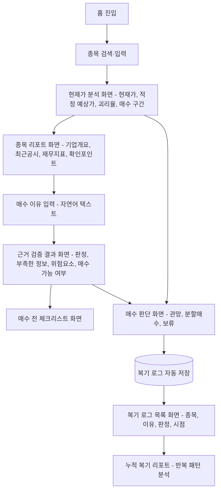

# 기획서 — 대학생 투자자를 위한 근거 검증 Agent

## 문제 정의

> 대학생 소액 투자자가 현재가가 적정한지, 예상 적정가가 어디인지, 그리고 지금 매수해도 되는지 판단할 수단이 없어 같은 실수를 반복한다.

핵심 문제는 "정보 부족"만이 아니라 "현재가 해석, 적정가 추정, 매수 판단을 한 흐름에서 검증할 수단이 없다"는 것이다. 이 서비스는 종목을 무조건 추천하지 않고, 사용자가 보고 있는 현재가와 예상 적정가를 비교한 뒤 매수 판단이 실제 데이터로 뒷받침되는지를 검증한다.

## 사용자 시나리오

1. 관심 종목을 검색해 현재가와 종목 리포트를 확인한다.
2. 현재가가 적정 범위인지, 예상 적정가가 얼마인지 본다.
3. 매수 이유를 자연어로 입력한다.
4. 매수 가능 여부와 근거 검증 결과를 확인한다.
5. 체크리스트를 보고 실제 매수 실행 전 최종 점검을 한다.
6. 판정 결과가 복기 로그에 자동 저장된다.
7. 로그가 쌓이면 누적 복기 리포트에서 반복 패턴을 확인한다.

## 핵심 기능 (3개)

- **기능 A. 종목 공부 Agent**: 종목명 입력 → OpenDART 공시 조회, 재무지표 계산 → 초보자용 종목 요약 리포트 + 확인 포인트 출력
- **기능 B. 현재가·적정가 분석 Agent**: 현재가 입력 또는 자동 조회 → PER/PBR/ROE/성장률/변동성 기반으로 적정 예상가 범위 산출 → 현재가 대비 고평가/저평가/중립 판정 + 매수 가능 구간 제안
- **기능 C. 근거 검증 Agent**: 매수 이유(자연어) 입력 → 근거 유형 추출 → 공시·재무 데이터와 대조 → 근거 있음/부족/없음 판정 + 체크리스트 + 복기 로그 저장

체크리스트·감정적 판단 여부·누적 복기 리포트는 기능 C의 출력을 재사용하는 부산물이며 별도 파이프라인이 아니다. 현재가 분석과 적정 예상가 산출은 기능 B의 핵심 산출물이다.

## 화면 흐름

**화면 목록 (IA)**

1. 홈
2. 종목 검색/입력
3. 현재가 분석
4. 종목 리포트 (기능 A 산출물)
5. 매수 이유 입력
6. 근거 검증 결과 (기능 C 핵심 산출물)
7. 매수 전 체크리스트
8. 매수 판단 화면
9. 복기 로그 목록
10. 누적 복기 리포트 (패턴)

**로그인 화면은 MVP 범위에서 생략.** 복기 로그·누적 리포트 구분은 임시 기기 ID(브라우저/기기 기준)로 처리하고, 정식 회원 인증은 MVP 이후 과제로 남긴다.

## 엣지 케이스 및 처리 방침

| 상황 | 처리 방침 |
|---|---|
| 비상장/코스닥 소형주 등 OpenDART 공시 데이터가 부실한 종목 | MVP는 KOSPI·KOSDAQ 상장사로 대상을 명시하고, 공시가 일정 개수 미만이면 종목 리포트 화면에 "공시 데이터가 부족해 제한된 리포트입니다"를 명시. 조용히 빈 값을 채우지 않는다 |
| 사용자가 근거를 여러 개 섞어 입력 (예: "실적도 좋고 뉴스도 좋아서") | Claim Extractor는 단일 유형이 아니라 유형 리스트를 추출하고, 근거 검증 결과 화면에서 유형별로 판정을 나눠 보여준다 (예: 실적 근거 → 있음 / 뉴스 근거 → 확인 불가) |
| 매수 이유를 "그냥 감"처럼 극히 짧게 입력 | 추출 가능한 근거 유형이 없으면 바로 "근거 없음(감정적 판단)"으로 판정하고, "어떤 정보를 보고 판단했나요?"라는 후속 질문을 함께 보여준다. 에러로 막지 않는다 |
| 공시 발표 직후 최신 데이터가 아직 반영 안 됨 | 종목 리포트·검증 결과 화면 모두에 "이 데이터는 YYYY-MM-DD 기준 공시입니다"라는 기준일을 표시해, 사용자가 최신성 한계를 알 수 있게 한다 |

## 참고

- 상세 배경·기술스택·Agent 아키텍처·리스크 논리: [docs_1.md](docs_1.md), [../../day1/docs/docs_2.md](../../day1/docs/docs_2.md)
