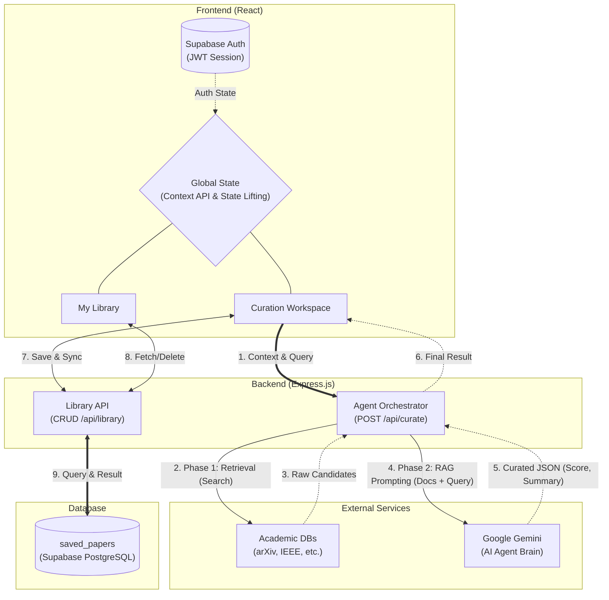

## 1. 문제 정의
대학(원)생 및 연구원이 끊임없이 쏟아지는 방대한 학술 논문 데이터베이스를 검색하고, 본인의 세부 연구 도메인에 맞는 논문을 찾기 위해 수많은 논문을 일일이 검토하는 과정에서 극심한 정보 과부하와 인지적 피로를 겪는다.

---

## 2. 세부 동작 시나리오

### [Scenario A: 연구 프로필 등록 및 관심 키워드 설정]
1. 사용자는 서비스 최초 진입 시 본인의 주 연구 분야/전공을 확인한다.
2. 실시간 모니터링을 원하는 타깃 학술 채널(arXiv, IEEE, NeurIPS 등)을 선택/해제할 수 있는 토글 영역을 제공한다.
3. 현재 진행 중인 프로젝트와 연관된 핵심 세부 연구 키워드들을 등록하고 관리한다.

### [Scenario B: 실시간 논문 탐색 및 스코어링]
4. 사용자가 구체적으로 찾고 있는 연구 질문이나 세부 쿼리를 입력창에 입력하고 '큐레이션 시작'을 요청한다.
5. 서비스는 실시간 학술 데이터베이스를 탐색하는 과정을 시각적 프로그레스 바와 단계별 안내 메시지로 유저에게 실시간으로 보여준다.
6. 탐색이 완료되면 유저의 프로필/키워드와의 연관성을 계산하여 '매칭도 관련 스코어(%)'가 높은 순서대로 논문 카드 리스트를 정렬하여 출력한다.

### [Scenario C: 핵심 인사이트 확인 및 서재 아카이빙]
7. 사용자는 매칭된 결과 리스트 중 탐색하고 싶은 논문 카드를 선택한다.
8. 상세 패널을 통해 영어로 된 긴 초록 대신 '가독성 높은 3줄 요약 인사이트'를 한눈에 확인한다.
9. 연구 가치가 높은 논문은 '내 서재 보관함'에 추가하여 나만의 논문 목록을 아카이빙하고 관리한다.

---

## 3. 핵심 기능 상세 명세

### [기능 1] 프로필 매칭 기반 지능형 논문 큐레이션 및 스코어링
* **관심 채널 및 키워드 필터링:** 유저가 지정한 타깃 학회 필터와 세부 연구 키워드를 바탕으로 맞춤형 검색 범위를 생성한다.
* **의미론적 연관성 점수(%) 산출:** 입력된 연구 쿼리와 탐색된 논문들의 제목/텍스트 간 유사도를 계산하여 단순 키워드 매칭을 넘어선 '관련도 점수(%)'를 매긴다.
* **매칭도 기준 정렬:** 산출된 스코어를 기반으로 고관련성 논문을 최상단에 배치하여 유저의 리서치 효율을 극대화한다.

### [기능 2] 핵심 3줄 요약 및 서재 아카이빙
* **3줄 인사이트 추출:** 영문 초록(Abstract)에서 1) 연구 배경 및 한계 원인, 2) 제안하는 핵심 방법론, 3) 구체적 개선 결과/수치를 추출하여 정형화된 3줄 요약본으로 변환한다.
* **내 서재 보관함 관리:** 탐색된 논문 중 유저가 선택한 논문을 '내 서재 보관함' 리스트에 추가 및 제거할 수 있는 아카이빙 기능을 지원한다.

---

## 4. UI/UX 화면 구조 및 레이아웃 스타일 가이드

본 서비스는 사용자의 시선 피로도를 최소화하고 핵심 가치(인사이트 소비 및 아카이빙)에 집중할 수 있도록 **비대칭형 2x2 격자 구조**의 인터페이스를 채택한다. 서비스 기능의 가치적 중요도(연구 프로필 30% : 큐레이션 트리거 10% : 인사이트 및 서재 60%)에 따라 화면 면적과 시각적 우선순위를 차등 분배한다.

### [기본 레이아웃 아키텍처]
- **상단 행:** 에이전트 구동을 위한 조건 설정 및 명령 하달 구간 (전체 화면의 약 40% 면적 점유)
- **하단 행:** 에이전트가 도출한 핵심 가치를 소비하고 영구 자산화하는 메인 워크스페이스 구간 (전체 화면의 약 60% 면적 점유)
- **해상도 대응 가이드:** 고해상도 환경에서는 격자 구조를 유지하며, 인지 흐름을 방해하지 않는 범위 내에서 저해상도 뷰포트 진입 시 위에서 아래로 순차 배치되는 수직 스택 구조로 유연하게 래핑된다.

---

### [상단 좌측 영역 - Container A: 연구 프로필 섹션 (Input / 가치 비중: 30%)]
인터랙션의 출발점으로서 사용자의 연구 컨텍스트를 수집하고 조건 필터를 설정하는 컨트롤러 영역이다.
- **시각적 특징:** 정보 입력의 피로감을 낮추기 위해 미니멀한 카드 컴포넌트 형태로 구성하며, 안정감을 주는 소프트 배경색을 적용한다.
- **주요 가이드 구조:**
  - 사용자의 연구 정체성을 명시하는 정적 텍스트 위젯
  - 메인 스트림 학술 채널들을 온/오프할 수 있는 가시성 높은 토글 버튼 그룹
  - 현재 설정된 키워드들을 직관적으로 식별할 수 있는 인라인 뱃지 형태의 나열 인터페이스 (삭제 기능 수반)
  - 새로운 연구 키워드를 적시에 보충할 수 있는 단순 폼 필드와 추가 액션 영역

### [상단 우측 영역 - Container B: 큐레이션 보드 섹션 (Process / 가치 비중: 10%)]
연구 질문(쿼리)을 에이전트에게 하달하고, 백그라운드 분석 상태를 시각적으로 모니터링하는 게이트웨이 영역이다. 인지적 부하를 줄이기 위해 최소한의 기능 면적만 점유한다.
- **시각적 특징:** '명령 제출'과 '상태 대기'라는 명확한 상태 변화에 집중할 수 있도록 동적인 컴포넌트 전이를 지원한다.
- **주요 가이드 구조:**
  - 사용자의 복잡한 자연어 연구 목적이 기술되는 쿼리 디스플레이 박스
  - 서비스 실행을 유도하는 강조된 명도 계열의 '큐레이션 시작' 마스터 버튼
  - 에이전트 분석 구동 시 활성화되는 동적 프로그레스 컴포넌트 (진행률 및 에이전트 서브 태스크 상태 텍스트 가이드 연계)

---

### [하단 전체 영역 - Container C: 데일리 인사이트 & 서재 섹션 (Output / 가치 비중: 60%)]
사용자가 가장 오랜 시간 머무르며 실질적인 연구 자산을 획득하는 공간으로, 화면에서 가장 압도적인 면적을 부여하여 정보 가독성을 극대화한다. 분석 결과물 출력과 상세 정보 소비, 보관 프로세스가 유기적으로 통합된다.
- **시각적 특징:** 화면 중앙을 가로질러 넓게 배치되며, 스코어링이 완료된 다량의 논문 목록과 텍스트 소비 위주의 요약 대시보드가 상호작용할 수 있도록 화면 분할 레이아웃을 제공한다.
- **주요 가이드 구조:**
  - **큐레이션 리스트 뷰:** 에이전트 탐색이 완료된 논문들이 관련도 점수(%)에 따라 컬러 뱃지(고정밀도: 그린 계열, 중정밀도: 옐로우 계열)와 함께 우선순위 정렬되어 노출되는 카드 스택 목록
  - **3줄 인사이트 패널:** 리스트 뷰에서 특정 항목 선택 시 활성화되는 공간으로, 초록을 완벽히 대체할 수 있도록 구조화된 번호 매기기(1. 연구 배경, 2. 핵심 방법론, 3. 실험 결과) 형태의 요약 텍스트 뷰어
  - **내 서재 아카이빙 라이브러리:** 유저가 보관 처리한 핵심 논문들이 컴팩트하게 누적 저장되는 독립 스크롤 뷰 형태의 보관함 (중복 저장 방지 문구 피드백 및 목록 내 상시 제외 트리거 내장)

---

### [디자인 시스템 및 인터랙션 원칙 (Design Principles)]
1. **아카데믹 신뢰성 테마:** 깊은 청록(Deep Teal) 및 스카이 블루(Sky Blue)를 포인트 컬러로 설정하여 학술 플랫폼으로서의 신뢰성과 차분한 리서치 환경을 시각적으로 보장한다.
2. **동적 상태 피드백:** 에이전트의 작동 주기('대기' > '분석 중' > '완료')에 따라 요소들의 시각적 밀도와 투명도, 애니메이션 펄스(Pulse) 효과를 다르게 주어 시스템이 현재 '생각하고 있음'을 사용자에게 자연스럽게 전달한다.

---

## 5. 웹 서비스 아키텍처 및 데이터 흐름 (Web Service Architecture & Data Flow)

학습 지침의 웹 서비스 3대 부품(FE, BE, DB) 작동 원리에 의거하여, Scholar-Sync AI 서비스의 기술 지도 및 핵심 기능 아키텍처 흐름을 아래와 같이 정의합니다.

### 5.1. 내 서비스 기술 지도 (Technical Architecture Map)
프론트엔드, 백엔드, 데이터베이스 레이어의 주방(로직), 창고(저장소), 홀(메뉴판) 역할을 분담하고 핵심 기술 스택을 매핑합니다.

| 부품 | 배역 및 핵심 처리 로직 | 채택 기술 |
| :--- | :--- | :--- |
| **FE** (프론트엔드) | • **연구 프로필 카드:** 소속 전공 라벨 인터랙션, 학술 채널 토글 버튼 그룹, 관심 키워드 뱃지 풀 구성 및 실시간 추가/삭제 폼 제어 • **큐레이션 보드:** 자연어 질문(Query) 입력 에어리어 제어 및 큐레이션 마스터 액션 트리거 처리 • **인사이트 워크스페이스:** 매칭도 점수(%) 정렬 기반 논문 카드 리스트 뷰, 넘버 서클(1, 2, 3) 기반 한국어/영어 3줄 요약 보드 및 서재 보관함 컴팩트 뷰어 스크롤 렌더링 | React + 순수 CSS |
| **BE** (백엔드) | • **학술 API 프록시 오케스트레이션:** 사용자 관심 채널 필터 및 키워드를 파라미터화하여 외부 학술 데이터베이스(arXiv, IEEE 등) 실시간 연동 및 탐색 • **AI 에이전트 매칭 분석:** 수집된 논문 풀과 유저 자연어 쿼리 간의 의미론적 연관성 확신 점수(Match %) 연산 연지 비즈니스 로직 구동 • **인사이트 추출 파이프라인:** Gemini API 구조화된 JSON 출력을 활용하여 영문 초록을 정형화된 3대 요소(연구 배경, 핵심 방법론, 구체적 개선 결과) 기반의 3줄 요약 데이터 가공 및 클라이언트 응답 응집 | Express (Node.js) |
| **DB** (데이터베이스) | • **유저 리서치 컨텍스트 저장:** 사용자의 소속/전공 설정값, 구독 학술 채널 활성화 여부, 등록된 관심 연구 키워드 데이터 인스턴스 지속성 보존 • **연구 자산 아카이빙:** 유저가 서재 저장을 트리거한 핵심 논문의 메타데이터(제목, 저자, 학회명) 및 백엔드에서 영구 가공한 에이전트 3줄 요약 인사이트 데이터 적층 관리 | Supabase (Postgres) *(MVP 단계 LocalStorage 혼용)* |

### 5.2. 핵심 기능 요청-응답 흐름 (Round Trip Breakdown)
서비스에서 발생하는 가장 핵심적인 두 가지 사용자 동작의 HTTP 메서드, API 엔드포인트 처리 및 상태 코드 분기 흐름입니다.

#### 시나리오 ① : 연구 질문 입력 후 지능형 논문 큐레이션 및 에이전트 분석 수행
- **화면 동작:** 큐레이션 보드에서 질문 입력 후 '큐레이션 시작' 마스터 버튼 클릭
- **요청 (Method + Path):** `POST /api/curate` (Body: `{ query: "string", profile: { keywords: [], channels: [] } }`)
- **서버 처리 (BE Logic):** 요청 검증 후 외부 학술 DB 탐색 수행 및 `@google/genai` SDK를 연계하여 `gemini-3.5-flash` 모델을 통해 맞춤형 3줄 요약과 매칭도 스코어를 정형 데이터 구조로 빌드
- **데이터베이스 (DB):** `SELECT` 쿼리를 통해 해당 요청을 보낸 유저 도메인의 기존 활성 키워드 가중치 대조 확인
- **응답 (Status + Body):** `200 OK` (Body: `{ papers: [ { title, authors, source, matchScore, insights: [3lines], keywordsMatched: [] } ] }`)
- **화면 변화 (FE Rendering):** 에이전트 상태 컴포넌트가 진행 완료 상태로 갱신되며, 관련도 점수(%) 가 정렬된 논문 카드 리스트와 우측 3줄 핵심 요약 패널이 연동되어 동적 리렌더링됨

#### 시나리오 ② : 연구 가치가 높은 논문을 '내 서재 보관함'에 추가 및 아카이빙
- **화면 동작:** 3줄 인사이트 패널에서 '내 서재 보관' 버튼 클릭
- **요청 (Method + Path):** `POST /api/library` (Body: `{ paper_id: "string", title: "string", insights: [] }`)
- **서버 처리 (BE Logic):** 보관을 요청한 논문 식별자의 정당성 검증 및 서재 보관함 내 중복 저장 데이터 확인 절차 가동
- **데이터베이스 (DB):** `INSERT INTO library (user_id, paper_id, title, insights) VALUES (...)` 데이터 레코드 영구 삽입
- **응답 (Status + Body):** `201 Created` (Body: `{ success: true, savedItem: { ... } }`)
- **화면 변화 (FE Rendering):** 저장 성공 메커니즘 피드백 인디케이터가 활성화되고, 대시보드 우측 하단 '내 서재 보관함' 독립 스크롤 뷰 내에 해당 아이템 카드가 컴팩트 스택 형태로 적층 추가됨

---

## 6. 화면 흐름도 (User Flow)

---

## 7. 프로토타입 UI 구조 미리보기 (Prototype Preview)

기획서의 레이아웃 스타일 가이드(상단 행 40%, 하단 행 60% 비중)를 바탕으로 구현된 순수 HTML/CSS 정적 프로토타입의 실제 구동 화면: 

