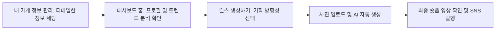

## 문제 정의
SNS 마케팅이 필수인 바쁜 소상공인들이, 매주 변하는 트렌드를 파악하고 직접 영상을 편집할 물리적 시간과 기술적 리소스가 절대적으로 부족한 불편함을 해결합니다.

## 사용자 시나리오 (End-to-End 플로우 6단계)
**① 정보 세팅 (내 가게 정보 관리)**
- 매장명, 위치, 업종, 주력 상품(시그니처 메뉴) 등 우리 가게의 기본 정보를 전용 설정 페이지에서 셋업합니다.

**② 트렌드 확인 (대시보드 홈)**
- ①에서 저장된 정보가 대시보드의 프로필 카드로 노출되며, 업종 정보를 기준으로 실시간 수집된 틱톡/인스타그램의 트렌드 데이터를 확인합니다.
- 검색량 추이는 꺾은선 차트로, 추천 해시태그는 컬러풀한 Pill 형태로 노출됩니다.

**③ 기획 세팅 (파이프라인)**
- 릴스 생성 파이프라인 화면으로 넘어가, 오늘 영상의 방향성을 가볍게 선택합니다.
- 홍보 목적(체크박스 중복 선택)과 영상 분위기(태그 라디오 버튼 단일 선택)를 타이핑 없이 클릭만으로 정할 수 있습니다.

**④ 사진 업로드 (파이프라인)**
- 방금 구운 크루아상 사진 등, 오늘 홍보하고 싶은 시그니처 메뉴 사진을 드래그 앤 드롭으로 업로드합니다.
- 이 사진 1장이 전체 AI 파이프라인의 유일한 시각 소스가 됩니다. (JPG, PNG, MP4 지원)

**⑤ AI 파이프라인 가동 (파이프라인)**
- 업로드가 완료되고 '생성 시작'을 누르면 4단계 자동화 파이프라인이 순차 가동됩니다.
- [비전 AI 스마트 크롭] ➔ [문맥 기반 자막 스크립트 매칭] ➔ [TTS 나레이션 생성] ➔ [최종 15초 영상 렌더링]

**⑥ 최종 확인 및 발행 (파이프라인)**
- 완성된 세로형(9:16) 숏폼 영상을 미리보기로 확인한 뒤, "인스타그램/틱톡 발행" 버튼 한 번으로 즉시 업로드합니다. (영상 파일 별도 다운로드 가능)

### 🔁 시나리오 요약 표
| 단계 | 화면 | 사용자 행동 | 시스템 반응 |
|---|---|---|---|
| ① 정보 세팅 | 내 가게 정보 관리 | 매장 정보 입력 후 저장 | StoreInfo DB 저장 |
| ② 트렌드 확인 | 대시보드 홈 | 프로필 확인 및 업종별 트렌드 확인 | 차트·해시태그 동적 렌더링 |
| ③ 기획 세팅 | 릴스 생성하기 | 목적/분위기 클릭 선택 | 기획 파라미터 설정 |
| ④ 사진 업로드 | 릴스 생성하기 | 사진 드래그 앤 드롭 | 이미지 서버 업로드 |
| ⑤ AI 가동 | 릴스 생성하기 | "AI 생성 시작" 클릭 | 4단계 파이프라인 순차 실행 |
| ⑥ 발행 | 릴스 생성하기 | 미리보기 확인 후 발행 | SNS 플랫폼 업로드 & GeneratedReels 기록 |

## 핵심 기능 (2개)
- **실시간 트렌드 분석 및 해시태그 추천 (KoBERT):** 사장님의 매장 정보와 틱톡 크리에이터 인사이트를 실시간 크롤링하여, 단순 조회수가 아닌 **'목적지 클릭률(CTR)'**이 가장 높은 고전환 키워드를 도출해 내는 기능.
- **AI 릴스 자동 생성 파이프라인 (YOLOv8 + TTS + FFmpeg):** 텍스트 입력의 부담 없이 선택한 기획 방향성과 사진 한 장만으로, 객체 인식부터 음성 합성, 렌더링까지 전 과정을 시각적으로 보여주며 숏폼을 뚝딱 만들어내는 자동화 공정.

## 화면 흐름

