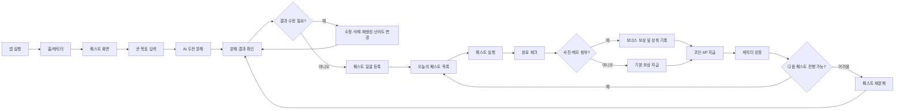

# One-Step 서비스 기획

## 문제 정의

대외활동·공모전·학습과 같은 큰 목표를 시작하고 싶지만 무엇부터 해야 할지 몰라 실행하지 못하는 대학생이, AI가 목표를 작은 도전으로 나눠 주고 퀘스트 완료 보상까지 연결해 주는 실행 구조를 필요로 한다.

## 사용자 시나리오

1. 사용자는 앱에 접속해 “공모전 지원하기”, “자격증 공부 시작하기”처럼 막막한 목표를 입력한다.
2. AI 도전 분해 엔진은 목표를 오늘 바로 실행할 수 있는 마이크로 퀘스트로 나누고 각 퀘스트의 난이도를 쉬움·보통·어려움으로 분류한다.
3. 사용자는 AI가 만든 결과를 확인하고 퀘스트 제목과 난이도를 수정하거나, 필요 없는 항목을 삭제하거나, 다시 분해한다.
4. 확정한 퀘스트는 오늘의 퀘스트 목록에 등록된다.
5. 사용자는 작은 퀘스트를 수행하고 완료 체크를 한다.
6. 퀘스트 난이도에 따라 코인과 경험치를 획득하고, 캐릭터가 성장한다.
7. 사용자가 특정 퀘스트에서 멈추면 해당 퀘스트를 더 작은 단위로 다시 분해해 도전을 재개한다.

## 핵심 기능 (2개)

### 기능 A. AI 도전 분해 엔진

- 사용자가 입력한 큰 목표를 실행 가능한 마이크로 퀘스트로 자동 분해한다.
- 각 퀘스트에 쉬움·보통·어려움 난이도를 자동 부여한다.
- 사용자가 결과를 수정·삭제·재생성하고 난이도를 수동 변경할 수 있다.
- 분해 결과는 구조화된 형식으로 생성해 퀘스트 목록에 일괄 등록한다.
- AI 응답 실패나 지연 시 대표 도전 유형 템플릿을 제공한다.
- 사용자가 특정 단계에서 멈추면 더 작은 퀘스트로 재분해할 수 있다.

### 기능 B. 퀘스트 실행 루프

- 사용자는 AI 분해 결과 또는 직접 입력으로 퀘스트를 등록한다.
- 퀘스트 목록에서 난이도와 예상 보상을 확인한다.
- 완료 체크 시 난이도별 코인과 경험치를 지급한다.
- 쉬움: 코인 3, XP 5
- 보통: 코인 5, XP 10
- 어려움: 코인 10, XP 20
- 완료한 퀘스트는 캐릭터 성장과 연결한다.
- 사진과 메모를 선택적으로 첨부하면 보너스 보상을 지급하고 성취 기록을 저장한다.

## 화면 흐름

## 핵심 성공 지표

- 도전 시작률: 퀘스트 등록 후 첫 완료까지 이어진 비율
- 재분해 복귀율: 멈춘 퀘스트를 더 작게 나눈 뒤 다시 실행한 비율
- 7일 리텐션: 가입 후 7일째에도 서비스를 사용하는 사용자 비율
- 누적 완료 퀘스트 수: 사용자가 반복적으로 작은 성공을 경험하는지 확인하는 지표
