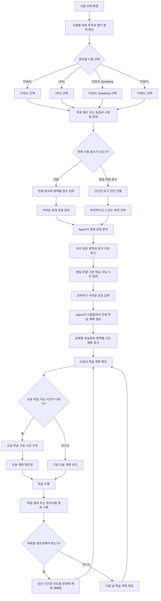

# 프로젝트 기획서 초안

## 1. 서비스 개요
대학생이 TOEIC, OPIc, TOEIC Speaking, TOEFL 중 준비할 시험을 직접 선택하고, 현재 실력, 목표 점수/등급, 시험일, 학습 가능 시간을 입력하면 취약 영역을 분석하고 시험일까지 날짜별 학습 계획을 제공하는 Agent 서비스입니다. 사용자가 자신의 조건을 빠르게 입력하면, 시험까지 남은 기간을 고려한 맞춤형 학습 일정을 제안합니다.

## 2. 문제 정의
대학생은 취업, 교환학생, 졸업 요건 등으로 어학 성적이 필요한 경우가 많습니다. 준비할 시험을 정한 뒤에도 현재 실력과 목표, 남은 기간을 바탕으로 어떤 영역을 먼저 공부해야 할지, 하루 학습 시간을 어떻게 배분해야 할지 판단하기 어렵습니다. 특히 방학이나 단기간에 성적이 필요한 상황에서는 바쁜 일정 속에서 자투리 시간을 계획적으로 활용해야 하지만, 이를 나누고 활용할 기준이 부족합니다.

## 3. 핵심 사용자
- 어학 시험 점수가 필요한 대학생
- 시험 준비까지 기간이 짧은 학생
- 현재 실력은 있으나 우선순위와 일별 학습 계획이 필요한 학생
- 처음 시험을 준비하는 학생

## 4. 사용자 시나리오
1. 사용자는 첫 화면에서 TOEIC, OPIc, TOEIC Speaking, TOEFL의 대표 활용 목적과 평가 영역을 확인한다.
2. 사용자는 자신이 준비할 영어시험을 직접 선택한다.
3. 사용자는 목표 점수 또는 등급과 시험일을 입력하고, 현재 점수가 있는 경우 입력하며 없는 경우에는 ‘처음 응시’로 선택한다.
4. 현재 점수가 있는 경우 영역별 점수와 어려운 문제 유형을 입력하고, 처음 응시인 경우 간단한 자기 진단을 진행한다.
5. Agent는 현재 상태와 우선 보완해야 할 영역을 분석한다.
6. 사용자는 평일과 주말의 기본 학습 가능 시간과 공부하기 어려운 요일을 입력한다.
7. Agent는 시험일까지 남은 기간을 고려해 전체 학습량을 날짜별로 배분한다.
8. 사용자는 매일 오늘의 계획을 확인하고, 필요한 경우 오늘의 학습 가능 시간을 수정한다.
9. 사용자가 학습 결과나 모의시험 결과를 기록하면 Agent가 이후 계획을 재조정한다.

## 5. 핵심 기능
1. 선택한 시험의 현재 상태와 취약 영역 분석
2. 시험일까지의 맞춤 학습 계획 생성 및 학습 결과에 따른 재조정

## 6. 시험별 입력 정보
- TOEIC
  - 목표 점수
  - 현재 점수(있다면)
  - 리딩/리스닝 영역별 취약점
- OPIc
  - 목표 등급
  - 현재 등급(있다면)
  - 주요 말하기 주제 또는 어려운 유형
- TOEIC Speaking
  - 목표 점수
  - 현재 점수(있다면)
  - 말하기 유형별 어려움
- TOEFL
  - 목표 점수
  - 현재 점수(있다면)
  - 리딩/리스닝/스피킹/라이팅별 취약점

공통 입력
- 시험일
- 평일 학습 가능 시간
- 주말 학습 가능 시간
- 공부하기 어려운 요일

## 7. 사용자 흐름 Mermaid

## 8. 학습 계획 생성 및 재조정 방식
- 사용자가 입력한 시험 종류와 목표, 현재 상태를 바탕으로 주요 학습 영역을 도출합니다.
- 남은 기간을 일수로 계산하고, 평일/주말 학습 시간을 고려해 총 학습 시간과 일별 배분을 산출합니다.
- 취약 영역 비중을 높여 우선순위 학습 항목을 생성합니다.
- 사용자가 학습 결과나 모의시험 결과를 입력하면, 남은 시간과 현재 진도에 따라 계획을 다시 배분합니다.

## 9. MVP 포함 범위
- 사용자가 시험 선택 및 기본 정보 입력
- 현재 상태(점수/자기 진단) 입력
- 평일/주말 학습 가능 시간 입력
- 취약 영역 분석
- 날짜별 학습 계획 생성
- 계획 확인 화면

## 10. MVP 제외 범위
- 시험 추천 기능
- 실제 시험 문제 채점
- 음성 평가
- 문제 자동 생성
- 외부 라이브러리 의존 기능

## 11. 예외 상황
- 시험일이 현재 날짜보다 이전인 경우
- 목표 점수/등급이 비현실적으로 낮거나 높은 경우
- 입력한 학습 가능 시간이 0인 경우
- 사용자가 시험 종류를 선택하지 않은 경우
- 평일/주말 학습 시간이 모두 0일 때

## 12. 아직 결정하지 않은 사항
- 계획 수정 시 구체적인 재조정 알고리즘 세부 방식
- UI에서 `처음 응시` 자기 진단의 구체적 질문 구성
- 하루 계획 구성 단위(시간 단위 vs 영역 단위)
- 데이터 저장 방식(세션 기준 저장 vs 로컬 저장)
