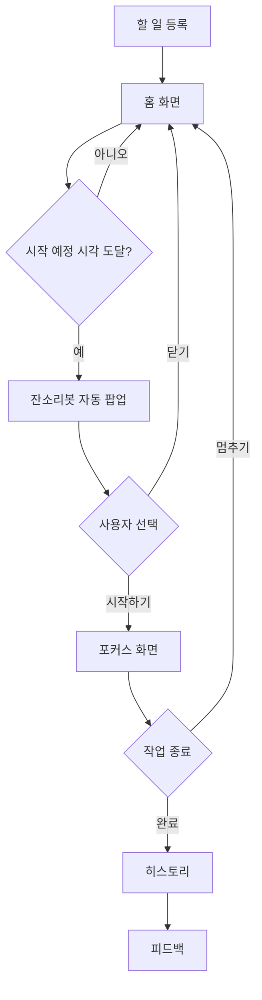
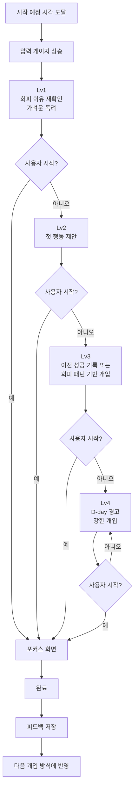

# 잔소리봇 기획서

> AI가 사용자의 회피 이유를 분석하고, 상황에 맞는 첫 행동을 제안하여 실행을 돕는 서비스

(프로토타입 링크) https://github.com/minsss42/hub/blob/work/docs/prototype.html

## 1. 문제 정의

대학생은 할 일을 시작하려는 순간 막막함, 하기 싫음, 놀고 싶음 등 다양한 이유로 첫 행동을 시작하지 못하고 할 일을 미루곤 한다.

하지만 이러한 회피 이유는 사람마다, 상황마다 다르다.

기존 리마인더 앱은 정해진 시간에 알림을 보내는 기능은 제공하지만, 사용자가 왜 시작하지 못하는지 파악하거나 그 이유에 맞는 도움을 제공하지 못한다. 결국 사용자는 같은 이유로 반복해서 할 일을 미루게 된다.

## 2. 해결 방식

잔소리봇은 사용자가 왜 시작하지 못하는지(회피 이유)를 먼저 파악한 뒤 그 이유에 맞는 첫 행동을 제안하여 실제 실행까지 이어지도록 돕는 서비스이다.

즉,
회피 이유 파악→ 맞춤 행동 제안→ 첫 행동 시작
이라는 흐름으로 사용자의 실행을 유도한다.

## 3. 사용자 시나리오

1. **할 일 등록**: 제목, 유형, 시작 예정 시각, 마감까지 D-day, 예상 회피 이유를 입력해 할 일을 등록한다.
2. **시작 시각 도달**: 시작 시간이 되면 할 일이 활성화되고, 사용자가 반응하지 않으면 압력 게이지가 차오르며 잔소리봇이 개입을 시작한다.
3. **'잔소리봇' 개입**: 사용자가 반응하지 않으면 개입 레벨에 따라 잔소리봇이 먼저 말을 걸고, 상황에 맞는 메시지를 자동으로 제공한다.
   - Lv1: 회피 이유를 다시 확인하고, 가볍게 시작을 독려한다.
   - Lv2: 유형과 회피 이유를 기반으로 현재 상황에 맞는 첫 행동(마이크로태스크)을 제안한다.
   - Lv3: 이전 기록이나 반복된 회피 패턴을 바탕으로 개인화된 행동을 제공한다.
   - Lv4: 실제 마감 D-day를 언급하며 즉시 시작을 유도하는 강한 개입을 제공한다.
4. **할 일 시작**: 사용자가 "시작하기"를 누르면 포커스 화면(경과 시간 표시)으로 이동해 작업을 시작한다. 작업을 완료하면 완료 기록이 저장되고 스트릭이 갱신되며, 잠시 멈춘 경우에는 다시 이어서 진행할 수 있다.
5. **피드백 제공**: 할 일 완료 후 잔소리봇의 개입이 도움이 되었는지 피드백을 남길 수 있으며, 이후 비슷한 상황에서 개입 방식에 반영된다.
6. **지속적인 개입**: 완료되지 않은 할 일이 남아 있다면 웹페이지를 닫은 뒤에도 잔소리봇이 다시 개입하여 할 일을 이어갈 수 있도록 돕는다. (향후 확장)

## 4. 핵심 기능

### ① 첫 행동(마이크로태스크) 제안

회피가 감지되면 할 일의 **유형·제목**을 바탕으로 "지금 바로 시작할 수 있는 가장 작은 행동"을 그때그때 새로 만들어 제안한다. 큰 계획을 한 번에 제시하지 않는 이유는 계획 자체가 부담이 되어 시작을 미루는 경우가 있기 때문이다.

- 현재(프로토타입): 유형 9종 × 회피 이유 3종(+기타 직접입력) 조합의 규칙 기반 템플릿으로 생성
- 향후 구현: AI 모델을 활용해 상황에 맞는 첫 행동(마이크로태스크)를 실시간으로 생성

### ② 회피 원인 기반 맞춤 개입

사용자가 선택한 회피 이유를 바탕으로 상황에 맞는 개입을 제공한다. 반복해서 미루는 경우에는 회피 이유를 다시 확인하고, 현재 상태에 맞게 개입 강도(Lv1~Lv4)를 조절한다. 이유에 따라 개입 강도(Lv1~4)와 메시지 내용이 달라진다.

- 현재(프로토타입): 사용자가 직접 선택한 회피 이유를 활용하고, 이전에 같은 회피 이유를 극복했던 방법이 있다면 이를 다시 제안하여 개인화된 개입 제공
- 향후 구현: 행동 데이터를 분석하여 회피 이유를 자동으로 추론하고 더욱 개인화된 개입 제공 (유의미하려면 며칠 이상의 실사용 데이터 필요)

첫 행동 제안은 **'무엇부터 시작할지'**를 해결하고,
회피 원인 기반 맞춤 개입은 **'왜 시작하지 못하는지'**를 해결한다.
이 두 기능이 함께 동작하여 사용자가 실제로 첫 행동을 시작할 수 있도록 돕는다.

## 5. 화면 흐름

① 사용자 화면 흐름(User Flow)

② AI 개입 흐름(System Flow)

## 6. 구현 및 확장 계획

### 6-1. 현재 프로토타입(MVP)

현재 프로토타입에서는 문제 정의를 검증하기 위해 핵심 기능만 구현하였다.

- 일반 웹페이지 구조 (홈 / 할 일 등록 / 히스토리)
- 잔소리봇 자동 개입(알림 모달)
- 압력 게이지 기반 단계별 개입(Lv1~Lv4)
- 회피 이유 기반 맞춤 개입
- 규칙 기반 첫 행동(마이크로태스크) 제안
- 완료/멈추기 및 스트릭 기록
- 세션 내 이전 기록을 활용한 개인화 개입
- Lv2 시점 자유 텍스트 회피 사유 입력(공감 응답용, 로직 미반영)

### 6-2. 이번 MVP에서 제외한 기능

핵심 기능 검증과 직접적인 관련이 없는 기능은 이번 프로토타입에서 제외하였다.

- 정식 뽀모도로 타이머
- 실제 캘린더 연동
- Web Push 알림
- 데이터베이스(DB) 기반 영구 저장
- Gemini API 기반 실시간 마이크로태스크 생성
- 캐릭터 일러스트 및 애니메이션
- 소셜/경쟁 기능
- 통계 리포트 및 상세 분석 화면

### 6-3. 주요 설계 결정

서비스의 핵심 가설을 검증하기 위해 다음과 같은 설계 원칙을 적용하였다.

- **챗봇 UI 대신 일반 웹페이지 + 알림 모달 구조**를 채택하였다.
- **시작 예정 시각**을 필수 입력값으로 사용한다.
- **완료**만 작업 종료로 인정하며, **멈추기**는 휴식으로 간주하여 다시 이어서 진행할 수 있다.
- **회피 이유는 사용자가 직접 선택**하고, 필요한 시점에만 다시 확인한다.
- 개입은 **압력 게이지(Lv1~Lv4)** 에 따라 점진적으로 강도가 높아진다.

### 6-4. 향후 확장

프로토타입 검증 이후에는 다음 기능을 순차적으로 확장할 계획이다.

1. 행동 데이터를 활용한 회피 이유 자동 추론
2. Gemini API 기반 실시간 마이크로태스크 생성
3. Web Push를 통한 지속적인 개입
4. 데이터베이스(DB) 기반 영구 저장
5. 실제 캘린더 연동
6. 정식 뽀모도로 타이머
7. 주간 리포트 및 통계 기능
8. 캐릭터 기반 인터랙션
9. 소셜 및 경쟁 요소

> 현재 프로토타입은 "회피 이유를 파악하고, 상황에 맞는 첫 행동을 제안하면 실제 실행을 유도할 수 있는가?"라는 핵심 가설을 검증하는 것을 목표로 한다.
