# '콕' 기획서 초안

> 상세 기획서는 [Wiki](https://github.com/imjyong/hub/wiki)에서 확인할 수 있습니다.
> 문제 정의(슬라이드 2) · 사용자 시나리오(슬라이드 6) · 핵심 기능(슬라이드 10) · 화면 흐름(슬라이드 8, User Flow)

**프로토타입**
- [디자인 보드: Home·Brain Dump·선택·타이머·완료·통계](prototype/design-board.html)
- [화이트 노이즈 테마: 낮/밤·숲·카페](prototype/whitenoise-themes.html)
- [ADHD 기능 제안: 2분 스타터·다시 시작해도 괜찮아·감각 강도 조절·같이 있어요](prototype/feature-proposals.html)

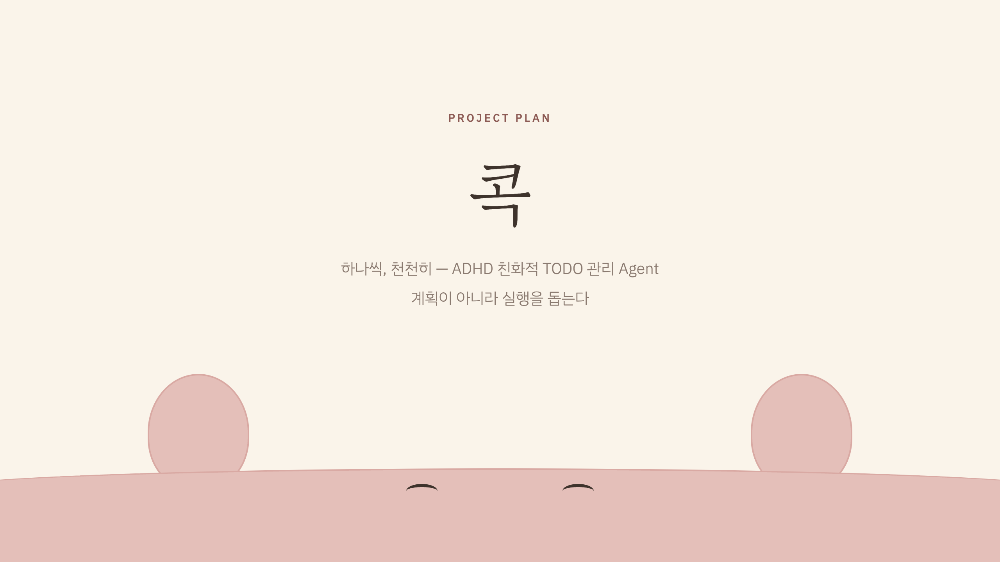
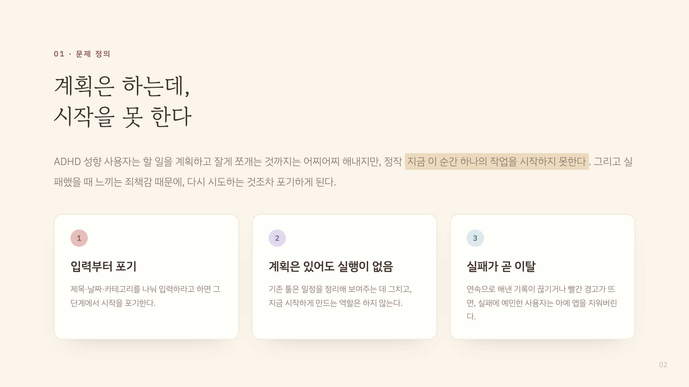
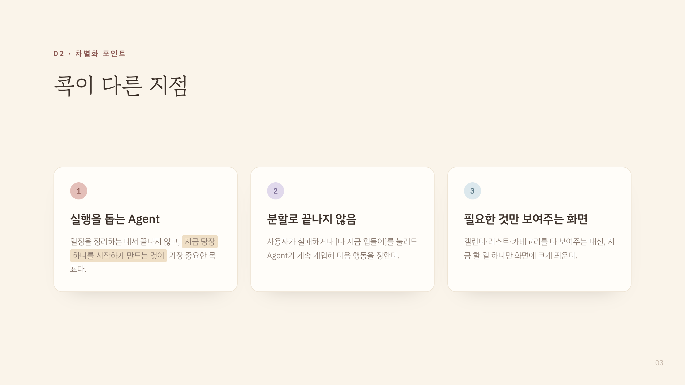
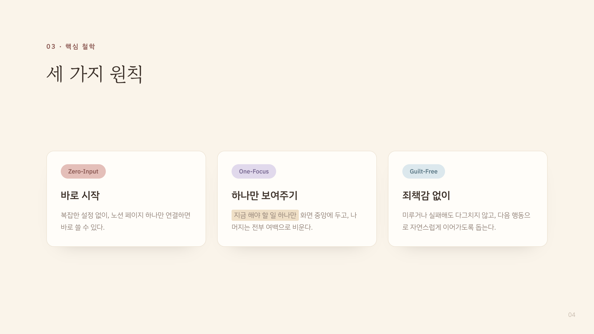
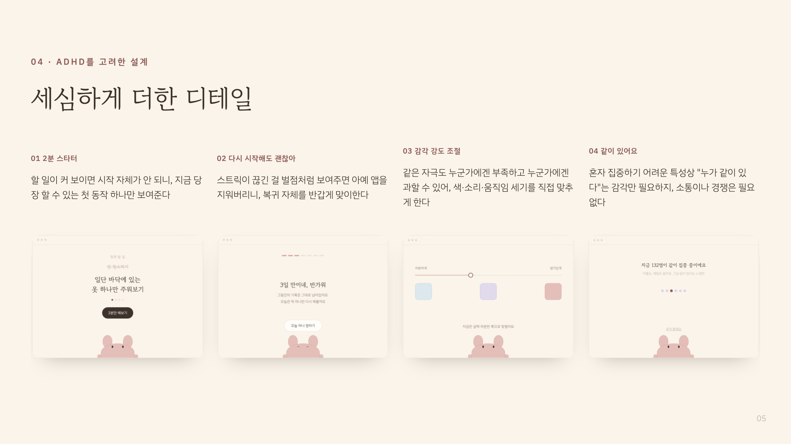
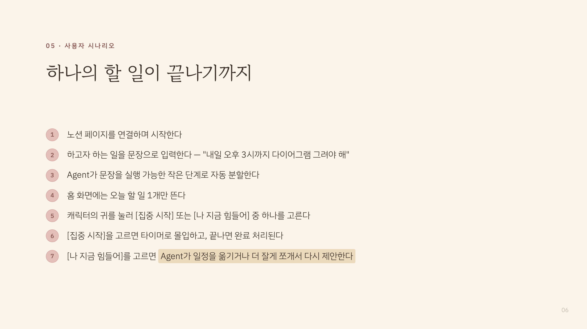
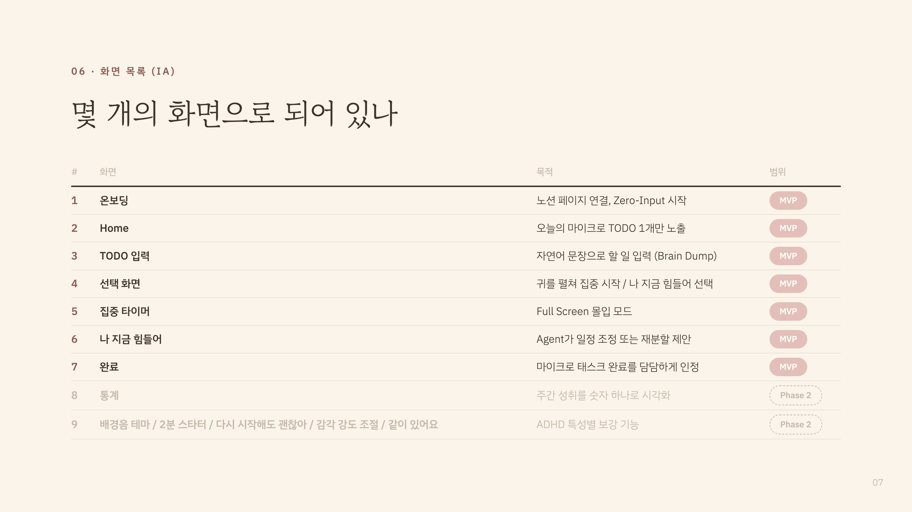
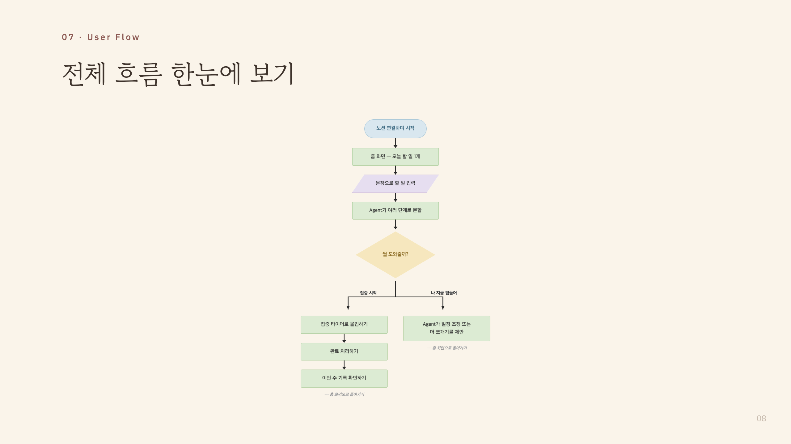
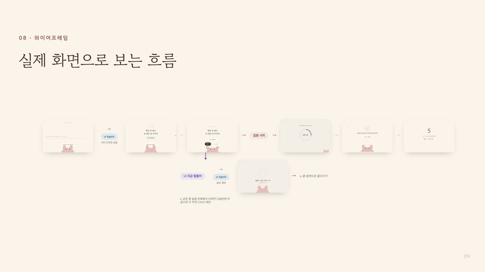
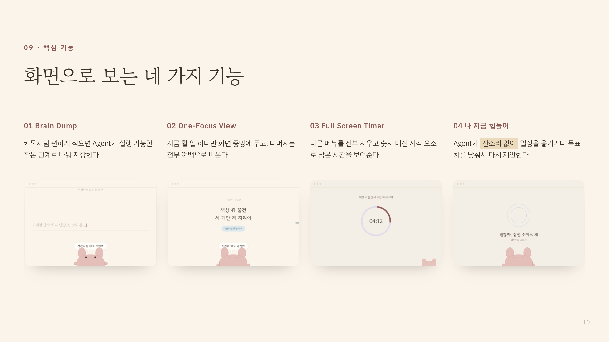
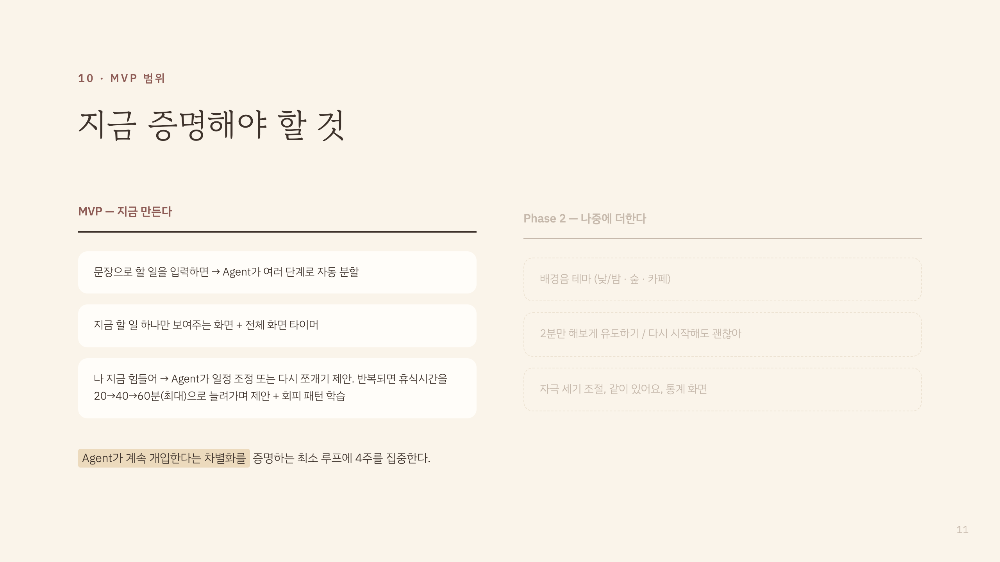
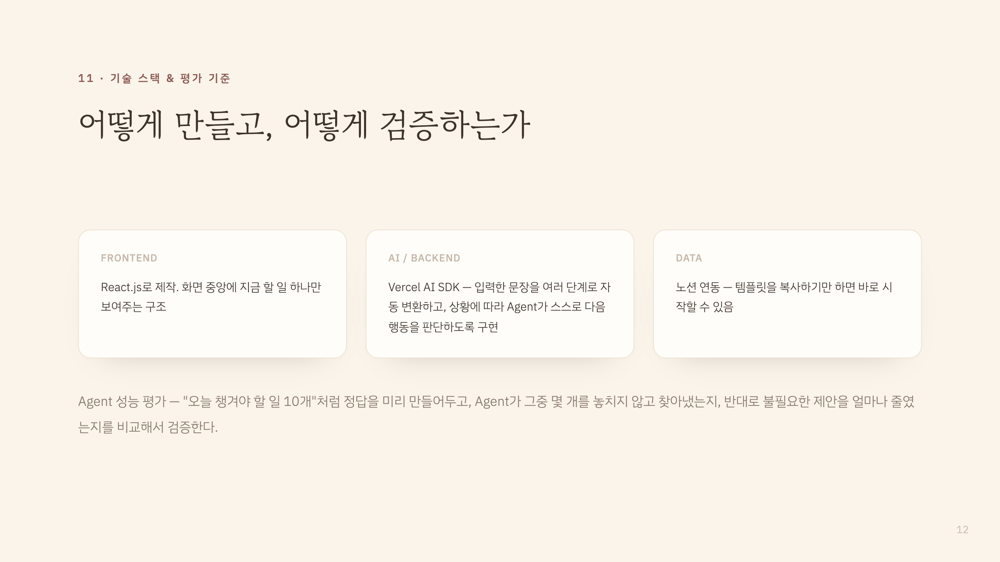