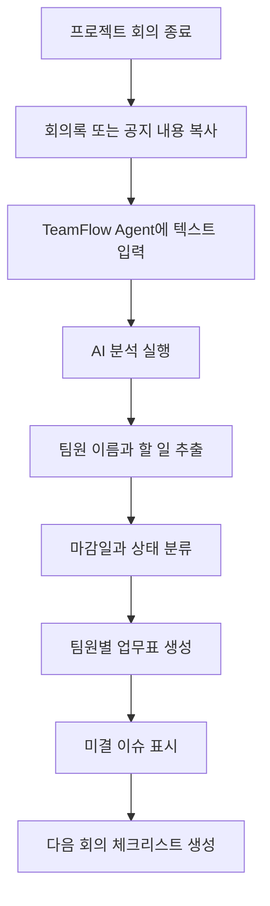

# TeamFlow Agent 기초 개발 기획서

## 1. 프로젝트 주제

**TeamFlow Agent - 대학생 프로젝트 업무 흐름 정리 에이전트**

TeamFlow Agent는 대학생 팀플, 공학설계, 졸업설계, 공모전, 동아리, 개인 사이드 프로젝트에서 회의록과 역할 분담 메모에 흩어진 내용을 분석해 팀원별 할 일, 마감일, 미결 이슈, 다음 회의 체크리스트를 정리해주는 AI 에이전트이다.

## 2. 문제 정의

대학생이 진행하는 팀플, 공모전, 졸업설계, 동아리 프로젝트에서는 회의 내용, 역할 분담, 교수님/멘토 피드백, 제출 마감일이 카카오톡, 노션, 구글 문서, 개인 메모에 흩어져 있어 누가 무엇을 언제까지 해야 하는지 헷갈리는 경우가 많다.

그 결과 팀원 간 책임이 불명확해지고, 과제 마감 직전에 누락된 작업을 발견하거나 같은 내용을 여러 번 다시 정리하게 된다.

### 문제 정의 한 문장

> 팀플, 공모전, 졸업설계 같은 프로젝트를 진행하는 대학생이 여러 채널에 흩어진 회의 내용과 역할 분담을 관리하면서 팀원별 할 일, 마감일, 미결 이슈를 한눈에 파악하지 못해 작업 누락과 반복 정리를 겪는다.

## 3. 목표 사용자

- 팀플을 진행하는 대학생
- 공학설계 프로젝트 팀장
- 졸업설계 또는 공모전 팀원
- 동아리 프로젝트 운영자
- 개인 사이드 프로젝트를 관리하는 학생
- 여러 과제와 회의를 동시에 관리해야 하는 학생

## 4. 서비스 목표

회의록, 역할 분담 메모, 공모전 준비 회의 내용, 멘토 피드백을 입력하면 AI가 다음 정보를 자동으로 정리한다.

- 누가 맡았는가
- 무엇을 해야 하는가
- 언제까지 해야 하는가
- 아직 정해지지 않은 것은 무엇인가
- 다음 회의에서 확인할 것은 무엇인가

## 5. 사용자 시나리오

1. 팀장이 팀플, 공모전, 졸업설계 회의를 마친다.
2. 회의록, 카카오톡 공지, 역할 분담 메모, 멘토 피드백을 복사한다.
3. TeamFlow Agent의 입력창에 내용을 붙여넣는다.
4. AI가 팀원 이름, 담당 업무, 마감일, 확인 필요 항목을 추출한다.
5. 팀원별 업무표와 미결 이슈 목록이 생성된다.
6. 다음 회의에서 확인할 체크리스트가 생성된다.
7. 팀장은 정리된 결과를 팀원들에게 공유한다.

## 6. 핵심 기능 2개

### 기능 1. 팀플 문서 입력 및 할 일 추출

사용자가 회의록, 역할 분담 메모, 카카오톡 공지, 공모전 준비 메모, 멘토 피드백 내용을 텍스트로 입력하면 에이전트가 프로젝트 관리에 필요한 정보를 추출한다.

추출 항목:

- 팀원 이름
- 담당 업무
- 마감일
- 진행 상태
- 확인 필요 사항
- 담당자가 불명확한 항목

### 기능 2. 팀원별 업무 흐름표 생성

추출한 정보를 팀원별 표와 체크리스트로 정리한다.

생성 항목:

- 팀원별 할 일 표
- 마감일 기준 우선순위
- 미결 이슈 목록
- 담당자 불명확 항목
- 다음 회의 체크리스트

## 7. MVP 범위

### 포함 범위

- 회의록/역할 분담 메모/공모전 준비 메모 텍스트 입력
- 예시 입력 불러오기
- 팀원 이름, 업무, 마감일 추출 결과 표시
- 팀원별 업무표 표시
- 담당자 불명확 항목 강조
- 다음 회의 체크리스트 표시

### 제외 범위

- 카카오톡, 슬랙, 노션 자동 연동
- 음성 회의 자동 녹음 및 분석
- 실제 캘린더 자동 등록
- 팀원에게 자동 메시지 전송
- 기업 문서 시스템 연동
- 실제 법적 책임이 필요한 계약/공문 검토

## 8. 예시 입력

```text
오늘 회의에서 서준은 발표 자료 첫 장과 문제 정의 부분을 수요일까지 정리하기로 했다.
민지는 사용자 시나리오와 화면 흐름도를 목요일까지 만들기로 했다.
현우는 관련 사례 조사를 다음 회의 전까지 정리해야 한다.
아직 최종 발표 대본 담당자는 정하지 못했다.
다음 회의에서는 화면 흐름도와 핵심 기능 2개를 다시 확인하기로 했다.
```

## 9. 예시 출력

### 팀원별 업무표

| 팀원 | 업무 | 마감일 | 상태 | 확인 필요 |
| --- | --- | --- | --- | --- |
| 서준 | 발표 자료 첫 장, 문제 정의 정리 | 수요일 | 진행 중 | 발표 자료 형식 확인 |
| 민지 | 사용자 시나리오, 화면 흐름도 작성 | 목요일 | 진행 중 | Mermaid 또는 이미지 방식 선택 |
| 현우 | 관련 사례 조사 정리 | 다음 회의 전 | 진행 중 | 참고 링크 포함 여부 |
| 미정 | 최종 발표 대본 작성 | 미정 | 담당자 불명확 | 담당자 지정 필요 |

### 다음 회의 체크리스트

- 화면 흐름도가 서비스 사용 과정을 잘 보여주는지 확인
- 핵심 기능 2개가 문제 정의와 연결되는지 확인
- 최종 발표 대본 담당자 정하기
- 각 팀원의 마감일 변경 여부 확인

## 10. 사용자 흐름



## 11. 화면 구성

| 화면 | 목적 | 주요 요소 |
| --- | --- | --- |
| 홈 화면 | 서비스 목적 설명 | 서비스 이름, 한 줄 설명, 시작 버튼 |
| 문서 입력 화면 | 회의록/공지/공모전 준비 메모 입력 | 텍스트 입력창, 예시 입력 버튼, 분석 버튼 |
| 분석 결과 화면 | 팀원별 업무 확인 | 팀원별 업무표, 마감일, 상태, 확인 필요 항목 |
| 체크리스트 화면 | 다음 회의 준비 | 미결 이슈, 담당자 불명확 항목, 다음 회의 확인 항목 |

## 12. 기초 개발 방향

### 1차 구현 방식

처음에는 실제 AI API를 연결하지 않고, 정해진 예시 입력과 더미 분석 결과를 사용해 화면 흐름을 먼저 구현한다.

이렇게 하면 서비스가 어떤 흐름으로 동작해야 하는지 먼저 확인할 수 있고, 이후 AI 분석 기능을 붙이기 쉬워진다.

### 필요한 데이터 구조

```text
TaskItem
- member: 팀원 이름
- task: 담당 업무
- dueDate: 마감일
- status: 진행 상태
- note: 확인 필요 사항
```

```text
ChecklistItem
- text: 확인할 내용
- type: 일반 / 미결 / 담당자 불명확
```

### 화면에서 보여줄 기본 상태

- 입력 전: 예시 입력 안내
- 분석 중: 분석 중 메시지
- 분석 후: 팀원별 업무표와 체크리스트 표시
- 입력 없음: 회의록을 입력하라는 안내 표시

## 13. 개발 작업 분해

- 홈 화면 만들기
- 회의록 입력 화면 만들기
- 예시 입력 버튼 만들기
- 분석 버튼 만들기
- 더미 분석 결과 데이터 만들기
- 팀원별 업무표 컴포넌트 만들기
- 담당자 불명확 항목 강조 표시하기
- 다음 회의 체크리스트 컴포넌트 만들기
- 모바일에서도 읽기 좋게 반응형 정리하기
- README에 기획서와 실행 방법 링크 정리하기

## 14. 확장 방향

1차 MVP는 대학생 팀플, 공모전, 졸업설계처럼 학생이 실제로 진행하는 프로젝트 관리에 집중한다.

이후 같은 구조를 다음 분야로 확장할 수 있다.

- 건축/건설: 설계 회의록, 시공 이슈, 감리 지적사항 정리
- 조선업: 설계 변경, 배관/전기/의장 업체별 업무 정리
- 플랜트: 공정별 미결 이슈, 승인 필요 도면, 협력업체 작업 추적
- 제조 공장: 생산 라인 구축 일정, 장비 설치, 업체별 납기 관리
- 창업/공모전: 아이디어 검증, 역할 분담, 제출 자료, 발표 준비 일정 관리

## 15. 완료 기준

- 문제 정의가 대학생 팀플, 공모전, 졸업설계 상황과 직접 연결된다.
- 핵심 기능이 2개로 좁혀져 있다.
- 사용자 흐름을 Mermaid로 설명할 수 있다.
- 예시 입력과 출력이 실제 팀플이나 공모전 준비에서 쓸 수 있는 수준이다.
- 화면 구성과 개발 작업 분해가 기초 구현으로 이어질 수 있다.

## 16. 최종 요약

TeamFlow Agent는 대학생 팀플, 공모전, 졸업설계에서 자주 생기는 문제인 역할 분담, 마감일, 미결 이슈 누락을 줄이기 위한 에이전트이다.

회의록이나 공지 내용을 입력하면 AI가 팀원별 할 일과 다음 회의 체크리스트를 자동으로 정리한다. 작은 팀플 관리 도구로 시작하지만, 구조는 나중에 건설, 조선, 플랜트, 제조 프로젝트의 협력업체 업무 흐름 관리로 확장할 수 있다.
