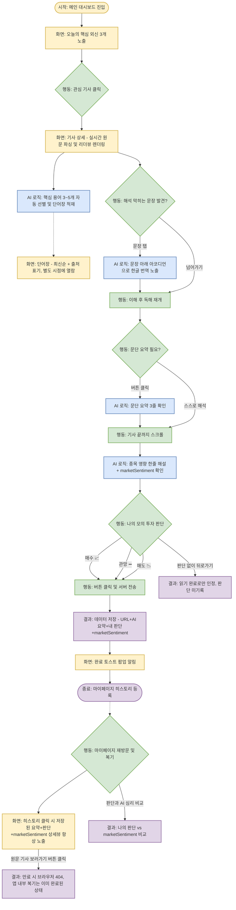

# 🚀 프로젝트 기획서: 브리플리 (Briefly)

**영문 뉴스 기반 해외 주식 모의 투자 학습 AI 에이전트**

---

## 1. 문제 발견 (Pain Points)

초보자가 해외 영문 뉴스를 통해 영어와 주식을 동시에 배우고자 할 때 겪는 세 가지 주요 장벽입니다.

- **언어적 측면 (전문 용어의 벽):** 경제 기사 특유의 은유적 표현(Bear/Bull)과 전문 용어(Ticker, Guidance)로 인해 번역기를 돌려도 문맥 파악이 어렵습니다.
- **정보적 측면 (정보 과부하):** 하루에도 쏟아지는 수많은 외신 중 어떤 뉴스가 주가에 실질적인 영향을 미치는지 선별할 기준이 없습니다.
- **경험적 측면 (인지적 충돌):** '어려운 영어 문장을 해석하는 것'과 '기업의 투자 가치를 분석하는 것'은 모두 뇌의 에너지를 심하게 소모하는 고부하 작업입니다. 이 두 가지를 동시에 하려다 보면 쉽게 피로해지고, 결국 주식도 영어도 흥미를 잃고 포기하게 됩니다.

## 2. 문제 정의 (Problem Definition)

- **누가:** 해외 주식 투자와 영문 뉴스 읽기에 처음 입문하려는 초보자가
- **어떤 상황에서:** 글로벌 시장 흐름을 파악하고 첫 투자 종목을 고르기 위해 외신에 접근할 때
- **무슨 불편을 겪는가:** 낯선 금융 영어와 방대한 정보량으로 인해 인지적 과부하를 겪으며 쉽게 지치고 포기하게 된다.

> **💡 통합 문제 정의**
> "해외 주식 및 영문 뉴스 초보자가 투자 정보를 얻기 위해 외신에 접근할 때, 금융 영어의 장벽과 정보 과부하로 인한 인지적 피로감 때문에 학습과 투자를 지속하지 못하고 포기한다."

## 3. 킥오프 목표

- **서비스 형태:** 웹 브라우저 (Web Browser)
- **정성적 목표:** 사용자가 영어 뉴스 읽기와 주식 분석을 '스트레스'가 아닌 '쉬운 큐레이션'으로 느끼게 한다.
- **성공 지표 (Success Metrics):** (2026-07-13 지표 분리 — "완독"과 "판단 수행"은 서로 다른 가치를 측정하므로 하나로 묶지 않는다)
  - **Primary — 주간 평균 완독 기사 수** (User Retention & Engagement): 독해 툴로서 얼마나 반복 사용되는가
  - **Secondary — 기사당 판단 인터랙션 수행률** (Conversion to Training): 독해에서 투자 훈련으로 얼마나 전환되는가
  - 판단 없이 완독만 하는 것도 "독해 툴"로서는 유의미한 성공 신호로 간주하며, 판단 참여율이 낮다고 해서 완독 데이터를 폐기하지 않는다.

## 4. 타겟 페르소나 및 제품 스코프

- **페르소나:** 영어 원문 기사와 해외 주식 투자 모두 경험이 없는 완전 초보자.
- **제품 스코프 (스코프 크리프 방어 논리):** 본 서비스는 실제 증권사 API와 연동된 매매 시스템이 아닌, 안전하게 시장을 학습하고 감각을 기르는 '모의 투자 판단 훈련 도구'임을 명확히 합니다.

## 5. 핵심 기능 및 MVP 우선순위

"이게 없으면 서비스가 굴러가는가?(필수성)"와 "문제 정의를 정확히 해결하는가?(적합성)"를 기준으로 도출된 4대 핵심 기능입니다. (2026-07-13: 논의를 거쳐 ④ 데일리 단어장을 Phase 2 후보에서 MVP 핵심 기능으로 승격, ①은 단어 인터랙션을 제거하고 문장 단위 번역으로 재설계)

### ① 원문 리더뷰 + 문장 단위 인라인 번역 (최우선순위)

- **기능:** 뉴스 원문을 깔끔한 리더뷰 형태로 렌더링. 해석이 막히는 문장을 탭하면 문장 바로 아래 빈 공간이 열리며(아코디언) 한글 번역이 노출됨. 팝업이 아닌 아코디언 방식을 택해, 긴 번역 텍스트가 원문 문장 자체를 가리지 않게 함.
- **정책:** 모든 문장이 아니라, LLM이 구조상 어렵다고 판단한 문장(긴 주어, 조동사구 중첩 등)만 선별적으로 탭 가능하게 표시. 원문 대신 번역만 읽게 되는 것을 방지하기 위함.
- **필수성:** 번역기를 따로 켜야 하는 이탈 지점을 기사 화면 안에서 바로 없애는, 브리플리만의 존재 이유입니다.
- **적합성:** 첫 번째 문제인 "금융 영어의 장벽" 중 문장 구조 난이도를 1:1로 겨냥합니다.

> **2026-07-13 재설계 이력**: 기존에는 전문용어 하이라이트+팝업(비유1줄+뜻1줄)이 이 기능의 핵심이었으나, "독해(리더뷰)"와 "단어 암기(단어장)"의 인지적 과정을 분리하기로 하면서 단어 인터랙션은 리더뷰에서 완전히 제거하고 ④ 데일리 단어장으로 이전했다. 리더뷰에서 언어 장벽을 해소하는 역할은 이제 문장 단위 번역이 전담한다.

### ② AI 문단 요약 + 종목 영향 한 줄 해설

- **기능:** 문단별 3줄 불릿(Bullet) 요약 제공 및 기사 하단에 "이 기사가 주가에 미치는 영향"을 AI가 한 줄로 브리핑.
- **필수성:** 문장 번역만으로 주가 영향을 스스로 연결하지 못하면 피로가 가중됩니다. '언어 해석'과 '투자 가치 분석'이라는 두 인지 작업 사이의 다리를 놓는 필수 장치입니다.
- **적합성:** 정보 과부하와 인지적 충돌 문제를 동시에 낮추어 뇌의 에너지 소모를 방지합니다.

### ③ 완독 후 투자심리 인터랙션 (매수/관망/매도 버튼) + AI 심리 비교

- **기능:** 기사 최하단에서 모의 투자 판단을 선택하고 마이페이지에 히스토리로 기록. 기사 분석 시 AI가 판별한 기사의 객관적 톤(`marketSentiment`: 호재/악재/중립)을 함께 저장해, 마이페이지에서 "나의 판단"과 "AI가 본 기사 톤"을 나란히 비교할 수 있게 함.
- **필수성:** 킥오프에서 정한 Secondary 지표(판단 인터랙션 수행률)를 실제로 측정할 수 있는 유일한 데이터 포인트입니다. AI 심리 비교는 "내 판단이 타당했는지" 확인할 기준점이 전혀 없던 빈틈을 최소 비용으로 메웁니다.
- **적합성:** 능동적 행동을 유도해 "나도 투자자처럼 생각했다"는 완결감을 부여하며, 서비스 이탈을 막고 지속성을 만듭니다. 마이페이지의 역할이 "단순 기록"에서 "나의 시장 해석 능력을 스스로 점검하는 공간"으로 격상됩니다.

> **정책 추가 (2026-07-13)**: 사용자가 매수/관망/매도 판단을 내리지 않고 단순 열람이나 뒤로 가기를 해도 "기사 읽기 완료"로 인정한다. 이는 3번 킥오프 목표에서 완독(Primary)과 판단 수행(Secondary)을 별도 지표로 분리하기로 한 결정과 일치한다 — 판단을 스킵해도 완독 자체는 유의미한 성공 신호로 집계된다.

> **링크 만료 대응 UX (2026-07-13)**: 서버가 원문 링크의 만료 여부(404/403 등)를 판단하는 로직은 만들지 않는다. 대신 마이페이지에서 히스토리 항목을 클릭하면 **항상** 저장된 요약본·나의 판단·`marketSentiment`를 보여주는 상세 화면(모달 또는 별도 뷰)이 먼저 뜨고, 그 하단에 `[원문 기사 보러가기 ↗]` 버튼을 둔다. 만료된 링크는 사용자가 그 버튼을 눌렀을 때 브라우저에서 자연스럽게 404를 보게 될 뿐, 앱 내부의 복기 목적은 이미 달성된 상태라 서버 측 만료 감지가 필요 없어진다.

### ④ 데일리 단어장 (핵심 용어 자동 큐레이션)

- **기능:** 기사 분석 시 AI가 해당 기사의 핵심 금융 용어 3~5개를 자동으로 선별해, 사용자의 탭 여부와 무관하게 단어장에 자동 적재. 단어장은 최신순(시간 역순)으로 정렬되며, 각 단어 하단에 출처(기사 제목/URL)를 표기해 문맥 기반 복습을 유도. 출처를 클릭하면 해당 기사로 이동.
- **정책:** "내가 몰랐던 단어"가 아니라 "오늘 읽은 기사 속 핵심 용어"로 개념을 재정의 — 사용자 행동에 의존하지 않아 하루 3개 기사 기준 10~15개의 단어가 안정적으로 쌓임.
- **필수성:** 리더뷰에서 단어 인터랙션을 제거했기 때문에, 언어 학습(용어 암기)이라는 문제 정의의 축을 담당할 유일한 장치가 됨.
- **적합성:** "독해"와 "암기"라는 서로 다른 인지 작업을 화면 단위로 분리해, 리더뷰에서는 읽기에만 집중하고 복습은 별도 화면에서 몰아서 하게 함으로써 인지적 충돌을 줄임.

## 6. 핵심 사용자 시나리오

**시나리오 목표:** 번역기나 사전 없이 브리플리 화면 안에서 영문 기사를 완독하고, 주가 영향을 이해한 뒤 모의 투자 판단을 내리는 것.

**Step 1: 기사 진입 (리더뷰 시작)**
사용자가 대시보드에서 큐레이션 된 외신 카드(로고+영문 제목+한 줄 번역)를 클릭합니다. 불필요한 요소가 제거된 깔끔한 리더뷰 형태의 원문이 실시간 파싱되어 렌더링됩니다.

**Step 2: 원문 독해 및 언어 장벽 해소 (문장 단위 인라인 번역)**
기사를 읽다 해석이 막히는 문장을 탭합니다. 팝업 없이 해당 문장 바로 아래 빈 공간이 열리며(아코디언) 깔끔한 한글 번역이 나타납니다. 원문 문장이 가려지지 않아 매끄럽게 독해를 이어갑니다. (단어 자체는 리더뷰에서 별도로 다루지 않으며, Step 5의 단어장에서 자동으로 다뤄집니다.)

**Step 3: 정보 소화 및 투자 가치 연결 (AI 요약 + 종목 영향)**
AI 3줄 요약을 활용해 맥락을 파악하며 기사 끝까지 스크롤합니다. 기사 하단의 'AI 인사이트 패널'에서 이 뉴스가 단기적으로 주가에 어떤 영향을 미칠지 AI의 한 줄 브리핑을 확인하여 인지적 부담을 해소합니다.

**Step 4: 의사결정 및 히스토리 보존 (투자 판단 기록)**
기사와 브리핑을 바탕으로 하단의 **[ 매수 📈 ] / [ 관망 ➖ ] / [ 매도 📉 ]** 버튼 중 하나를 클릭하여 모의 투자 판단을 내립니다. 클릭 즉시 서버에 `기사 URL`, `AI 요약본`, `나의 선택`, AI가 분석한 `marketSentiment`가 데이터로 저장됩니다. 저장이 성공적으로 완료되면 "오늘의 모의 투자 판단 완료!" 토스트 팝업이 노출됩니다. 추후 기사 원문 URL이 페이월(Paywall)에 막히거나 만료되더라도, 함께 저장된 'AI 요약본과 판단 기록'을 통해 학습 복기가 가능합니다. (판단 없이 뒤로 가기를 해도 "기사 읽기"는 완료로 인정됩니다.)

**Step 5: 단어 복습 (단어장, 리더뷰와 독립)**
Step 2~4와 무관하게, 기사를 분석하는 시점에 AI가 선별한 핵심 용어 3~5개가 자동으로 단어장에 적재됩니다. 사용자는 원할 때 단어장 화면에 들어가 최신순으로 쌓인 용어들을 몰아서 복습하고, 출처(기사 제목)를 눌러 해당 기사로 돌아가 문맥을 다시 확인할 수 있습니다.

## 7. 사용자 플로우차트 (Mermaid)

> 💡 **안내:** 위 6번의 '핵심 사용자 시나리오'를 바탕으로, 개발 및 디자인 파트와의 명확한 소통을 위해 화면(노랑)·사용자 행동(초록)·AI 로직(파랑)·결과 및 데이터(보라)의 흐름을 시각적으로 도식화한 다이어그램입니다.

---

## 부록: 추가 기능 후보 (Phase 2)

핵심 기능 4개(①②③④)는 MVP 범위로 고정하고, 아래는 유사 서비스 조사 및 팀 논의를 거쳐 도출한 **Phase 2 후보**입니다. 구현 비용(기존 인프라와의 시너지)과 문제 정의와의 적합성 두 기준으로 평가했습니다.

### Tier 1 — 낮은 비용, 핵심과 직결 (우선 검토)

| 기능 | 왜 낮은 비용인가 | 왜 적합한가 |
|---|---|---|
| 다크 모드 | 디자인 토큰 시스템(`SKILL.md`)에 다크 토큰 세트만 추가하면 됨 | 텍스트를 오래 읽는 리더 앱 특성상 표준 기능 |
| 경제 캘린더 (비UI) | 새 화면·컴포넌트 불필요, 대시보드 큐레이션 로직에 조건 하나만 추가 | `api-spec.md`에 명시된 "실제 외신 수집·선별 로직 미구현" 구멍을 채워줌 — 화면이 아니라 대시보드가 오늘 기사를 고르는 내부 신호로만 사용 |
| TTS 오디오 모드 | 브라우저 내장 Web Speech API로 외부 연동 없이 구현 가능 | "화면 보기 힘든 상황" 편의성 문제 해결. 다만 티커 기호($SPX)·축약어(YoY, MoM) 발음에 한계가 있어 Tier 1 내에서도 우선순위는 가장 낮음 |

> 나만의 단어장은 2026-07-13 논의를 거쳐 Phase 2 후보에서 MVP 핵심 기능 ④로 승격됨(5번 항목 참고). 연속 읽기 스트릭+뱃지는 후보에서 제외.

### Tier 2 — 가치는 있지만 외부 연동 필요 (Phase 2 검토)

| 기능 | 필요한 새 인프라 | 비고 |
|---|---|---|
| 가상 수익률 트래킹 | 실시간/이력 주가 데이터 API 신규 연동 | 투자심리 인터랙션(기능③)의 자연스러운 다음 단계라 적합성은 높으나 구현 비용 큼 |
| 관심 섹터 개인화 피드 | 온보딩 화면 신규 필요 | v1 피벗 때 뺐던 온보딩이 다시 필요해짐 — 신중해야 함 |
| 인라인 티커 차트 | 실시간 시세 API 신규 연동 | 리더뷰 안에서 완결되는 경험이라 몰입 유지에는 도움 |
| 기업 펀더멘털 요약 | 재무 데이터 API 신규 연동 | 위 두 개와 비슷한 비용 구조, 상대적으로 낮은 우선순위 |

### Tier 3 — 추가하지 않음

| 기능 | 이유 |
|---|---|
| 시장 히트맵 | 개별 기사 몰입 완독이라는 핵심 경험과 무관한 완전히 새로운 화면 필요 |
| 경제 캘린더 (UI 화면 형태) | 위와 같은 이유. 데이터 자체는 Tier 1로 채택하되, 화면으로는 만들지 않음 |

