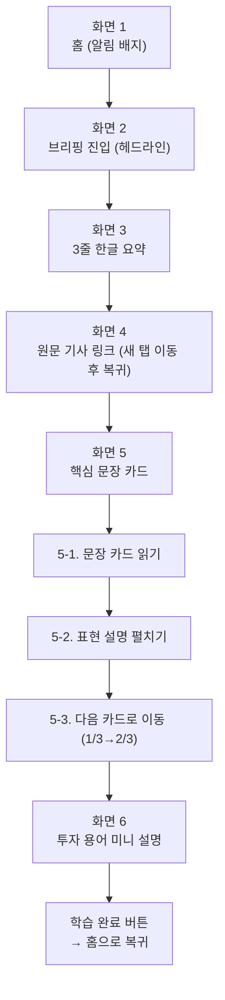

# 기획서 — 해외주식투자 & 실전영어 학습 브리핑 서비스

## 문제 정의

해외주식에 관심이 생긴 투자 초보 대학생은, 정보를 얻기 위해 야후 파이낸스 등 영어 뉴스를 찾아 읽어도 금융 전문용어와 실전 영어 표현을 동시에 해석해야 하는 이중 부담 때문에 기사 하나를 소화하는 데 오래 걸리고, 결국 꾸준히 읽지 못해 투자 감각도 영어 실력도 쌓이지 않는다.

- **누가**: 해외주식에 관심 있는 투자 초보 대학생 (영어 실력 확장 + 해외투자 입문을 동시에 원하는 사용자)
- **어떤 상황에서**: 야후 파이낸스 등 해외 영어 뉴스로 정보를 얻으려 할 때
- **무슨 불편**: 금융 전문용어와 실전 영어 표현의 이중 장벽으로 기사 이해가 느리고, 꾸준한 학습·투자 습관으로 이어지지 못함

## 사용자 시나리오

**핵심 시나리오: 데일리 브리핑 학습 (MVP)**

서비스에 로그인한 사용자가 매일 아침 자신의 관심 종목 관련 뉴스를 브리핑 형태로 학습하는 흐름.

1. 앱에 로그인하면 홈 화면에 "오늘의 브리핑" 알림 배지가 떠 있다.
2. 오늘의 브리핑을 연다.
3. 오늘의 관심 종목 뉴스 헤드라인과 3줄 한글 요약을 본다.
4. 원문 기사 링크를 클릭해 새 탭으로 이동한다. → 확인 후 다시 앱으로 돌아온다.
5. 핵심 문장 카드를 확인한다.
   - 5-1. 첫 번째 문장 카드(원문+해석)를 읽는다.
   - 5-2. 표현 설명 박스를 탭해 뜻/용례를 펼쳐본다.
   - 5-3. 다음 문장 카드로 넘긴다. (인디케이터 1/3 → 2/3)
6. 문장 속 투자 용어(예: EPS, guidance) 미니 설명을 확인한다.
7. "오늘 학습 마치기" 버튼을 눌러 홈 화면으로 돌아온다.

> 퀴즈/정답확인/스트릭 갱신 단계는 Phase 2로 유보 (MVP는 "읽고 이해하는 것"까지를 핵심 가치로 설정)

## 핵심 기능 (2개)

**선정 기준**: ① 필수성 — 이게 없으면 서비스가 안 돌아가는가 / ② 적합성 — 문제 정의를 정확히 해결하는가

### 기능 A. 관심종목/섹터 기반 뉴스 큐레이션

**무엇을 하는 기능인가**: 사용자가 온보딩에서 선택한 관심 종목/섹터를 기준으로, 매일 아침 브리핑에 담을 뉴스 기사를 야후 파이낸스에서 선별해오는 기능.

- **필수성**: 뉴스 수집기가 "무엇을 가져올지" 결정하는 유일한 입력값. 없으면 콘텐츠 생성 파이프라인의 첫 단계(기사 선별)가 물리적으로 시작되지 않고, 화면 2 이후 모든 화면이 빈 화면이 됨
- **적합성**: 문제 정의의 대상("해외주식에 관심이 생긴 대학생")이 이미 개인화된 관심 대상을 전제로 함. 이 기능이 없으면 일반 경제뉴스 요약 앱과 다를 바 없어져 타겟 니즈와 어긋남

**구체적 동작**
1. 온보딩에서 사용자가 관심 종목/섹터 선택 (복수 선택 가능)
2. 매일 지정 시간에 뉴스 수집기가 야후 파이낸스에서 관련 기사 검색
3. 오늘 발송할 기사 1개 선정: **관심 종목 전체 중 발행 시각이 가장 최신인 기사를 우선 선정** (관심 종목이 여러 개여도 별도 우선순위 설정 없이 "가장 최신 소식"을 기준으로 자동 선정)
4. 화면 2~4에 헤드라인, 요약, 원문 링크로 반영

> Phase 2 고려사항: 특정 종목에 뉴스가 몰려 다른 관심 종목이 계속 노출되지 않는 경우를 대비해, 종목별 로테이션 로직을 보완 검토

**완료 조건 (Acceptance Criteria)**
- [ ] 사용자가 등록한 관심 종목과 무관한 기사가 브리핑에 노출되지 않는다
- [ ] 관심 종목 관련 기사가 없는 날에도 앱이 정상 작동한다 (대체 로직 발동)

### 기능 B. 난이도별 콘텐츠/표현 조절

**무엇을 하는 기능인가**: 사용자의 영어 실력 수준에 맞춰, 화면 5(핵심 문장+표현 해설)에서 다루는 표현의 난이도와 설명 방식을 조절하는 기능.

- **필수성**: 고정 난이도로도 형식적으로는 서비스가 작동하지만, 초급자에게는 너무 어렵고 고급자에게는 너무 쉬워져 "서비스는 켜져 있지만 아무도 제대로 못 쓰는" 상태가 됨
- **적합성**: 문제 정의의 핵심 문장인 "금융 전문용어와 실전 영어 표현의 이중 부담"을 정면으로 해결하는 유일한 기능. 이 기능이 없으면 서비스의 존재 이유 자체가 사라짐

**난이도 판단 방식**: 온보딩에서 사용자가 직접 선택 (초급/중급/고급)
> 레벨 테스트(Phase 2)나 AI 자동 조정(Phase 3)은 더 정확하지만, MVP 단계에서는 구현 비용 대비 효과가 낮아 제외. 자기 선택도 난이도 조절의 유효한 입력값이며, 정교화는 이후 단계에서 고도화

**적용 범위**: 화면 5(핵심 문장+표현 해설)에만 적용 (MVP 범위 최소화). 화면 6(투자 용어 설명)은 모든 사용자에게 동일한 기본 설명 제공 — 난이도 조절은 영어 표현 학습이 핵심인 화면 5로 한정

**구체적 동작**
1. 온보딩에서 사용자가 영어 실력 수준 선택 (초급/중급/고급)
2. 화면 5의 표현 설명 아코디언 내용이 수준에 따라 달라짐 (초급: 쉬운 동의어+한글 설명 위주 / 고급: 원어 뉘앙스+실전 예문 위주)
3. 문장 카드에서 하이라이트되는 표현의 개수·난이도도 수준별로 조절

**완료 조건 (Acceptance Criteria)**
- [ ] 초급/중급/고급 설정에 따라 화면 5의 표현 설명 내용이 실제로 달라진다
- [ ] 동일한 기사라도 사용자 수준에 따라 하이라이트되는 표현이 다르게 선택된다

## 화면 흐름

> 상세 와이어프레임은 Figma 참고: `[Figma 링크 삽입]`

### Figma 배치 원칙

- 프레임 크기: 모바일 기준 375×812 (iPhone 표준)로 6개 화면 통일
- 배치 순서: 왼쪽→오른쪽, 위→아래로 화면 번호 순서대로 배치 (2행 3열: 화면1~3 상단, 화면4~6 하단), 프레임 간격 100px
- 프레임 이름 규칙: `01_홈`, `02_브리핑진입`, `03_요약`, `04_원문링크`, `05_핵심문장`, `06_투자용어` (번호 접두어로 레이어 패널 정렬)
- 공통 요소(진행 표시줄, 상단 네비게이션, 하단 CTA 버튼)는 Figma Component로 분리해 인스턴스로 재사용
- 화면 간 연결은 Prototype 탭에서 각 CTA를 다음 화면으로 드래그하여 연결

### 화면 5 상세 요소 (핵심 문장 + 표현 해설)

시나리오 5-1~5-3의 인터랙션이 몰려있는 화면이라 별도로 상세화함.

| 순서 | 요소 | 설명 | 대응 시나리오 |
|---|---|---|---|
| 1 | 상단 네비게이션 | 좌: 뒤로가기, 중앙: "오늘의 핵심 문장" 타이틀, 우: 홈 아이콘 | 공통 |
| 2 | 진행 표시줄 | 전체 6단계 중 5단계 위치 표시 | 공통 |
| 3 | 문장 카드 | 영어 원문 + 한글 해석, 카드 배경으로 구분 | 5-1 |
| 4 | 표현 하이라이트 | 문장 내 핵심 표현에 색상 강조 (예: guidance) | 5-1 |
| 5 | 표현 설명 아코디언 | 기본 접힘 → 탭하면 뜻+예문 펼침 | 5-2 |
| 6 | 카드 개수 인디케이터 | 점 형태, 현재 카드 위치 표시 (1/3) | 5-3 진입 전 상태 |
| 7 | "다음 문장" 버튼 | 하단 전체 너비 버튼, 클릭 시 인디케이터 이동 | 5-3 |

**인터랙션 상태 3가지**
1. 5-1 기본 상태: 아코디언 접힘, 문장만 읽는 상태
2. 5-2 펼침 상태: 아코디언 탭 → 표현 설명 확장 (Figma Variants로 관리)
3. 5-3 카드 전환: "다음 문장" 클릭 → 인디케이터 이동 + 카드 내용 교체 (별도 프레임 3개로 만들어 Prototype 연결)

---

## 부록 (참고용)

### 서비스 목표 (MVP KPI)
- North Star: 브리핑 열람 완료율 (화면 6까지 도달한 비율)
- 보조 지표: 브리핑 오픈율, 평균 체류시간, 4주 차 리텐션율

### 주요 엣지케이스
- 관심 종목에 뉴스가 없는 날의 콘텐츠 대체 로직
- AI 요약/해석 오류에 대한 검증 프로세스
- 투자자문업 규제 경계 및 저작권(짧은 발췌 원칙) 준수
- 크롤링 소스 의존 리스크 (야후 파이낸스 정책 변경 대응)

### 향후 확장 후보 (Phase 2)
- 확인 퀴즈 및 학습 완료율 측정
- 망각곡선 기반 자동 복습 스케줄링
- 경제 캘린더 연동 (실적발표/금리결정 등 이벤트 기반 콘텐츠 기획)
