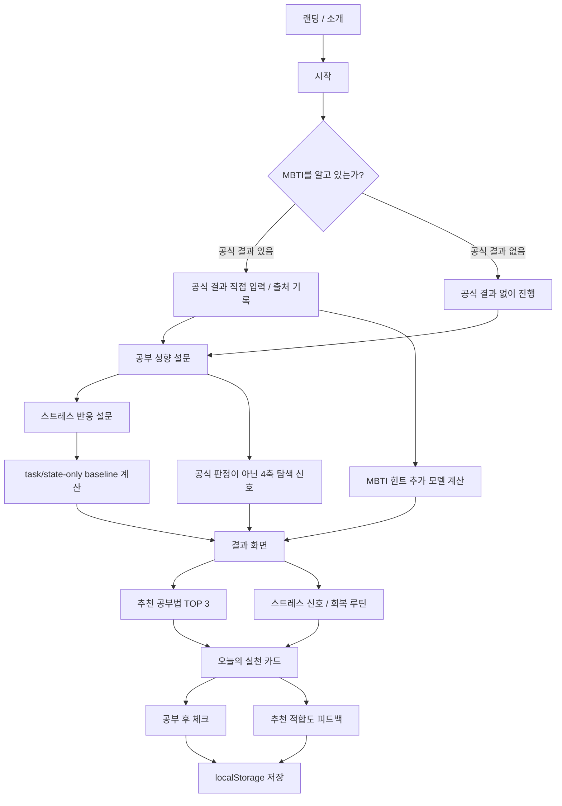

# plan.md — MBTI 기반 공부법 및 스트레스 관리 웹앱

## 한 줄 정의

**MBTI 기반 공부법 및 스트레스 관리 웹앱**은 사용자가 보유한 공식 MBTI 결과와 짧은 공부습관·스트레스 자체 점검을 분리해 입력받고, 과업·상태 중심 baseline과 MBTI 힌트 추가 모델을 비교하여 인지과학 학습 전략과 실행 가능한 공부·회복 루틴을 제안하고 검증하는 적응형 학습 지원 웹앱이다.

MBTI는 이 서비스에서 "정답"이 아니라 **초기 선호 가설**이다. 실제 추천은 MBTI 유형명만으로 결정하지 않고, 공부 행동 설문과 스트레스 반응 설문을 함께 사용해 보정한다.

---

## 0. 문서 역할

이 문서는 제품의 최종 기준 기획서다. 현재 동작하는 MVP, 검증 가능한 베타, 장기 확장을 구분하고 문제 정의, 타겟 사용자, 핵심 가치, 사용자 시나리오, 추천 알고리즘, 데이터 전략, User Flow, IA, 구현 전제와 리스크를 정리한다.

세부 컴포넌트 구현, 코드 구조, 테스트 케이스, 배포 설정은 별도 `checklist.md`와 개발 문서에서 다룬다.

---

## 1. 배경

### 문제 상황

많은 학습자는 유튜브, 블로그, 책, 주변 사람의 조언을 통해 여러 공부법을 접한다. 하지만 실제로는 유명한 공부법을 그대로 따라 해도 오래 지속하기 어렵거나, 계획이 무너지고, 스트레스가 쌓이며, 결국 "나는 의지가 부족하다"라고 해석하는 경우가 많다.

특히 시험 준비, 전공 공부, 자격증, 어학, 취업 준비처럼 장기적으로 공부해야 하는 상황에서는 단순한 공부법 정보보다 **내가 어떤 환경에서 집중하는지, 어떤 방식으로 기억하는지, 어떤 상황에서 피로가 쌓이는지**를 아는 것이 중요하다.

### 문제 원인

- 공부법은 많지만, 사용자가 자신의 성향과 상태에 맞게 적용하기 어렵다.
- MBTI 콘텐츠는 흥미롭지만, 16유형별 성격풀이에 그치면 실제 공부 행동으로 이어지기 어렵다.
- 계획표 앱은 할 일을 관리해주지만, 왜 계획이 반복적으로 무너지는지는 설명하기 어렵다.
- 스트레스 관리 앱은 회복을 돕지만, 공부 루틴과 직접 연결되지 않는 경우가 많다.
- 사용자는 실패 원인을 전략 문제보다 의지 부족이나 성격 문제로 해석하기 쉽다.

### 필요한 도구

단순히 "MBTI별 공부법"을 알려주는 도구가 아니라, 사용자의 MBTI를 출발점으로 삼되 공부 행동과 스트레스 반응을 함께 분석하여 **나에게 맞는 학습 전략, 시간관리 방식, 회복 루틴**을 제안하는 도구가 필요하다.

### 우리가 해결하고자 하는 바

사용자가 자신의 학습 선호와 피로 패턴을 이해하고, 인지과학적으로 효과가 알려진 학습법을 자신의 성향에 맞게 적용하도록 돕는다.

### 우리가 제공하는 가치

핵심 가치는 "더 많이 공부하기"가 아니라 **나에게 맞는 방식으로 오래 지속하는 공부 루틴을 만드는 것**이다.

---

## 2. 문제 정의

### 한 문장 문제 정의

> 사용자는 좋은 공부법을 알고도 자신의 집중 방식, 계획 선호, 스트레스 반응에 맞게 적용하기 어려워 공부를 지속하기 어렵다.

### 해결책 없이 문제만 보기

이 프로젝트의 문제는 "MBTI별 공부법 정보가 부족하다"가 아니다. 진짜 문제는 사용자가 이미 알고 있는 공부법을 자신의 성향과 현재 상태에 맞게 바꾸기 어려워 실천에 실패한다는 점이다.

---

## 3. 문제 리프레임

### 기존 프레임

> MBTI 유형별로 잘 맞는 공부법을 추천한다.

### 개선 프레임

> MBTI를 입구로 사용하되, 실제 추천은 행동지표와 인지과학적 학습 원리를 결합해 제공한다.

### 리프레임 근거

처음 아이디어는 "MBTI별 공부법 추천"에 가까웠다. 하지만 이 방식은 16유형별 고정 설명으로 흐를 위험이 있다. 따라서 문제의 축을 "유형별 성격풀이"에서 "내 성향에 맞게 학습 전략을 적용하지 못하는 문제"로 옮긴다.

MBTI는 사용자가 쉽게 진입하도록 돕는 친숙한 언어이며, 실제 추천의 근거는 다음 세 가지로 구성한다.

1. MBTI 선호 축
2. 공부 행동 설문
3. 스트레스 반응 설문

### 새 아이디어를 반영한 제품 프레임

이 프로젝트는 단순한 결과 페이지에서 **평가 → 가이드라인 → 실행 → 피드백 → 알고리즘 개선**이 이어지는 학습 의사결정 보조 도구로 발전한다.

```text
친숙한 진입점(MBTI)
→ 공부 행동·피로 맥락 관측
→ 설명 가능한 규칙 기반 추천
→ 오늘의 공부·회복 루틴
→ 추천 적합도와 실행 피드백
→ 근거·문항·가중치 검토
```

여기서 평가는 사용자의 능력이나 정신건강을 판정하는 절차가 아니다. 사용자가 현재 어떤 전략을 시도해볼지 정하기 위한 **자기보고 기반 관측**이며, 점수는 추천 엔진의 내부 신호다.

### 제품 단계와 범위

| 단계 | 목표 | 데이터 | 기술 경계 |
| --- | --- | --- | --- |
| 현재 MVP | 입력에서 설명 가능한 추천과 실천 카드까지 연결 | 브라우저 localStorage | 로그인·서버·AI API 없음 |
| 검증 베타 | 추천 적합도·이해도·실행 가능성과 이탈을 측정 | 동의 설계 전까지 로컬 피드백 | 알고리즘 버전과 측정 계획 우선 |
| 동의 기반 베타 | 반복 사용과 추천 개선 가능성 검증 | 별도 서버, 최소 수집, 삭제 지원 | 개인정보·보안 검토 후 계정 도입 |
| 장기 확장 | 학업·논문·연구 과업의 전략 가이드와 외부 채널 검토 | 목적별 분리 저장 | 공식 API와 효과 검증이 있는 경우만 연동 |

“빅데이터”는 현재 보유 역량이 아니라 장기 데이터 전략이다. 표본 수를 늘리는 것보다 **무엇을 왜 측정하고, 어떤 편향과 결측이 있으며, 어떤 기준으로 알고리즘을 바꿀지**를 먼저 정의한다. 세부 기준은 [`evidence-data-roadmap.md`](./evidence-data-roadmap.md)를 따른다.

### 이번 재구성에서 확정한 입력 원칙

1. **공식 결과 입력 경로**: 사용자가 공식 MBTI 평가에서 이미 받은 4글자 결과를 직접 입력한다. 앱은 공식 문항을 제공·복제·채점하지 않는다.
2. **공부습관 자체 점검 경로**: 독자적으로 작성한 소수의 상황형 문항으로 행동지표와 4축 탐색 신호를 만든다.
3. **탐색 신호의 경계**: 4축 탐색 코드는 공식 MBTI 판정이 아니며, 현재 추천 가중치에 자동 투입하지 않는다.
4. **저작권·상표 경계**: 공식 문항을 표현만 바꾸어 재가공하는 방식은 채택하지 않는다. 독자 문항은 clean-room 방식으로 개발하고, 공식 도구 사용은 별도 라이선스·자격 경로로 분리한다.
5. **사용자 최종 판단 존중**: 공식 MBTI 결과도 개인을 고정하거나 선발·제한하는 기준으로 쓰지 않는다.

### 이 프로젝트에서 “귀납적 정확도”의 의미

이 프로젝트는 MBTI 자체가 참임을 데이터 양으로 증명하려 하지 않는다. 귀납적 정확도는 다음 질문에 대한 반복 가능한 예측·검증 성능을 뜻한다.

- 공식 MBTI 결과 또는 연속형 선호 신호가 생활·학습 행동과 안정적으로 연관되는가
- task/state 정보만 사용한 모델에 MBTI 신호를 추가했을 때 설명력·예측력·실행률이 개선되는가
- 특정 학습 전략의 효과가 MBTI 관련 신호에 따라 달라지는 조절효과가 있는가
- 추천이 만족스러운가와 별개로 실행률·지연 학습성과·부담이 개선되는가

검증 지표는 신뢰도, 요인구조, 수렴·판별타당도, 증분타당도, calibration, 실제 효용으로 분리한다. “정확도” 하나로 합치지 않는다.

### 핵심 연구 가설

| 가설 | 내용 | 현재 상태 |
| --- | --- | --- |
| H1 | 인출·분산·교차·자기설명은 MBTI와 무관하게 기본 학습전략 후보가 된다. | 문헌 근거 카탈로그 필요 |
| H2 | 과업 종류, 선행지식, 가용시간, 피로·계획 부담이 전략의 효과와 실행 가능성을 조절한다. | task/state 입력 확장 필요 |
| H3 | MBTI 신호는 task/state-only baseline을 넘어 일부 결과에 증분 설명력을 제공할 수 있다. | 검증 대상, 미확립 |
| H4 | 추천 적합도뿐 아니라 실행률·지연 학습성과·부담을 사용하면 추천 정책을 개선할 수 있다. | 종단 데이터 필요 |

### 반드시 보존할 두 가지 반증 기준

1. **사용자 만족도는 알고리즘 정확도가 아니다.** 적합도·이해도·실행 가능성은 수용성 지표이고, 실행률·지연 인출·오답 변화·부담은 별도 결과다.
2. **MBTI별 공부법 매칭은 learning-styles 오류를 반복할 수 있다.** 선호와 효과를 구분하고, 유형별 고정 매칭이 아니라 조건별 조절효과를 비교실험으로 검증한다.

---

## 4. 근본 원인 분석: 5 Whys

**문제:** 사용자는 공부법을 알고도 지속적으로 실천하기 어렵다.

1. 왜 실천하지 못하는가?  
   공부법이 자신의 집중 방식이나 생활 패턴에 맞지 않는 경우가 있기 때문이다.
2. 왜 맞지 않는 공부법을 계속 사용하는가?  
   인기 있는 공부법을 그대로 따라 하거나, 주변 사람이 좋다고 한 방식을 기준으로 삼기 때문이다.
3. 왜 자신의 방식으로 바꾸지 못하는가?  
   자신이 어떤 환경에서 집중하고, 어떤 방식으로 기억하며, 어떤 상황에서 피로가 쌓이는지 구조적으로 점검해본 적이 적기 때문이다.
4. 왜 구조적으로 점검하기 어려운가?  
   기존 도구는 계획 관리, MBTI 해석, 스트레스 관리가 분리되어 있어 공부 행동과 회복 전략을 함께 연결하기 어렵기 때문이다.
5. 왜 연결이 중요한가?  
   공부 지속성은 학습법만이 아니라 감정 상태, 피로도, 계획 방식, 실패 해석 방식의 영향을 함께 받기 때문이다.

따라서 핵심은 공부법을 많이 제시하는 것이 아니라, 사용자의 성향과 현재 상태에 맞게 **학습법을 적용 가능한 루틴으로 변환하는 것**이다.

---

## 5. 타겟 사용자

### 핵심 사용자

- 전공 공부를 지속해야 하는 대학생
- 시험 준비 수험생
- 자격증·어학·취업 준비생
- 계획을 자주 세우지만 끝까지 지키기 어려운 학습자
- 공부 스트레스로 쉽게 지치거나 번아웃을 경험하는 학습자

### 페르소나

**이름:** 김하은  
**상황:** 대학생. 전공 시험과 자격증 공부를 병행한다.  
**행동:** 유튜브에서 공부법을 찾아보고, 플래너도 써보지만 3일 이상 지속하기 어렵다.  
**불편:** 계획이 무너지면 자책하고, 어떤 공부법이 자기에게 맞는지 모르겠다.  
**기대:** 내 성향과 현재 스트레스 상태에 맞는 현실적인 공부 루틴을 알고 싶다.

### JTBD

사용자가 공부를 시작하기 전, 자신의 성향과 현재 상태에 맞는 공부법과 회복 루틴을 확인하고 오늘 바로 실행하고 싶다.

---

## 6. 경쟁·대안 분석 및 포지셔닝

| 대안 | 강점 | 한계 |
| --- | --- | --- |
| 유튜브 공부법 콘텐츠 | 접근이 쉽고 다양한 사례를 볼 수 있다. | 개인 성향과 스트레스 상태에 맞춰 적용해주지 않는다. |
| 플래너·투두 앱 | 할 일과 시간을 관리하기 좋다. | 공부법 추천이나 피로 패턴 분석은 약하다. |
| MBTI 콘텐츠 | 흥미롭고 자기이해의 출발점이 된다. | 유형별 고정 설명에 그치면 실제 행동 변화로 이어지기 어렵다. |
| 명상·스트레스 관리 앱 | 회복과 감정 안정에 도움을 준다. | 공부 전략과 직접 연결되지 않는 경우가 많다. |
| 학습관리 앱 | 진도와 기록을 관리할 수 있다. | 사용자가 왜 집중이 안 되는지, 어떤 방식이 맞는지는 설명하기 어렵다. |

### 우리 서비스의 포지셔닝

이 서비스는 MBTI 성격풀이 앱도 아니고 단순 플래너도 아니다.

> **MBTI를 친숙한 입구로 사용해 공부 성향과 스트레스 반응을 분석하고, 인지과학 학습법을 개인화된 실천 루틴으로 바꾸는 서비스**다.

---

## 7. 핵심 가치

1. **자기이해**  
   사용자는 자신의 공부 에너지, 정보 처리 방식, 계획 선호, 스트레스 반응을 이해한다.
2. **근거 있는 공부법 적용**  
   인출 연습, 분산 학습, 자기설명, 교차 학습 같은 학습 전략을 자신의 성향에 맞게 적용한다.
3. **번아웃 방지**  
   피로 신호와 스트레스 유발 상황을 확인하고 회복 루틴을 추천받는다.
4. **즉시 실행**  
   결과 설명에서 끝나지 않고 오늘 바로 실행할 20~30분 루틴을 받는다.
5. **검증 가능성**
   추천 이유, 입력 신호, 알고리즘 버전과 사용자 피드백을 연결해 개선 근거를 남긴다.
6. **과업 확장성**
   과목 공부뿐 아니라 논문 읽기와 연구 주제 탐색에도 같은 “과업 분해 → 학습 전략 → 회고” 구조를 적용할 여지를 둔다.

---

## 8. 핵심 기능 4개

### 기능 A. 성향·상태 점검

사용자는 외부 공식 MBTI 평가 결과가 있으면 직접 입력하고, 없으면 공식 결과 없이 진행한다. 이후 독자적인 공부 행동 설문과 스트레스 반응 설문에 응답한다.

주요 범위:

- 공식 MBTI 결과 보유 여부 선택
- 공식 결과를 보유한 사용자의 직접 입력
- 공식 결과가 없는 사용자의 공부습관 자체 점검
- 공식 판정이 아닌 4축 탐색 신호
- 공부 성향 설문
- 스트레스 반응 설문
- 응답 결과를 행동지표 점수로 변환

### 기능 B. 인지과학 학습법 매칭

사용자의 행동지표를 바탕으로 인지과학적 학습법을 추천한다.

주요 학습법:

- 인출 연습
- 분산 학습
- 자기설명
- 교차 학습
- 오답 분석
- 환경 설계
- 짧은 집중 블록

### 기능 C. 오늘의 공부·회복 루틴

분석 결과를 실제 행동으로 바꿔 오늘 바로 실행할 수 있는 카드로 제공한다.

주요 범위:

- 추천 공부법 TOP 3
- 피해야 할 공부 방식
- 스트레스 신호 요약
- 회복 루틴
- 오늘의 20~30분 실천 카드
- 공부 후 간단 체크

### 기능 D. baseline 비교와 결과 검증

- task/state-only 추천 저장
- 공식 MBTI 힌트를 추가한 추천 저장
- 두 추천의 순위 변화 기록
- 추천 적합도·이해도·실행 가능성 분리
- 루틴 실행률·집중도·피로도 연결
- 추후 지연 학습성과 측정

### 왜 이 4개인가

- A가 없으면 개인화가 불가능하다.
- B가 없으면 추천의 근거가 약해진다.
- C가 없으면 결과가 실제 행동으로 이어지지 않는다.
- D가 없으면 MBTI가 실제로 추가 가치를 제공하는지 검증할 수 없다.

A는 입력, B는 추천 엔진, C는 사용자가 체감하는 가치, D는 연구 목적을 달성하는 검증 계층이다.

---

## 9. 뺀 것들에 대한 근거

| 제외 또는 후순위 기능 | 판단 |
| --- | --- |
| AI 챗봇 코치 | MVP에서는 규칙 기반 추천 품질 검증이 먼저다. |
| 실제 성적 예측 | MBTI와 설문만으로 성과를 예측하는 것은 논리적으로 무리다. |
| 의학적 판단 | 스트레스 관리는 생활관리 표현으로 제한한다. |
| 커뮤니티 | 핵심 문제와 직접 관련이 약하고 구현 범위가 커진다. |
| 캘린더·알림 | 루틴 추천이 검증된 뒤 추가한다. |
| 16유형별 고정 해석 페이지 | 자기고정 위험이 있어 행동지표 중심 결과로 대체한다. |
| 회원가입 | MVP에서는 localStorage 기반으로 시작해 마찰을 줄인다. |
| 자체 문항의 공식 MBTI 판정 | 공식 도구의 복제·재가공으로 오해될 수 있고 측정 타당도가 확립되지 않았다. 탐색 프로필로 제한한다. |
| 사용자 응답을 Git repository에 저장 | 개인정보·자유응답·운영 데이터 저장소로 부적절하므로 금지한다. |
| 빅데이터·AI 기반 정확도 홍보 | 측정 타당성과 비교 효과가 검증되기 전에는 주장하지 않는다. |
| 에브리타임·학교 사이트 연동 | 공식 API, 정책, 사용자 가치가 확인된 뒤 장기 확장으로 검토한다. |

---

## 10. 추천 로직 구조

### 전체 흐름

```text
MBTI 선택
→ 공식 결과 출처 기록 또는 공식 결과 없이 진행
→ 공부 성향 설문
→ 스트레스 반응 설문
→ task/state-only 행동지표·추천 산출
→ 공식 결과가 있으면 MBTI 힌트 추가 모델 산출
→ baseline과 추가 모델 비교
→ 학습법 후보 매칭
→ 회복 루틴 매칭
→ 오늘의 실천 카드 생성
→ 추천 적합도·실행 피드백
```

### 알고리즘의 입력·도구·출력

| 구분 | 현재 사용하는 것 | 사용하지 않는 것 |
| --- | --- | --- |
| 입력 | MBTI 약한 힌트, 공부 행동 응답, 피로·회복 응답 | 성적, 의료정보, 학교 활동 감시 데이터 |
| 도구 | 명시적 가중치, 경계값, 학습법 후보별 규칙 | 검증되지 않은 예측 모델, 외부 AI API |
| 출력 | 행동지표, 추천 TOP 3, 이유, 피해야 할 패턴, 실천 카드 | 진단, 능력 판정, 성적·연구 성공 예측 |
| 피드백 | 추천 적합도, 이해도·실행 가능성 후보, 루틴 기록 | 공개 저장소로의 자유응답 전송 |

현재 가중치는 프로토타입 가설이다. “정확도”를 주장하려면 비교 기준, 결과 변수, 표본, 결측 처리와 알고리즘 버전을 먼저 정해야 한다.

### 검증과 갱신 원칙

1. 같은 입력은 같은 결과를 내야 한다.
2. MBTI 힌트가 행동·상태 응답을 압도하지 않아야 한다.
3. 추천 이유에서 사용된 신호를 추적할 수 있어야 한다.
4. 일반 추천 대비 개인화 추천의 추가 가치를 별도로 검증한다.
5. 추천을 받은 사람만의 만족도를 전체 사용자 결과처럼 해석하지 않는다.
6. 단계별 이탈과 무응답을 기록하고 NMAR 가능성을 민감도 분석 대상으로 둔다.
7. 가중치 변경에는 버전, 이유, 검증 결과와 회귀 테스트를 남긴다.
8. 만족도와 학습·행동 성과를 같은 accuracy 값으로 합치지 않는다.
9. 선호에 맞춘 추천이 실제 효과도 높다는 가정을 하지 않는다.
10. 공식 결과 없는 사용자의 탐색 코드는 추천 모델 입력에서 분리한다.

### `rules-v2` 구현 감사 스냅샷

- 19,683개 설문 조합, 334,611개 설문×MBTI/미입력 결과에서 오류·NaN·중복 추천 0건
- 모든 추천 카드의 `basedOn`을 방법별 실제 기준으로 분리
- 자체 4축 탐색 코드의 추천 입력 누출 0건
- 314,928개 설문×MBTI 쌍에서 baseline 대비 TOP 3 순위 변화 16.9%, 1순위 변화 3.9%
- 추천 노출은 7개 방법 모두에서 발생

이 값은 구현 안정성과 힌트 영향도를 보여주는 audit이지, 학습효과나 적정 가중치를 입증하지 않는다. 통과 기준은 비교실험 전에 별도로 사전 정의한다.

### 행동지표 후보

| 지표 | 설명 | 활용 |
| --- | --- | --- |
| 몰입 에너지 | 혼자/함께 공부 선호 | 공부 환경 추천 |
| 정보 입력 방식 | 예시/개념 선호 | 강의·교재 접근 방식 추천 |
| 기억 전략 | 반복/연결/설명/문제풀이 선호 | 암기법 추천 |
| 계획 안정감 | 계획이 안정감을 주는 정도 | 시간표형 루틴 추천 |
| 유연성 필요도 | 자유도 필요 정도 | 선택형 미션 추천 |
| 감정 영향도 | 감정이 공부에 미치는 정도 | 회복 루틴 추천 |
| 실패 회복력 | 틀린 뒤 다시 시작하는 힘 | 오답노트 방식 추천 |
| 자극 필요도 | 변화·흥미 필요 정도 | 공부 방식 변주 추천 |
| 번아웃 주의도 | 피로 누적 위험 | 공부량 조절 및 휴식 추천 |
| 자기이해 점수 | 자신의 패턴을 인식하는 정도 | 성장 기록과 회고 추천 |

### 점수 해석

| 점수 | 해석 |
| --- | --- |
| 0~39 | 낮음 |
| 40~69 | 보통 |
| 70~100 | 높음 |

점수는 사용자를 평가하기 위한 점수가 아니라 추천 방향을 정하기 위한 신호다.

### 추천 예시

| 조건 | 추천 |
| --- | --- |
| 혼자 몰입 선호 높음 | 조용한 환경에서 백지 복습 |
| 말로 정리 선호 높음 | 친구에게 설명하듯 말하기 인출 연습 |
| 계획 안정감 높음 | 주간 분산 복습표 |
| 계획 압박감 높음 | 오늘의 3미션 선택형 루틴 |
| 감정 영향도 높음 | 공부 전 감정 라벨링 + 오답 재해석 |
| 번아웃 주의도 높음 | 공부량 축소 + 회복 루틴 우선 |

---

## 11. 사용자 시나리오

### 시나리오 1. 공부법 추천

1. 사용자가 웹앱에 접속한다.
2. MBTI를 선택한다.
3. 공부 성향 설문과 스트레스 반응 설문에 응답한다.
4. 결과 화면에서 자신의 행동지표를 확인한다.
5. 추천 공부법 TOP 3를 확인한다.
6. 오늘의 20분 공부 루틴을 실행한다.

### 시나리오 2. 스트레스 관리

1. 사용자는 시험 기간에 계획이 밀려 스트레스를 느낀다.
2. 스트레스 반응 문항에 답한다.
3. 결과 화면에서 "계획이 무너질 때 자책이 올라오는 패턴"을 확인한다.
4. 앱은 전체 계획을 다시 짜기보다 "다음 20분에 할 일 1개"를 추천한다.
5. 사용자는 짧은 성공 경험을 만들고 공부 후 체크를 남긴다.

### 시나리오 3. 자기이해

1. 사용자는 반복적으로 계획 실패를 경험한다.
2. 결과 화면에서 자신이 고정 시간표보다 선택형 미션에 더 잘 반응하는 경향을 확인한다.
3. "나는 게으르다"가 아니라 "내게 맞는 계획 구조가 필요하다"는 식으로 실패를 재해석한다.

---

## 12. User Flow



---

## 13. IA: 화면 목록

| 화면 | 역할 | 포함 요소 | 우선순위 |
| --- | --- | --- | --- |
| 랜딩 | 서비스 소개 | 제목, 한 줄 설명, 시작 버튼, 주의 문구 | P1 |
| 입력 출처 선택 | 측정 경계 구분 | 공식 결과 직접 입력, 공식 결과 없음 | P0 |
| 공부 설문 | 공부 행동 수집 | 문항, 진행률, 다음 버튼 | P0 |
| 스트레스 설문 | 피로·회복 반응 수집 | 문항, 진행률, 다음 버튼 | P0 |
| 결과 | 행동지표와 추천 표시 | 지표 카드, 추천 공부법, 피해야 할 방식 | P0 |
| 실천 카드 | 오늘의 루틴 제공 | 20분 루틴, 회복 미션, 완료 체크 | P0 |
| 기록 | 공부 후 회고 | 완료 여부, 집중도, 피로도 | P1 |
| 추천 피드백 | 추천 시스템 평가 | 적합도 점수, 선택적 의견 | P1 |
| baseline 비교 | MBTI 증분효과 관찰 | task/state-only와 MBTI 추가 추천 차이 | P1 |

---

## 14. 와이어프레임 방향

### 결과 화면

- 상단: "나의 공부 성향 요약"
- 중간: 핵심 행동지표 카드
- 중간: 추천 공부법 TOP 3
- 하단: 피해야 할 공부 방식과 스트레스 신호
- CTA: 오늘의 실천 카드 보기

### 실천 카드 화면

- 오늘의 상태 요약
- 20~30분 공부 루틴
- 회복 루틴
- 완료 체크
- 공부 후 집중도/피로도 기록

---

## 15. 목표

### MVP 목표

1. 사용자가 공식 MBTI 결과 직접 입력 또는 공식 결과 없음 경로로 시작할 수 있다.
2. 공부 성향과 스트레스 반응을 입력할 수 있다.
3. 행동지표 점수가 계산된다.
4. 성향에 맞는 인지과학 학습법이 추천된다.
5. 오늘의 공부·회복 루틴이 제공된다.
6. 결과와 간단 기록이 localStorage에 저장된다.
7. 사용자는 추천이 현재 상황에 맞았는지 평가할 수 있다.
8. 공식 결과가 있는 경우 MBTI 신호 제외·포함 추천을 별도로 기록할 수 있다.

### MVP 성공 기준

| 기준 | 설명 |
| --- | --- |
| 이해 가능성 | 사용자가 결과를 보고 자신의 공부 패턴을 이해했다고 느낀다. |
| 실행 가능성 | 사용자가 추천 루틴을 오늘 바로 해볼 수 있다고 느낀다. |
| 신뢰 가능성 | 추천 이유가 MBTI 단정이 아니라 응답 기반 지표로 설명된다. |
| 범위 적절성 | 3~4주 안에 구현 가능한 수준으로 유지된다. |
| 측정 정직성 | 점수가 평가·진단·검증된 정확도로 오해되지 않는다. |
| 개선 가능성 | 추천 적합도와 이탈을 다음 알고리즘 버전의 근거로 사용할 수 있다. |

### North Star 지표

기능이 도는가가 아니라 **"돕기 → 측정 → 축적" 루프가 실제로 한 바퀴 도는가**를 본다.

> **North Star: 완결된 학습 루프 세션 수** — 한 사용자가 *매칭 추천을 받고 → 오늘 루틴을 실행하고 → 메타인지 보정·적합도까지 기록*한 세션의 수.

- 이 숫자가 늘어야만 연구 데이터(③)가 쌓이고, MBTI 매칭이 실제로 도움이 되는지 이후에 비교할 수 있다.
- 만족도(적합도)는 보조 지표일 뿐 North Star가 아니다 — 만족 ≠ 학습효과(3-2 반증 기준).
- 보조 지표: 매칭≠baseline 비율, 평균 보정오차, 루틴 실행률(재방문). (구현: `backend` `/api/analysis` 집계.)

### 로드맵 (제품 버전 = 3-에이전트 성숙도)

| 버전 | 범위 | 안 하는 것 |
|---|---|---|
| **v1 (현재)** | 규칙 기반 3-에이전트(매칭·스케줄·수집·분석) + 비식별 데이터 루프 | 외부 LLM 호출, 로그인 |
| **v1.5 (여유)** | Supabase 영속화, 과제(task/state) 입력, 하루/주간 시간표, 컴포넌트 분리 | 계정형 개인화 |
| **이후 (게이트 후)** | 제품 내 LLM(매칭 설명·데이터 요약·MBTI 페르소나) — 동의·PII 설계 후. 대학 플랫폼 연동 검토 | 검증 전 정확도·효과 단정 |
| **제외** | — | 진단·성적 예측, 공식 MBTI 문항 복제·번역, 경쟁·랭킹 |

> LLM 도입 설계는 [llm-agent-plan.md](./llm-agent-plan.md), 주요 기술 결정 기록은 [decisions.md](./decisions.md) 참고.

---

## 16. 일정

| 기간 | 주요 작업 |
| --- | --- |
| 1주차 | 기획 확정, 설문 문항 작성, 행동지표 정의, 추천 로직 초안 |
| 2주차 | 프로젝트 셋업, 데이터 구조 정의, scoring 로직 구현, 추천 매칭 구현 |
| 3주차 | 화면 UI 구현, 설문 플로우 구현, 결과 화면 구현, localStorage 저장 |
| 4주차 | 와이어프레임 보완, QA, 데모 데이터, README/Wiki 문서 정리, 배포 |

---

## 17. 담당

**기획 / 개발**

- N077_박병관

**문서화 및 구현 계획 보조**

- AI Agent

**확인 필요**

- 멘토님 또는 동료 피드백
  - MBTI 표현의 적절성
  - 스트레스 관리 표현의 안전성
  - MVP 범위 현실성
  - 추천 로직의 설득력

---

## 18. 요구사항 명세서

| 우선순위 | 요구사항 | 설명 |
| --- | --- | --- |
| P0 | 입력 출처 구분 | 공식 MBTI 결과를 직접 입력했는지, 공식 결과 없이 진행했는지 저장한다. |
| P0 | 공식 결과 없음 | 공식 결과가 없는 사용자는 자체 공부습관 점검으로 진행한다. |
| P0 | 4축 탐색 신호 | 독자 문항에서 탐색 코드를 생성하되 공식 MBTI 판정과 추천 입력에서 분리한다. |
| P0 | 공부 성향 설문 | 집중 방식, 이해 방식, 복습 방식, 계획 방식을 묻는다. |
| P0 | 스트레스 반응 설문 | 피로 신호, 자책, 회복 방식, 계획 붕괴 반응을 묻는다. |
| P0 | 행동지표 계산 | 설문 결과를 10개 지표로 변환한다. |
| P0 | 공부법 추천 | 인출 연습, 분산 학습, 자기설명 등 학습법을 추천한다. |
| P0 | 추천 이유 표시 | "왜 이 공부법이 추천되는지"를 함께 보여준다. |
| P0 | 오늘의 실천 카드 | 20~30분 단위 공부·회복 루틴을 제공한다. |
| P0 | localStorage 저장 | 결과와 기록을 브라우저에 저장한다. |
| P1 | 공부 후 기록 | 완료 여부, 집중도, 피로도를 기록한다. |
| P1 | 결과 다시 보기 | 이전 결과를 다시 확인할 수 있다. |
| P1 | 추천 적합도 평가 | 사용자가 현재 추천의 적합도를 1~5로 평가하고 로컬에 저장한다. |
| P1 | 평가 지표 분리 | 적합도, 이해도, 실행 가능성을 별도 값으로 저장한다. |
| P1 | baseline 비교 | task/state-only 추천과 MBTI 힌트 추가 추천을 모두 저장한다. |
| 제외 | 회원가입 | MVP에서는 제공하지 않는다. |
| 제외 | AI API | MVP에서는 규칙 기반 추천 품질 검증이 먼저다. |
| 제외 | 의학적 판단 | 스트레스 관리는 생활관리 표현으로 제한한다. |
| 제외 | 성적 예측 | 성과 예측은 제공하지 않는다. |
| 제외 | 커뮤니티 | 핵심 문제와 직접 관련이 약하고 구현 범위가 커진다. |
| 제외 | 캘린더/알림 | 루틴 추천이 검증된 뒤 추가한다. |
| 제외 | 공개 저장소 응답 수집 | 사용자 응답과 자유서술을 Git repository에 저장하지 않는다. |
| 후속 게이트 | 로그인/서버 저장 | 동의·삭제·보존·보안 설계를 통과한 베타에서만 검토한다. |
| 후속 게이트 | OpenAI 기능 | 규칙 기반으로 해결되지 않는 구체적 문제가 검증된 경우에만 검토한다. |
| 후속 게이트 | 대학 플랫폼 연동 | 공식 API와 정책, 사용자 가치가 확인된 경우에만 검토한다. |

---

## 19. 아키텍처 설계

### Frontend

- Vite
- React
- JavaScript
- CSS

### State / Storage

- React state
- localStorage
- 추후 필요 시 서버 저장소 확장 가능

### Logic

- `src/lib/scoring.js`: 설문 응답을 행동지표 점수로 변환
- `src/lib/recommendations.js`: 지표 점수와 응답 근거를 기반으로 추천 생성
- `src/lib/storage.js`: 결과, 기록, 추천 적합도 피드백 저장
- `src/data/questions.js`: MBTI 선택지와 설문 문항 정의

### 구조 흐름

1. 사용자가 MBTI를 선택하거나 모름을 선택한다.
2. 공부 성향 설문에 답한다.
3. 스트레스 반응 설문에 답한다.
4. `scoring.js`가 행동지표 점수를 계산한다.
5. `recommendations.js`가 공부법과 회복 루틴을 생성한다.
6. 결과 화면이 추천 이유와 함께 표시한다.
7. 사용자는 오늘의 실천 카드를 확인하고 완료 여부를 기록한다.
8. 결과와 기록은 localStorage에 저장된다.
9. 사용자는 추천 적합도를 남기고, 이 값은 현재 브라우저에만 저장된다.

---

## 20. 데이터 모델

### `UserProfile`

```js
{
  mbti: "INTJ" | "UNKNOWN",
  mbtiKnown: boolean,
  mbtiSource: "official-self-report" | "not-provided",
  createdAt: string
}
```

`official-self-report`는 앱이 공식 MBTI를 시행했다는 뜻이 아니라, 사용자가 외부 공식 평가에서 받은 결과를 직접 입력했다는 뜻이다.

### `ExploratoryPreferenceProfile`

```js
{
  code: "IXFJ",
  isOfficialMbti: false,
  axes: [
    {
      axis: "IE" | "SN" | "TF" | "JP",
      leaning: "I" | "E" | "S" | "N" | "T" | "F" | "J" | "P" | "X",
      confidence: number,
      label: string
    }
  ]
}
```

`code`는 자체 공부습관 문항의 연구용 탐색 신호다. 공식 MBTI 결과로 표시하거나 자동 대체하지 않는다.

### `SurveyResponse`

```js
{
  questionId: string,
  optionId: string
}
```

### `BehaviorScores`

```js
{
  focusEnergy: number,
  inputStyle: number,
  memoryStrategy: number,
  planningStability: number,
  flexibilityNeed: number,
  emotionImpact: number,
  failureRecovery: number,
  stimulationNeed: number,
  burnoutCaution: number,
  selfUnderstanding: number
}
```

### `Recommendation`

```js
{
  id: string,
  title: string,
  reason: string,
  action: string,
  basedOn: string[]
}
```

### `RoutineCard`

```js
{
  title: string,
  studySteps: string[],
  recoveryStep: string,
  estimatedMinutes: number
}
```

### `StudyRecord`

```js
{
  resultId: string,
  algorithmVersion: string,
  date: string,
  completed: boolean,
  focusLevel: number,
  fatigueLevel: number
}
```

### `RecommendationFeedback`

```js
{
  algorithmVersion: string,
  resultId: string,
  fitScore: 1 | 2 | 3 | 4 | 5,
  understandingScore: 1 | 2 | 3 | 4 | 5,
  actionabilityScore: 1 | 2 | 3 | 4 | 5,
  assessmentSource: "official-self-report" | "not-provided",
  baselineTopRecommendations: string[],
  topRecommendations: string[],
  note: string,
  createdAt: string
}
```

`note`는 선택 입력이며 MVP에서는 브라우저 밖으로 전송하지 않는다.

---

## 21. 인터페이스 명세

### 입력

```js
{
  mbti: "INTJ" | "UNKNOWN",
  mbtiKnown: boolean,
  mbtiSource: "official-self-report" | "not-provided",
  studyResponses: SurveyResponse[],
  stressResponses: SurveyResponse[]
}
```

### 결과 출력

```js
{
  resultId: string,
  algorithmVersion: string,
  baselineScores: BehaviorScores,
  baselineRecommendations: Recommendation[],
  preferenceProfile: ExploratoryPreferenceProfile,
  scores: BehaviorScores,
  recommendations: Recommendation[],
  avoidList: string[],
  stressSignals: string[],
  routine: RoutineCard
}
```

### 저장 데이터

```js
{
  "mbti-study-routine-result": {
    resultId: string,
    profile: UserProfile,
    studyAnswers: Record<string, string>,
    stressAnswers: Record<string, string>,
    result: {
      algorithmVersion: string,
      baselineScores: BehaviorScores,
      baselineRecommendations: Recommendation[],
      preferenceProfile: ExploratoryPreferenceProfile,
      scores: BehaviorScores,
      recommendations: Recommendation[],
      routine: RoutineCard
    },
    updatedAt: string
  },
  "mbti-study-routine-records": StudyRecord[],
  "mbti-study-routine-feedback": RecommendationFeedback[]
}
```

세 데이터는 별도 localStorage key로 저장한다. 사용자는 앱에서 세 key를 한 번에 삭제할 수 있다.

---

## 22. 리스크와 대응

### 1. MBTI 과신 리스크

- 리스크: 사용자가 "나는 이 유형이라서 어쩔 수 없다"고 받아들일 수 있다.
- 대응:
  - 결과 문장은 가능성 표현을 사용한다.
  - 유형명보다 행동지표를 중심에 둔다.
  - "MBTI는 선호 탐색의 출발점"이라는 문구를 명시한다.

### 2. 추천 신뢰성 리스크

- 리스크: 추천이 MBTI 콘텐츠처럼 가볍게 보일 수 있다.
- 대응:
  - 추천 이유를 반드시 표시한다.
  - 인지과학 학습법을 추천의 기본 원리로 둔다.
  - 지표 → 학습법 → 행동 루틴 구조를 유지한다.

### 3. 스트레스 표현 리스크

- 리스크: 스트레스 기능이 의학적 판단처럼 보일 수 있다.
- 대응:
  - 의학적 개입 표현과 심각도 분류 표현을 쓰지 않는다.
  - "피로 신호", "회복 루틴", "주의 패턴"으로 표현한다.

### 4. 범위 확장 리스크

- 리스크: 챗봇, 캘린더, 알림, 커뮤니티 등으로 기능이 커질 수 있다.
- 대응:
  - MVP 핵심 기능 4개와 단계별 게이트를 유지한다.
  - 기록과 알림은 후순위로 둔다.

### 5. 추천 로직 복잡도 리스크

- 리스크: 처음부터 복잡한 개인화 로직을 만들면 구현이 지연된다.
- 대응:
  - 1차는 규칙 기반으로 구현한다.
  - 사용자 피드백을 받은 뒤 가중치를 조정한다.

### 6. 표본 편향과 NMAR 리스크

- 리스크: 만족하거나 끝까지 사용한 사람만 피드백을 남겨 추천 품질이 과대평가될 수 있다.
- 대응:
  - 단계별 이탈률과 무응답률을 함께 본다.
  - 완료자 분석과 전체 사용자 경계를 구분한다.
  - 결측 가정에 따른 민감도 분석을 계획한다.

### 7. 데이터·개인정보 리스크

- 리스크: 로그인, 자유응답, 학교 데이터 연동이 목적보다 큰 개인정보 수집으로 이어질 수 있다.
- 대응:
  - 현재 MVP는 localStorage만 사용한다.
  - Git repository에 사용자 응답을 저장하지 않는다.
  - 서버 도입 전 수집 목적, 보존기간, 삭제, 동의, 접근통제를 설계한다.

### 8. 근거 과장 리스크

- 리스크: 인지과학 또는 데이터라는 표현이 현재 추천 규칙의 타당성을 보증하는 것처럼 보일 수 있다.
- 대응:
  - 문헌 근거와 제품 관측 데이터를 분리한다.
  - 실제 확인한 출처만 근거 카탈로그에 기록한다.
  - 검증 전에는 “정확한 평가”, “빅데이터 기반” 표현을 사용하지 않는다.

### 9. 만족도 최적화 리스크

- 리스크: 듣기 좋은 추천이 실제 학습에 효과적인 추천보다 높은 점수를 받을 수 있다.
- 대응:
  - 적합도·이해도·실행 가능성을 분리한다.
  - 실행률, 지연 인출, 오답 변화, 부담을 별도 결과로 수집한다.
  - 만족도만으로 가중치를 자동 변경하지 않는다.

### 10. learning-styles matching 리스크

- 리스크: MBTI 유형에 맞춘 공부법이 효과도 높다고 순환적으로 가정할 수 있다.
- 대응:
  - task/state-only baseline을 항상 유지한다.
  - MBTI 추가 모델의 증분효과와 조절효과를 비교한다.
  - 선호, 실행 가능성, 실제 학습성과를 구분한다.

### 11. 공식 도구·독자 문항 혼동 리스크

- 리스크: 자체 문항 결과가 공식 MBTI 판정처럼 보이거나 공식 문항을 변형한 것으로 오해될 수 있다.
- 대응:
  - 공식 결과는 사용자 직접 입력으로만 받는다.
  - 독자 문항은 탐색 프로필로 명명한다.
  - 공식 문항을 복제·번역·표현 변경해 사용하지 않는다.
  - 공식 도구 도입은 라이선스·자격·상표 검토를 통과한 뒤 별도 구현한다.

---

## 23. 요청사항 및 확인 필요

- 설문 문항 수를 18~24문항으로 늘릴지 확인
- 10개 행동지표가 너무 많은지 확인
- 결과 화면에 10개 지표를 모두 보여줄지, 핵심 5개만 먼저 보여줄지 확인
- 스트레스 표현이 의학적 판단처럼 보이지 않는지 피드백 필요
- 추천 공부법 TOP 3의 기준을 더 구체화해야 함
- User Flow, IA, 와이어프레임 SVG를 README와 Wiki에 연결할지 확인

---

## 24. 다음 단계

1. `rules-v2`의 공통 점수 척도, 방법별 근거, 추천 분포를 전수 감사한다.
2. 공식 결과 입력과 자체 탐색 프로필이 저장·표시·추천 입력에서 분리되는지 회귀 테스트한다.
3. 문헌 근거 카탈로그의 claim·population·outcome·boundary 필드를 작성한다.
4. task/state-only와 MBTI 추가 모델의 비교실험·결과 지표를 사전 정의한다.
5. 사용자 1~2명 사용성 검증에서 단정감, 이해도, 실행 가능성을 확인한다.
6. 로그인·서버 저장은 데이터 거버넌스 게이트를 통과한 뒤 별도 기획한다.
7. 대학 플랫폼과 OpenAI 기능은 공식 인터페이스와 구체적 사용자 가치가 확인될 때 재평가한다.

실행 항목은 [`checklist.md`](./checklist.md), 연구·측정 기준은 [`evidence-data-roadmap.md`](./evidence-data-roadmap.md)를 기준으로 관리한다.
