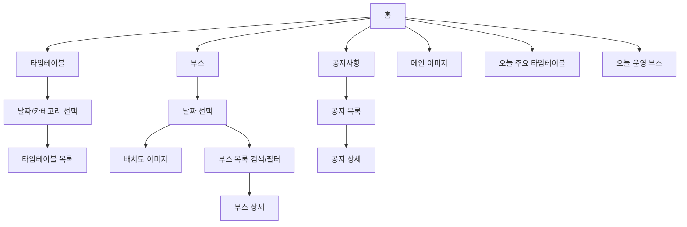

# 대학 축제 웹사이트 기획안

## 문제 정의

대학 축제에 참여하는 재학생과 방문객은 축제 당일 공지, 일정, 부스 정보가 여러 채널과 이미지에 흩어져 있어 지금 필요한 정보를 빠르게 확인하기 어렵다.

## MVP 전제

이 기획은 프론트엔드 MVP를 기준으로 한다.  
백엔드, 인증/인가, 관리자 페이지, 운영진용 CRUD 기능은 1차 범위에서 제외한다.  
초기 데이터는 정적 데이터 또는 임시 데이터로 구성하는 것을 전제로 한다.

## 타겟 사용자

### 1차 사용자: 축제 방문객

축제 당일 모바일로 정보를 확인하는 재학생 및 외부 방문객이다.  
이 사용자는 지금 진행 중인 공연, 운영 중인 부스, 부스 위치, 메뉴와 가격을 빠르게 확인하고 싶어 한다.

### 보조 사용자: 축제 운영진

공지사항, 타임테이블, 부스 정보, 배치도 이미지를 제공하는 주체다.  
다만 1차 MVP에서는 운영진이 직접 정보를 입력하거나 수정하는 기능은 제공하지 않는다.

### 추후 사용자: 부스 운영자

자기 부스의 메뉴, 가격, 운영 상태를 관리할 수 있는 사용자다.  
해당 기능은 인증/인가와 백오피스가 필요하므로 추후 확장 범위로 둔다.

## 사용자 시나리오

방문객은 축제 당일 모바일로 사이트에 접속한다.  
홈에서 오늘 진행되는 공연과 운영 중인 부스를 빠르게 확인한다.  
타임테이블에서는 날짜와 카테고리별 일정을 확인한다.  
부스 화면에서는 날짜별 배치도 이미지, 부스 목록, 메뉴와 가격 정보를 확인한다.  
필요한 경우 공지사항에서 축제 관련 안내를 확인한다.

## 핵심 기능

### 1. 타임테이블

- 날짜별, 카테고리별 일정 확인
- 날짜/시간, 이름, 위치 표시
- 별도 상세 화면 없음

### 2. 부스

- 날짜별 배치도 이미지 제공
- 날짜/카테고리 필터와 검색 제공
- 부스명, 위치, 운영 시간, 메뉴, 가격 표시

### 3. 공지사항

- 공지 목록과 상세 화면 제공
- 제목, 공지일, 공지한 사람, 본문, 중요 공지 여부 표시

## 사용자 흐름

## 점검

### 내 서비스가 푸는 문제를 한 문장으로?

대학 축제 현장에서 방문객이 흩어진 축제 정보를 빠르게 확인하기 어렵다는 문제를 푼다.

### 핵심 기능을 왜 이 3개로 골랐나?

타임테이블은 오늘 어떤 공연과 일정이 있는지 알려준다.  
부스는 어떤 부스가 운영 중이고, 어디에 있으며, 무엇을 판매하거나 진행하는지 알려준다.  
공지사항은 일정 변경이나 운영 안내처럼 필요할 때 확인해야 하는 정보를 제공한다.

### 사용자 흐름에서 빠진 화면은 없나?

프론트엔드 MVP 기준으로 홈, 타임테이블, 부스, 부스 상세, 공지 목록, 공지 상세 화면을 포함한다.

## 다음 기획 세션에서 정할 것

- 실제 축제 날짜와 장소
- 타임테이블 카테고리
- 부스 카테고리와 데이터 항목
- 배치도 이미지 수급 방식
- 모바일 화면 와이어프레임
- 디자인 방향
- 프론트엔드 데이터 구성 방식
