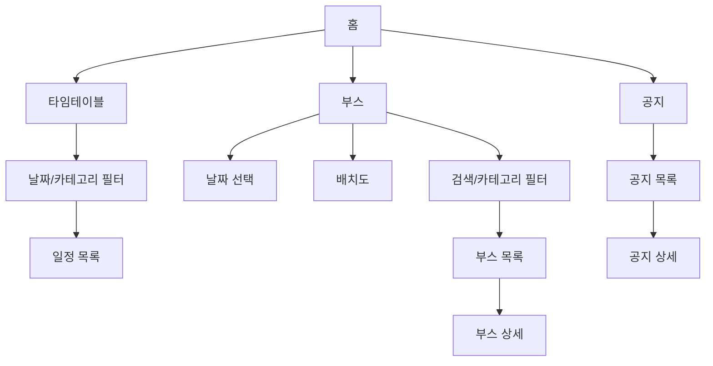

# 대학 축제 가이드 기획서 v2.0.0

## 문서 목적

이 문서는 `docs/plan/v1.0.0.md`의 초기 기획, `docs/design/DESIGN.md`의 디자인 시스템, 1차 MVP 구현 결과, MVP 평가 및 UI/UX 감사 내용을 반영한 2차 기획서다.

v2.0.0의 목적은 단순한 화면 목록을 넘어, 현재 프로토타입을 실제 축제 운영 데이터와 사용자 검증에 견딜 수 있는 MVP로 발전시키기 위한 기준을 정하는 것이다.

## 제품 정의

대학 축제 가이드는 축제 방문객이 모바일에서 일정, 부스, 공지 정보를 빠르게 확인하는 웹 서비스다.

핵심 사용 맥락은 축제 당일 현장이다. 사용자는 야외, 이동 중, 짧은 시간 안에 정보를 확인한다. 따라서 서비스는 많은 정보를 한 화면에 보여주는 대시보드가 아니라, 지금 필요한 판단을 빠르게 도와주는 모바일 유틸리티여야 한다.

## 문제 정의

대학 축제 정보는 보통 포스터, 이미지, SNS, 단체 채팅방, 학교 공지 등 여러 채널에 흩어져 있다.

방문객은 다음과 같은 문제를 겪는다.

- 지금 진행 중이거나 곧 시작할 일정이 무엇인지 찾기 어렵다.
- 어떤 부스가 운영 중인지, 어디에 있는지, 무엇을 판매하는지 빠르게 확인하기 어렵다.
- 일정 변경, 우천 안내, 운영 시간 변경 같은 공지를 놓치기 쉽다.
- 지도나 배치도 이미지가 있어도 부스 목록, 메뉴, 가격 정보와 연결되어 있지 않다.

## 제품 목표

### 1차 목표

방문객이 축제 당일 모바일에서 다음 정보를 3초 안에 파악할 수 있게 한다.

- 오늘 축제가 운영 중인지
- 다음 주요 일정이 무엇인지
- 부스 정보를 어디서 확인할 수 있는지
- 중요 공지가 있는지

### 2차 목표

방문객이 추가 탐색을 통해 다음 과업을 완료할 수 있게 한다.

- 날짜별/카테고리별 타임테이블 확인
- 부스 검색 및 카테고리 필터링
- 부스 위치, 운영 시간, 메뉴, 가격 확인
- 공지 목록과 공지 상세 확인

## MVP 범위

### 포함 범위

- 홈 화면
- 타임테이블 화면
- 부스 목록 화면
- 부스 상세 화면
- 공지 목록 화면
- 공지 상세 화면
- 모바일 우선 하단 내비게이션
- 정적 mock 데이터 기반 화면 흐름
- 기본 빈 상태와 필터 상태
- 디자인 시스템 기반 UI

### 제외 범위

- 백엔드 API
- 인증/인가
- 관리자 페이지
- 운영진용 CRUD
- 부스 운영자용 관리 기능
- 실시간 알림
- 위치 기반 길찾기
- 실제 날씨 API 연동
- 결제, 예약, 쿠폰 기능

## 타겟 사용자

### 1차 사용자: 축제 방문객

재학생, 외부 방문객, 초대받은 지인처럼 축제 현장에서 정보를 확인하는 사용자다.

주요 니즈:

- 지금 볼 수 있는 공연이나 행사를 알고 싶다.
- 운영 중인 부스를 찾고 싶다.
- 부스 메뉴와 가격을 미리 보고 싶다.
- 갑작스러운 변경 공지를 확인하고 싶다.

### 보조 사용자: 축제 운영진

축제 일정, 부스 정보, 공지, 배치도 이미지를 제공하는 주체다.

v2.0.0에서도 운영진이 직접 정보를 입력하는 기능은 범위 밖이다. 다만 추후 관리자 기능으로 확장될 수 있도록 데이터 구조는 운영진이 제공하는 실제 자료와 맞춰야 한다.

### 추후 사용자: 부스 운영자

자기 부스의 메뉴, 가격, 운영 상태를 관리할 수 있는 사용자다.

이 기능은 인증/인가, 권한, 백오피스가 필요하므로 v2.0.0 MVP 범위에서는 제외한다.

## 핵심 사용자 과업

1. 홈에서 다음 일정 확인하기
2. 날짜별 축제 일정 확인하기
3. 특정 카테고리의 행사만 보기
4. 부스 이름이나 메뉴로 부스 검색하기
5. 부스 위치, 운영 시간, 메뉴, 가격 확인하기
6. 중요 공지 확인하기
7. 공지 상세 내용 확인하기

## 정보 구조

## 화면별 기획

### 홈

목표: 사용자가 현재 축제 상태와 다음 행동을 가장 빠르게 판단하게 한다.

필수 요소:

- 서비스명
- 오늘 날짜
- 현재 시간 또는 축제 기준 시간
- 운영 상태
- 다음 일정 1개
- 운영 중인 부스 신호
- 중요 공지 1개
- 타임테이블, 부스, 공지 진입점
- 하단 내비게이션

정책:

- 홈은 대시보드가 아니다. 긴 목록을 넣지 않는다.
- 다음 일정은 1개만 강조한다.
- 부스 정보는 `운영 중인 부스 수` 또는 대표 부스 1개 수준으로만 보여준다.
- mock 값은 실제 운영 정보처럼 오해되지 않게 표시한다.

### 타임테이블

목표: 날짜와 카테고리별 일정을 빠르게 훑게 한다.

필수 요소:

- 날짜 선택
- 카테고리 필터
- 시간순 일정 목록
- 일정명
- 시작/종료 시간 또는 진행 시간
- 위치

정책:

- MVP에서는 일정 상세 화면을 만들지 않는다.
- 일정 목록은 시간순 정렬을 기본으로 한다.
- 선택한 필터에 결과가 없으면 빈 상태를 제공한다.

### 부스 목록

목표: 사용자가 원하는 부스를 찾고 위치와 주요 판매 정보를 확인하게 한다.

필수 요소:

- 날짜 선택
- 날짜별 배치도 이미지 또는 실제에 가까운 placeholder
- 검색
- 카테고리 필터
- 부스명
- 위치
- 운영 시간
- 대표 메뉴 또는 활동 요약
- 운영 상태

정책:

- 배치도는 단순 장식이 아니라 핵심 정보다.
- 실제 이미지가 없는 경우 `임시 배치도`임을 명확히 표시한다.
- 부스 목록의 위치 표기는 배치도 표기와 일치해야 한다.
- 검색 결과가 없으면 필터 초기화 경로를 제공한다.

### 부스 상세

목표: 사용자가 부스 방문 여부를 결정하는 데 필요한 정보를 확인하게 한다.

필수 요소:

- 부스명
- 카테고리
- 위치
- 운영 시간
- 운영 상태
- 메뉴/가격 또는 체험 내용
- 목록으로 돌아가기

정책:

- 메뉴와 가격은 가장 읽기 쉬운 형태로 제공한다.
- 품절, 운영 종료, 준비 중 같은 상태는 추후 확장 필드로 고려한다.

### 공지 목록

목표: 축제 운영 안내와 변경 사항을 빠르게 확인하게 한다.

필수 요소:

- 중요 공지 우선 노출
- 제목
- 작성일
- 작성자 또는 공지 주체
- 중요 여부

정책:

- 하단 내비게이션 라벨은 `공지`로 명확히 표기한다.
- 중요 공지는 색상만으로 구분하지 않고 텍스트 라벨을 함께 제공한다.

### 공지 상세

목표: 공지 본문을 읽고 필요한 행동을 이해하게 한다.

필수 요소:

- 제목
- 작성일
- 작성자
- 중요 여부
- 본문
- 목록으로 돌아가기

정책:

- 실제 공지 본문이 길어질 수 있으므로 줄 간격과 문단 간격을 충분히 확보한다.
- 직접 링크 진입을 고려할 경우 `공지 상세` 같은 화면 맥락 라벨을 추가한다.

## 데이터 기획

v2.0.0 이후 가장 먼저 확정해야 할 것은 데이터 구조다.

### Festival

| 필드 | 설명 |
| --- | --- |
| `name` | 축제명 |
| `dates` | 축제 운영 날짜 목록 |
| `venue` | 장소 |
| `status` | 운영 상태 |

### Schedule

| 필드 | 설명 |
| --- | --- |
| `id` | 일정 ID |
| `date` | 날짜 |
| `category` | 공연, 이벤트, 체험 등 |
| `title` | 일정명 |
| `startTime` | 시작 시간 |
| `endTime` | 종료 시간 |
| `location` | 장소 |
| `description` | 보조 설명 |

### Booth

| 필드 | 설명 |
| --- | --- |
| `id` | 부스 ID |
| `date` | 운영 날짜 |
| `category` | 음식, 체험, 굿즈 등 |
| `name` | 부스명 |
| `location` | 위치 |
| `zone` | 배치도 기준 구역 |
| `openTime` | 운영 시작 시간 |
| `closeTime` | 운영 종료 시간 |
| `status` | 운영 중, 준비 중, 종료 등 |
| `menus` | 메뉴와 가격 목록 |

### Notice

| 필드 | 설명 |
| --- | --- |
| `id` | 공지 ID |
| `title` | 제목 |
| `publishedAt` | 공지일 |
| `author` | 작성자/공지 주체 |
| `important` | 중요 공지 여부 |
| `body` | 본문 |

## 디자인 원칙

v2.0.0은 `Today Simple` 디자인 방향을 유지한다.

- 한 화면에 하나의 주요 판단만 제공한다.
- 야외 환경에서도 읽히는 큰 글자와 높은 대비를 우선한다.
- 장식보다 정보 전달을 우선한다.
- 홈에는 긴 목록을 넣지 않는다.
- 카드는 필요한 곳에만 사용하고, 목록은 행 단위 구조를 우선한다.
- 주요 강조색은 녹색, 부스 보조색은 파랑, 공지 보조색은 주황으로 제한한다.

## 접근성 요구사항

- 모든 터치 대상은 최소 44px 높이를 확보한다.
- 아이콘만 있는 버튼은 접근 가능한 이름을 제공한다.
- 색상만으로 상태를 전달하지 않는다.
- 키보드 탭 순서를 검증한다.
- 스크린리더에서 주요 내비게이션과 버튼명이 의미 있게 읽혀야 한다.
- 320px, 390px, 430px 모바일 폭에서 주요 CTA와 하단 내비게이션이 겹치지 않아야 한다.

## 상태와 예외 처리

실제 데이터 연결 전이라도 다음 상태를 설계해야 한다.

- 일정 없음
- 부스 없음
- 검색 결과 없음
- 공지 없음
- 배치도 이미지 없음
- 데이터 로딩 중
- 데이터 로딩 실패

각 상태는 사용자의 다음 행동을 제안해야 한다. 예를 들어 검색 결과가 없으면 필터 초기화 또는 다른 날짜 선택을 제공한다.

## 검증 기준

### 기능 검증

- 홈에서 다음 일정과 중요 공지를 확인할 수 있다.
- 타임테이블에서 날짜/카테고리 필터가 동작한다.
- 부스에서 날짜/카테고리/검색 필터가 동작한다.
- 부스 상세에서 위치, 시간, 메뉴, 가격을 확인할 수 있다.
- 공지 목록에서 중요 공지를 구분할 수 있다.
- 공지 상세에서 본문을 확인할 수 있다.

### 품질 검증

- `pnpm lint` 통과
- `pnpm build` 통과
- 필터 로직 단위 테스트 도입
- 주요 화면 전환 smoke test 도입 검토
- 모바일 폭별 화면 캡처 검증
- 키보드/스크린리더 smoke test

## 성공 지표

초기 MVP에서는 정량 분석보다 과업 성공 여부를 우선한다.

사용자 테스트 과업:

- 다음 공연이 무엇인지 찾기
- 특정 날짜의 공연 일정 찾기
- 특정 메뉴를 파는 부스 찾기
- 부스 위치와 가격 확인하기
- 중요 공지 확인하기

성공 기준:

- 사용자가 각 과업을 30초 안에 완료한다.
- 사용자가 하단 내비게이션 목적을 혼동하지 않는다.
- 부스 위치 확인 과정에서 배치도와 목록 정보가 충돌하지 않는다.
- mock 데이터와 실제 운영 정보를 혼동하지 않는다.

## 우선순위

### P0. 실제 데이터 구조 확정

타임테이블, 부스, 공지 데이터 구조를 실제 운영 자료와 맞춘다. 이 작업이 확정되어야 필터, 상세 화면, 배치도, 추후 API 연결이 안정된다.

### P1. 부스 배치도 실제 자산 반영

날짜별 배치도 이미지 또는 실제에 가까운 자산을 반영한다. 이미지가 없을 때의 빈 상태도 함께 설계한다.

### P1. 운영 상태와 시간 정보 실제화

현재 시간, 다음 일정, 운영 중인 부스 수가 정적 상수처럼 보이지 않게 실제 계산값 또는 명확한 mock 표시로 정리한다.

### P1. 빈 상태와 예외 상태 추가

검색 결과 없음, 일정 없음, 부스 없음, 공지 없음, 배치도 없음 상태를 추가한다.

### P2. 접근성 검증

키보드, 스크린리더, 작은 화면, 긴 텍스트 상황을 검증한다.

### P2. 테스트 자동화 도입

필터 로직과 주요 화면 전환을 자동 검증한다.

### P3. 사용자 검증 준비

3-5개 핵심 과업으로 모바일 사용자 테스트를 준비한다.

## 릴리즈 기준

v2.0.0 기획 기준으로 다음 조건을 만족하면 실제 축제 데이터 연결 전의 프론트엔드 MVP로 볼 수 있다.

- 핵심 화면 6개가 모두 존재한다.
- 홈이 `Today Simple` 원칙을 유지한다.
- 타임테이블, 부스, 공지 흐름이 클릭으로 이어진다.
- 부스 배치도 영역이 실제 자산 투입을 전제로 설계되어 있다.
- mock 데이터 표시가 명확하다.
- 주요 빈 상태가 존재한다.
- `pnpm lint`와 `pnpm build`가 통과한다.

## 참고 문서

- [기획서 v1.0.0](./v1.0.0.md)
- [디자인 시스템](../design/DESIGN.md)
- [후속 작업 우선순위](../roadmap/NEXT_STEPS.md)
- [MVP 평가 기록](../../audit/mvp-evaluation/notes.md)
- [UI/UX 감사 리포트](../../audit/ui-ux-review/report.md)
